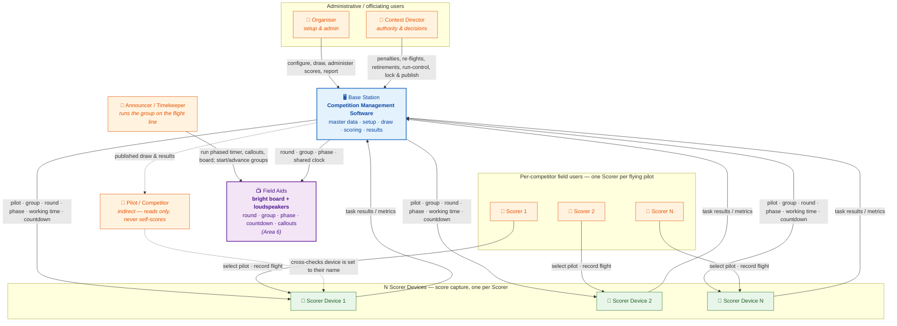

# Soarscore — Logical High-Level Architecture

A logical (not deployment) view of the system: **what the parts are and how they
talk**, independent of any specific technology, framework or wire protocol.
It complements the [requirements](../requirements/high-level-requirements.md) and
[users](../requirements/users.md) — see those for *what* each part does and *who*
it serves.

## The shape in one line

One **Base Station** runs the competition; **N Scorer Devices** capture live
results against it two-way, one Scorer per flying competitor; a **bright field
board and loudspeakers** plus each Scorer device follow the group's shared clock;
**users** interact according to their [role](../requirements/users.md).

## Diagram

## What the diagram says

- **Base Station** — the single authority. Runs the competition management
  software: master data, setup, the fair anti-repeat draw, live scoring
  aggregation, and results. Everything reconciles here.
- **N Scorer Devices** — one per Scorer, capturing live during a group's working
  time. The **base↔device link is two-way**:
  - **down** (base → device): the pilot, group, round and working-time context the
    device needs to present the right entry — plus the live **phase and countdown**
    it mirrors from the field-aid clock ([Area 6](../requirements/high-level-requirements.md#area-6--display-timer--audio-field-aids));
  - **up** (device → base): the competitor's task results / metrics (times,
    landings, laps, heights, motor runs, penalties).
- **Users**, attached by [role](../requirements/users.md):
  - **Organiser** and **Contest Director** operate the **Base Station** —
    administrative setup vs. officiating authority.
  - Each **Scorer** operates **one Scorer Device**, recording the adjacent pilot.
    Several work in parallel within a group.
  - The **Announcer / Timekeeper** operates the **Field Aids** (Area 6) — the
    bright board and loudspeakers — running each group's automatic phased sequence
    (prep → working → landing) and advancing rounds. The **Contest Director** holds
    the run-control authority actions (prep pause / fast-forward, gate override,
    abort) via the Base Station.
  - The **Pilot** is **indirect**: reads the published draw and results, and
    cross-checks (before the group starts) that a Scorer's device is set to their
    name — but never self-scores.

## Notes & caveats

- **Logical, not physical.** "Two-way link" is a logical dependency, not a claim
  about transport, topology or sync strategy. The MVP assumes Scorers capture live
  into the shared system; *remote* scoring and device-to-device sync are
  [future enhancements](../requirements/high-level-requirements.md#future-enhancements).
- **Scorer Devices are dedicated hardware** — ESP32 stopwatch-style handhelds
  running custom firmware; the device *is* the Scorer's stopwatch, and no other
  device types are permitted. Devices are **offline-tolerant**: if the base link
  drops they keep capturing and sync when it returns. The whole system is
  **offline-first** — no internet required to run a contest; results publish when
  connectivity exists. See
  [decisions.md](../requirements/decisions.md) (D2, D6).
- **Field Aids (Area 6) are confirmed and in MVP scope** — a bright board and
  loudspeakers, always present and driven by the Base Station from one shared
  clock. The Announcer/Timekeeper here is the *group-level* operator, **not** the
  per-competitor Scorer (see the
  [naming caution](../requirements/users.md#4-announcer--timekeeper-field-aid-operator)).
- **One person, several hats** — Organiser, Contest Director and Announcer may be
  the same individual at a small contest; the **Scorer** role cannot be merged,
  since a whole group flies at once.
