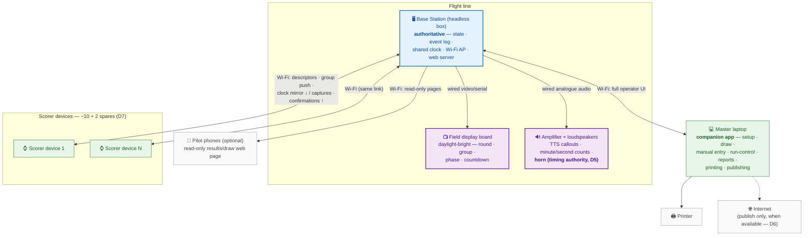

# Soarscore — Physical High-Level Architecture

The deployment view: **what boxes exist on the field, what each is responsible
for, and how they are physically connected**. It refines the
[logical architecture](logical-architecture.md) — same parts, now pinned to
hardware — and is framed by the recorded decisions
([decisions.md](../requirements/decisions.md)), especially D2 (dedicated ESP32
scorer devices), D4 (immutable event log), D5 (the horn is the timing
authority), D6 (offline-first) and D7 (scale bounds).

Decided with the owner **2026-07-08**: the Base Station is a **headless
authoritative controller**, the laptop is a **detachable companion UI**, the
board and speakers are **wired to the base at the flight line**, and pilot
phones are served an **MVP-optional read-only web page** over local Wi-Fi.

## The field in one line

A headless **Base Station** box at the flight line owns the contest — state,
event log, shared clock, and the radio — with the **board and speakers wired
to it**; **N Scorer devices** capture over the base's Wi-Fi; a **laptop**
running the companion app is the humans' window into the base and can come
and go; **pilot phones** may read a results page, nothing more.

## Diagram

---

## 1. Base Station — headless authoritative controller

An embedded, screenless box (Raspberry-Pi-class or similar; chosen at
implementation time) sited **at the flight line**, because the board and
audio hang off it by wire.

**Responsibilities**

- **Owns all contest state and the immutable event log (D4)** — every
  mutation from every client lands here; current state is derivable from the
  log, so after an unplanned reboot the base resumes into the correct
  contest state ([scorer-device.md §9](../requirements/scorer-device.md#9-environment-envelope-d)).
  A group that was **running at the moment of failure is treated as aborted**
  on resume *(owner-decided 2026-07-08)* — the existing 6.5 abort semantics:
  restart from preparation, accumulated metrics annulled — unless the
  Contest Director instead accepts pen-and-paper results for it under D3.
  Devices' buffered captures for the annulled run sync in but are not
  applied (event-logged only).
- **Owns the shared clock** and runs the automatic phased group sequence
  ([Area 6](../requirements/high-level-requirements.md#area-6--display-timer--audio-field-aids)) —
  a group in progress continues even with no laptop connected.
- **Radio centre**: Wi-Fi AP for the scorer fleet (proposed default,
  [scorer-device.md §6](../requirements/scorer-device.md#6-transport-and-range-a4);
  ESP-NOW fallback pending the range test), the laptop's link, and the
  pilots' results page. Reliable at **100 m line-of-sight**.
- **Renders the board output and generates the audio** — TTS callouts
  (English-only MVP) and the horn are produced on-box; no internet is
  involved (D6).
- **Serves** the pilots' read-only web page, device firmware updates, and
  the device health view ([scorer-device.md §8](../requirements/scorer-device.md#8-fleet-logistics-a5)).

**Physical**: field power (generator/battery) for a full contest day;
weather-protected siting; owned by the Organiser(s) with the device fleet.

**Implications**

- The base is a **deliberate single point of failure** — D3's pen-and-paper
  fallback is the answer, not redundancy.
- Being headless, the base **cannot be operated directly**: every human
  action goes through a client (normally the laptop). See §5 for what that
  means for run-control.

## 2. Scorer devices — dedicated ESP32 handhelds (× ~10 + 2 spares)

Fully specified in [scorer-device.md](../requirements/scorer-device.md); this
view adds nothing new. Physically: round stopwatch-style handhelds, no-look
start/stop, ~1.3-inch daylight-readable screen, ≈ 8 h battery with overnight
fleet charging, pre-bound to the base, buffer-and-sync when the link drops
(D6), countdown mirror within ±0.5 s or hidden. Fleet size follows max group
size, not pilot count (D7).

**Interaction with the rest of this architecture**: the scorer link is the
contest-critical radio traffic — pilot phones and the laptop share the same
AP and **must not be able to degrade it** (see §7).

## 3. Field display board — wired to the base

The Area 6.3 board: big, glanceable, **daylight-readable**, showing round,
group, phase and remaining time. Wired to the base (video or serial,
per the panel technology chosen), so it shares the base's clock exactly —
no staleness handling needed, unlike the scorer devices' mirrored countdown.

**Implications**

- Daylight readability at flight-line distance points to an **LED-matrix
  panel** rather than a consumer TV; the choice is a prototyping question,
  not a requirements one.
- Likely the **largest power draw on the field** — it sizes the
  generator/battery requirement more than the base does.
- The cable run fixes the base's position at the flight line.

## 4. Speaker system — wired analogue from the base

The Area 6.2 audio chain: base → amplifier → loudspeakers. Carries the
spoken announcements (round/group, pilots, phase starts), the
minute-on-the-minute and −30 s-to-zero counts, and the **horn**.

**Why wired is a requirement, not a preference**: the horn, by ear, is the
field authority for end of working time (D5) — a wireless audio node that
could be seconds stale would make the timing authority unreliable. The
analogue chain off the box that owns the clock cannot drift.

**Physical**: amplifier and speaker count/placement sized for one flight
line at ≤ 20-pilot scale (D7); shares the flight-line power budget.

## 5. Master laptop — detachable companion app

An ordinary laptop running the companion app, connected to the base over its
Wi-Fi. It is a **client of the base, never an authority**: all state and the
event log live on the base, so the laptop can arrive, leave, sleep or fail
without stopping a running group.

**Responsibilities (the humans' window into the base)**

- **Organiser**: master data, competition setup and configuration
  (Areas 1–3), draw generation and validation (Area 4).
- **Contest Director**: run-control authority actions (6.5), penalties
  (5.9), score administration (5.3–5.7), the end-of-contest validation pass
  and Lock (2.2).
- **Announcer/Timekeeper**: round progression (6.4) — confirming
  completeness and advancing rounds.
- **Manual entry & paper fallback** (5.8) after a failure (D3).
- **Reports and printing** (Area 7) — the printer hangs off the laptop, and
  the **mid-contest standings screen** (7.1, e.g. on the clubhouse table) is
  a companion client's screen — the master laptop's, or a second connected
  client's (see Implications).
- **Publishing when internet exists** (D6) — the laptop is the only machine
  that ever touches the internet; the base never does.

**Implications**

- **Run-control needs a companion client present.** The base runs a started
  group autonomously, but starting, holding, gate-releasing and advancing
  rounds are operator actions with no UI on the headless base. Whoever holds
  the run-control hat (CD / Announcer) needs a companion client — the laptop
  or a second client device (see Open items) — within reach of the flight
  line.
- **Multiple companion clients may connect concurrently** *(owner-decided
  2026-07-08)*: the base accepts actions from any connected client,
  **last-action-wins**, with every action event-logged with its originating
  client and exercised authority
  ([D4 attribution](../requirements/decisions.md#d4--immutable-event-log)).
  There is no control-session lock — the small trusted group (D1)
  coordinates who is operating by convention, and the log settles any
  dispute. This also dissolves the laptop's double-booking: a second client
  can sit on the clubhouse table showing standings while the flight line
  keeps run control.
- The laptop needs no special resilience: if it dies, any other laptop with
  the companion app (or the pen-and-paper fallback, D3) takes over, because
  it holds no state.

## 6. Pilot phones — optional, read-only web page

Pilots' own phones, joined to the base's local Wi-Fi, reading a **read-only
web page served by the base**: the draw, current round/group, and standings
as rounds complete. *(Owner-decided 2026-07-08: promoted from Future
Enhancement to **MVP-optional** — [7.1](../requirements/high-level-requirements.md#area-7--reports)
amended accordingly.)*

**Deliberate limits**

- **No native app** — nothing to install, distribute or update; any phone
  with a browser works. A push-notification companion app remains a
  [Future Enhancement](../requirements/high-level-requirements.md#future-enhancements).
- **Strictly read-only** — pilots never self-score (conflict of interest,
  Area 5) and have no write path of any kind.
- **Optional per event** — a contest is fully runnable with zero pilot
  phones; the page is a convenience layer over the laptop standings screen
  and printed reports.
- **Must not endanger the scorer link** — see §7.

## 7. Network — one radio, three classes of traffic

The base's Wi-Fi carries three very different things:

| Traffic | Criticality |
|---|---|
| Scorer devices — captures, confirmations, clock mirror | **contest-critical**; buffer-and-sync tolerates dropouts (D6) but the prep gate and countdown mirror want a live link |
| Laptop — operator UI | important; brief drops are an annoyance, not a loss (state is on the base) |
| Pilot phones — read-only pages | expendable |

**Requirement**: pilot-phone and laptop traffic must not be able to degrade
the scorer-device link — by separate SSID/band, client caps, or
prioritisation (an implementation choice). If the range test moves the
scorer fleet to **ESP-NOW**, the split becomes physical for free: scorers on
ESP-NOW, laptop and phones on Wi-Fi.

No part of this network touches the internet; publishing is the laptop's
job, on its own connection, when one exists (D6).

## 8. Power and failure summary

| Device | Power | On failure |
|---|---|---|
| Base Station | field power, full day | contest halts → pen and paper (D3); reboot-resume from event log (D4); a group running at failure is aborted on resume (§3) |
| Scorer device | ≈ 8 h battery | swap a spare; buffered data syncs (D6) |
| Board | field power (largest draw) | audio alone carries the group; fix between groups |
| Speakers/amp | field power | **group cannot run** — the horn is the authority (D5); hold via run-control |
| Laptop | own battery / field power | groups keep running; no run-control until a client returns; state safe on base |
| Pilot phones | pilots' own | nothing — expendable by design |

## 9. Adjacent system — the local F3B lap/speed timing rig

The local F3B scene already operates **custom wireless hardware** that
records **lap counts** (Task B distance) and **speed course times**
(Task C), with its own **Raspberry-Pi base station**. It is a separate,
pre-existing system — not part of Soarscore — but it produces exactly the
per-pilot metrics the F3B rows of the
[capture matrix](../requirements/scorer-device.md#per-class-capture-matrix)
need.

- **MVP: manual cross-entry.** The Scorer reads the lap count / course time
  off that system and enters it on the hand-held like any other raw metric.
  No link between the two base stations exists; the raw-capture principle is
  unchanged — the Scorer transcribes an observation, the system interprets.
- **Ultimately: base-to-base integration.** The Soarscore Base Station
  ingests those metrics per pilot from the rig's Pi, removing the
  transcription step. This is a [Future Enhancement](../requirements/high-level-requirements.md#future-enhancements)
  (the "machine-readable / hardware-assisted score capture" item — this rig
  is its first concrete case). The task-descriptor `entry` attribute
  ([scorer-device.md A.3](../requirements/scorer-device.md#a3-field-definition))
  already distinguishes `device` from `base` sources, so an `external`
  source is a natural extension, not a redesign.

---

## Open items

1. **Run-control without the laptop** — is a second, smaller client (e.g.
   the CD's phone browsing an operator page served by the base) wanted for
   flight-line run-control, or does the laptop simply live at the flight
   line? The base already serves pages for pilots, so an operator page is
   cheap — but it widens the trust surface of an auth-less system (D1).
2. **Board technology and drive interface** — LED matrix vs. high-bright
   monitor; video vs. serial. A prototyping decision; feeds the power
   budget.
3. **Audio bill of materials** — amplifier power and speaker
   count/placement for one flight line. Prototyping decision.
4. **Base Station hardware class** — Pi-class SBC vs. mini-PC; sized by
   on-box TTS, web serving, and the AP role. Implementation decision.
