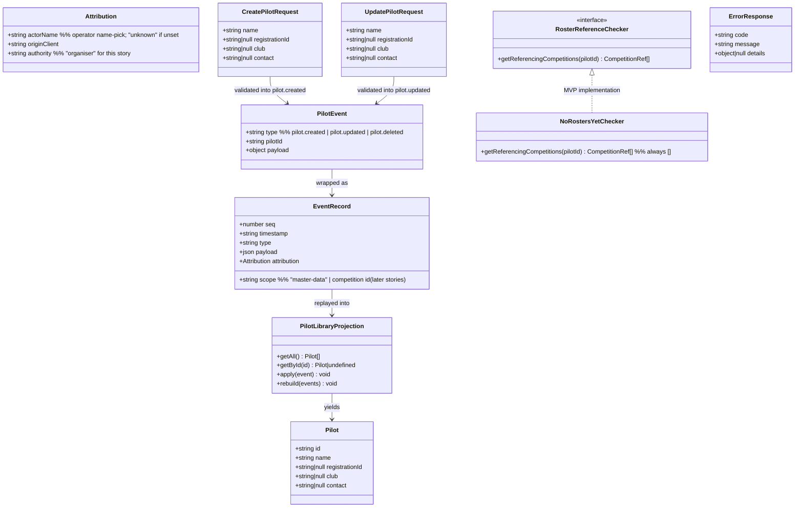

# Master Pilot Library — Walking Skeleton + Pilot CRUD (STORY-001-001)

## Requirements

Implement the master pilot library — a reusable, cross-competition collection
of pilot records the Organiser maintains through the companion web app —
and, because this is the system's first story, bootstrap the thinnest
vertical slice of the Soarscore architecture it must flow through: a Node
Base Station server owning all state, an append-only SQLite event log from
which current state is derived (decisions.md D4), and the base-served
companion UI with unauthenticated operator name-pick identity (D1/D4).

Boundaries: pilot records only (name required; registration ID, club,
contact optional; no name uniqueness). Competition rosters are out of scope
(STORY-001-005) — deletion protection lands as a seam that reports "no
references" until rosters exist. No authentication, no internet dependency,
club scale (≤ hundreds of pilots, single-digit concurrent clients).

## Entities

Conservative constraints honoured: `Pilot` is a flat record — no value
objects for name/contact; `contact` is one free-text field (owner default);
the projection is a plain in-memory `Map<string, Pilot>` rebuilt from the
log at boot — no projected SQL tables at this scale (D7).

## Approach

1. Architecture (walking skeleton):
   - npm-workspaces monorepo: `packages/shared` (domain types, event
     contracts, Zod schemas), `apps/base` (Fastify server = the Base
     Station software), `apps/companion` (Vite + React + TypeScript web UI,
     built to static assets the base serves). One repo, one language,
     matching D8's "base serves the operator UI".
   - Event-sourced from the first mutation: commands validate → append an
     `EventRecord` to a SQLite `events` table (better-sqlite3, WAL mode) →
     apply to the in-memory projection → respond. Reads hit the projection
     only. On boot the projection is rebuilt by full replay — this *proves*
     D4's "current state derivable from the log" on every start.
   - Single system-level event stream with a `scope` column
     (`master-data` now; competition ids in later stories) — the analysis's
     recommended answer to the global-vs-per-competition question.

2. Technical implementation:
   - Fastify with a typed error envelope; a global `setErrorHandler` maps
     domain errors to HTTP: `ValidationError` → 400, `NotFoundError` → 404,
     `ReferencedPilotError` → 409, anything else → 500 with a generic
     message (no stack traces to clients).
   - Attribution: every mutating request carries `X-Actor-Name` and
     `X-Client-Id` headers set by the companion UI from its name-pick and a
     generated client id; missing actor defaults to `"unknown"` (D4 — record
     identity, never demand it). Authority is fixed at `"organiser"` here.
   - Concurrency: last-action-wins by design (D8) — no optimistic locking,
     no ETags; both conflicting edits land in the log and the later one
     defines current state.
   - Offline-first: no CDN links, no external fonts/APIs; everything the
     browser loads is served by the base (D6).

3. Business logic:
   - Name required: trimmed, non-empty after trim (covers whitespace-only),
     max 100 chars. Optional fields trimmed; empty string normalises to
     null; clearing an optional field on edit is legal.
   - No uniqueness rule on any field — duplicate names are legitimate
     (AC7); the UI disambiguates by showing all four attributes in the list.
   - Delete: ask `RosterReferenceChecker` first; any referencing
     competitions → refuse with their names in the error details (AC6).
     Unreferenced → append `pilot.deleted`; the pilot vanishes from the
     projection while its events remain immutably in the log (AC5).
   - Deleted-pilot integrity: `pilot.updated`/`pilot.deleted` against an
     unknown or deleted id → 404; replay tolerates nothing out of order
     because appends are serialized on the single SQLite writer.

## Structure

### Inheritance Relationships
1. `DomainError` extends `Error` — base class carrying `code: string`.
2. `ValidationError`, `NotFoundError`, `ReferencedPilotError` extend
   `DomainError`.
3. `RosterReferenceChecker` interface defines the reference-protection
   seam; `NoRostersYetChecker` implements it (returns `[]`).
4. No other hierarchies — flat modules, functions over classes where a
   class adds nothing.

### Dependencies
1. `apps/companion` (React UI) calls `apps/base` HTTP API (`/api/pilots`).
2. `pilot routes` (Fastify plugin) depend on `PilotService`.
3. `PilotService` depends on `EventStore`, `PilotLibraryProjection`,
   `RosterReferenceChecker`.
4. `EventStore` depends on better-sqlite3 (single DB file, e.g.
   `data/soarscore.db`).
5. `packages/shared` is imported by both apps; it depends on `zod` only.

### Layered Architecture
1. UI layer (`apps/companion`): name-pick, pilot list, add/edit/delete
   forms; holds no state beyond the current fetch (D8 — client, never
   authority).
2. HTTP layer (`apps/base/src/routes`): request parsing, Zod validation,
   attribution extraction, response shaping; no business rules.
3. Service layer (`apps/base/src/pilots`): commands (create/update/delete),
   business rules, event construction.
4. Event/persistence layer (`apps/base/src/eventstore`): append-only
   SQLite access, replay iteration; the only module that touches the DB.
5. Error handling layer: Fastify global error handler translating
   `DomainError` subtypes to the unified `ErrorResponse`.

## Operations

### Task 0 — Scaffold the monorepo (walking skeleton)
1. Responsibility: first-commit skeleton everything else lands in.
2. Steps:
   - Root `package.json` with npm workspaces `["packages/*", "apps/*"]`,
     Node ≥ 22, `"type": "module"`; TypeScript 5 strict base `tsconfig`.
   - `packages/shared`, `apps/base` (Fastify, better-sqlite3, zod),
     `apps/companion` (Vite + React + TS).
   - Tooling: ESLint + Prettier, Vitest at root; scripts: `dev` (base with
     tsx watch + Vite dev proxying `/api`), `build` (companion → static
     assets, base → dist), `test`.
   - `apps/base` serves `apps/companion`'s built assets via
     `@fastify/static` in production mode; `GET /api/health` returns
     `{ status: "ok" }`.
3. Constraints: no external network resources in the built UI; SQLite file
   path configurable via `SOARSCORE_DATA_DIR` (default `./data`).

### Task 1 — Shared contracts (`packages/shared`)
1. Responsibility: single source of the domain types both apps use.
2. Contents:
   - `Pilot` type; `CreatePilotRequest`/`UpdatePilotRequest` Zod schemas —
     `name: z.string().transform(trim).refine(len > 0).max(100)`; optional
     fields `z.string().max(200).nullable().optional()` normalising `""` →
     `null`.
   - `PilotEventType = "pilot.created" | "pilot.updated" | "pilot.deleted"`;
     payload types per event (`created`/`updated` carry the full four-field
     snapshot; `deleted` carries only `pilotId`).
   - `Attribution` type; `ErrorResponse` type
     `{ code, message, details? }`; `CompetitionRef = { id, name }`.

### Task 2 — Event store (`apps/base/src/eventstore/`)
1. Responsibility: the D4 append-only log; the only DB-touching module.
2. Schema (migration on boot, idempotent):
   - `events(seq INTEGER PRIMARY KEY AUTOINCREMENT, timestamp TEXT NOT
     NULL, scope TEXT NOT NULL, type TEXT NOT NULL, payload TEXT NOT NULL,
     actor_name TEXT NOT NULL, origin_client TEXT NOT NULL, authority TEXT
     NOT NULL)`.
   - SQLite triggers `BEFORE UPDATE` / `BEFORE DELETE` on `events` that
     `RAISE(ABORT, 'events are immutable')` — immutability enforced in the
     store, not by discipline.
3. Methods:
   - `append(event: { scope, type, payload, attribution }): EventRecord` —
     stamps ISO-8601 UTC timestamp, serialises payload, returns the stored
     record with its `seq`.
   - `readAll(): Iterable<EventRecord>` — ordered by `seq`, for replay.
4. Constraints: WAL mode; single shared connection (better-sqlite3 is
   synchronous — natural serialisation of appends).

### Task 3 — Pilot domain (`apps/base/src/pilots/`)
1. Responsibility: business rules, events, projection.
2. `PilotLibraryProjection`:
   - Internal `Map<string, Pilot>`; `apply(record)` handles the three event
     types (`created` → set; `updated` → replace; `deleted` → remove;
     unknown scope/type → ignore).
   - `rebuild(events)` clears and replays; called once at boot with
     `eventStore.readAll()`.
   - `getAll()` returns pilots sorted by name (case-insensitive, then by
     id for stable duplicate ordering); `getById(id)`.
3. `PilotService` methods:
   - `create(input, attribution): Pilot` — validate via shared schema
     (throw `ValidationError` with field details on failure); generate
     `id = crypto.randomUUID()`; append `pilot.created` (scope
     `master-data`); apply to projection; return the pilot.
   - `update(id, input, attribution): Pilot` — 404 via `NotFoundError` if
     projection lacks `id`; validate; append `pilot.updated` with the full
     new snapshot; apply; return.
   - `delete(id, attribution): void` — `NotFoundError` if unknown; call
     `referenceChecker.getReferencingCompetitions(id)`; non-empty → throw
     `ReferencedPilotError` carrying the `CompetitionRef[]`; else append
     `pilot.deleted`; apply.
   - `list(): Pilot[]`, `get(id): Pilot` (`NotFoundError` if absent).
4. `NoRostersYetChecker`: implements the seam, returns `[]`; module doc
   comment states the STORY-001-005 contract — the checker must answer
   from current roster state and deletion must not interleave with a
   concurrent roster-add (both run on the base's single writer).

### Task 4 — HTTP API (`apps/base/src/routes/pilots.ts`)
1. Endpoints:
   - `GET /api/pilots` → 200 `Pilot[]`.
   - `GET /api/pilots/:id` → 200 `Pilot` | 404.
   - `POST /api/pilots` → 201 `Pilot` | 400.
   - `PUT /api/pilots/:id` → 200 `Pilot` | 400 | 404.
   - `DELETE /api/pilots/:id` → 204 | 404 | 409 (referenced; body's
     `details.competitions = CompetitionRef[]`).
2. Attribution extraction: `actorName = X-Actor-Name ?? "unknown"`,
   `originClient = X-Client-Id ?? "unknown-client"`, `authority =
   "organiser"`; passed into every service call.
3. Global error handler (`setErrorHandler`): `ValidationError` →
   400 `{ code: "VALIDATION_FAILED", message, details }`; `NotFoundError` →
   404 `{ code: "PILOT_NOT_FOUND" }`; `ReferencedPilotError` → 409
   `{ code: "PILOT_REFERENCED", message: "Pilot is on the roster of:
   <names>", details }`; unexpected → 500 `{ code: "INTERNAL" }`, full
   error logged server-side only.

### Task 5 — Companion UI (`apps/companion/`)
1. Responsibility: the Organiser's master-data view (companion-app.md §3.1)
   plus the name-pick shell every later view reuses.
2. Name-pick: on first load prompt "Who is operating?" (free-text at this
   stage — the operator people-list is future work); persist to
   `localStorage`; changeable any time from the header; sent as
   `X-Actor-Name` on every mutating request. Generate and persist a client
   id (`crypto.randomUUID()`) for `X-Client-Id`.
3. Pilot library view:
   - Table listing name, registration ID, club, contact (all four visible —
     AC7), sorted as served; empty-state message for a fresh library.
   - Add / edit form with the four fields, name marked required; submit
     errors from the API shown inline (400 field details, 404, 409 with
     the referencing competition names).
   - Delete with a confirm step; 409 response rendered as "cannot delete —
     on the roster of: …".
4. Constraints: fetch wrapper handling the `ErrorResponse` envelope; no
   client-side state store beyond component state + a refetch after each
   mutation (the base is the authority).

### Task 6 — Tests
1. Domain unit tests (Vitest, in-memory SQLite `:memory:`):
   - create/update/delete happy paths; projection rebuild-from-log
     equivalence (state after operations === state after fresh replay);
     whitespace-only name rejected; clearing optional fields; duplicate
     names both retained; delete-then-recreate yields a new id; update and
     delete of unknown id fail; event rows are immutable (trigger fires).
2. API integration tests (Fastify `inject`), mapped one-to-one to the ACs:
   - AC1 minimal create; AC2 full create; AC3 empty + whitespace name →
     400, list unchanged; AC4 edit reflected in library reads (roster
     isolation asserted at the seam level: no roster module consulted);
     AC5 delete unreferenced → 204 and gone from list, event count grown;
     AC6 with a stub `RosterReferenceChecker` returning one competition →
     409 naming it; AC7 two "John Brown"s listed with distinct clubs.
   - Attribution: mutation without headers logs `actor_name = "unknown"`;
     with headers, values land in the event row.

## Norms

1. TypeScript: `strict: true`, no `any` in `packages/shared` or domain
   code; ESM throughout; named exports only.
2. Validation: Zod schemas live in `packages/shared` and are the single
   definition — the API parses with them, the UI reuses them for form
   hints; no hand-rolled validation.
3. Exception handling:
   - All expected failures are `DomainError` subclasses with a stable
     `code`; routes never construct HTTP errors ad hoc.
   - The Fastify global error handler is the only place mapping errors to
     status codes and the `ErrorResponse` envelope
     `{ code, message, details? }`.
   - Unexpected errors: logged with stack server-side (Fastify's pino),
     returned to clients as `INTERNAL` with no internals exposed.
4. Event log discipline: every mutation appends exactly one event before
   the projection changes; events carry the D4 attribution triple
   (actorName, originClient, authority) always; event `type` naming is
   `<aggregate>.<past-tense-verb>` (`pilot.created`).
5. Naming/layout: kebab-case file names; one Fastify plugin per resource
   under `src/routes/`; domain modules under `src/<aggregate>/`.
6. Logging: pino via Fastify defaults; log every appended event at `info`
   with `seq`, `type`, `scope`, actor.
7. Documentation: each module opens with a short comment stating the
   constraint it enforces (e.g. the seam contract in
   `NoRostersYetChecker`), not what the code does; README gains the
   dev/build/test commands from Task 0.

## Safeguards

1. Functional constraints: all seven ACs of STORY-001-001 pass via the
   Task 6 test suite; AC4/AC6 at the seam level as specified (rosters do
   not exist yet).
2. Performance constraints: trivial by scale (D7) — full replay at boot
   must stay under 1 s at 10 000 events; `GET /api/pilots` under 100 ms at
   500 pilots on a dev machine. No caching layers, no pagination — adding
   them would be over-engineering.
3. Security constraints: no authentication by decision (D1) — do not add
   login, tokens or roles; attribution headers are recorded, never
   verified; server binds to LAN only; no secrets exist in this story.
4. Integration constraints: no internet access at build- or runtime for
   the served app (D6) — all assets self-hosted; must run on Linux ARM64
   (Pi-class) and x64 dev machines; SQLite file is the only persistence.
5. Business rule constraints: name required after trimming, ≤ 100 chars;
   optional fields clearable; **no uniqueness constraint on any pilot
   field**; deletion refused with competition names when referenced;
   deleted pilots' events remain in the log.
6. Exception handling constraints: every business error carries a stable
   `code` (`VALIDATION_FAILED`, `PILOT_NOT_FOUND`, `PILOT_REFERENCED`,
   `INTERNAL`); all errors flow through the global handler; no stack
   traces or SQL in responses.
7. Technical constraints: the `events` table is append-only, enforced by
   SQLite triggers; no UPDATE/DELETE statements against it anywhere in the
   codebase; the projection is derived state only and can be discarded at
   any time; last-action-wins concurrency — no locking (D8).
8. Data constraints: ids are UUIDv4 generated server-side; timestamps
   ISO-8601 UTC stamped by the base (the authority's clock); event payloads
   are JSON snapshots sufficient to rebuild state without reading prior
   events of the same pilot.
9. API constraints: REST under `/api/pilots` exactly as specified in
   Task 4 (methods, status codes, error envelope); 201 on create, 204 on
   delete; responses are `Pilot` objects with all four fields present
   (nulls explicit) so the UI never guesses.
