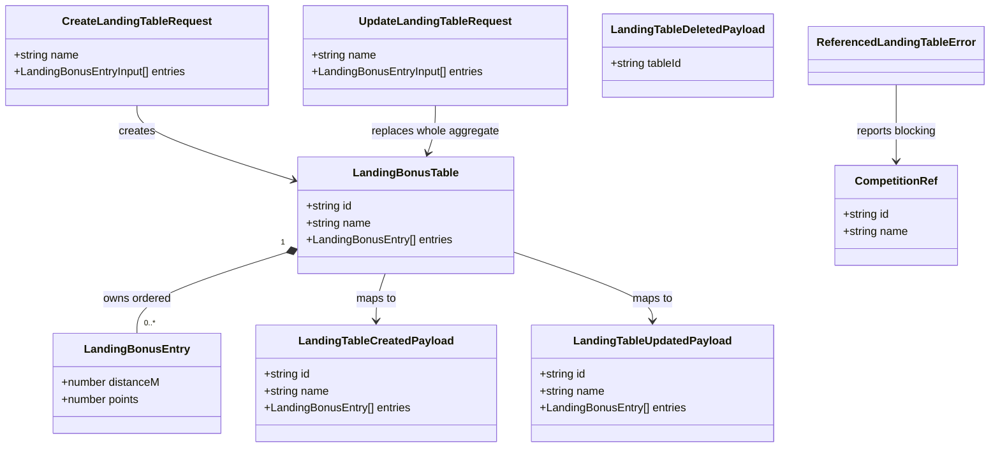

# STORY-001-002 — Reusable Landing-Bonus Table Management

## Requirements

Implement a second master-data vertical slice that lets the Organiser define
named, reusable distance→points landing-bonus tables once and reuse them across
any competition, without per-event re-entry and without exposing scoring maths.

- Create, name, view, edit, duplicate, and delete tables, each owning an ordered
  set of `distance → points` entries.
- Persist and redisplay entries **verbatim**, including the "≤ first distance"
  and "over last distance → 0" boundary rows — no scoring interpretation,
  rounding, or banding in this slice.
- Protect a table from deletion while any competition references it, telling the
  Organiser which competitions block it.
- Keep tables entirely optional: a table exists independently of any task; no
  task/competition surface may demand one here.

Boundaries: this slice does **not** apply tables during score computation
(scoring stories), select a table for a task (STORY-001-008), or warn on
deviation from rule defaults (STORY-001-007). It clones the established Pilot
master-data slice end to end, substituting the `LandingBonusTable` aggregate.

## Entities

**Conservative notes**

- `CompetitionRef` (`packages/shared/src/errors.ts`) already exists — reuse it
  verbatim for deletion-block reporting. Do **not** redefine it.
- `LandingBonusEntry` is a flat `{ distanceM: number; points: number }` value —
  no id, no lifecycle of its own. It is not a top-level aggregate and gets no
  events of its own; the table carries the whole entry set in every payload.
- Boundary semantics ("≤ first", "over last → 0") are held as **positional
  data** (first row = at-or-below, last row = over→zero), not as extra flags or
  derived fields — round-tripping the numbers as entered is all AC1/AC2 require.

## Approach

1. **Shared domain + contracts (`packages/shared`)**:
   - Add `LandingBonusTable` / `LandingBonusEntry` interfaces mirroring
     `pilot.ts`, plus Zod `createLandingTableRequestSchema` /
     `updateLandingTableRequestSchema` (trim + require name; validate entries as
     well-formed non-negative numbers). Minimal structural validation only —
     **defer** monotonicity/ascending-distance/rule-conformance to
     STORY-001-007.
   - Add `landingTable.*` event types and a `landingTableToCreatedPayload`
     mapper alongside the `pilot.*` set in `events.ts`. Export all from
     `index.ts`.

2. **Base station (`apps/base`)** — same event-sourced flow as pilots:
   - `LandingTableService` (create / get / list / update / duplicate / delete)
     appending to the shared `EventStore` under the existing `"master-data"`
     scope, then applying the record to the projection.
   - `LandingTableProjection` keyed by table id, rebuildable from
     `eventStore.readAll()` on boot; **deep-copies entries on `apply`** so no two
     projected tables (especially a duplicate) alias the same array.
   - `LandingTableReferenceChecker` interface + `NoTaskConfigYetChecker` no-op
     stub returning `[]`, injected via `AppOptions` exactly like the pilot
     `referenceChecker`.
   - Landing-table-specific domain errors and an added `setErrorHandler` branch
     for a referenced-table 409 (Fastify pattern — **no** Spring
     `@RestControllerAdvice`; this repo centralises error mapping in
     `app.ts:setErrorHandler`).

3. **Companion (`apps/companion`)**:
   - `LandingTableLibrary` screen mirroring `PilotLibrary` (list, add, edit,
     delete-with-block-reason dialog) plus a **Duplicate** action.
   - `LandingTableForm` extending the flat `PilotForm` pattern to edit a
     variable-length entry list (add / remove / edit rows). Keep the list editor
     minimal — this is the dominant cost of the 2-day estimate.

**Data flow (unchanged from the pilot slice):** React form → `apiRequest`
(attribution headers) → Fastify route → service (Zod validate + invariant
checks) → `EventStore.append` → `projection.apply` → response; boot does
`projection.rebuild(eventStore.readAll())`.

## Structure

### Type / interface relationships

1. `LandingBonusTable` and `LandingBonusEntry` are plain shared interfaces (peers
   of `Pilot`), consumed by base and companion alike.
2. `LandingTableReferenceChecker` interface defines
   `getReferencingCompetitions(tableId): CompetitionRef[]`;
   `NoTaskConfigYetChecker` implements it (peer of `NoRostersYetChecker`).
3. Landing-table errors extend the existing `DomainError` abstract base in
   `apps/base/src/landing-tables/errors.ts`: `LandingTableNotFoundError` and
   `ReferencedLandingTableError` (each with its **own** code — do not reuse the
   pilot-specific `PILOT_NOT_FOUND` / `PILOT_REFERENCED`). `ValidationError` with
   code `VALIDATION_FAILED` is generic and may be shared or re-declared per the
   pilot precedent.

### Dependencies

1. `LandingTableService` depends on `EventStore`, `LandingTableProjection`, and
   `LandingTableReferenceChecker`.
2. `registerLandingTableRoutes` injects `LandingTableService`.
3. `buildApp` constructs the projection, rebuilds it, builds the service with
   `options.landingTableReferenceChecker ?? new NoTaskConfigYetChecker()`, and
   registers the routes + error-handler branch.
4. `LandingTableLibrary` calls `apiRequest`; renders `LandingTableForm`.

### Layered architecture

1. Route layer (`routes/landing-tables.ts`): HTTP mapping, attribution from
   headers, status codes (201 create, 200 get/put, 204 delete).
2. Service layer (`landing-tables/service.ts`): Zod validation, invariant checks
   (existence, reference protection), event append + projection apply.
3. Projection layer (`landing-tables/projection.ts`): derived in-memory state,
   rebuildable; deep-copies entries.
4. Event-store layer (`eventstore/event-store.ts`): **reused unchanged** — the
   sole writer of the immutable log (D4).
5. Error-handling layer (`app.ts:setErrorHandler`): centralised `DomainError` →
   `ErrorResponse` mapping; gains the referenced-table 409 case.

## Operations

### Create shared types — `packages/shared/src/landing-table.ts`
1. Responsibility: define the landing-table domain shape and request schemas.
2. Types:
   - `LandingBonusEntry`: `{ distanceM: number; points: number }`.
   - `LandingBonusTable`: `{ id: string; name: string; entries: LandingBonusEntry[] }`.
3. Schemas (Zod):
   - `landingBonusEntrySchema`: `distanceM` is `z.number().nonnegative()`;
     `points` is `z.number().int().nonnegative()`.
   - `landingTableFields`: `name` trimmed, required, ≤ 100 chars (clone pilot
     `name` refinements); `entries` is `z.array(landingBonusEntrySchema).min(1, "At least one entry is required")`
     (**empty tables are rejected** — decision confirmed below).
   - `createLandingTableRequestSchema = z.object(landingTableFields)`;
     `updateLandingTableRequestSchema = z.object(landingTableFields)`.
   - Export `CreateLandingTableRequest` / `UpdateLandingTableRequest` inferred
     types.
4. Constraints: **no** semantic validation (ordering/monotonicity/rule match) —
   deferred to STORY-001-007.

### Update shared events — `packages/shared/src/events.ts`
1. Add `LandingTableEventType = "landingTable.created" | "landingTable.updated" | "landingTable.deleted"`.
2. Add `LandingTableCreatedPayload = { id; name; entries: LandingBonusEntry[] }`,
   `LandingTableUpdatedPayload = LandingTableCreatedPayload`,
   `LandingTableDeletedPayload = { tableId: string }`.
3. Add `landingTableToCreatedPayload(table: LandingBonusTable): LandingTableCreatedPayload`
   returning `{ id, name, entries: table.entries.map((e) => ({ ...e })) }`
   (copy entries — no aliasing).
4. Update `packages/shared/src/index.ts` to `export * from "./landing-table.js"`.

### Create projection — `apps/base/src/landing-tables/projection.ts`
1. Responsibility: derived, rebuildable in-memory map of tables by id.
2. Attributes: `private tables = new Map<string, LandingBonusTable>()`.
3. Methods:
   - `apply(record: EventRecord): void`
     - Logic: `if (record.scope !== "master-data") return;` then `switch (record.type)`:
       - `landingTable.created` / `landingTable.updated`: cast payload, `set`
         `{ id, name, entries: payload.entries.map((e) => ({ ...e })) }`
         (**deep-copy entries** — guards AC3).
       - `landingTable.deleted`: `this.tables.delete(payload.tableId)`.
       - `default`: ignore (unknown types coexist under the shared scope).
   - `rebuild(events): void`: reset map, `apply` each.
   - `getAll(): LandingBonusTable[]`: sorted by name (localeCompare, base
     sensitivity) then id, mirroring the pilot projection.
   - `getById(id): LandingBonusTable | undefined`.

### Create reference-checker seam — `apps/base/src/landing-tables/table-reference-checker.ts`
1. Interface `LandingTableReferenceChecker`:
   `getReferencingCompetitions(tableId: string): CompetitionRef[]`.
2. `NoTaskConfigYetChecker implements LandingTableReferenceChecker`: returns `[]`.
3. Comment: STORY-001-008 will supply a real checker answering from per-task
   scoring config; delete/reference-add serialise on the single SQLite writer.

### Create domain errors — `apps/base/src/landing-tables/errors.ts`
1. Reuse the abstract `DomainError` base (import or re-declare consistently with
   the pilot module).
2. `LandingTableNotFoundError` — `readonly code = "LANDING_TABLE_NOT_FOUND"`.
3. `ReferencedLandingTableError` — `readonly code = "LANDING_TABLE_REFERENCED"`,
   carries `readonly competitions: CompetitionRef[]`.
4. `ValidationError` — `code = "VALIDATION_FAILED"` (shared/generic).

### Implement service — `apps/base/src/landing-tables/service.ts`
1. Constructor: `(eventStore, projection, referenceChecker)`; `SCOPE = "master-data"`.
2. `list(): LandingBonusTable[]` → `projection.getAll()`.
3. `get(id): LandingBonusTable` → `getById` or throw `LandingTableNotFoundError`.
4. `create(input, attribution): LandingBonusTable`
   - Validate via `createLandingTableRequestSchema` (throw `ValidationError` on
     failure, carrying `error.flatten()`).
   - Build `{ id: crypto.randomUUID(), name, entries }`.
   - `append({ scope, type: "landingTable.created", payload: landingTableToCreatedPayload(table), attribution })`,
     then `projection.apply(record)`, return table.
5. `update(id, input, attribution): LandingBonusTable`
   - Existence check (throw `LandingTableNotFoundError`).
   - Validate; build `{ id, name, entries }` (whole-aggregate replacement).
   - Append `landingTable.updated`, apply, return.
6. `duplicate(id, attribution): LandingBonusTable`
   - Load source via `get(id)` (throws if missing).
   - Build a **new** table: fresh `crypto.randomUUID()`, copied name (e.g. the
     source name — renaming is a subsequent `update`; see UX decision), and
     `entries: source.entries.map((e) => ({ ...e }))` (independent copy).
   - Append `landingTable.created`, apply, return. Independence (AC3) comes from
     the fresh id + copied entries; the projection deep-copy is the backstop.
7. `delete(id, attribution): void`
   - Existence check.
   - `const referencing = referenceChecker.getReferencingCompetitions(id);`
     if non-empty, throw `ReferencedLandingTableError` with joined names +
     `referencing`.
   - Append `landingTable.deleted` (`{ tableId: id }`), apply.
8. Reuse the `parseOrThrow` helper shape from the pilot service.

### Implement routes — `apps/base/src/routes/landing-tables.ts`
1. `attributionFromHeaders` (reuse the pilot helper's shape;
   `authority: "organiser"`).
2. Routes on `LandingTableService`:
   - `GET /api/landing-tables` → `list()`.
   - `GET /api/landing-tables/:id` → `get(params.id)`.
   - `POST /api/landing-tables` → `create(body, attribution)`, `reply.code(201)`.
   - `PUT /api/landing-tables/:id` → `update(params.id, body, attribution)`.
   - `POST /api/landing-tables/:id/duplicate` → `duplicate(params.id, attribution)`,
     `reply.code(201)`.
   - `DELETE /api/landing-tables/:id` → `delete(...)`, `reply.code(204)`.

### Wire app — `apps/base/src/app.ts`
1. Extend `AppOptions` with `landingTableReferenceChecker?: LandingTableReferenceChecker`.
2. Construct `LandingTableProjection`, `projection.rebuild(eventStore.readAll())`,
   `LandingTableService(eventStore, projection, options.landingTableReferenceChecker ?? new NoTaskConfigYetChecker())`.
3. `registerLandingTableRoutes(app, landingTableService)`.
4. Add to `setErrorHandler`: `if (error instanceof LandingTableNotFoundError)` →
   404; `if (error instanceof ReferencedLandingTableError)` → 409 with
   `details: { competitions: error.competitions }`. Missing this branch would
   leak a 500 — required.

### Implement form — `apps/companion/src/landing-tables/LandingTableForm.tsx`
1. `LandingTableFormValues = { name: string; entries: { distanceM: string; points: string }[] }`
   (string-typed inputs; coerce on submit).
2. Seed from an optional `table` prop; new table → `{ name: "", entries: [{ distanceM: "", points: "" }] }`
   (start with one blank row, since ≥1 entry is required — the last row is not
   removable when only one remains).
3. Render name input (clone `PilotForm`) + an entry-list editor: one row per
   entry with distance and points inputs, a per-row **Remove**, and an **Add
   row** button. Show `fieldErrors` per the pilot pattern.
4. On submit, map entries to `{ distanceM: Number, points: Number }` and call
   `onSubmit`.

### Implement library screen — `apps/companion/src/landing-tables/LandingTableLibrary.tsx`
1. Mirror `PilotLibrary`: load `GET /api/landing-tables`; Add / Edit / Delete
   with the block-reason dialog reading `details.competitions`.
2. Add a **Duplicate** button per row → `POST /api/landing-tables/:id/duplicate`
   then `refresh()`.
3. Table columns: Name, entry count (or a compact entry summary), actions.
4. Wire into `App.tsx` navigation alongside `PilotLibrary` (e.g. a simple
   screen switch) so both master-data screens are reachable.

## Norms

1. **Module layout**: one folder per aggregate under `apps/base/src/`
   (`landing-tables/{service,projection,errors,table-reference-checker}.ts`) and
   `apps/companion/src/landing-tables/`, matching `pilots/`.
2. **Validation**: Zod schemas live in `packages/shared`; services call
   `safeParse` and throw `ValidationError(message, error.flatten())` on failure.
   Trim strings; require name; keep validation structural only.
3. **Event sourcing (D4/D7)**: the `EventStore` is the only writer of the log;
   all state changes are appends under `scope: "master-data"` with
   whole-aggregate payloads; projections are derived and rebuilt from
   `readAll()` on boot. Never mutate in place.
4. **Attribution**: every mutation carries `{ actorName, originClient, authority }`
   derived from `X-Actor-Name` / `X-Client-Id` headers.
5. **Error handling (Fastify, not Spring)**: business errors extend the abstract
   `DomainError` with a stable string `code`; mapping to HTTP status +
   `ErrorResponse` is centralised in `app.ts:setErrorHandler`. Each aggregate
   owns its own codes (`LANDING_TABLE_*`) — do not reuse another aggregate's
   codes. There is no `@RestControllerAdvice`/`ResponseEntity` — those are
   framework artefacts of a different stack and must not be introduced.
6. **Immutability / aliasing**: entry arrays are copied on every payload map and
   on every projection `apply`; no projected table may share a mutable array
   with another (protects AC3).
7. **Naming**: types PascalCase, event types `landingTable.<verb>`, routes
   `/api/landing-tables`. Prose docs (if touched) wrap ~80 cols per repo style.

## Safeguards

1. **Functional**: AC1 create round-trips entries exactly as entered (incl.
   ≤-first and over-last→0 rows); AC2 edit persists changed points via a
   `landingTable.updated` whole-aggregate event; AC3 duplicate yields a fully
   independent table (distinct id, no shared entry array); AC4 deleting a
   referenced table is blocked with the blocking competition names; AC5 a table
   exists with no task referencing it and this is not an error.
2. **Reference protection**: `delete` must consult the injected checker before
   appending; a non-empty result throws `ReferencedLandingTableError` → 409 with
   `{ competitions }`. The full path is unit-tested **now** by injecting a stub
   that returns references (production `NoTaskConfigYetChecker` returns `[]`
   until STORY-001-008) — do not ship this path untested.
3. **Scope discipline**: no scoring interpretation, no table selection for a
   task, no rule-deviation guardrail in this slice. Do not add a
   task/competition config surface here; AC5 is asserted only as "a table can
   exist independently of any task."
4. **Data / validation**: name required, ≤ 100 chars, trimmed; **at least one
   entry required** (`entries.min(1)`); `distanceM ≥ 0`; `points` non-negative
   integer; entries stored in the order entered. No uniqueness constraint on
   table names (follows the pilot precedent).
5. **Aliasing correctness**: a test must edit an original after duplicating and
   assert the copy is unchanged, and vice versa.
6. **Error hygiene**: `ErrorResponse` must not leak internals; unmapped
   `DomainError` falls through to a generic 500; the new 404/409 branches must be
   wired in `setErrorHandler` or errors leak as 500.
7. **Not-found parity**: delete/update/get/duplicate of an unknown or
   already-deleted id throws `LandingTableNotFoundError` → 404, matching pilots.
8. **API contract**: routes under `/api/landing-tables`; 201 on create and
   duplicate, 200 on get/list/update, 204 on delete, 400 on validation, 404 on
   not-found, 409 on referenced-delete.
9. **Regression**: existing pilot slice, event-store, and error handling remain
   unchanged in behaviour; the event store and `CompetitionRef` are reused, not
   modified.

## Resolved decisions (confirmed with the Organiser)

The analysis's Risk & Gap ambiguities are now settled:

- **Empty table on save → REJECTED.** A table must have **at least one entry**;
  the create/update schema enforces `entries.min(1)`, and the form starts with
  one blank row and never lets the last row be removed. (This overrides the
  "tables start empty" phrasing — that means *the library* starts empty, not
  that a saved table may be entry-less.)
- **Duplicate naming → copy immediately, rename after.** `POST /:id/duplicate`
  mints a copy carrying the source name; the Organiser renames via the normal
  edit flow. Independence per AC3.
- **Boundary rows → positional plain entries.** First row = at-or-below, last
  row = over→0, stored as plain `{ distanceM, points }` with no extra flags;
  scoring interpretation stays out of this slice.
- **AC5 in this slice → assert standalone existence only.** No task/competition
  surface is built here; AC5 is asserted only as "a table persists with no
  reference." Real optional-at-save enforcement is deferred to STORY-001-008.
