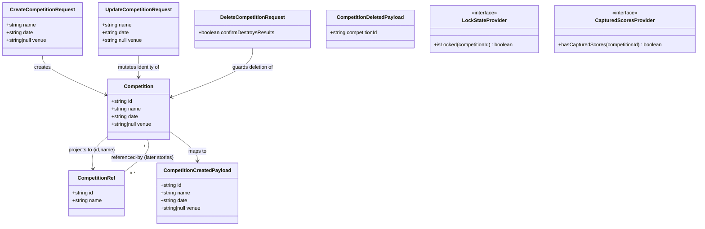

# Competition Lifecycle — Create, Open, Delete, Identity (STORY-001-003)

## Requirements

Implement the **competition aggregate** as the first non-master-data citizen of
the immutable event log: create a distinct, re-openable event object carrying a
required identity (name + date, optional venue) over a stable surrogate id;
isolate each competition's data from every other so opening one never leaks
another's rows; and guard deletion — a hard block while locked, an
acknowledge-the-consequence guard once scores exist, an ordinary confirm
otherwise.

Boundaries:
- **In**: create (with editable identity), open/isolate, guarded delete,
  identity update; `competition.*` events; a `"competitions"` registry scope and
  the `scope = competitionId` convention for future content.
- **Out**: lock/unlock (CD authority — respected via a stubbed seam, not set
  here), template seeding (STORY-001-006), further configuration
  (STORY-001-004+), suspend/resume (STORY-001-013), name uniqueness, an end
  date, any server-side "open competition" session.

Value: gives the Organiser independently managed events, protects captured
results from accidental destruction, and establishes the identity + scope that
all later setup hangs off.

## Entities

Notes (conservative design):
- `Competition` is a flat record mirroring `LandingBonusTable` /
  `Pilot`; `date` is an ISO calendar date **string** (event start date, no end
  date), `venue` is `string | null` like existing optional fields
  (`registrationId`, `club`).
- `CompetitionRef` **already exists** in `packages/shared/src/errors.ts` — do
  not redefine it; the competition `{ id, name }` projection is finally the real
  object it has described all along.
- The two providers are the **only new abstractions** — direct clones of the
  `RosterReferenceChecker` / `LandingTableReferenceChecker` seam. No stored
  `locked` / `hasScores` fields on `Competition`.

## Approach

1. **Vertical slice, reusing the proven shape**:
   - `packages/shared`: `Competition` type + Zod `create`/`update` schemas
     (name+date required, venue optional) + `competition.*` event types and a
     `competitionToCreatedPayload` mapper, exported from `index.ts`. Mirror
     `landing-table.ts` / `events.ts`.
   - `apps/base`: `CompetitionService` (list/get/create/update/delete) →
     `EventStore.append` → `CompetitionProjection.apply`; two injected state
     seams; competition-specific `DomainError` subclasses; `/api/competitions`
     Fastify routes; new `setErrorHandler` branches.
   - `apps/companion`: a `CompetitionLibrary` screen + `CompetitionForm`
     reached from `App.tsx`'s `Screen` switch, with a guarded-delete dialog.

2. **Isolation as a structural guarantee (AC3)**:
   - Registry/lifecycle events (`competition.created` / `.updated` / `.deleted`)
     file under a single fixed `"competitions"` scope — this projection filters
     `record.scope !== "competitions"`, exactly as landing tables filter
     `"master-data"`.
   - **Establish the convention** that future *content* events (roster, draw,
     scores) will file under `scope = competitionId`; a content projection built
     for id X applies only events whose scope is X, so cross-competition leakage
     is impossible by construction. This story mostly documents/enforces the
     convention at the registry surface; heavy consumers are later stories.
   - "Open"/"close"/"re-open" are **client-side selections** (per D8's stateless
     base) — no server session. Re-open returns the same projected object.

3. **Deletion guard (server-authoritative, ordered)**:
   - Check order is **fixed**: not-found → **locked (hard, AC6)** → **captured
     scores without acknowledgment (soft, AC5)** → append `competition.deleted`
     tombstone (AC4). Locked must precede captured-scores so a locked-with-scores
     competition can never slip through on an acknowledgment flag.
   - AC4 ordinary confirmation is **UI-only**; AC5's consequence-naming
     acknowledgment is a required `confirmDestroysResults` flag on the request
     body, enforced on the base so a mis-built client cannot bypass it.
   - Deletion is a **tombstone, not a purge** (D4 immutable log / `no-delete`
     trigger): the projection drops the competition on apply and on rebuild.

4. **Deferred-state seams**: `LockStateProvider` and `CapturedScoresProvider`
   injected via `AppOptions`, defaulting to `AlwaysUnlocked` / `NoScoresYet`
   stubs. AC5/AC6 guard paths are fully unit-testable now by injecting stubs
   that report locked / scores-present; the CD-lock and scoring stories swap
   implementations with zero rework.

5. **Validation & errors**: reuse the `ValidationError` → 400 `flatten()`
   contract for field-named messages (AC2), and the `DomainError` →
   `setErrorHandler` branch pattern for the new codes.

Data flow (unchanged from existing slices): **React form → `apiRequest`
(headers carry actor/client) → Fastify route (attribution from headers) →
service (Zod validate + lifecycle guards) → `EventStore.append` →
`projection.apply` → JSON response**; `projection.rebuild(eventStore.readAll())`
on boot.

## Structure

### Inheritance relationships
1. `CompetitionNotFoundError extends DomainError` (code `COMPETITION_NOT_FOUND`).
2. `CompetitionLockedError extends DomainError` (code `COMPETITION_LOCKED`).
3. `CompetitionDeleteNeedsConfirmationError extends DomainError`
   (code `COMPETITION_DELETE_NEEDS_CONFIRMATION`).
4. Reuse (re-export) `DomainError` and `ValidationError` from
   `apps/base/src/pilots/errors.js`, as `landing-tables/errors.ts` does.
5. `AlwaysUnlockedProvider implements LockStateProvider`;
   `NoScoresYetProvider implements CapturedScoresProvider`.

### Dependencies
1. `CompetitionService` depends on `EventStore`, `CompetitionProjection`,
   `LockStateProvider`, `CapturedScoresProvider`.
2. `buildApp` injects the two providers (from `AppOptions`, defaulting to
   stubs), rebuilds the projection from `eventStore.readAll()`, and passes the
   service to `registerCompetitionRoutes`.
3. `registerCompetitionRoutes(app, service)` reuses `attributionFromHeaders`.
4. Companion `CompetitionLibrary` calls `apiRequest`; `App.tsx` renders it from
   the `Screen` switch.

### Layered architecture
1. **Shared contract** (`packages/shared`): types, Zod schemas, event
   types/payload mappers — the single source of DTO truth for base + companion.
2. **Route layer** (`apps/base/src/routes/competitions.ts`): HTTP binding,
   attribution extraction, status codes (200/201/204); no business logic.
3. **Service layer** (`apps/base/src/competitions/service.ts`): Zod validation,
   lifecycle guards, id generation, append + apply. Owns all invariants.
4. **Projection layer** (`apps/base/src/competitions/projection.ts`): derived,
   rebuildable in-memory map keyed by id, scope-filtered to `"competitions"`.
5. **Event log** (`EventStore`): the one writer; append-only, trigger-guarded.
6. **Error mapping** (`buildApp`'s `setErrorHandler`): the repo's equivalent of
   a global handler — one branch per domain error → `ErrorResponse`.
7. **UI layer** (`apps/companion`): `CompetitionLibrary` + `CompetitionForm`.

### Extension points
- `scope = competitionId` convention for later content projections.
- The two providers are the swap-in points for CD-lock and scoring stories.

## Operations

### Create shared contract — `packages/shared/src/competition.ts`
1. Responsibility: define the `Competition` type and Zod request schemas.
2. Attributes: `id: string`, `name: string`, `date: string`,
   `venue: string | null`.
3. Schemas (mirror `landing-table.ts` field style):
   - `name`: `z.string().transform(trim).refine(len>0, "Name is required")
     .refine(len<=100, "Name must be 100 characters or fewer")`.
   - `date`: required, well-formed calendar date — `z.string().refine(v =>
     /^\d{4}-\d{2}-\d{2}$/.test(v) && !Number.isNaN(Date.parse(v)),
     "A valid date is required")`.
   - `venue`: `z.string().transform(trim).transform(v => v.length ? v : null)
     .nullable().optional()` normalising blank/absent → `null`.
   - `createCompetitionRequestSchema = z.object({ name, date, venue })`;
     `updateCompetitionRequestSchema` identical (whole-aggregate update).
4. Exports: `CreateCompetitionRequest`, `UpdateCompetitionRequest` via
   `z.infer`. Add `export * from "./competition.js"` to `index.ts`.
5. Constraints: no uniqueness constraint (follow precedent); venue optional
   (AC2 mandatory set is name+date only).

### Update shared events — `packages/shared/src/events.ts`
1. Add `CompetitionEventType = "competition.created" | "competition.updated"
   | "competition.deleted"`.
2. `CompetitionCreatedPayload = { id, name, date, venue: string | null }`;
   `CompetitionUpdatedPayload = CompetitionCreatedPayload`;
   `CompetitionDeletedPayload = { competitionId: string }`.
3. `CompetitionEventPayload` union of the three.
4. `competitionToCreatedPayload(c: Competition): CompetitionCreatedPayload`
   returning a shallow copy of the four fields.

### Create projection — `apps/base/src/competitions/projection.ts`
1. Responsibility: rebuildable in-memory registry keyed by id.
2. `private competitions = new Map<string, Competition>()`; `SCOPE =
   "competitions"`.
3. Methods:
   - `apply(record)`: `if (record.scope !== SCOPE) return;` then switch —
     `created`/`updated` → `set(payload.id, {id,name,date,venue})`;
     `deleted` → `delete(payload.competitionId)`; default no-op.
   - `rebuild(events)`: reset map, apply each in seq order (tombstone after a
     create must leave the competition absent).
   - `getAll()`: sorted by name (base sensitivity) then id, like landing tables.
   - `getById(id)`.
4. Constraints: never mutate caller-held payloads; copy fields on `set`.

### Create errors — `apps/base/src/competitions/errors.ts`
1. Re-export `DomainError`, `ValidationError` from `../pilots/errors.js`.
2. `CompetitionNotFoundError` (`COMPETITION_NOT_FOUND`).
3. `CompetitionLockedError` (`COMPETITION_LOCKED`).
4. `CompetitionDeleteNeedsConfirmationError`
   (`COMPETITION_DELETE_NEEDS_CONFIRMATION`), optionally carrying
   `{ reason: "captured-scores" }` in details.

### Create seams — `apps/base/src/competitions/state-providers.ts`
1. `interface LockStateProvider { isLocked(competitionId: string): boolean }`
   with `AlwaysUnlockedProvider` returning `false` (STORY: CD lock).
2. `interface CapturedScoresProvider { hasCapturedScores(competitionId: string):
   boolean }` with `NoScoresYetProvider` returning `false` (STORY: scoring).
3. Comment each stub with the story that will replace it, per the existing seam
   convention.

### Create service — `apps/base/src/competitions/service.ts`
1. Constructor: `(eventStore, projection, lockState, capturedScores)`.
2. `SCOPE = "competitions"`; `parseOrThrow` helper copied from the landing
   service.
3. Methods:
   - `list(): Competition[]` → `projection.getAll()`.
   - `get(id)`: `getById` or throw `CompetitionNotFoundError`.
   - `create(input, attribution)`: parse `createCompetitionRequestSchema`; build
     `{ id: crypto.randomUUID(), name, date, venue }`; append
     `competition.created` with `competitionToCreatedPayload`; `apply`; return.
   - `update(id, input, attribution)`: throw `CompetitionNotFoundError` if
     absent; parse `updateCompetitionRequestSchema`; append
     `competition.updated` with the full new identity over the same id; apply;
     return. (Rename never breaks refs — id is the key.)
   - `delete(id, req, attribution)`: **ordered guard** —
     1. `getById(id)` absent → `CompetitionNotFoundError` (AC: 404; second
        delete of a tombstoned competition also 404).
     2. `lockState.isLocked(id)` → `CompetitionLockedError` (AC6, hard —
        regardless of any flag).
     3. `capturedScores.hasCapturedScores(id) &&
        !req.confirmDestroysResults` → `CompetitionDeleteNeedsConfirmationError`
        (AC5).
     4. Append `competition.deleted` `{ competitionId: id }`; apply (AC4).
4. Constraints: guard order is load-bearing; do not reorder 2 before 3.

### Create routes — `apps/base/src/routes/competitions.ts`
1. Copy `attributionFromHeaders` (or extract to a shared helper — optional).
2. `GET /api/competitions` → `list()`.
3. `GET /api/competitions/:id` → `get()`.
4. `POST /api/competitions` → `create()`, `reply.code(201)`.
5. `PUT /api/competitions/:id` → `update()`.
6. `DELETE /api/competitions/:id` → read `confirmDestroysResults` from
   `request.body` (default `false`), call `delete()`, `reply.code(204)`.

### Wire into app — `apps/base/src/app.ts`
1. `AppOptions`: add optional `lockStateProvider?: LockStateProvider` and
   `capturedScoresProvider?: CapturedScoresProvider` with seam comments.
2. Build `CompetitionProjection`, `rebuild(eventStore.readAll())`, construct
   `CompetitionService` with providers defaulting to the stubs.
3. `registerCompetitionRoutes(app, competitionService)`.
4. `setErrorHandler`: add branches —
   `CompetitionNotFoundError` → 404;
   `CompetitionLockedError` → 409 `{ code, message }`;
   `CompetitionDeleteNeedsConfirmationError` → 409 `{ code, message, details }`.
   Place before the generic `DomainError` → 500 fall-through so none leaks 500.

### Companion — `apps/companion/src/competitions/`
1. `CompetitionForm.tsx`: name (text), date (`<input type="date">`), venue
   (optional text); render `fieldErrors` from `flatten().fieldErrors` (AC2
   field-named messages); reused for create and edit (`table`-style `competition`
   prop).
2. `CompetitionLibrary.tsx` (model on `LandingTableLibrary`): list, Add, Edit,
   Delete; on `POST /DELETE` handle `ApiError` — map `COMPETITION_LOCKED` to
   "cannot delete — competition is locked", and
   `COMPETITION_DELETE_NEEDS_CONFIRMATION` to a stronger dialog that, on
   explicit confirm, re-issues DELETE with body `{ confirmDestroysResults: true }`.
3. Track the selected/"open" competition in component state (client-side only).

### App shell — `apps/companion/src/App.tsx`
1. Extend `Screen` to `"competitions" | "pilots" | "landing-tables"`; add a nav
   button; render `<CompetitionLibrary actor={actor} />`.

### Tests — `apps/base/test/`
1. `competitions.service.test.ts`: create+identity survives rebuild (AC1);
   missing name / missing date rejected with field messages (AC2); two
   competitions isolated — deleting/renaming one leaves the other intact (AC3);
   unlocked+no-scores delete tombstones and drops on rebuild (AC4); captured
   scores without flag → needs-confirmation, with flag → deletes (AC5, inject
   `CapturedScoresProvider` stub = true); locked → hard block even with the flag
   (AC6, inject `LockStateProvider` stub = true); locked check precedes
   captured-scores check; second delete → 404.
2. `competitions.routes.test.ts`: status-code mapping for each error branch;
   201 on create; 204 on delete; 409 codes for locked / needs-confirmation.

## Norms

1. **Module layout**: one folder per aggregate under `apps/base/src/`
   (`competitions/{service,projection,errors,state-providers}.ts`); routes under
   `routes/competitions.ts`; shared contract in `packages/shared/src/`.
2. **Imports**: `@soarscore/shared` for cross-package types; `.js` extensions on
   relative ESM imports (repo convention).
3. **Ids**: `crypto.randomUUID()` surrogate key; identity attributes are mutable
   over it — never key by name.
4. **Validation**: Zod at the service boundary via `parseOrThrow`; `trim` +
   required + length-bound; field-level messages so `flatten().fieldErrors`
   names the missing field.
5. **Events**: past-tense `aggregate.verb` type strings; payloads are plain
   JSON-serialisable objects built by a `…ToCreatedPayload` mapper; deep-copy
   nested data on apply.
6. **Scope**: registry events under the literal `"competitions"`; reserve
   `scope = competitionId` for future content — every projection guards
   `record.scope !== SCOPE` first.
7. **Errors**: extend the shared `DomainError`; one `code` constant per class;
   map centrally in `setErrorHandler` (409 for conflict-style guards, 404
   not-found, 400 validation) — the repo's single error-mapping seam, not a
   per-route try/catch.
8. **Seams**: defer not-yet-owned state behind an injected interface + a no-op
   stub named for the story that replaces it; wire via `AppOptions` with a
   default.
9. **Attribution**: derive from `x-actor-name` / `x-client-id`; `authority`
   stays `"organiser"` for these operations.
10. **Style**: match existing TypeScript/React idiom, comment density, and
    ~80-col prose in any docs touched. No new dependencies.

## Safeguards

1. **Functional**: name + date mandatory before identity-dependent config, with
   the missing field named (AC2); a created competition survives close/re-open
   with details intact (AC1); rename/edit never breaks the id-keyed reference or
   scope boundary.
2. **Isolation**: a projection/query for one competition must never observe
   another's events — proven by a two-competition test (AC3); every projection
   guards its scope before applying; content convention is `scope =
   competitionId`.
3. **Deletion rules (server-authoritative)**: locked → hard 409 regardless of
   any flag (AC6); captured scores → 409 unless `confirmDestroysResults` is
   explicitly true (AC5); guard order is not-found → locked → captured-scores →
   tombstone, and is non-negotiable.
4. **Immutable-log**: deletion is a `competition.deleted` tombstone — never a
   row delete (D4 / `no-delete` trigger); rebuild must drop a tombstoned
   competition even though its `created` event remains; audit history retained.
5. **Statelessness**: no server-side "open competition" session (D8);
   last-action-wins, no control lock.
6. **Error handling**: business errors carry a stable `code` + human message; no
   internal detail leaked; every new `DomainError` has a `setErrorHandler`
   branch (a missing branch = a 500 leak — verify all three are wired).
7. **Data**: `date` is an ISO `YYYY-MM-DD` start date, no end date; `venue`
   normalises blank → `null`; `name` trimmed, ≤100 chars.
8. **Integration**: do **not** wire competitions into the pilot/landing
   reference-checkers here — those remain stubbed (STORY-001-005 / -008);
   staying in scope is a constraint.
9. **API**: REST under `/api/competitions`; 201 create, 204 delete, 200
   read/update, 4xx per the error map; request/response shapes come only from
   the shared Zod-derived types.
10. **No over-reach**: reuse existing `CompetitionRef`; add no stored
    `locked`/`hasScores` fields; introduce no new tables or dependencies.
