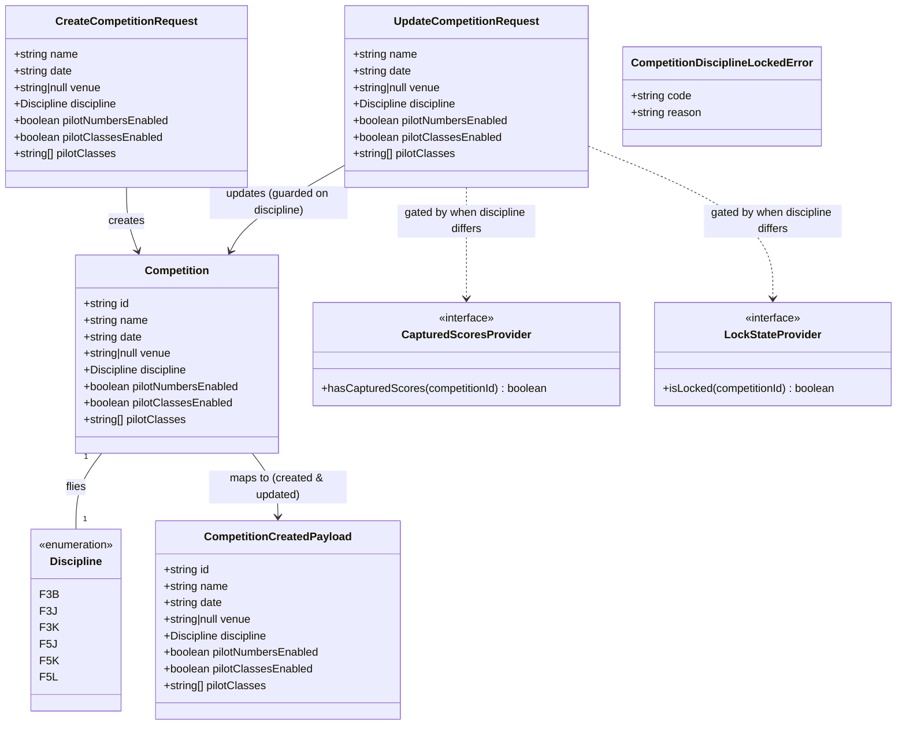

# Competition Discipline Selection and Entry Options

## Requirements

Extend the existing Competition aggregate so an Organiser captures a **required
FAI discipline** at creation and toggles two per-competition **entry options**
(pilot numbers, pilot classes), giving every downstream configuration story a
correct, single source of truth for the class being flown and the entrant
attributes the event uses.

- Make discipline the aggregate's pivotal, additive configuration field: one
  enumerated choice over the six MVP classes (F3B, F3J, F3K, F5J, F5K, F5L)
  that later stories read to scope tasks/rules/scoring — recorded here, not
  encoded here.
- Carry discipline on **both** the create and the PUT/update path (RD5); a
  competition never exists without one (RD1).
- Guarantee discipline is **never silently switched once scores exist** (RD2):
  the guard lives **inside `update`** and fires only when the submitted
  discipline differs from the stored one, hard-blocking (409) when captured
  scores are present or the competition is locked — no acknowledgment flag.
- Let the Organiser tailor entrant attributes per event via `pilotNumbersEnabled`
  and `pilotClassesEnabled` flags, the latter carrying a competition-level
  `pilotClasses: string[]` allowed-name set that reports later group/rank by
  (RD3); disabling pilot classes discards the set (RD4).
- Boundary: this slice **persists and exposes** configuration only. Per-entry
  attributes (roster), draw columns, and report grouping belong to
  STORY-001-005/009/014/015; per-discipline task/scoring catalogues belong to
  STORY-001-007/008.

## Entities

**Conservative note (RD5):** `Competition` is *extended*, not restructured.
Discipline rides the existing `competition.created` / `competition.updated`
events — there is **no** dedicated `competition.disciplineChanged` event, **no**
separate `ChangeDisciplineRequest` DTO, and **no** `PATCH` route. Existing
`id/name/date/venue` and the whole-aggregate update path are preserved;
`pilotClasses` stays a plain `string[]` — no wrapper entity. The dev DB is
disposable and there are **no legacy `competition.created` events** to backfill
(RD1), so no cross-version defaulting is load-bearing.

## Approach

1. **Shared contract (`packages/shared`)**:
   - Add a `discipline` Zod enum over the six class codes to `competitionFields`
     so it is validated on **both** `createCompetitionRequestSchema` and
     `updateCompetitionRequestSchema` (RD5), **required** on each (RD1), with a
     field-level message so an unknown code fails at the boundary. Additive-only
     per the NFR — new classes extend the enum without reshaping the aggregate.
   - Add `pilotNumbersEnabled` / `pilotClassesEnabled` booleans (default `false`)
     and `pilotClasses: string[]` (default `[]`, trimmed, non-empty, deduped)
     to the shared fields.
   - Extend `CompetitionCreatedPayload` (and therefore `CompetitionUpdatedPayload`)
     with the four new fields and update `competitionToCreatedPayload`. **No new
     event type.**

2. **Base service + guard (`apps/base`)**:
   - `create` requires and persists discipline + entry-option state.
   - `update` mutates identity, entry options **and** discipline through the one
     `competition.updated` event, but wraps a **guard**: after parsing, compare
     the submitted discipline to the stored competition's discipline; only when
     they differ, run the ordered check `locked → captured-scores` and
     hard-block (409) with `CompetitionDisciplineLockedError` — no acknowledgment
     flag (RD2). An unchanged discipline (or a pure name/venue/date/toggle edit)
     passes freely.
   - Disabling pilot classes via `update` **discards** the `pilotClasses` set to
     `[]` (RD4); the entry-level clear is handed forward to STORY-001-005.
   - Add `CompetitionDisciplineLockedError` (409) with its own `setErrorHandler`
     branch, parallel to `CompetitionDeleteNeedsConfirmationError`.
   - Extend `CompetitionProjection` to read/store the four new fields on
     `competition.created` / `competition.updated`.

3. **Companion client (`apps/companion`)**:
   - Extend `CompetitionForm` with a discipline `<select>` (shown on both create
     and edit), two toggle checkboxes, and a `pilotClasses` name editor shown
     only when the pilot-classes toggle is on.
   - The single save (POST on create, PUT on edit) carries discipline; surface
     the 409 hard-block message when an edit that changes discipline is refused.
   - **Do not** build roster attributes, draw columns, or report grouping — those
     are downstream stories; this slice only persists/exposes the config.

**Data flow (unchanged from slice precedent):** React form → `apiRequest`
(attribution headers) → Fastify route → service (Zod validate + discipline
guard inside `update`) → `EventStore.append` → `projection.apply` → response;
boot does `projection.rebuild(readAll())`.

## Structure

### Inheritance Relationships
1. `CompetitionDisciplineLockedError` extends `DomainError` (from
   `apps/base/src/pilots/errors.ts`), exposing
   `code = "COMPETITION_DISCIPLINE_LOCKED"`.
2. `CapturedScoresProvider` / `LockStateProvider` interfaces are implemented by
   the existing `NoScoresYetProvider` / `AlwaysUnlockedProvider` stubs (no new
   implementations in this slice).
3. `createCompetitionRequestSchema` and `updateCompetitionRequestSchema` both
   compose the shared `competitionFields` object (now including `discipline`).

### Dependencies
1. `CompetitionService` depends on `EventStore`, `CompetitionProjection`,
   `LockStateProvider`, `CapturedScoresProvider` (constructor unchanged).
2. `update` calls `projection.getById` (to read the stored discipline for the
   diff), then — only when discipline differs — `lockState.isLocked` and
   `capturedScores.hasCapturedScores`, then `eventStore.append` +
   `projection.apply`.
3. `registerCompetitionRoutes` injects `CompetitionService`; the existing
   `POST` and `PUT` routes carry the new fields — **no new route**.
4. `buildApp`'s `setErrorHandler` gains a branch for
   `CompetitionDisciplineLockedError`.
5. `CompetitionForm` (companion) depends on the shared `Competition` type and
   the discipline enum values.

### Layered Architecture
1. **Shared contract layer** (`packages/shared`): types, Zod schemas, event
   payloads, payload mapper — the cross-app source of truth.
2. **Route layer** (`apps/base/src/routes/competitions.ts`): HTTP → service,
   attribution from headers; existing POST/PUT carry the new fields.
3. **Service layer** (`apps/base/src/competitions/service.ts`): invariants, the
   in-`update` discipline-change guard, event append.
4. **Projection layer** (`apps/base/src/competitions/projection.ts`): derived,
   rebuildable read model carrying the four new fields.
5. **Error-handling layer** (`apps/base/src/app.ts` `setErrorHandler`): maps the
   new domain error to 409 with a `reason`.
6. **UI layer** (`apps/companion`): discipline picker, toggles, class-set editor.

## Operations

### Update Shared Contract — `packages/shared/src/competition.ts`
1. Responsibility: define discipline + entry-option shape and validation.
2. Add constant `DISCIPLINES = ["F3B","F3J","F3K","F5J","F5K","F5L"] as const`
   and `export type Discipline = (typeof DISCIPLINES)[number]`.
3. Extend `interface Competition` with `discipline: Discipline`,
   `pilotNumbersEnabled: boolean`, `pilotClassesEnabled: boolean`,
   `pilotClasses: string[]`.
4. Add to `competitionFields` (shared by create and update — RD5):
   - `discipline: z.enum(DISCIPLINES)` with message `"A discipline is required"`.
   - `pilotNumbersEnabled: z.boolean().default(false)`.
   - `pilotClassesEnabled: z.boolean().default(false)`.
   - `pilotClasses: z.array(z.string().transform(trim).refine(nonEmpty))
     .default([])` then a cross-field `.superRefine`: dedupe (case-insensitive)
     and require ≥1 name **when `pilotClassesEnabled` is true**, else force `[]`.
5. `createCompetitionRequestSchema` and `updateCompetitionRequestSchema` remain
   `z.object(competitionFields)` — both now include discipline.
6. Export inferred types `CreateCompetitionRequest`, `UpdateCompetitionRequest`.

### Update Event Contract — `packages/shared/src/events.ts`
1. Extend `CompetitionCreatedPayload` (and thus `CompetitionUpdatedPayload`) with
   `discipline`, `pilotNumbersEnabled`, `pilotClassesEnabled`, `pilotClasses`.
2. **No new event type** (RD5): `CompetitionEventType` and the payload union are
   unchanged apart from the widened created/updated payload.
3. Update `competitionToCreatedPayload` to copy the four new fields.

### Update Service — `apps/base/src/competitions/service.ts`
1. `create(input, attribution)`:
   - Parse `createCompetitionRequestSchema`.
   - Build `Competition` incl. `discipline`, toggles, and `pilotClasses`
     (normalised to `[]` when `pilotClassesEnabled` is false).
   - Append `competition.created` via `competitionToCreatedPayload`; apply; return.
2. `update(id, input, attribution)`:
   - Read `existing = projection.getById(id)`; not-found guard unchanged.
   - Parse `updateCompetitionRequestSchema`.
   - **Discipline-change guard (RD2/RD5):** if `parsed.discipline !==
     existing.discipline`, run ordered check:
     `lockState.isLocked(id)` → throw `CompetitionLockedError`;
     `capturedScores.hasCapturedScores(id)` → throw
     `CompetitionDisciplineLockedError`. (No acknowledgment flag.)
   - When `pilotClassesEnabled` is false, force `pilotClasses = []` (RD4 discard).
   - Build the whole-aggregate `Competition` (id + all fields incl. discipline);
     append `competition.updated`; apply; return.

### Create Business Exception — `CompetitionDisciplineLockedError`
1. Location: `apps/base/src/competitions/errors.ts`.
2. Inheritance: `extends DomainError`.
3. Attributes: `readonly code = "COMPETITION_DISCIPLINE_LOCKED"`;
   `readonly reason: "captured-scores"` (the locked case reuses the existing
   `CompetitionLockedError`).
4. Constructor: `(message: string)` sets the fixed `reason` for the handler.
5. Usage: thrown by `update` when the discipline differs and scores are present.

### Update Projection — `apps/base/src/competitions/projection.ts`
1. Widen the `created`/`updated` payload cast and stored `Competition` to include
   `discipline`, `pilotNumbersEnabled`, `pilotClassesEnabled`, `pilotClasses`.
2. `competition.deleted` and `rebuild` unchanged.

### Update Routes — `apps/base/src/routes/competitions.ts`
1. `POST` / `PUT` bodies now carry the four new fields (validated in the service).
   No new route; the guard is enforced inside `update`.

### Update Error Handler — `apps/base/src/app.ts`
1. Import `CompetitionDisciplineLockedError`.
2. Add a `setErrorHandler` branch **before** the generic `DomainError` 500:
   `reply.code(409).send({ code, message, details: { reason } })`.

### Update Companion Form — `apps/companion/src/competitions/CompetitionForm.tsx`
1. Extend `CompetitionFormValues` with `discipline`, `pilotNumbersEnabled`,
   `pilotClassesEnabled`, `pilotClasses` (string[] editor state).
2. Render a required discipline `<select>` on both create and edit; render two
   toggle checkboxes; show the `pilotClasses` name editor only when
   `pilotClassesEnabled` is on. Clear the local class list when toggled off.
3. Wire the single save (POST/PUT) to send the new fields; surface the 409
   `COMPETITION_DISCIPLINE_LOCKED` message when an edit that changes discipline
   is refused. Keep existing field-error rendering.

### Tests
1. Service unit tests: create-with-discipline; update with unchanged discipline
   passes (no guard) even when a captured-scores stub returns present;
   **update changing discipline hard-blocks 409 when the stub returns present**;
   blocked when locked; discipline change is free when no scores; unknown code
   rejected at Zod boundary; disabling pilot classes discards the set.
2. Route tests: PUT changing discipline under scores → 409 shape (`code`,
   `reason`); PUT identity-only edit under scores succeeds.
3. Projection test: created/updated replay carries the four new fields.

## Norms
1. **Schema style**: mirror existing `competitionFields` — `.transform(trim)` +
   `.refine` with field-named messages so `flatten().fieldErrors` names the
   offending field. Enums via `z.enum(DISCIPLINES)`.
2. **Additive-only extensibility (NFR)**: new classes extend `DISCIPLINES`; never
   reshape the aggregate or rename existing fields.
3. **Event sourcing (D4)**: every mutation is an appended event carrying
   `Attribution`; "discard" is a forward event, not a purge; projection is
   derived/rebuildable. Discipline rides the existing created/updated events (RD5).
4. **Guard placement**: the discipline guard lives **inside `update`**, keyed on a
   diff against stored state, ordered `locked → captured-scores`; it never gates a
   rename or an unchanged-discipline edit.
5. **Server-authoritative destructive rules**: the discipline guard lives in the
   service, never trusted to the client — even though it shares the PUT path.
6. **Error pattern**: one typed `DomainError` subclass per domain code, one
   `setErrorHandler` branch each; 409 for guard conflicts with a `details.reason`.
7. **Slice discipline**: shared types → EventStore → projection → service → routes
   → companion screen; do not leak downstream (roster/draw/report) behaviour in.
8. **House rules**: do not copy FAI rule numbers into product code (rule 1);
   discipline is a *key into* the rule corpus, not a copy of it. Keep FAI
   `discipline` and product `pilotClass` strictly separate concepts (rule 2).
9. **Style**: prose/comments wrapped ~80 cols; match surrounding code idiom.

## Safeguards
1. **Functional — discipline required at create and update**: both schemas reject
   a missing or unknown discipline at the Zod boundary (RD1/RD5); a competition
   never exists without one.
2. **Functional — hard block on change under scores (AC2/RD2)**: `update` returns
   409 `COMPETITION_DISCIPLINE_LOCKED` whenever the submitted discipline differs
   from the stored one **and** `capturedScores.hasCapturedScores(id)` is true;
   **no acknowledgment flag clears it**. Also 409 (locked) via
   `CompetitionLockedError` when `lockState.isLocked(id)`.
3. **Functional — unchanged discipline never guards**: an identity/toggle-only
   edit, or a PUT resubmitting the same discipline, passes freely even under
   captured scores.
4. **Functional — entry toggles never guard**: toggling pilot numbers / pilot
   classes is free; disabling pilot classes discards `pilotClasses` to `[]` (RD4).
5. **Business rule — pilot classes vs discipline are orthogonal**: `pilotClasses`
   is an event-local grouping (e.g. Open/Sportsman) with no FAI-rule meaning; must
   never be conflated with `discipline`.
6. **Business rule — pilotClasses integrity**: when `pilotClassesEnabled`, require
   ≥1 non-empty, deduped class name; when disabled, force `[]`.
7. **Exception-handling constraints**: `CompetitionDisciplineLockedError` carries
   a clear `code` + `reason`, is domain-classified, exposes no internal detail,
   and is handled by the centralised `setErrorHandler` (a missing branch would
   leak a 500 — must be added).
8. **Integration constraints**: reuse the existing `CapturedScoresProvider` /
   `LockStateProvider` seams and `AppOptions` injection unchanged; no new provider
   implementations and **no new route/event** in this slice. Backward compatible
   with the shipped competition slice (create/update/delete paths intact).
9. **Data constraints**: `discipline ∈ DISCIPLINES`; toggles boolean default
   false; `pilotClasses` trimmed, non-empty, deduped strings.
10. **Scope constraints (out of this slice)**: per-entry pilot-number/pilot-class
    attributes (STORY-001-005), draw columns (009), report grouping (014/015),
    per-discipline task/scoring catalogues (007/008), template-seeded discipline
    rule (006), team entry / per-entry frequency (Future Enhancements). This slice
    only persists and exposes the configuration.
