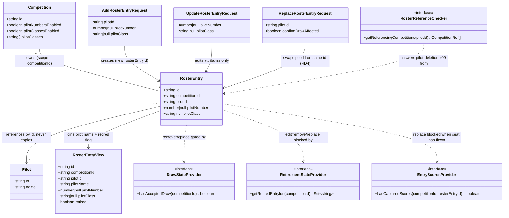

# Build and Edit the Competition Roster

## Requirements

Introduce the **competition roster** — the per-event field list built from the
master pilot library — as the first per-competition content aggregate
(`scope = competitionId`), so an Organiser assembles up to 20 entrants fast,
edits their per-entry attributes without ever touching master pilot data, and
handles a post-draw withdrawal as a slot-inheriting replacement instead of a
re-draw.

- Add master pilots to a competition as **roster entries referencing the pilot
  by id** — never copying pilot fields (AC1/AC2); remove entries freely while
  no accepted draw exists (AC3).
- Give each entry **its own stable `rosterEntryId`** distinct from `pilotId`
  (RD4): the entry is the durable *seat*; draw slots, scores and reports key on
  it, so an AC4 replacement is a `roster.entryReplaced` mutation on the same
  entry id and every downstream reference is inherited with **no draw write**.
- Materialise per-entry attributes **iff the owning competition's entry option
  is on**: unique auto-assignable pilot number from 1 (RD5) under
  `pilotNumbersEnabled`; mandatory class ∈ the competition's `pilotClasses`
  set (RD6) under `pilotClassesEnabled`.
- Gate edit freedom on draw existence via an injected read-only
  `DrawStateProvider` (RD3/RD4): absent draw → free add/remove/edit; present
  draw → remove becomes replace-with-acknowledgment (AC4 warning).
- **Replacement inherits the schedule, never results**: a seat that has flown
  (any captured score against its `rosterEntryId`) cannot be replaced — that
  is CD retirement territory (Area 5.5, which re-draws). Enforced via an
  injected per-entry `EntryScoresProvider` seam; and the score contract pins
  that scores bind to the **occupant at capture time** (`pilotId`), never to
  the seat alone, so points can never transfer across a replacement.
- Reflect CD-retired entries via an injected `RetirementStateProvider` (RD3)
  and refuse silent edit/remove/replace/reactivation of them (AC5).
- **Close the pilot-deletion seam (RD1)**: replace `NoRostersYetChecker` with a
  real checker answering from roster state, so deleting a rostered master
  pilot hard-blocks 409 `PILOT_REFERENCED` naming the referencing competitions
  — no force/override.
- Boundary: draw generation (STORY-001-009), retirement/re-draw authority
  (Area 5.5), teams and per-entry frequency are **out**; this slice ships the
  consumer side of both seams with no-op stubs.

## Entities

**Conservative note:** `Pilot`, `Competition`, and their schemas/events are
**untouched** — the roster reads the competition projection for toggles and the
pilot projection for names; no field is added to either aggregate. Retired
state is **not stored on the entry** — it is queried from the provider at read
time, so Area 5.5 owns it outright. `CompetitionRef` is reused as-is.

## Approach

1. **Shared contract (`packages/shared`)**:
   - New `roster.ts`: `RosterEntry`, `RosterEntryView`, and Zod schemas for
     add / update / replace requests. Schemas validate **structure only**
     (uuid-ish ids, positive-integer number, trimmed non-empty class); the
     cross-aggregate rules (option toggles, class vocabulary, uniqueness,
     duplicates) live in `RosterService` because Zod cannot see the owning
     competition.
   - New event types in `events.ts`: `roster.entryAdded`, `roster.entryUpdated`,
     `roster.entryRemoved`, `roster.entryReplaced` — all filed under
     `scope = competitionId` (the model the competition projection's comment
     already promises). `entryReplaced` records `previousPilotId → pilotId` on
     the same `rosterEntryId` so the immutable log (D4) shows the prior
     occupant.

2. **Base station (`apps/base`)** — same
   shared-schema → service → projection → routes layering as every aggregate:
   - **One `RosterProjection`** (RD2), `Map<competitionId, Map<entryId,
     RosterEntry>>`, rebuilt from the full log; guards by recognising
     `roster.*` event types and filing under the record's scope, so one
     competition's events never bleed into another's roster. Also drops a
     competition's roster on `competition.deleted` (scope `"competitions"`).
   - **`RosterService`** enforces all invariants at command time against the
     *live* competition/pilot/roster projections (never cached toggle state),
     appends attributed events, and applies them.
   - **Ordered guards** mirror `CompetitionService`: not-found → retired →
     draw-gate → attribute validation, so the most authoritative refusal wins.
   - **Post-draw remove = replace** with a server-enforced acknowledgment flag
     (`confirmDrawAffected`), mirroring the competition-delete
     `confirmDestroysResults` precedent: the 409 carries a reason the client
     surfaces as the AC4 warning; a mis-built client cannot bypass it.
   - **Seams (RD3)**: `DrawStateProvider` (read-only — RD4 means slot
     inheritance needs no write path), `RetirementStateProvider`, and
     `EntryScoresProvider` join `AppOptions` beside the lock/scores providers,
     with `NoAcceptedDrawProvider` / `NothingRetiredProvider` /
     `NoEntryScoresYetProvider` stubs; STORY-001-009, Area 5.5, and the
     scoring story swap in real implementations with zero rework.
   - **Flown-seat guard**: replace refuses (409) whenever the seat has any
     captured score — a half-flown competitor is a CD retirement + re-draw
     (Area 5.5), never an Organiser swap. With this guard, a replacement can
     never sit atop existing results, so points cannot transfer.
   - **Close RD1**: `ProjectionRosterReferenceChecker` implements the existing
     `RosterReferenceChecker` interface from roster + competition projections
     and becomes `buildApp`'s default, replacing `NoRostersYetChecker` (which
     stays for tests). The single synchronous SQLite writer gives the
     delete-vs-add ordering guarantee for free.

3. **Companion client (`apps/companion`)**:
   - New roster screen per competition: pick-from-library add (only pilots not
     already rostered), inline number/class editing gated by the competition's
     toggles, free remove pre-draw, replace dialog post-draw that surfaces the
     409 reason and re-submits with `confirmDrawAffected: true` on user
     confirmation, and a visible retired badge with edit/remove/replace
     disabled on retired entries.

**Data flow:** React screen → `apiRequest` (attribution headers) → Fastify
route → `RosterService` (Zod + cross-aggregate guards) → `EventStore.append`
→ `RosterProjection.apply` → `RosterEntryView` response (pilot name joined,
retired flag from provider); boot does `projection.rebuild(readAll())`.

## Structure

### Inheritance Relationships
1. `RosterEntryNotFoundError`, `DuplicateRosterEntryError`,
   `RosterEntryRetiredError`, `RosterRemoveRequiresReplacementError`,
   `RosterReplaceNeedsConfirmationError` extend `DomainError`
   (`apps/base/src/pilots/errors.ts`), each with its own `code`.
2. `NoAcceptedDrawProvider` implements `DrawStateProvider`;
   `NothingRetiredProvider` implements `RetirementStateProvider`;
   `NoEntryScoresYetProvider` implements `EntryScoresProvider`.
3. `ProjectionRosterReferenceChecker` implements the existing
   `RosterReferenceChecker` interface (unchanged).

### Dependencies
1. `RosterService` depends on `EventStore`, `RosterProjection`,
   `CompetitionProjection` (toggles + class set + existence),
   `PilotLibraryProjection` (pilot existence + name join),
   `DrawStateProvider`, `RetirementStateProvider`, `EntryScoresProvider`.
2. `ProjectionRosterReferenceChecker` depends on `RosterProjection` (which
   competitions hold the pilot) and `CompetitionProjection` (live-competition
   filter + names for `CompetitionRef`).
3. `PilotService` keeps its `RosterReferenceChecker` constructor slot;
   `buildApp` now defaults it to the real checker.
4. `registerRosterRoutes` injects `RosterService`; `buildApp`'s
   `setErrorHandler` gains one branch per new domain error.
5. The companion roster screen depends on shared `RosterEntryView`,
   `Competition` (toggles), and `Pilot` types.

### Layered Architecture
1. **Shared contract layer** (`packages/shared`): types, Zod request schemas,
   event payloads + mappers.
2. **Route layer** (`apps/base/src/routes/roster.ts`): HTTP → service,
   attribution from headers, nested under `/api/competitions/:competitionId`.
3. **Service layer** (`apps/base/src/roster/service.ts`): all invariants and
   the draw/retirement gates; event append.
4. **Projection layer** (`apps/base/src/roster/projection.ts`): derived,
   rebuildable read model keyed by competition id (first
   `scope = competitionId` aggregate).
5. **Reference-check layer** (`apps/base/src/roster/roster-reference-checker.ts`):
   real pilot-deletion protection (RD1).
6. **Error-handling layer** (`apps/base/src/app.ts` `setErrorHandler`): maps
   each new domain error to 404/409 with details.
7. **UI layer** (`apps/companion/src/roster/`): roster screen.

## Operations

### Create Shared Contract — `packages/shared/src/roster.ts`
1. Responsibility: roster types and structural validation.
2. Types:
   - `interface RosterEntry { id; competitionId; pilotId;
     pilotNumber: number | null; pilotClass: string | null }`.
   - `interface RosterEntryView extends RosterEntry { pilotName: string;
     retired: boolean }`.
3. Schemas (field-named messages, `.transform(trim)` style as elsewhere):
   - `addRosterEntryRequestSchema`: `pilotId` non-empty string;
     `pilotNumber` optional positive integer, normalised to `null` when
     absent; `pilotClass` optional trimmed string → `null` when blank/absent.
   - `updateRosterEntryRequestSchema`: `pilotNumber` / `pilotClass` as above
     (no `pilotId` — the occupant changes only via replace).
   - `replaceRosterEntryRequestSchema`: `pilotId` non-empty string;
     `confirmDrawAffected: z.boolean().default(false)`.
4. Export inferred request types; re-export from `index.ts`.

### Update Event Contract — `packages/shared/src/events.ts`
1. Add `RosterEventType = "roster.entryAdded" | "roster.entryUpdated" |
   "roster.entryRemoved" | "roster.entryReplaced"`.
2. Payloads:
   - `RosterEntryAddedPayload { id; competitionId; pilotId; pilotNumber;
     pilotClass }`; `RosterEntryUpdatedPayload` = same shape.
   - `RosterEntryRemovedPayload { rosterEntryId; competitionId }`.
   - `RosterEntryReplacedPayload { rosterEntryId; competitionId;
     previousPilotId; pilotId; pilotNumber; pilotClass }` — same entry id,
     new occupant (RD4), attribute state after the swap.
3. Add `rosterEntryToPayload(entry: RosterEntry)` mapper.

### Create Projection — `apps/base/src/roster/projection.ts`
1. Responsibility: derived roster state for all competitions (RD2), safe to
   discard and rebuild.
2. State: `Map<competitionId, Map<rosterEntryId, RosterEntry>>`.
3. `apply(record)`:
   - `roster.entryAdded` / `roster.entryUpdated` / `roster.entryReplaced`:
     upsert the entry under `record.scope` (the competition id) — for
     replaced, same id, payload's `pilotId`/attributes win.
   - `roster.entryRemoved`: delete the entry.
   - `competition.deleted` (scope `"competitions"`): drop that competition's
     whole roster map so stale entries never block pilot deletion.
   - Any other type/scope: ignore.
4. Reads: `getRoster(competitionId): RosterEntry[]` (empty array when none),
   `getEntry(competitionId, entryId)`,
   `getCompetitionIdsForPilot(pilotId): string[]`,
   `hasPilot(competitionId, pilotId): boolean`,
   `usedPilotNumbers(competitionId): Set<number>`.
5. `rebuild(events)`: reset map, apply all — same shape as
   `CompetitionProjection.rebuild`.

### Create State Providers — `apps/base/src/roster/state-providers.ts`
1. `interface DrawStateProvider { hasAcceptedDraw(competitionId): boolean }` —
   read-only by design (RD4); contract comment: *accepted* draw (not merely
   generated) flips free-edit off, and slots key on `rosterEntryId` so
   replacement needs no draw write. STORY-001-009 supplies the real one.
2. `class NoAcceptedDrawProvider` returns `false`.
3. `interface RetirementStateProvider
   { getRetiredEntryIds(competitionId): Set<string> }` — Area 5.5 supplies the
   real one.
4. `class NothingRetiredProvider` returns an empty set.
5. `interface EntryScoresProvider
   { hasCapturedScores(competitionId, rosterEntryId): boolean }` — the
   scoring story supplies the real one. Contract comment (**score-binding
   rule**): a captured score must record the `pilotId` of the occupant at
   capture time alongside the `rosterEntryId`, and results aggregate **per
   pilot** — the seat carries draw slots *forward*, never results backward or
   across occupants. This provider exists so a flown seat can never be
   replaced (points must not transfer with the seat).
6. `class NoEntryScoresYetProvider` returns `false`.

### Create Service — `apps/base/src/roster/service.ts`
1. Constructor: `(eventStore, rosterProjection, competitionProjection,
   pilotProjection, drawState, retirementState, entryScores)`.
2. `list(competitionId): RosterEntryView[]`:
   - Competition must exist (`CompetitionNotFoundError` otherwise).
   - Join each entry with its pilot's name; `retired` from
     `retirementState.getRetiredEntryIds`.
   - When the owning competition's option is now off, surface the attribute as
     `null` in the view (stored value retained in the log/projection but
     ignored — the disable-later reconciliation).
   - Sort by `pilotNumber` (nulls last) then pilot name (base-sensitivity),
     matching existing sort idiom.
3. `add(competitionId, input, attribution): RosterEntryView`:
   - Guards in order: competition exists → pilot exists (`NotFoundError`) →
     pilot not already rostered here (`DuplicateRosterEntryError`) →
     attribute rules (below).
   - Attribute rules (shared by add/update, enforced against the live
     competition projection):
     - `pilotNumbersEnabled` off: a provided `pilotNumber` → `ValidationError`
       ("Pilot numbers are not enabled for this competition"); stored `null`.
     - `pilotNumbersEnabled` on: absent number → auto-assign the lowest
       integer ≥ 1 not in `usedPilotNumbers` (RD5); provided number must be
       unused → else `ValidationError` naming `pilotNumber`.
     - `pilotClassesEnabled` off: a provided `pilotClass` → `ValidationError`;
       stored `null`.
     - `pilotClassesEnabled` on: class **required** (RD6) and must
       case-insensitively match a member of `competition.pilotClasses`
       (store the canonical casing from the set); else `ValidationError`
       naming `pilotClass`.
   - Append `roster.entryAdded` with `id: crypto.randomUUID()`,
     `scope: competitionId`; apply; return the view.
4. `update(competitionId, entryId, input, attribution): RosterEntryView`:
   - Guards: competition exists → entry exists (`RosterEntryNotFoundError`) →
     entry not retired (`RosterEntryRetiredError` — AC5, ordinary editing can
     never touch a retired entry) → attribute rules with uniqueness excluding
     this entry's own number.
   - Append `roster.entryUpdated` (same entry id, same pilotId); apply; return.
   - Note: **no `pilot.updated` event is ever appended** — AC2's isolation is
     structural, and a test asserts it.
5. `remove(competitionId, entryId, attribution): void`:
   - Guards: competition exists → entry exists → not retired
     (`RosterEntryRetiredError`) → **draw gate**: if
     `drawState.hasAcceptedDraw(competitionId)` throw
     `RosterRemoveRequiresReplacementError` (409, reason `"accepted-draw"`)
     directing the Organiser to replace instead (AC3/AC4 boundary).
   - Append `roster.entryRemoved`; apply.
6. `replace(competitionId, entryId, req, attribution):
   { entry: RosterEntryView; drawAffected: boolean }`:
   - Guards: competition exists → entry exists → entry not retired
     (`RosterEntryRetiredError` — a CD-retired entrant is 5.5's re-draw path,
     never a slot-inheriting swap) → **flown-seat gate**: if
     `entryScores.hasCapturedScores(competitionId, entryId)` throw
     `RosterEntryHasFlownError` (409, reason `"captured-scores"`) — a seat
     with results is CD retirement territory, and points must never transfer
     to a new occupant → replacement pilot exists → replacement
     pilot not already on this roster and not this entry's current occupant
     (`DuplicateRosterEntryError`) → **acknowledgment gate**: when
     `drawState.hasAcceptedDraw(competitionId)` and `confirmDrawAffected` is
     not `true`, throw `RosterReplaceNeedsConfirmationError` (409, reason
     `"draw-and-lanes-affected"`) — the server-enforced AC4 warning.
   - The seat keeps its `pilotNumber`/`pilotClass` unchanged (attribute edits
     are a separate `update`).
   - Append `roster.entryReplaced` on the **same** entry id with
     `previousPilotId` (audit — supersede, never overwrite history); apply;
     return with `drawAffected` = current draw state.

### Create Reference Checker — `apps/base/src/roster/roster-reference-checker.ts`
1. `class ProjectionRosterReferenceChecker implements RosterReferenceChecker`.
2. Constructor: `(rosterProjection, competitionProjection)`.
3. `getReferencingCompetitions(pilotId)`: map
   `rosterProjection.getCompetitionIdsForPilot(pilotId)` through
   `competitionProjection.getById`, dropping deleted competitions, into
   `CompetitionRef[]` — read at call time (current state, never a snapshot).
4. `NoRostersYetChecker` stays in `pilots/` for tests; production default
   changes in `buildApp` (RD1). No force/override path exists.

### Create Business Exceptions — `apps/base/src/roster/errors.ts`
1. All extend `DomainError`; re-export `ValidationError` as siblings do.
2. `RosterEntryNotFoundError` — `code = "ROSTER_ENTRY_NOT_FOUND"` (404).
3. `DuplicateRosterEntryError` — `code = "DUPLICATE_ROSTER_ENTRY"` (409).
4. `RosterEntryRetiredError` — `code = "ROSTER_ENTRY_RETIRED"` (409); message
   names the CD as the authority to change retired state.
5. `RosterRemoveRequiresReplacementError` —
   `code = "ROSTER_REMOVE_REQUIRES_REPLACEMENT"`,
   `readonly reason: "accepted-draw"` (409).
6. `RosterReplaceNeedsConfirmationError` —
   `code = "ROSTER_REPLACE_AFFECTS_DRAW"`,
   `readonly reason: "draw-and-lanes-affected"` (409).
7. `RosterEntryHasFlownError` — `code = "ROSTER_ENTRY_HAS_FLOWN"`,
   `readonly reason: "captured-scores"` (409); message names CD retirement
   (Area 5.5) as the correct path for a seat with results. No acknowledgment
   flag clears it — hard block.

### Create Routes — `apps/base/src/routes/roster.ts`
1. Reuse the `attributionFromHeaders` idiom (authority `"organiser"`).
2. `GET /api/competitions/:competitionId/roster` → `list` (200).
3. `POST /api/competitions/:competitionId/roster` → `add` (201).
4. `PUT /api/competitions/:competitionId/roster/:entryId` → `update` (200).
5. `DELETE /api/competitions/:competitionId/roster/:entryId` → `remove` (204).
6. `POST /api/competitions/:competitionId/roster/:entryId/replace` →
   `replace` (200 with `{ entry, drawAffected }`).

### Update App Wiring — `apps/base/src/app.ts`
1. Build `RosterProjection`, `rebuild(eventStore.readAll())`.
2. `AppOptions` gains `drawStateProvider?: DrawStateProvider`,
   `retirementStateProvider?: RetirementStateProvider`, and
   `entryScoresProvider?: EntryScoresProvider` (test seams, stub defaults)
   beside the existing providers.
3. Construct `RosterService` with projections + providers; register roster
   routes.
4. **Default `referenceChecker` becomes
   `new ProjectionRosterReferenceChecker(rosterProjection,
   competitionProjection)`** (RD1); the `AppOptions` override seam stays.
   Update the seam comment — the story it named has arrived.
5. `setErrorHandler` branches: `RosterEntryNotFoundError` → 404; the four
   409s send `{ code, message }` (+ `details: { reason }` where a reason
   exists), each **before** the generic `DomainError` 500.

### Create Companion Screen — `apps/companion/src/roster/RosterView.tsx`
1. Entered from the competition library (per competition); loads the
   competition (for toggles/class set), the pilot library, and the roster.
2. Add: a picker listing only library pilots not already rostered; on add,
   show number (auto-assigned, editable) / class (required select over
   `pilotClasses`) per the toggles.
3. Edit: inline number/class per entry, gated by toggles; surface
   `ValidationError` field messages.
4. Remove: free delete; on 409 `ROSTER_REMOVE_REQUIRES_REPLACEMENT`, guide to
   the replace flow.
5. Replace: pick a replacement pilot; on 409 `ROSTER_REPLACE_AFFECTS_DRAW`,
   show the warning ("draw and lane allocations are affected") and re-submit
   with `confirmDrawAffected: true` only on explicit confirmation. On 409
   `ROSTER_ENTRY_HAS_FLOWN`, show the hard-block message directing to the
   Contest Director (retirement + re-draw) — no retry path.
6. Retired entries: visible with a retired badge; edit/remove/replace controls
   disabled (server refusal is the backstop).

### Tests
1. **Service**: add materialises attributes per toggles (AC1); auto-assign
   fills lowest free number, collision refused (RD5); classless add refused
   when option on, class outside set refused, class refused when option off
   (RD6); duplicate add refused; update changes this entry only and **appends
   no `pilot.updated` event**, other competitions' rosters unchanged (AC2);
   add/remove free with stub draw provider, no warning (AC3); remove under a
   fake accepted-draw provider → 409 requires-replacement; replace without
   flag → 409 affects-draw, with flag → `entryReplaced` on the same entry id
   recording previous occupant, `drawAffected: true` (AC4); replace with
   already-rostered or same pilot refused; **replace on a flown seat (fake
   entry-scores provider returning true) → 409 `ROSTER_ENTRY_HAS_FLOWN` even
   with `confirmDrawAffected: true`** — no flag clears it; retired entry
   (fake retirement provider) refuses update/remove/replace and is flagged in
   `list` (AC5).
2. **Reference checker / pilot delete**: deleting a rostered pilot → 409
   `PILOT_REFERENCED` (the existing `ReferencedPilotError` code) naming the
   competition(s); deleting after roster removal
   succeeds; a roster on a *deleted* competition does not block (RD1).
3. **Projection**: replay rebuilds rosters per competition; scope guard keeps
   competitions isolated; `competition.deleted` drops its roster;
   `entryReplaced` swaps occupant on the same id.
4. **Routes**: 201/200/204 happy paths; 409 shapes carry `code` (+ `reason`);
   404 for unknown competition/entry.

## Norms
1. **Slice layering**: shared types → events → projection → service → routes →
   companion screen, mirroring the pilot/landing-table/competition modules.
2. **Event sourcing (D4)**: every mutation is one attributed appended event;
   replace supersedes (previous occupant stays in the log), remove is a
   forward event, never a purge; projections are derived and rebuildable.
3. **Scope model**: roster events file under `scope = competitionId` — the
   projection guards by event type + files by scope; never mix with the fixed
   `"competitions"` / `"master-data"` scopes.
4. **Validation split**: Zod for structure with field-named messages
   (`flatten().fieldErrors` idiom); cross-aggregate rules (toggles, class
   vocabulary, uniqueness, duplicates) in the service against **live**
   projections read at command time — never cache toggle state on the entry.
5. **Guard ordering is load-bearing**: not-found → retired → draw-gate →
   attribute validation, per the existing locked → captured-scores precedent.
6. **Server-authoritative confirmations**: the AC4 acknowledgment is a
   required body flag enforced in the service (competition-delete precedent),
   never client-side only.
7. **Error pattern**: one `DomainError` subclass per code, one `setErrorHandler`
   branch each, added before the generic 500 fallback.
8. **Reference-not-copy**: roster entries carry `pilotId` only; pilot fields
   are joined into views at read time.
9. **Style**: prose/comments wrapped ~80 cols; match surrounding idiom
   (sorting, `parseOrThrow`, `crypto.randomUUID()` ids).

## Safeguards
1. **Functional — isolation (AC2)**: no roster operation may append a
   `pilot.*` or `competition.*` event or alter another competition's roster;
   asserted by test.
2. **Functional — stable seat (RD4)**: `rosterEntryId` never changes across
   update/replace; replacement reuses the id and records `previousPilotId`.
   `DrawStateProvider` has **no write method** — adding one is a design break.
   **Replacement inherits the schedule only, never results**: a seat with any
   captured score cannot be replaced (409 `ROSTER_ENTRY_HAS_FLOWN`, hard
   block, no acknowledgment flag) — a half-flown competitor is CD retirement
   + re-draw (Area 5.5). **Score-binding rule** (pinned in the
   `EntryScoresProvider` contract for the scoring story): every captured
   score records the occupant's `pilotId` at capture time alongside the
   `rosterEntryId`, and results aggregate per pilot — points can never
   transfer to a new occupant under any future path.
3. **Functional — draw gate (AC3/AC4)**: with `hasAcceptedDraw` false, add /
   remove / edit are warning-free; with it true, remove 409s to the replace
   path and replace 409s until `confirmDrawAffected: true`. "Exists" means
   **accepted**, pinned in the provider contract.
4. **Functional — retired entries (AC5)**: rendered with `retired: true`;
   update/remove/replace on one → 409 `ROSTER_ENTRY_RETIRED`; there is no
   reactivate path in this slice — retirement state is owned by Area 5.5.
5. **Business rule — pilot numbers (RD5)**: unique per competition, positive
   integers, auto-assigned lowest-free from 1, override allowed while unique;
   collision is a named `pilotNumber` validation refusal.
6. **Business rule — pilot class (RD6)**: mandatory and ∈ the competition's
   `pilotClasses` set when the option is on; forbidden when off; stale stored
   values are ignored (surfaced `null`) after a later disable.
7. **Business rule — no double seats**: a pilot appears at most once per
   roster; add and replace both enforce it.
8. **Data-integrity — pilot deletion (RD1)**: a rostered master pilot cannot
   be deleted anywhere; 409 `PILOT_REFERENCED` lists live referencing
   competitions; **no override**. Deleted competitions never block.
9. **Exception-handling constraints**: every new error carries a clear domain
   `code` + message, exposes no internals, and has its own `setErrorHandler`
   branch (a missing branch leaks a 500 — must be added with the error).
10. **Integration constraints**: all three new providers (draw, retirement,
    entry-scores) follow the existing `AppOptions` seam pattern with stub
    defaults; no draw, retirement, or score state is written by this slice; `PilotService`, `CompetitionService`, and all
    existing routes/events are backward compatible and untouched apart from
    the checker default.
11. **Scale/data constraints**: rosters are bounded at ≤ 20 entries by domain
    scale (no hard cap enforced); the projection is derived state rebuilt at
    boot — startup-latency NFR is recorded as deferred, do not design
    snapshots/per-event DBs now.
12. **Scope constraints (out of this slice)**: draw generation and slot data
    (STORY-001-009), CD retirement + re-draw (Area 5.5), team entries and
    per-entry frequency (Future Enhancements), pilot self-service views.
