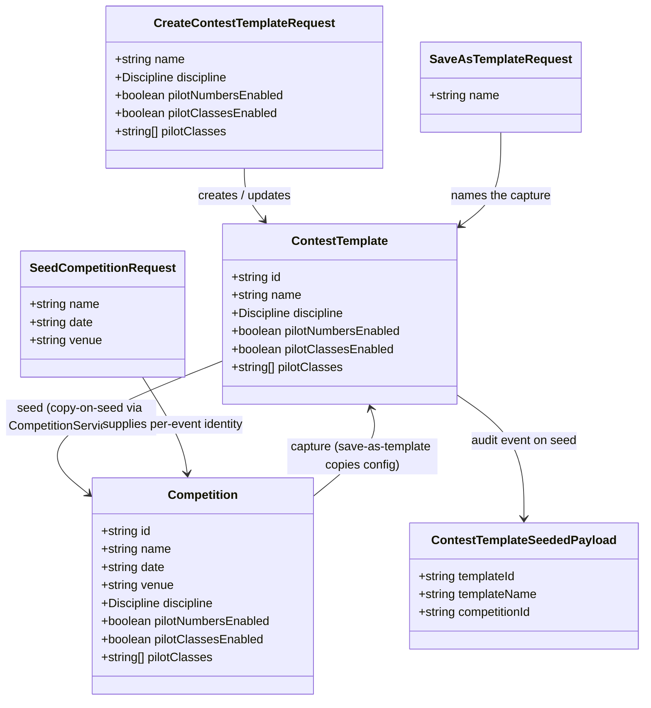

# Reusable Contest Templates (STORY-001-006)

## Requirements

Implement reusable, discipline-specific contest templates as the third
master-data aggregate, so an Organiser can capture a proven competition
configuration under a name and later create new competitions seeded from it in
one step — without re-deriving settings and without template maintenance ever
touching competitions already created from a template.

- **For whom**: the Organiser (master-data owner, competition creator).
- **Essence**: one-step reuse of a configuration snapshot via
  **copy-on-seed** — templates and competitions share values only at the two
  moments of *capture* and *seed*; no live link ever exists (RD4).
- **Boundaries**: templates capture **configuration only** (today: discipline
  + entry options per RD1/RD2) — never identity (name/date/venue), roster, or
  results. Single-discipline by design. The snapshot grows additively as
  STORY-001-007/008/009 land; this story ships the complete save / seed /
  lifecycle *mechanics*.

## Entities

**Conservative constraints honoured**: `Competition` is unchanged — no
template reference field, no new state (RD4). The configuration fields are
not wrapped in a new object; the template mirrors them flat, exactly as the
competition holds them. The existing `competitionFields` schema block is
*split* (identity vs configuration), not reshaped: both competition schemas
recompose to byte-identical behaviour.

## Approach

1. **Third master-data aggregate, cloned from the landing-table module
   shape** (`apps/base/src/landing-tables/*`):
   - Shared Zod schemas in `packages/shared` → event-sourced service +
     in-memory projection under `scope = "master-data"` → REST routes →
     companion library/form pair.
   - Full CRUD with attributed events (D4), tombstone delete, projection
     rebuilt from the log at startup.
   - **No reference checker and no `duplicate` verb**: copy-on-seed means
     nothing ever references a template, so deletion is always free (AC4);
     a verbatim-name duplicate would violate RD3, so the verb is omitted.

2. **Typed-mirror snapshot via shared schema fragments** (drift guard for
   RD1):
   - Split the existing `competitionFields` in
     `packages/shared/src/competition.ts` into exported
     `competitionIdentityFields` (name/date/venue) and
     `competitionConfigurationFields` (discipline + entry options), plus the
     exported cross-field helpers (`pilotClassesRefinement`,
     `normalisePilotClasses`).
   - The template schema composes its own `name` field +
     `competitionConfigurationFields` + the same refinement/normalisation, so
     the entry-option invariants (enabled ⇒ ≥1 class, dedupe, discard on
     disable) hold inside templates automatically, and any field
     STORY-001-007/008/009 adds to the configuration fragment is a
     compile-visible change in both aggregates.

3. **Capture** (AC1): `TemplateService.createFromCompetition` reads the
   source competition from the existing `CompetitionProjection`, extracts the
   configuration fields, validates name + config through the create schema,
   and appends an ordinary `contestTemplate.created` event. A vanished source
   is a named not-found refusal. Direct create/edit of templates (the "fresh
   configuration" path) is the ordinary master-data CRUD form; both paths
   converge on the same event.

4. **Seed** (AC2/AC3) — base-side endpoint, single writer of competition
   state:
   - `TemplateService.seedCompetition(templateId, input, attribution)` reads
     the template, merges its configuration with the Organiser-supplied
     identity fields, and **delegates to `CompetitionService.create`** — it
     never appends `competition.created` itself, so every existing validation
     and guard applies unchanged and the result is indistinguishable from a
     hand-configured competition.
   - After the create succeeds, append a `contestTemplate.seeded` audit
     event (`{ templateId, templateName, competitionId }`) — event-log-only
     provenance (RD4); **no projection consumes it**.
   - AC3 needs zero new mechanism: the seeded competition carries the
     template's discipline and the existing STORY-001-004 guard governs
     later changes; covered by a regression test from the seeded path.

5. **Name uniqueness (RD3)** — service-level invariant, error handling via
   the existing centralised Fastify `setErrorHandler`:
   - Case-insensitive uniqueness checked against the template projection at
     command time (Zod cannot see sibling templates); the single synchronous
     SQLite writer makes the check race-free.
   - Collision throws the existing `ValidationError` with flatten-shaped
     details (`fieldErrors.name`), so the companion's existing field-error
     rendering shows it under the name field with no new client branch.
   - Update excludes the template being edited itself (case-only renames of
     a template's own name are legal).

## Structure

### Inheritance Relationships

1. `TemplateNotFoundError` extends `DomainError` (from
   `apps/base/src/pilots/errors.ts`, the shared base) — code
   `TEMPLATE_NOT_FOUND`, mapped to 404.
2. Name collisions reuse the existing `ValidationError` (400
   `VALIDATION_FAILED`) — no new error class, no new handler branch.
3. `contestTemplate.*` event types extend the `packages/shared/src/events.ts`
   payload catalogue following the landing-table pattern.

### Dependencies

1. `TemplateService` depends on `EventStore`, `TemplateProjection`,
   `CompetitionProjection` (read-only, for capture), and
   `CompetitionService` (delegation target for seed).
2. `registerTemplateRoutes` injects `TemplateService`.
3. `TemplateForm` / `TemplateLibrary` (companion) call the REST routes via
   the existing `apiRequest` client with actor headers.
4. `CompetitionLibrary` gains a per-row "Save as template" action calling the
   capture endpoint.
5. Nothing depends on templates: no reference checker, no state provider, no
   new `AppOptions` seam.

### Layered Architecture

1. **Shared schema layer** (`packages/shared`): `contest-template.ts` types +
   request schemas; `competition.ts` refactored into exported identity /
   configuration fragments; `events.ts` payload types + mappers.
2. **Route layer** (`apps/base/src/routes/templates.ts`): attribution from
   headers, thin delegation, status codes (201/200/204).
3. **Service layer** (`apps/base/src/templates/service.ts`): Zod parse →
   service invariants (name uniqueness, source/template existence) →
   attributed event append → projection apply.
4. **Projection layer** (`apps/base/src/templates/projection.ts`): derived
   state only, rebuildable from the log, deep-copies on apply.
5. **Error layer**: `apps/base/src/templates/errors.ts` + one new branch in
   `app.ts`'s `setErrorHandler` (`TemplateNotFoundError` → 404).
6. **Companion layer**: `TemplateLibrary` / `TemplateForm` +
   seed-identity dialog; nav tab in `App.tsx`.

## Operations

Execute in order; each task compiles and its tests pass before the next.

### 1. Refactor shared competition schema into fragments — `packages/shared/src/competition.ts`

1. Responsibility: expose the configuration surface for reuse without
   changing competition validation behaviour.
2. Changes:
   - Split the private `competitionFields` object into two **exported**
     consts: `competitionIdentityFields` (`name`, `date`, `venue`) and
     `competitionConfigurationFields` (`discipline`, `pilotNumbersEnabled`,
     `pilotClassesEnabled`, `pilotClasses`). Field definitions move verbatim.
   - Export `pilotClassesRefinement` and `normalisePilotClasses` (currently
     module-private).
   - Recompose `createCompetitionRequestSchema` /
     `updateCompetitionRequestSchema` as
     `z.object({ ...competitionIdentityFields, ...competitionConfigurationFields })`
     with the same `superRefine` + `transform` — behaviour identical.
3. Constraints: no competition test may change; this is a pure export
   refactor. Add a comment on the configuration fragment recording the
   STORY-001-007/008/009 obligation: *any field added here must be added to
   the template snapshot and seed mapping in the same change*.

### 2. Create shared template schema — `packages/shared/src/contest-template.ts`

1. Responsibility: the `ContestTemplate` type and request schemas.
2. Types:
   - `interface ContestTemplate { id: string; name: string; discipline: Discipline; pilotNumbersEnabled: boolean; pilotClassesEnabled: boolean; pilotClasses: string[]; }`
3. Schemas (mirror the landing-table style):
   - `templateName` field: trim → non-empty ("Name is required") → ≤100
     chars, same messages as sibling aggregates.
   - `createContestTemplateRequestSchema` = `z.object({ name: templateName, ...competitionConfigurationFields })`
     `.superRefine(pilotClassesRefinement).transform(normalisePilotClasses)`.
   - `updateContestTemplateRequestSchema` — identical composition (whole-
     aggregate update, matching the house RD5 style).
   - `saveAsTemplateRequestSchema` = `z.object({ name: templateName })`.
   - `seedCompetitionRequestSchema` = `z.object(competitionIdentityFields)`
     (name/date/venue only — configuration comes from the template).
4. Export inferred request types; re-export everything from
   `packages/shared/src/index.ts`.

### 3. Extend event catalogue — `packages/shared/src/events.ts`

1. Types:
   - `ContestTemplateEventType = "contestTemplate.created" | "contestTemplate.updated" | "contestTemplate.deleted" | "contestTemplate.seeded"`.
   - `ContestTemplateCreatedPayload` = full template shape (id, name,
     discipline, entry options); `Updated` aliases `Created`.
   - `ContestTemplateDeletedPayload { templateId: string }`.
   - `ContestTemplateSeededPayload { templateId: string; templateName: string; competitionId: string }`
     — comment: **audit-only provenance (RD4); no projection consumes it;
     `templateName` is denormalised so the log stays meaningful after the
     template is deleted**.
2. Mapper: `contestTemplateToCreatedPayload(template): ContestTemplateCreatedPayload`
   (copy `pilotClasses` with `[...]`).

### 4. Create errors — `apps/base/src/templates/errors.ts`

1. Re-export `DomainError`, `ValidationError` from `../pilots/errors.js`
   (the landing-table pattern).
2. `TemplateNotFoundError extends DomainError`, `code = "TEMPLATE_NOT_FOUND"`.
3. No referenced-error class — templates are never referenced (RD4).

### 5. Create projection — `apps/base/src/templates/projection.ts`

1. Responsibility: derived, rebuildable in-memory map of live templates.
2. Shape: clone `LandingTableProjection` — `apply(record)` handling
   `contestTemplate.created`/`updated` (set, deep-copying `pilotClasses`) and
   `contestTemplate.deleted` (delete); **ignore `contestTemplate.seeded`**;
   `rebuild(events)`; `getAll()` sorted name-then-id with
   `sensitivity: "base"`; `getById(id)`.
3. Add `findByName(name: string): ContestTemplate | undefined` — trimmed,
   case-insensitive (`toLowerCase()` comparison) lookup for the RD3
   invariant.

### 6. Implement service — `apps/base/src/templates/service.ts`

1. Constructor: `(eventStore: EventStore, projection: TemplateProjection, competitionProjection: CompetitionProjection, competitionService: CompetitionService)`.
   `SCOPE = "master-data"`. Reuse the local `parseOrThrow` helper pattern.
2. Private invariant `assertNameAvailable(name: string, excludeId?: string)`:
   `findByName(name)` hit whose id ≠ `excludeId` → throw
   `ValidationError("Validation failed", { formErrors: [], fieldErrors: { name: ["A template named \"<existing.name>\" already exists"] } })`.
3. Methods:
   - `list(): ContestTemplate[]` / `get(id)` (not-found →
     `TemplateNotFoundError`) — mirror landing tables.
   - `create(input, attribution)`: parse create schema →
     `assertNameAvailable(parsed.name)` → build template with
     `crypto.randomUUID()` → append `contestTemplate.created` → apply →
     return.
   - `update(id, input, attribution)`: existence check → parse →
     `assertNameAvailable(parsed.name, id)` → append
     `contestTemplate.updated` (whole aggregate over same id) → apply →
     return.
   - `delete(id, attribution)`: existence check → append
     `contestTemplate.deleted` tombstone → apply. **No reference check** —
     comment cites RD4/AC4.
   - `createFromCompetition(competitionId, input, attribution)`: read source
     from `competitionProjection.getById`; missing → reuse the competition
     module's `CompetitionNotFoundError` (import from
     `../competitions/errors.js`) so the existing 404 branch applies. Parse
     `saveAsTemplateRequestSchema` → `assertNameAvailable` → build template
     copying the source's `discipline`, `pilotNumbersEnabled`,
     `pilotClassesEnabled`, `pilotClasses` (spread the array) → append
     `contestTemplate.created` → apply → return. (Refuse-with-named-error on
     collision — MVP decision; the Organiser edits the existing template
     instead.)
   - `seedCompetition(templateId, input, attribution)`: `get(templateId)`
     (404 if gone) → build the raw create-competition input
     `{ ...input as identity fields, discipline, pilotNumbersEnabled, pilotClassesEnabled, pilotClasses: [...] }`
     → **`this.competitionService.create(merged, attribution)`** (comment:
     delegation is load-bearing — never append `competition.created` here,
     or the invariants fork) → append `contestTemplate.seeded` audit event →
     apply (no-op) → return the created `Competition`. Identity-field
     validation errors surface from the delegated create's own
     `parseOrThrow` with field-named errors.

### 7. Register routes — `apps/base/src/routes/templates.ts`

1. Clone the landing-table route file's `attributionFromHeaders`.
2. Endpoints:
   - `GET /api/templates` → `list()`.
   - `GET /api/templates/:id` → `get(id)`.
   - `POST /api/templates` → `create` → 201.
   - `PUT /api/templates/:id` → `update`.
   - `DELETE /api/templates/:id` → `delete` → 204.
   - `POST /api/competitions/:id/save-as-template` →
     `createFromCompetition(id, body)` → 201 (capture verb lives on the
     competition URL because AC1 starts from a competition; the handler is
     registered here, with the template routes, because the template service
     owns it).
   - `POST /api/templates/:id/seed` → `seedCompetition(id, body)` → 201
     returning the new `Competition`.

### 8. Wire into app — `apps/base/src/app.ts`

1. Build `TemplateProjection`, `rebuild(eventStore.readAll())` alongside the
   other projections.
2. Construct `TemplateService` **after** `CompetitionService` (it depends on
   it); `registerTemplateRoutes(app, templateService)`.
3. Add one `setErrorHandler` branch: `TemplateNotFoundError` → 404
   `{ code, message }`. (`ValidationError` and `CompetitionNotFoundError`
   branches already exist.)
4. No new `AppOptions` seam — templates need no checkers or providers.

### 9. Companion UI — `apps/companion/src/templates/` + integration

1. `TemplateForm.tsx`: clone `CompetitionForm`'s discipline select +
   entry-option toggles + pilot-class editor (including the
   clear-on-toggle-off behaviour), minus date/venue; fields: name,
   discipline, pilot numbers, pilot classes. Same
   `fieldErrors` rendering — the RD3 collision arrives as
   `fieldErrors.name` for free.
2. `TemplateLibrary.tsx`: clone `LandingTableLibrary` — list (name,
   discipline columns), Add/Edit/Delete with confirm dialog (**no
   Duplicate**), plus per-row **"New competition"** which opens a small
   identity dialog (name required, date required, venue optional) and POSTs
   `/api/templates/:id/seed`; on success show a confirmation (e.g. switch to
   the competitions screen or a "created" notice) and clear the dialog.
3. `App.tsx`: add `"templates"` to the `Screen` union, a nav button
   "Templates", and render `<TemplateLibrary actor={actor} />`.
4. `CompetitionLibrary.tsx`: add a per-row **"Save as template"** action
   opening a name-only dialog; POST
   `/api/competitions/:id/save-as-template`; render a returned
   `fieldErrors.name` collision message in the dialog.

### 10. Tests — `apps/base/test/templates.service.test.ts` and `templates.routes.test.ts`

Follow the existing service/routes test split. Cover at minimum:

1. CRUD happy paths; projection rebuild from the log reproduces state;
   delete is a tombstone (created event retained).
2. **RD3**: create with a colliding name (exact and case-only variant, and
   surrounding-whitespace variant) → `VALIDATION_FAILED` with
   `fieldErrors.name`; update colliding with a *different* template refused;
   update keeping/re-casing the template's **own** name allowed.
3. Entry-option invariants inside the template: `pilotClassesEnabled` with
   zero usable classes refused; classes deduped case-insensitively; classes
   discarded when toggle off.
4. **AC1 capture**: save-as-template from a configured competition copies
   discipline + entry options and not name/date/venue; unknown competition →
   404 `COMPETITION_NOT_FOUND`; colliding name → validation refusal.
5. **AC2 seed**: seed produces a competition with the template's
   configuration and the supplied identity; the competition appears in
   `CompetitionService.list()`; a `contestTemplate.seeded` event is in the
   log with the right ids; the seeded competition is fully editable via the
   ordinary update path; missing/invalid identity fields → field-named 400.
6. **AC3 regression**: seed, then change the seeded competition's discipline
   while unlocked/score-free → allowed; with the captured-scores test seam
   active → `COMPETITION_DISCIPLINE_LOCKED` (guard applies to seeded
   competitions unchanged).
7. **AC4 isolation**: seed two competitions, then edit the template's entry
   options and delete the template → both competitions unchanged; template
   deletion succeeds with no reference error.
8. **Aliasing**: mutate a seeded competition's `pilotClasses`
   (via update) → template unchanged, and vice versa (deep-copy check).
9. Edge: save-as-template where the source competition was deleted first →
   404.

## Norms

1. **Module shape**: mirror `apps/base/src/landing-tables/*` file-for-file
   (errors / projection / service) and `routes/landing-tables.ts`; mirror
   `apps/companion/src/landing-tables/*` for the UI. Match existing naming:
   `contestTemplate.*` event types, `SCOPE = "master-data"`.
2. **Validation**: Zod schemas in `packages/shared` are the single request
   validators; trim + required + field-named messages so
   `flatten().fieldErrors` names the offending field. Cross-aggregate
   invariants (name uniqueness, existence) live in the service, never in
   Zod.
3. **Error handling**: domain errors extend the shared `DomainError` with a
   readonly `code`; HTTP mapping happens only in `app.ts`'s central
   `setErrorHandler` (this codebase's global exception handler). Reuse
   `ValidationError` (400) and `CompetitionNotFoundError` (404) rather than
   minting parallels. Never leak internals — unmatched `DomainError` falls
   through to 500 `INTERNAL` as today.
4. **Event sourcing**: every mutation appends exactly one attributed event
   before applying it to the projection; deletes are tombstones; projections
   are derived state, safe to discard and rebuild; deep-copy arrays on apply
   so no two projected records alias.
5. **Attribution**: routes derive `Attribution` from `x-actor-name` /
   `x-client-id` headers with `authority: "organiser"`, exactly as sibling
   route files do.
6. **Comments**: state constraints the code can't show (delegation rule,
   RD3/RD4 rationale, audit-only event), in the terse style of the existing
   modules; wrap prose at ~80 columns.
7. **Drift obligation**: the comment added in Operation 1 makes it a
   standing rule that STORY-001-007/008/009 extend
   `competitionConfigurationFields`, the template snapshot, the capture
   mapping, and the seed mapping in the same change.

## Safeguards

1. **Functional constraints**:
   - Templates capture configuration only — the payload must never contain
     competition identity (name/date/venue), roster entries, draws, or
     scores.
   - A template always has exactly one discipline (required enum field).
   - Seeding must produce a competition indistinguishable from a
     hand-configured one: no template reference, no flag, no special state.
2. **Single-writer constraint (critical)**: only `CompetitionService.create`
   may append `competition.created`. The seed path delegates; it must never
   duplicate the competition invariants or append competition events itself.
3. **Isolation constraint (AC4)**: no code path may read a template when
   displaying, validating, or mutating an existing competition. Template
   edit/delete touches only `master-data`-scoped template events.
4. **Uniqueness constraint (RD3)**: template names unique after trimming,
   case-insensitively, across live (non-deleted) templates; the check reads
   current projection state at command time and excludes the template being
   updated. Collision → 400 `VALIDATION_FAILED` with `fieldErrors.name`;
   never silent overwrite (re-save over an existing name is refused, not
   merged).
5. **Entry-option invariants**: `pilotClassesEnabled === true` ⇒ ≥1 usable
   class after dedupe; toggle off ⇒ `pilotClasses` normalised to `[]`. Must
   hold on the template itself so a seed can never emit an invalid create
   request.
6. **Rule-doc constraint (house rule 1)**: templates copy values whose
   legality is governed elsewhere; when STORY-001-007's guardrails land,
   seeding must not bypass any rule-deviation warning (recorded obligation
   on that story — do not add rule checks here).
7. **Data constraints**: names ≤100 chars, trimmed; ids are
   `crypto.randomUUID()`; the `contestTemplate.seeded` payload denormalises
   `templateName` so the audit trail survives template deletion.
8. **API constraints**: REST under `/api/templates` (+ the
   `/api/competitions/:id/save-as-template` capture verb); 201 on create-
   shaped verbs, 204 on delete, `ErrorResponse` shape on failure — matching
   the existing route contract exactly.
9. **Scope constraints**: no multi-discipline templates, no template
   duplicate verb, no reference checker, no overwrite-on-save-as, no new
   `AppOptions` seams. Scale is a handful of records — no pagination or
   projection-size work.
