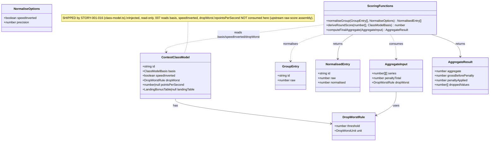

# Scoring Computation Behaviours — Group Normalisation, Round Derivation & Final Aggregate

> Stack note: this is a **pure-functions domain module** in `packages/shared`
> (TypeScript, ESM, built by `tsc`, tested with Vitest). It has **no HTTP layer,
> no controllers, no exception-handler advice, and no event/DB coupling**. The
> canvas below is adapted to that reality: "Operations" are exported functions
> and a test suite, not REST endpoints. Degenerate inputs (AC6–AC8) yield
> **defined return values, never thrown exceptions**.

## Requirements

Implement the discipline-agnostic **scoring computation** that turns raw group
results and a `ContestClassModel` into normalised group scores, round scores,
and a final per-pilot aggregate — correct by construction, with no per-class
branching (all class numbers are read from the injected model, NFR-1/D12).

- **Build scope**: AC5 (penalties retained through drop-worst), AC6 (all-zero
  group), AC7 (tied best, incl. inverted speed), AC8 (negative aggregate floors
  at zero, penalties recorded in full).
- **Spec-only (owned by STORY-001-016, not built here)**: AC1–AC4 — model
  defaulting and the deviation guardrail.
- **Boundary**: this module consumes *raw* results; how raw flight scores are
  assembled (points-per-second, landing bonus, launch height) is per-task
  work (STORY-001-008). No I/O, no events — a later base-side scoring service
  calls these functions.
- **Rounding constraint (decided)**: round normalised scores to **whole points
  by default**, with an **optional caller-supplied decimal precision**;
  per-class rounding refinement is deferred to per-discipline stories.

## Entities

**Conservative-design note**: `ContestClassModel`, `DropWorstRule`,
`ClassModelBasis`, `DropWorstUnit` and `LandingBonusTable` **already exist** in
`class-model.ts` / `landing-table.ts` — reuse them verbatim, do not re-declare.
Only the small input/output types (`GroupEntry`, `NormalisedEntry`,
`NormaliseOptions`, `AggregateInput`, `AggregateResult`) are new, and they are
plain interfaces, not classes.

## Approach

1. **Module placement & shape**:
   - One new file `packages/shared/src/scoring.ts` exporting three pure
     functions plus their small input/output types.
   - Add `export * from "./scoring.js";` to `packages/shared/src/index.ts`
     (barrel convention, `.js` specifier).
   - No runtime dependencies; no `zod` needed (these are computations over
     already-validated data, not request parsing).

2. **Computation strategy**:
   - **Group normalisation** is ratio scaling to a best-of-group anchor:
     non-inverted `raw / best × 1000`; inverted (speed) `best / raw × 1000`
     where `best` is the *smallest positive* raw. Degenerate inputs resolve to
     defined values (see Safeguards), never division by zero.
   - **Round derivation** is a sum of per-task normalised partials — the
     `single-group` basis is the one-partial special case; `separate-per-task`
     (F3B) sums the three task partials.
   - **Final aggregate** applies drop-worst **per series** (drop the single
     lowest element of a series once its length exceeds `threshold`), sums the
     survivors, subtracts the **independently-tracked** penalty total, then
     floors at zero. Penalties live outside the series, so a dropped round can
     never discard its penalty (AC5).

3. **Model-driven, not discipline-branched**:
   - Functions branch only on `basis` / `speedInverted` / `dropWorst.unit`
     read from the model — never on a discipline string. Adding a class adds no
     code here (NFR-1/NFR-2).

4. **Rounding**:
   - `precision` = decimal places, default `0` (whole points). Rounding is
     applied once, at the normalisation boundary, via a single helper so the
     rule is defined in exactly one place. Boundary-value tests pin it.

5. **Testing strategy** (first Vitest suite in `packages/shared`):
   - `packages/shared/src/scoring.test.ts`, picked up by the root `vitest run`.
   - The degenerate ACs (6–8) are authored as **exported reusable fixtures**
     (a `DEGENERATE_CASES` set) so per-discipline scoring specs echo them
     rather than re-implement.

## Structure

### Type Relationships
1. `scoring.ts` imports `ContestClassModel`, `DropWorstRule`,
   `ClassModelBasis`, `DropWorstUnit` from `./class-model.js` (no new copies).
2. New plain interfaces `GroupEntry`, `NormalisedEntry`, `NormaliseOptions`,
   `AggregateInput`, `AggregateResult` are declared and exported from
   `scoring.ts`.
3. No inheritance, no classes — a flat functional module (matches the existing
   `competition.ts` / `class-model.ts` "exported functions + interfaces" style).

### Dependencies
1. `scoring.ts` depends only on `class-model.ts` types (compile-time) — zero
   runtime deps.
2. `index.ts` re-exports `scoring.js` alongside the existing modules.
3. Future callers (a base-side scoring service/projection, report builders)
   depend on `scoring.ts`; **this story adds none of them**.

### Layering
1. Domain-computation layer (`packages/shared`): the three pure functions —
   THIS story.
2. Service/projection layer (`apps/base`): calls the functions over
   event-sourced captures — OUT of scope.
3. Test layer: `scoring.test.ts` colocated in `packages/shared/src`.

## Operations

### Create Module — `packages/shared/src/scoring.ts`

Responsibility: the complete, pure scoring computation surface. Exports the
types from Entities and the three functions below. No side effects.

#### Function — `normaliseGroup(entries, options): NormalisedEntry[]`
1. Parameters:
   - `entries: GroupEntry[]` — each competitor's `{ id, raw }` in one group.
   - `options: NormaliseOptions` — `{ speedInverted?: boolean; precision?: number }`.
2. Logic:
   - If `entries` is empty → return `[]`.
   - Let `precision = options.precision ?? 0`.
   - **Non-inverted** (`speedInverted` falsy):
     - `best = max(raw over entries)`.
     - If `best <= 0` → every entry `normalised = 0` (AC6 all-zero; also
       covers an all-non-positive group). Return.
     - Else each `normalised = round(raw / best × 1000, precision)`; an entry
       whose `raw <= 0` yields `0`. Entries equal to `best` yield exactly
       `1000` (AC7 tied best — all tied winners get 1000).
   - **Inverted** (`speedInverted` true, speed task — lower is better):
     - Consider only entries with `raw > 0` as valid times.
     - `best = min(raw over valid entries)`.
     - If there are no valid entries (all `raw <= 0`) → every entry
       `normalised = 0` (AC6 inverted variant). Return.
     - Else each valid entry `normalised = round(best / raw × 1000, precision)`;
       entries with `raw <= 0` yield `0`; entries equal to `best` yield `1000`
       (AC7 inverted tied best).
   - Return `entries.map(e => ({ id: e.id, raw: e.raw, normalised }))`
     preserving input order.
3. Guarantees: no division by zero on any path; pure; deterministic.

#### Function — `deriveRoundScore(partials, basis): number`
1. Parameters:
   - `partials: number[]` — the competitor's normalised partial(s) for the
     round. `single-group` supplies exactly one; `separate-per-task` (F3B)
     supplies three (Duration, Distance, Speed).
   - `basis: ClassModelBasis`.
2. Logic:
   - `single-group`: expect one partial; return `partials[0] ?? 0`.
   - `separate-per-task`: return the sum of all partials.
   - (Both reduce to "sum of partials"; `basis` documents intent and lets the
     function assert the expected shape.)
3. Guarantees: pure; empty `partials` → `0`.

#### Function — `computeFinalAggregate(input): AggregateResult`
1. Parameters:
   - `input.series: number[][]` — one series per counting stream. For
     `unit === "round"` the caller passes a single series of round scores; for
     `unit === "task"` (F3B) the caller passes one series **per task** of that
     task's partials across rounds.
   - `input.penaltyTotal: number` — the pilot's cumulative penalty across ALL
     rounds (including any dropped round), tracked independently of `series`.
   - `input.dropWorst: DropWorstRule` — `{ threshold, unit }`.
2. Logic:
   - For each series `s`: if `s.length > dropWorst.threshold`, drop exactly one
     element equal to `min(s)` (the single lowest; if several tie for lowest,
     drop one). Collect dropped values into `droppedValues`.
   - `grossBeforePenalty = sum of all surviving elements across all series`.
   - `penaltyApplied = penaltyTotal` (retained in full regardless of drops —
     AC5).
   - `aggregate = max(0, grossBeforePenalty - penaltyApplied)` (AC8 zero floor).
   - Return `{ aggregate, grossBeforePenalty, penaltyApplied, droppedValues }`.
3. Guarantees: penalties never removed by a drop (they are outside `series`);
   result never negative; penalty preserved in the result for the audit/report.

### Update Barrel — `packages/shared/src/index.ts`
1. Add `export * from "./scoring.js";` (keep alphabetical-ish grouping with the
   other domain modules).

### Update Build Config — `packages/shared/tsconfig.json`
1. The suite is colocated in `src` (Norm 6), but `tsconfig.json` has
   `include: ["src"]`, so `tsc` would compile `scoring.test.ts` into `dist` and
   fail `npm run build` (Safeguard 7). Add `"exclude": ["src/**/*.test.ts"]` so
   the colocated test is picked up by `vitest run` yet kept out of the tsc build.
   (`apps/base` sidesteps this by holding tests in a sibling `test/` dir outside
   `rootDir`; the shared package colocates instead, so it needs the exclude.)

### Create Test Suite — `packages/shared/src/scoring.test.ts`
1. First Vitest suite in `packages/shared`; run by root `vitest run`.
2. Export `DEGENERATE_CASES` — a reusable fixture set covering AC6/AC7/AC8 (and
   their inverted variants) for per-discipline specs to import.
3. Cases (must all pass):
   - **AC6 all-zero group**: `normaliseGroup([{id:"a",raw:0},{id:"b",raw:0}], {})`
     → both `normalised: 0`; no throw. Repeat with `speedInverted: true`.
   - **AC7 tied best (non-inverted)**: raws `[100,100,50]` →
     `[1000,1000,500]`.
   - **AC7 tied best (inverted speed)**: raws `[60,60,120]`,
     `speedInverted:true` → `[1000,1000,500]`.
   - **AC5 penalty retained through drop**: `series:[[300,900,50,700]]` (round 3
     = 50 lowest), `penaltyTotal:100`, `dropWorst:{threshold:3,unit:"round"}` →
     dropped `50`; `grossBeforePenalty = 1900`; `penaltyApplied = 100`;
     `aggregate = 1800`. Assert the penalty is deducted even though its round
     was the dropped one.
   - **AC8 negative floors at zero**: `series:[[250,250,250]]` (gross 750),
     `penaltyTotal:900`, `dropWorst:{threshold:5,unit:"round"}` (no drop) →
     `aggregate:0`, `penaltyApplied:900`, `grossBeforePenalty:750`.
   - **Boundary — threshold not exceeded**: 4 rounds with
     `threshold:4,unit:"round"` → nothing dropped.
   - **F3B per-task drop**: three series, `threshold:5,unit:"task"`, 6 rounds
     each → one lowest dropped per task; sum of survivors correct.
   - **Rounding**: `precision:1` yields one-decimal normalised values;
     default `precision:0` yields whole points at a fractional boundary.

## Norms

1. **File/module style**: match `class-model.ts` — exported `interface`s and
   `export function`s, top-of-symbol comments explaining the *why*, ESM `.js`
   import specifiers, no default export.
2. **Purity**: no I/O, no mutation of inputs, no `Date.now()`/randomness, no
   throwing on degenerate domain inputs — degenerate cases return defined
   values. A plain `Error` is acceptable **only** for a programmer misuse that
   cannot arise from valid domain data (e.g. `precision < 0`); prefer clamping
   where reasonable.
3. **No per-class branching**: never switch on a discipline string; branch only
   on `basis` / `speedInverted` / `dropWorst.unit` from the model (NFR-1).
4. **Reuse existing types**: import `ContestClassModel`, `DropWorstRule`,
   `ClassModelBasis`, `DropWorstUnit` from `./class-model.js`; do not duplicate.
5. **Rounding in one place**: a single private `round(value, precision)` helper;
   no ad-hoc `Math.round` scattered across the functions.
6. **Testing**: Vitest, colocated `*.test.ts`; assert exact numbers; export
   shared fixtures rather than duplicating cases. Follow the assertion style in
   `apps/base/test/*.test.ts`.
7. **Naming**: `normaliseGroup`, `deriveRoundScore`, `computeFinalAggregate`
   (British "normalise", consistent with `normalisePilotClasses`).

## Safeguards

1. **Functional constraints**:
   - `normaliseGroup` NEVER divides by zero: an all-zero (or all-non-positive)
     group returns all-`0`; a valid best always exists before any division.
   - Tied best raws all map to exactly `1000` (non-inverted and inverted).
   - `computeFinalAggregate` never returns a negative `aggregate`.
2. **Business-rule constraints**:
   - Penalties are tracked outside `series` and applied after drop-worst, so a
     dropped round's penalty is always retained (AC5); `penaltyApplied` returns
     the full penalty even when it exceeds the gross (AC8).
   - Drop-worst removes exactly **one** lowest element per series and only when
     `series.length > threshold` (strictly greater — "more than N").
   - F3B discards per **task** series, not per round; man-on-man discards the
     single round series.
3. **Rounding constraints**:
   - Default precision = whole points (`0` dp); optional decimal `precision`;
     applied once at the normalisation boundary. No per-class rounding numbers
     hard-coded here (deferred to per-discipline stories).
4. **Integration constraints**:
   - No import of `apps/base`, no event-store/projection coupling, no `zod`.
   - Consumes the **existing** `ContestClassModel` shape unchanged; adds only
     plain input/output interfaces (backward compatible; purely additive).
   - `pointsPerSecond` and `landingTable` are NOT read by this module (raw-score
     assembly is STORY-001-008).
5. **Technical constraints**:
   - Pure, deterministic, side-effect free; inputs never mutated.
   - Float handling: round at defined boundaries; boundary-value tests included.
6. **Data constraints**:
   - `GroupEntry.raw` may be any finite number; `raw <= 0` means "no valid
     score / no valid time" and normalises to `0`.
   - `series` may contain empty inner arrays (a pilot with no rounds) → contribute
     `0`, no drop.
7. **Test constraints**:
   - AC5–AC8 (and inverted AC6/AC7 variants) MUST be covered and green under
     `npm test`; degenerate fixtures exported for reuse.
   - `npm run build` (tsc) and `npm run lint` MUST pass with the new module and
     barrel export.
