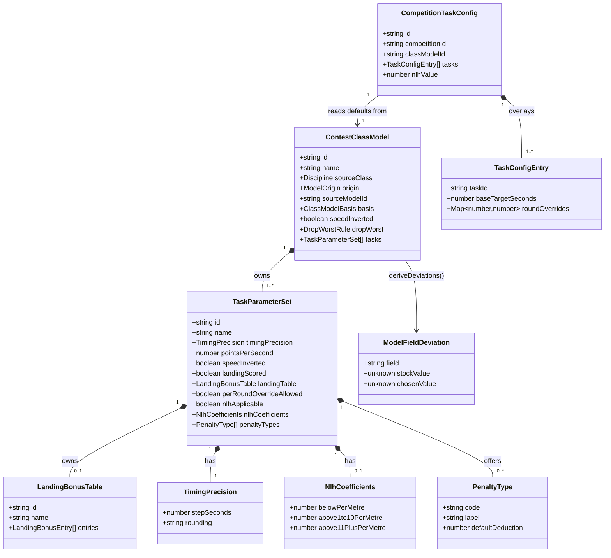

# Per-Task Scoring Rules Configuration (STORY-001-008)

## Requirements

Configure each competition's task scoring parameters in exactly one authoritative
place, split cleanly across two layers so a shared, reusable class definition is
never contaminated with one event's data:

- **Extend the Contest Class Model** (`packages/shared/src/class-model.ts`) with a
  rule-fixed `tasks[]` list — each task carrying timing precision, points-per-second,
  landing (scored? / owned table), a per-class penalty-type catalogue, an
  NLH-applicable flag with adjustment coefficients, and a per-round-override capability
  flag — reconciling the current flat `pointsPerSecond` / `landingTable` fields into the
  first (or only) task. Deviating from a rule-fixed value stays a **clone-and-edit** of
  the model (D12/016), never a per-field warning.
- **Introduce a per-competition task-configuration aggregate** filed under
  `scope = competitionId` (the roster pattern) holding the two genuinely per-event
  quantities: a task's base target/working time with a sparse per-round override map
  (AC1), and the CD-announced F5K Nominal Launch Height *value* (AC6), reading its
  defaults from the referenced class model.

The value: the single central task model (NFR-1) is *configured*, not hard-coded per
class, so live capture and score computation behave correctly for this event's tasks —
without a `switch (discipline)` anywhere. Boundaries: this story defines *available*
penalty types (imposition is CD authority, Area 5.9), supplies scoring *inputs* (raw-score
assembly maths is per-discipline), and defers discipline-specific task screens and the
round→task schedule.

## Entities

**Conservative-design notes (respect existing implementations):**

- `pointsPerSecond` and `landingTable` are **moved off** the flat `ContestClassModel`
  surface **into** `TaskParameterSet` — a shape reconcile, not new parallel fields. There
  is no persisted data to migrate (dev store reset + idempotent re-seed), so this is a
  plain interface/seed/payload/schema/`deriveDeviations` change, **not** a projection
  back-fill. `basis`, `speedInverted` (model-level marker), and `dropWorst` stay where
  they are.
- `TimingPrecision` is a **distinct** value object — do **not** reuse
  `NormaliseOptions.precision` (which is normalised-score decimal places, a different
  quantity). `rounding: "truncate" | "nearest"` captures the F3K truncation nuance.
- `LandingBonusTable` and `LandingBonusEntry` already exist — reuse verbatim; the table is
  model-owned per 016, never re-selected per-event.
- The per-competition overlay persists **only** overrides/values, never a copy of the
  model shape (NFR-1).

## Approach

1. **Class-model extension (rule-fixed layer):**
   - Add a `tasks: TaskParameterSet[]` list to `ContestClassModel`, folding the existing
     flat `pointsPerSecond` / `landingTable` into each task. Single-task classes (F3J,
     F3K, F5J, F5K, F5L) carry one task; F3B carries three (Duration whole-seconds /
     Distance / Speed 1/100 s inverted); F5K carries five (Tasks A–E). The round→task
     *schedule* stays deferred (per-discipline).
   - Seed the six stock models with rule-doc values (house rule 1), citing the rule line
     in a comment beside each: precisions (F3J/F3K 0.1 s, F3K `truncate`; F5×/F3B-Duration
     whole seconds; F3B-Speed 1/100 s), F5L 2 pt/s, F5K NLH coefficients (+0.5 below /
     −1.0 per m 1–10 above / −3.0 per m 11 m+ above), `landingScored=false` for F3K/F5K,
     and each class's real penalty-type catalogue transcribed from the rule docs.
   - Thread every new rule-fixed field through the full model touch-point set in one
     change: interface → `STOCK_CLASS_MODELS` seed → `classModelToCreatedPayload`
     (deep-copy) → `clone` deep-copy → `updateClassModelRequestSchema` → `deriveDeviations`.
     Deviation surfacing (AC2/AC5/AC6) is entirely the 016 clone-and-edit path — **no new
     warning primitive**.

2. **Per-competition task-config aggregate (per-event layer):**
   - New event-sourced module mirroring roster: `packages/shared` types + Zod schemas +
     event payloads/type union; `apps/base` projection (guards by `taskConfig.*` type,
     files under `record.scope = competitionId`, rebuildable from log), service (validates
     against the competition's class model + live competition state, appends event), and
     routes wired into `buildApp`.
   - Holds per-round target-time overrides (AC1, only where the task's
     `perRoundOverrideAllowed` flag is set) and `nlhValue: number | null` (AC6). Defaults
     read from the referenced model; overrides keyed by round number tolerate
     not-yet-created / later-removed rounds (draw is STORY-001-009).

3. **Business logic & validation:**
   - `nlhValue` optional at save (matches the CD-announces-a-day-before workflow); never
     demanded, never crashes downstream — an unset NLH is a blocking "not ready" condition
     surfaced to the CD (mirrors `scoring.ts`'s never-throw stance). 008 owns only
     allow-null.
   - No landing table demanded for time-only tasks (`landingScored=false`); a table on
     such a task is rejected/ignored both directions (AC4).
   - Retire the orphaned `NoTaskConfigYetChecker`; note the standalone `landing-tables`
     table-reference seam as a separate 016-leftover cleanup to confirm — do not silently
     delete the wider module here.

4. **Error handling strategy (stack-native, not a Java `GlobalExceptionHandler`):**
   follow the existing per-module `errors.ts` + typed error classes + the shared route
   error-mapping branch in `buildApp`. Validation failures throw a `ValidationError`
   carrying a Zod `flatten()` shape so the client's `fieldErrors` idiom applies. New task-
   config errors (`CompetitionTaskConfigNotFoundError`, `TaskNotFoundError`,
   `PerRoundOverrideNotAllowedError`, `NlhNotApplicableError`) extend the module's
   base error and register their status branch. (Originally scoped as
   `LandingTableNotApplicableError`; reconciled — the overlay carries no
   landing-table field at all, so AC4's "no table for time-only tasks" is enforced
   on the class-model layer, `materialiseTask` dropping a table on a
   `landingScored=false` task. The overlay's only "slot has no home" reject is a
   `nlhValue` on a class with no NLH-applicable task, AC6.)

## Structure

### Type / inheritance relationships

1. `TaskParameterSet`, `TimingPrecision`, `NlhCoefficients`, `PenaltyType` are new
   interfaces in `packages/shared/src/class-model.ts`; `ContestClassModel` gains
   `tasks: TaskParameterSet[]`.
2. `CompetitionTaskConfig` / `TaskConfigEntry` are new interfaces in a new
   `packages/shared/src/task-config.ts`, with Zod request schemas alongside (roster style).
3. New event types extend the shared `events.ts` unions:
   `taskConfig.updated` (payload = the full overlay, denormalised for audit).
4. New base error classes extend the task-config module's `ValidationError` /
   `NotFoundError` base, matching `apps/base/src/roster/errors.ts`.

### Dependencies

1. `CompetitionTaskConfigService` depends on `EventStore`, its own
   `CompetitionTaskConfigProjection`, `CompetitionProjection` (existence + classModelId),
   and `ClassModelProjection` (defaults, `perRoundOverrideAllowed`, `nlhApplicable`).
2. `ClassModelService.clone` / `.update` deep-copy the new `tasks[]` (extend existing
   deep-copy logic); `deriveDeviations` diffs the task list.
3. Routes inject the service; `buildApp` constructs projection + service and rebuilds the
   projection from the log on init (audit/replay parity — the load-bearing wiring step).

### Layered architecture (existing event-sourced pattern)

1. **Route layer** (`apps/base/src/routes/task-config.ts`): HTTP shape only; delegates to
   the service, maps typed errors to status codes.
2. **Service layer** (`apps/base/src/task-config/service.ts`): cross-aggregate validation
   (Zod cannot see sibling aggregates), appends the event, applies to the projection.
3. **Projection layer** (`apps/base/src/task-config/projection.ts`): derived read model,
   discardable/rebuildable from the log, filed under `scope = competitionId`.
4. **Event store**: the append-only substrate; the projection is never the source of truth.
5. **Shared domain** (`packages/shared`): interfaces, Zod schemas, event payloads,
   `deriveDeviations`, stock seed — the single source of a class's shape.

## Operations

### Update Interface + Seed — `ContestClassModel` / `STOCK_CLASS_MODELS`
1. Responsibility: own each class's rule-fixed task parameters as `tasks[]`.
2. Add interfaces `TimingPrecision { stepSeconds: number; rounding: "truncate" | "nearest" }`,
   `NlhCoefficients { belowPerMetre; above1to10PerMetre; above11PlusPerMetre }`,
   `PenaltyType { code: string; label: string; defaultDeduction: number }`,
   `TaskParameterSet { id; name; timingPrecision; pointsPerSecond: number | null;
   speedInverted; landingScored; landingTable: LandingBonusTable | null;
   perRoundOverrideAllowed; nlhApplicable; nlhCoefficients: NlhCoefficients | null;
   penaltyTypes: PenaltyType[] }`.
3. Add `tasks: TaskParameterSet[]` to `ContestClassModel`; remove flat `pointsPerSecond`
   and `landingTable` (folded into `tasks[0]`).
4. Seed logic — transcribe from rule docs, comment each with its source line:
   - **F3J** (1 task): 0.1 s / nearest, 1 pt/s, landingScored, FINE table,
     perRoundOverrideAllowed=**false** (600 s rule-fixed, no organiser-reduce
     clause), nlhApplicable=false; penalties towline −100 / winch −1000 /
     unauthorised transmission −300 / overfly −30 (`f3j.md`).
   - **F3K** (1 task): 0.1 s / **truncate**, pointsPerSecond=null, landingScored=false,
     no table, perRoundOverrideAllowed=**true** — the *only* class with the flag
     set (F3K.11: "the tasks and the related working time may be reduced by a
     decision of the organiser"); penalty out-of-window −100 (`f3k.md`).
   - **F5J** (1 task): whole seconds, 1 pt/s, landingScored, F5J table; penalties
     launch −100 each / safety −300 / corridor −1000 (`f5j.md`).
   - **F5K** (5 tasks A–E): whole seconds, pointsPerSecond=null, landingScored=false,
     nlhApplicable=true, coefficients +0.5/−1.0/−3.0; penalties overfly-window −100 /
     safety-zone −300 / landing-outside-area −10 per landing (`f5k.md`).
   - **F5L** (1 task): whole seconds, 2 pt/s, landingScored, FINE table; landing-outside
     → 0 / overfly>30 s → 0 (`f5l.md`).
   - **F3B** (3 tasks): Duration whole seconds; Distance (integer legs — whole-unit
     truncated, no pt/s rate); Speed 1/100 s + speedInverted; penalties safety-plane
     −300 (Task C) / non-conforming winch −1000 (`f3b.md`). F3B Duration's landing bonus
     stays **unscored** (`landingScored=false`, table `null`) — matching the pre-016 flat
     `landingTable: null`; the Task-A landing table is a deferred per-discipline detail,
     not seeded here (deferral, not a rule contravention).
5. Constraints: where a class fixes no value → `null` (never a placeholder, house rule 1).

### Update Payload + Deep-copy — `classModelToCreatedPayload`, `ClassModelService.clone/update`
1. Extend `classModelToCreatedPayload` to deep-copy `tasks[]` (each task's
   `timingPrecision`, `nlhCoefficients`, `penaltyTypes[]`, and owned `landingTable`
   entries) so no appended payload aliases the caller's model.
2. Extend `clone` and `update` deep-copy blocks identically; preserve task ids on edit
   where kept, mint otherwise (mirror the existing landing-table id handling).
3. Extend `updateClassModelRequestSchema` with a `tasks` array schema (per-task Zod
   validation: precision enum-ish object, non-negative pointsPerSecond nullable, penalty
   descriptors, nullable table).

### Update Diff Engine — `deriveDeviations`
1. Responsibility: surface per-task rule-fixed deviations (AC2/AC5/AC6) on a custom clone.
2. Diff `tasks[]` positionally by task id: emit `ModelFieldDeviation` entries for changed
   `timingPrecision`, `pointsPerSecond`, `landingScored`, `landingTable`, `nlhCoefficients`,
   `penaltyTypes`, and `perRoundOverrideAllowed`, with dotted field names
   (e.g. `tasks[0].timingPrecision`).
3. Logic: reuse the existing `landingTablesEqual` helper; add value-object equality helpers
   for precision / coefficients / penalty lists. Identity fields stay excluded.

### Create Shared Types — `packages/shared/src/task-config.ts`
1. Responsibility: per-competition overlay interface + Zod request schema.
2. Interfaces: `CompetitionTaskConfig { id; competitionId; classModelId;
   tasks: TaskConfigEntry[]; nlhValue: number | null }`,
   `TaskConfigEntry { taskId: string; baseTargetSeconds: number | null;
   roundOverrides: Record<number, number> }`.
3. Schema `updateCompetitionTaskConfigRequestSchema`: per-task base target (non-negative,
   nullable), `roundOverrides` map (positive integer round keys → non-negative seconds),
   `nlhValue` non-negative **nullable/optional** (never demanded). Structural only;
   cross-aggregate rules live in the service.
4. Export `taskConfigToPayload(config): CompetitionTaskConfigUpdatedPayload`.

### Create Events — extend `packages/shared/src/events.ts`
1. `TaskConfigEventType = "taskConfig.updated"`; payload = full `CompetitionTaskConfig`
   (denormalised for audit), deep-copied by `taskConfigToPayload`.
2. Add to the exported event-payload/type unions following the roster block's placement.

### Create Service — `CompetitionTaskConfigService`
1. Constructor deps: `EventStore`, `CompetitionTaskConfigProjection`,
   `CompetitionProjection`, `ClassModelProjection`.
2. `get(competitionId)`: return the overlay merged over model defaults; 404 if the
   competition is absent.
3. `update(competitionId, input, attribution)`:
   - Input validation via `updateCompetitionTaskConfigRequestSchema` (`parseOrThrow`).
   - Business logic: resolve the competition → its `classModelId` → the model's `tasks[]`;
     reject a per-round override on a task whose `perRoundOverrideAllowed` is false
     (`PerRoundOverrideNotAllowedError`); reject a target on a non-matching taskId
     (`TaskNotFoundError`); accept `nlhValue` only when some task has `nlhApplicable`, else
     reject it (`NlhNotApplicableError`); never demand `nlhValue`.
   - Append `taskConfig.updated` under `scope = competitionId`; apply to projection; return
     the merged view.
4. Transaction boundary: single synchronous append+apply, matching roster/class-model.

### Create Projection — `CompetitionTaskConfigProjection`
1. `apply(record)`: on `taskConfig.updated` store the overlay under `record.scope`; on
   `competition.deleted` (scope `"competitions"`) drop the overlay so it never orphans.
2. `rebuild(events)`: reset + replay (audit/replay parity).
3. Accessor `getConfig(competitionId): CompetitionTaskConfig | undefined`.

### Create Routes — `apps/base/src/routes/task-config.ts`
1. `GET /competitions/:competitionId/task-config` → merged view (defaults + overrides).
2. `PUT /competitions/:competitionId/task-config` → `service.update(...)`.
3. Map `CompetitionTaskConfigNotFoundError`/`TaskNotFoundError` → 404,
   `PerRoundOverrideNotAllowedError`/`NlhNotApplicableError` → 409, `ValidationError`
   → 400 per the module error-mapping convention.

### Wire into `buildApp` — `apps/base/src/app.ts`
1. Construct projection + service; rebuild the projection from the event log on init.
2. Register the routes and the module's error-status branches.

### Retire orphaned seam — `NoTaskConfigYetChecker`
1. Remove `NoTaskConfigYetChecker` (`apps/base/src/landing-tables/table-reference-checker.ts`)
   and any construction/registration; 008 creates no per-competition table references.
2. Add a note (not a deletion) flagging the wider standalone `landing-tables`
   service/projection/routes as a 016-leftover cleanup to confirm separately.

## Norms

1. **Domain purity**: interfaces, Zod schemas, event payloads, and pure diff/seed logic
   live in `packages/shared`; no I/O, no events, no throwing on degenerate domain input
   (mirror `scoring.ts`).
2. **Event-sourcing discipline**: every mutation is an appended event under the correct
   `scope`; projections are derived, discardable, rebuilt from the log; write payloads
   carry the **full** denormalised shape for audit.
3. **House rule 1**: every seeded number transcribed from `docs/requirements/rules/` with
   the source line cited in a comment; no invented placeholders — unfixed values are `null`.
4. **Deviation = clone-and-edit (D12)**: no per-field warning primitive; deviations surface
   through `deriveDeviations` on a custom clone.
5. **Validation**: Zod schemas do structural validation and normalisation; cross-aggregate
   rules live in the service (`parseOrThrow` → `ValidationError` with a `flatten()` shape so
   the client's `fieldErrors` idiom applies).
6. **Error handling**: per-module `errors.ts` typed error classes mapped to HTTP status in
   the route/`buildApp` branch — the stack-native equivalent of a global handler; error
   messages never leak internal detail.
7. **Additive touch-point checklist (NFR-2)**: any new rule-fixed field updates interface +
   seed + `classModelToCreatedPayload` + clone/update deep-copy + update schema +
   `deriveDeviations` in the **same** change; lean on `class-models.service.test.ts` and
   `scoring.test.ts`. NB — because this story *reshapes* the model (flat
   `pointsPerSecond`/`landingTable` → `tasks[]`), the checklist extends to the 016
   **companion** 016 class-model UI (`apps/companion/src/class-models/ClassModelForm.tsx` +
   `ClassModelLibrary.tsx`) that read those flat fields: reconcile them to `tasks[]`
   minimally (edit the primary task's rate, ride the rest through — full per-task task
   screens are the deferred per-discipline scope).
8. **Precision separation**: `TimingPrecision` (capture granularity) is never routed through
   `NormaliseOptions.precision` (normalised-score decimals), and vice versa.
9. **Style**: prose/comments match the existing `class-model.ts` density and idiom; TS
   strict; `.js` import specifiers as in the codebase.

## Safeguards

1. **Functional — AC1**: per-round target-time overrides are accepted only for tasks whose
   `perRoundOverrideAllowed` is true — in MVP that is **F3K alone** (F3K.11 organiser
   working-time reduction); F3J/F5J/F5L/F5K/F3B are all `false` (rule-fixed working times).
   Unset rounds inherit the base target; overrides for not-yet-created / later-removed
   rounds are tolerated (no crash, no phantom round). NB: for F3K/F5K the working time also
   varies via the deferred round→task schedule — that is *not* the override path.
2. **Functional — AC2**: timing precision defaults per class (F3J/F3K 0.1 s, F3K
   `truncate`; F5×/F3B-Duration whole seconds; F3B-Speed 1/100 s); a deviation is a
   clone-and-edit surfaced by `deriveDeviations`, not a warning.
3. **Functional — AC3/AC4**: landing table is model-owned (016) — no per-event selection;
   time-only tasks (`landingScored=false`) neither require nor accept a table at save.
4. **Functional — AC5**: `pointsPerSecond` per task (F5L=2); each task offers only its
   class's seeded penalty-type catalogue; imposition is out of scope (Area 5.9).
5. **Functional — AC6**: `nlhValue` has a named place, optional at save (60/70 m accepted);
   the +0.5 / −1.0 / −3.0 coefficients are rule-fixed model slots (deviate via clone); an
   unset NLH is a downstream "not ready" condition, never a crash.
6. **Business-rule (NFR-1)**: rule-fixed parameters live only on the class model, per-event
   overrides only on the task-config overlay; no third home, no `switch (discipline)`.
7. **Business-rule (NFR-2)**: adding a seventh class stays a pure data addition — the
   aggregate shape is not reshaped again after this story.
8. **Data**: no persisted data migration (dev store reset + idempotent re-seed); the
   overlay persists only overrides/values, never a copy of the model shape.
9. **Integration**: the task-config projection is rebuilt from the log on init and filed
   under `scope = competitionId` — missing the rebuild or mis-scoping breaks audit/replay.
10. **Exception-handling**: task-config errors carry clear, class-appropriate messages via
    typed error classes mapped in the route/`buildApp` branch; never expose internals.
11. **Cross-requirement (house-keeping rule 2)**: AC3's literal "select from master data /
    per-field warning" and the banner's "additive slots on the class model" wording both
    conflict with D12/016 and the two-layer split — flag to the user before building; do
    not silently reconcile.
