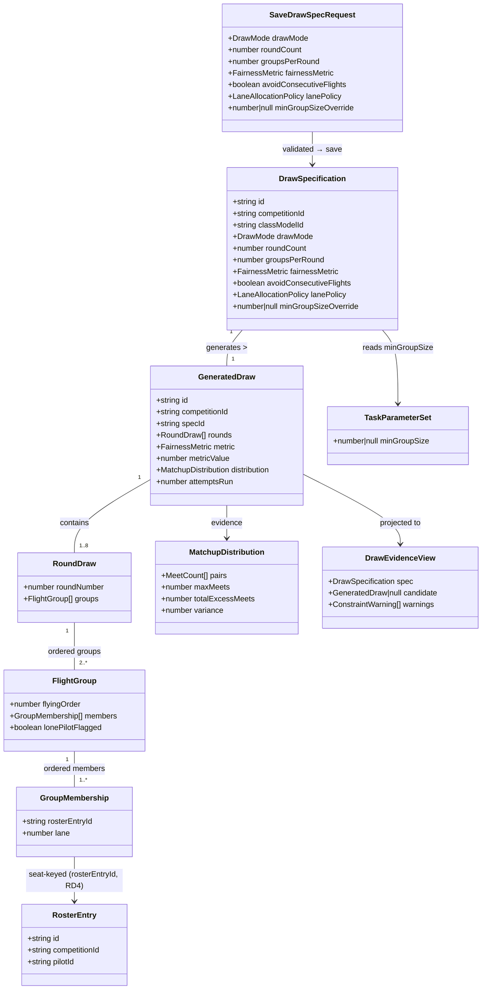

# STORY-001-009 — Draw Specification and Generation

## Requirements

Implement a per-competition **draw** capability that lets the Organiser
**specify** a fair-draw policy, **generate** flight groups over N qualifying
rounds from the live roster, and **surface fairness evidence** for the Contest
Director — without contravening the FAI anti-repeat rule (general-rules §1,
house rule 1).

- **Specify** a validated draw policy (draw mode, round count N, groups-per-round,
  fairness metric, consecutive-flight toggle, lane-allocation policy, optional
  min-group-size override) as a per-competition aggregate under
  `scope = competitionId`.
- **Generate** the fairest of *K* randomised attempts, persisting the fully
  **materialised outcome** as a `draw.generated` event so event-log replay
  reproduces the identical draw with **no RNG in the projection** (D4 determinism).
- **Evidence**: expose the retained attempt's chosen-metric value and matchup
  distribution as a derived read-model for the CD's accept/re-draw decision (4.3,
  out of scope here).

Boundaries: this story produces **candidate** draws only — it does **not** accept
one, does **not** flip `hasAcceptedDraw`, and does **not** implement frequency or
team-separation constraints (all-2.4 GHz, no teams — MVP). Generate ≠ accept.
Value: the fairness backbone of a contest, defensible for ≤ 20 pilots over ≤ 8
rounds, with clear failure instead of a silently unfair or invalid draw.

## Entities

Enums:
- `DrawMode` = `"random-anti-repeat"` (MVP; the only mode — random initial order
  + anti-repeat intent. Progressive/seeded is a Future Enhancement).
- `FairnessMetric` = `"min-max-then-excess"` | `"min-total-excess"` |
  `"min-variance"` (Resolved Decision #2, Organiser-selected).
- `LaneAllocationPolicy` = `"rotate"` | `"fixed-by-contest-number"` | `"random"`
  (Resolved Decision #6).

**Conservative-design notes.** Reuse existing `RosterEntry`, `Competition`,
`ContestClassModel`, `Attribution`, `EventRecord`, `EventStore`, and the
`DomainError`/`ValidationError` pair verbatim — no refactor. The **only** change
to an existing shared type is an **additive** `minGroupSize: number | null` slot
on `TaskParameterSet` (NFR-2), seeded from the rule docs and threaded through
`stockTask`, `copyTaskParameterSet`, `deriveDeviations`, and `updateTaskSchema`.
Membership keys on `rosterEntryId` (never `pilotId`) so a post-draw replacement
inherits its slots (RD4). Groups are stored **ordered** regardless of the
consecutive-flight toggle (Decision #5).

## Approach

1. **Aggregate placement & module shape**
   - The draw is per-competition content → `scope = competitionId`, following the
     **roster / task-config module template** end-to-end: `packages/shared`
     types + Zod request schema; `apps/base/src/draw/` with
     `projection.ts` / `service.ts` / `errors.ts`; `routes/draw.ts`; wiring in
     `app.ts` (`buildApp` + `setErrorHandler` branches).
   - **Two persisted facts + one derived read-model**: (a) the saved spec, (b)
     the generated outcome, (c) the evidence view over the retained outcome.

2. **Persistence & determinism (highest-priority decision)**
   - Persist the **fully materialised outcome** in the `draw.generated` payload
     (ordered groups → seat-keyed memberships with lanes → metric + distribution
     + lone-pilot flags), **not** an RNG seed. Rationale: a seed couples replay
     to the exact algorithm build forever (a later generator tweak silently
     rewrites history — a D4 violation in spirit); the materialised outcome is
     the actual immutable fact and is algorithm-version-independent, matching the
     "payloads denormalised for audit" convention already used by class-model /
     task-config events.
   - **The projection is a pure loader** — it must never invoke the randomiser.
     A rebuild-equivalence test asserts identical groups before/after replay.
   - **Supersede, never overwrite** (Decision #7): each success appends a new
     `draw.generated`; the projection surfaces the **latest** as the current
     candidate. The log retains prior attempts (D4). Failure (AC6) appends nothing.

3. **Validation split (mirrors `CompetitionTaskConfigService`)**
   - **Structural** checks (types, enums, `1 ≤ roundCount ≤ 8`,
     `groupsPerRound ≥ 2`, non-negative override) live in the **Zod schema**.
   - **Cross-aggregate** checks (Zod cannot see roster size or the class model)
     live in the **service**: AC1 group-size bound (min from
     `TaskParameterSet.minGroupSize` or the spec override; max = `roster/2`,
     D1-derived) and AC2 joint-feasibility warnings. Re-check at **generate**
     time too, since a roster can shrink after a spec was saved.

4. **Generation algorithm (service/command path only)**
   - Read live roster + saved spec + bounds → run *K* randomised attempts of
     random-initial-order + anti-repeat + (opt-in) consecutive-flight + lane
     allocation → score each attempt by the chosen `FairnessMetric` → retain the
     best → append the materialised outcome. At MVP scale (≤ 20 pilots, ≤ 8
     rounds) a fixed `K` (e.g. 200) runs comfortably (D7). "Fairest of the
     attempts run", **not** global optimum — the evidence must say so honestly.
   - **Anti-repeat degrades gracefully**: minimise repeats, never fail because a
     pair must repeat at small group counts.
   - **Lone-pilot**: avoid arithmetically where roster size allows ≥ 2 scoring
     pilots per group; where unavoidable, **store** the draw with the group
     `lonePilotFlagged = true` (AC5) — distinct from AC6's store-nothing failure.
     No dummy insertion here (that is scoring-time, Area 5.3 / STORY-001-011).

5. **Error & warning strategy (no GlobalExceptionHandler — this stack uses
   `DomainError` subclasses + a central `setErrorHandler`)**
   - Each new domain error subclasses `DomainError`, carries a stable `code`, and
     gets **one branch** in `app.ts`'s `setErrorHandler` mapping code → HTTP
     status. Missing a branch surfaces as a 500 instead of the intended 4xx.
   - AC2 warnings are **not** errors: a successful save returns the spec **plus**
     a `warnings[]` list of unmet constraints (soft, non-blocking) — separate
     from AC1's hard rejection and AC6's failure.

6. **Seam honesty (Decision #3)**
   - Leave `DrawStateProvider` as `NoAcceptedDrawProvider` (returns `false`).
     Generating a candidate must **not** lock roster editing; the positive wiring
     is Area 4.3's accept/re-draw story. No `draw.accepted` event here.

## Structure

### Type / interface relationships
1. `DrawSpecification`, `GeneratedDraw`, `RoundDraw`, `FlightGroup`,
   `GroupMembership`, `MatchupDistribution` are new **interfaces** in
   `packages/shared/src/draw.ts`; `DrawMode`, `FairnessMetric`,
   `LaneAllocationPolicy` are string-literal union types there.
2. `saveDrawSpecRequestSchema` (Zod) in the same file validates structure only;
   `drawSpecToPayload` / `generatedDrawToPayload` deep-copy for event payloads
   (mirroring `taskConfigToPayload`).
3. New event types in `packages/shared/src/events.ts`: `"draw.specSaved"` and
   `"draw.generated"` added to a `DrawEventType` union with their payload types.
4. New `DomainError` subclasses in `apps/base/src/draw/errors.ts`
   (re-exporting `DomainError` / `ValidationError` from `pilots/errors.js`, the
   task-config idiom).

### Dependencies
1. `routes/draw.ts` → `DrawService` (via `registerDrawRoutes`, attribution from
   `x-actor-name` / `x-client-id` headers, `authority: "organiser"`).
2. `DrawService` depends on `EventStore`, `DrawProjection`,
   `CompetitionProjection`, `ClassModelProjection`, and `RosterProjection`
   (for live roster size and seat ids).
3. `DrawProjection` consumes `EventRecord`s of type `draw.*` filed under
   `scope = competitionId`; drops a competition's draw on `competition.deleted`
   (roster/task-config idiom).
4. `buildApp` constructs the projection (`rebuild(eventStore.readAll())` on boot),
   the service, and registers routes; `setErrorHandler` gains the new branches.

### Layered architecture (this stack)
1. **Shared types + Zod layer** (`packages/shared`): interfaces, enums, request
   schema, payload mappers. Structural validation only.
2. **Route layer** (`apps/base/src/routes/draw.ts`): HTTP surface, attribution
   assembly, delegates to the service.
3. **Service layer** (`apps/base/src/draw/service.ts`): cross-aggregate
   validation, the generation algorithm (the *only* place RNG lives), event
   append, invariant guards.
4. **Projection layer** (`apps/base/src/draw/projection.ts`): pure replay of the
   stored outcome — **no RNG** — plus the derived evidence read-model.
5. **Error-mapping layer** (`app.ts setErrorHandler`): each new `DomainError`
   `code` → HTTP status (there is no `@RestControllerAdvice` equivalent; this
   central handler is the project's unified error mapper).

## Operations

### Update shared type — `TaskParameterSet.minGroupSize` (`packages/shared/src/class-model.ts`)
1. Responsibility: give AC1 a rule-grounded minimum group size per task.
2. Attribute: `minGroupSize: number | null` — rule-fixed minimum scoring pilots
   per group; `null` where the class fixes none.
3. Seed values (transcribe with a rule-doc citation comment per value, as stock
   models already do): F3B per task **5 / 3 / 8** (`F3B.1.8b`), F3J **6**
   (`F3J.6.1`), F3K **5** (`F3K.9.1`), F5J **6** (`5.5.11.14.1`), F5K/F5L **null**.
4. Thread through: default `null` in `stockTask`; copy in `copyTaskParameterSet`;
   diff in `deriveDeviations` (a `tasks[i].minGroupSize` deviation when edited);
   add `minGroupSize: z.number().int().positive().nullable()` to `updateTaskSchema`.
5. Constraint: **additive only** (NFR-2) — no aggregate reshape, no code branch on
   discipline. Do **not** edit `rules/` (house rule 1); the numbers come *from* it.

### Create shared types — `packages/shared/src/draw.ts`
1. Responsibility: the draw's shared vocabulary + structural validation.
2. Interfaces: `DrawSpecification`, `GeneratedDraw`, `RoundDraw`, `FlightGroup`,
   `GroupMembership`, `MatchupDistribution`, `MeetCount { a; b; count }`,
   `ConstraintWarning { constraint; message }`, `DrawEvidenceView`.
3. Enums (string unions): `DrawMode`, `FairnessMetric`, `LaneAllocationPolicy`.
4. `saveDrawSpecRequestSchema`:
   - `drawMode`: `z.enum(["random-anti-repeat"])`.
   - `roundCount`: `z.number().int().min(1).max(8, "…up to 8 rounds per day (D7)")`.
   - `groupsPerRound`: `z.number().int().min(2, "A round needs at least two groups")`.
   - `fairnessMetric`: `z.enum([...])`.
   - `avoidConsecutiveFlights`: `z.boolean().default(false)` (Decision #5).
   - `lanePolicy`: `z.enum([...])`.
   - `minGroupSizeOverride`: `z.number().int().positive().nullable().default(null)`.
5. `drawSpecToPayload(spec)` / `generatedDrawToPayload(draw)`: deep-copy nested
   arrays so no appended payload aliases caller state (mirror `taskConfigToPayload`).

### Update events — `packages/shared/src/events.ts`
1. `export type DrawEventType = "draw.specSaved" | "draw.generated";`
2. `DrawSpecSavedPayload = DrawSpecification`;
   `DrawGeneratedPayload = GeneratedDraw`; union `DrawEventPayload`.
3. Both events file under `scope = competitionId` (per-competition content).

### Create projection — `apps/base/src/draw/projection.ts`
1. Responsibility: derived state only (D4) — rebuildable from the log.
2. State: `specs: Map<competitionId, DrawSpecification>`;
   `candidates: Map<competitionId, GeneratedDraw>` (latest wins — Decision #7).
3. `apply(record)`:
   - `draw.specSaved` → `specs.set(record.scope, copy(payload))`.
   - `draw.generated` → `candidates.set(record.scope, copy(payload))` (overwrites
     with the newest; supersede).
   - `competition.deleted` (scope `"competitions"`) → delete both maps for the id.
   - **No RNG, no re-generation** — pure load.
4. `rebuild(events)`, `getSpec(competitionId)`, `getCandidate(competitionId)`,
   each returning deep copies.

### Create errors — `apps/base/src/draw/errors.ts`
1. Re-export `DomainError`, `ValidationError` from `../pilots/errors.js`.
2. `DrawSpecNotFoundError` (`DRAW_SPEC_NOT_FOUND`, 404).
3. `GroupSizeOutOfBoundsError` (`DRAW_GROUP_SIZE_OUT_OF_BOUNDS`, 409) — AC1;
   message states the bound (min from task/override, max = roster/2) and the
   implied groups-per-round range.
4. `DrawGenerationFailedError` (`DRAW_GENERATION_FAILED`, 422) — AC6; carries a
   human reason; **nothing is appended** before it is thrown.
5. Each new class gets a `setErrorHandler` branch in `app.ts`.

### Implement service — `apps/base/src/draw/service.ts` (`DrawService`)
1. Constructor deps: `EventStore`, `DrawProjection`, `CompetitionProjection`,
   `ClassModelProjection`, `RosterProjection`.
2. `getEvidence(competitionId): DrawEvidenceView`
   - Resolve competition (404 `DrawSpecNotFoundError` idiom if absent) and model.
   - Return `{ spec, candidate, warnings }`; `candidate` null until first generate.
3. `saveSpec(competitionId, input, attribution): DrawSpecification`
   - `parseOrThrow(saveDrawSpecRequestSchema, input)`.
   - Resolve competition + model + **live roster size** `R`.
   - Compute `minGroupSize = spec.minGroupSizeOverride ?? max(task.minGroupSize)`
     across the model's tasks (null → 1).
   - **AC1 hard bound**: derive feasible groups-per-round range
     `[ceil(R / floor(R/2)) … floor(R / minGroupSize)]`; if `groupsPerRound`
     forces any group `< minGroupSize`, or `groupsPerRound < 2`
     (`> R/2` per D1), throw `GroupSizeOutOfBoundsError` explaining the bound.
   - **AC2 soft warnings**: build `ConstraintWarning[]` for constraints that
     cannot be *jointly* satisfied (e.g. anti-repeat infeasible for
     `roundCount` × `groupsPerRound`; consecutive-flight unsatisfiable with only
     2 groups). Return them; do **not** block the save.
   - Append `draw.specSaved`; `projection.apply(record)`; return the saved spec.
4. `generate(competitionId, attribution): GeneratedDraw`
   - Load saved spec (404 if none), model, and the live roster (seat ids).
   - **Re-run AC1 bound** against current roster (it may have shrunk since save)
     → `GroupSizeOutOfBoundsError` if now infeasible.
   - Run `K` attempts (see algorithm below); if **no** attempt yields a valid
     draw (AC6, e.g. consecutive-flight unsatisfiable), throw
     `DrawGenerationFailedError` with the reason — **append nothing**.
   - Score each valid attempt by `spec.fairnessMetric`; retain the best; set
     `metricValue`, `distribution`, `attemptsRun`, and per-group
     `lonePilotFlagged` where a singleton was unavoidable (AC5).
   - Append `draw.generated` (materialised outcome); `projection.apply`; return it.
5. Private generation helpers:
   - `runAttempt(roster, spec)`: random initial order (`crypto`/seeded PRNG local
     to the call); partition into `groupsPerRound` ordered groups per round; carry
     an anti-repeat meet-count matrix forward across rounds, preferring pairings
     with the fewest prior meets; when `avoidConsecutiveFlights`, forbid a seat in
     the **last group of round r** and the **first group of round r+1**; assign
     `lane` per `lanePolicy`. Returns a candidate `RoundDraw[]` or a
     constraint-violation marker.
   - `scoreAttempt(draw, metric)`: compute `MatchupDistribution` then reduce to a
     comparable scalar/tuple —
     `min-max-then-excess` (lexicographic `[maxMeets, totalExcessMeets]`),
     `min-total-excess` (`totalExcessMeets`), `min-variance` (`variance`).
6. `parseOrThrow` helper: identical to task-config's (Zod `safeParse` →
   `ValidationError(flatten())`).

### Create routes — `apps/base/src/routes/draw.ts`
1. `attributionFromHeaders` (copy task-config's; `authority: "organiser"`).
2. `GET  /api/competitions/:competitionId/draw` → `getEvidence`.
3. `PUT  /api/competitions/:competitionId/draw/spec` → `saveSpec`.
4. `POST /api/competitions/:competitionId/draw/generate` → `generate`.

### Wire in `apps/base/src/app.ts`
1. Construct `DrawProjection`, `drawProjection.rebuild(eventStore.readAll())`
   after the other projections.
2. Construct `DrawService` with its five deps; `registerDrawRoutes(app, drawService)`.
3. Add `setErrorHandler` branches:
   `DrawSpecNotFoundError` → 404; `GroupSizeOutOfBoundsError` → 409;
   `DrawGenerationFailedError` → 422.
4. **Do not** change the `drawStateProvider` default — it stays
   `NoAcceptedDrawProvider` (Decision #3).

### Tests (Vitest, alongside the module)
1. AC1: roster 14 + `minGroupSize` 5 + `groupsPerRound` 4 → rejected with the
   bound explained; only 2 groups of 7 valid.
2. AC2: over-constrained spec saves with populated `warnings[]`, not an error.
3. AC3: 8 rounds, `avoidConsecutiveFlights: true` → all 8 rounds produced, no
   forbidden boundary repeat, composition varies round to round.
4. AC4: retained draw is fairest by the chosen metric; evidence exposes metric
   value + distribution.
5. AC5: even roster → no lone-pilot group; forced-singleton roster → stored with
   `lonePilotFlagged`.
6. AC6: impossible spec → `DrawGenerationFailedError`, **nothing appended**
   (assert event count unchanged).
7. **Determinism**: generate → `readAll()` → fresh projection `rebuild` →
   candidate is byte-identical (no re-randomisation on replay).

## Norms

1. **Module layout**: follow the roster / task-config triad exactly —
   `apps/base/src/draw/{projection,service,errors}.ts`, `routes/draw.ts`, shared
   types in `packages/shared/src/draw.ts`, events in the shared `events.ts`.
2. **Validation split**: structural in Zod schemas; cross-aggregate (roster size,
   class model) in the service, with the `parseOrThrow` → `ValidationError`
   idiom. Never validate roster/model facts in Zod.
3. **Error handling** (this stack, not Spring):
   - Every domain error extends `DomainError`, exposes a stable `readonly code`.
   - Every new code gets exactly one `setErrorHandler` branch mapping to an HTTP
     status; the fallback `DomainError` branch returns 500, so an unmapped error
     is a bug.
   - `ValidationError` carries `flatten()` details for field-named companion UI
     errors; AC2 warnings ride the **success** response, never an error.
4. **Event payloads**: denormalised + deep-copied via `*ToPayload` mappers; the
   payload is the immutable fact. Filed under `scope = competitionId`. One event
   type per whole-aggregate write (`draw.specSaved`, `draw.generated`); supersede,
   never mutate.
5. **Determinism**: RNG lives **only** in `DrawService.generate`; projections are
   pure loaders. Any randomness in `apply`/`rebuild` is a defect.
6. **Seat-keying**: memberships reference `rosterEntryId`, never `pilotId` (RD4).
7. **Rule fidelity**: `minGroupSize` seeds are transcribed from `rules/` with a
   per-value citation comment; the `roster/2` maximum is D1-derived and belongs in
   requirements/decisions, never in `rules/` (house rule 1).
8. **Attribution**: every mutating route assembles `Attribution` from headers with
   `authority: "organiser"`.
9. **Style**: TypeScript, ~80-col comments matching neighbouring modules; explain
   *why* (rule/decision reference), not *what*.

## Safeguards

1. **Functional**: `1 ≤ roundCount ≤ 8` (D7); `groupsPerRound ≥ 2` and
   `≤ R/2` (D1); every group `≥ minGroupSize` (task/override) unless a singleton
   is arithmetically unavoidable, in which case it is stored and
   `lonePilotFlagged`. AC1 rejects; AC2 warns; AC6 fails — three distinct paths.
2. **Determinism (critical)**: a projection rebuild from the log MUST reproduce
   the identical candidate. No RNG, seed-recompute, or re-generation in
   `apply`/`rebuild`. Enforced by the rebuild-equivalence test.
3. **Persistence**: the `draw.generated` payload carries the **fully materialised**
   outcome (groups, lanes, metric value, distribution, flags). Never persist an
   RNG seed in place of the outcome. Failure (AC6) appends **no** event.
4. **Supersede semantics**: regeneration appends a new event; the projection holds
   exactly **one** current candidate (latest); the log retains all prior attempts
   (D4). Not a comparison set (that is Area 4.3).
5. **Seam integrity**: `hasAcceptedDraw` stays `false` (no `draw.accepted` event);
   generating a candidate must not lock roster editing (Decision #3).
6. **Cross-aggregate freshness**: AC1 bounds are validated at **both** save and
   generate time against the **live** roster; a roster that shrinks after save
   must not silently yield an infeasible generation.
7. **Rule non-contravention**: the anti-repeat objective and per-class minima come
   from `rules/` and must not be weakened; frequency/team constraints stay out of
   scope (do not implement, do not edit rule docs). Anti-repeat **degrades
   gracefully** (fewest repeats), never hard-fails at small group counts.
8. **Error mapping completeness**: each new `DomainError` has a `setErrorHandler`
   branch; error messages must not leak internals; a missing branch (500) is a
   release blocker.
9. **Data**: memberships key on `rosterEntryId` (RD4); lanes are explicit per-slot
   integers; groups are stored ordered (`flyingOrder`) irrespective of the
   consecutive-flight toggle, anchoring STORY-001-010 (lanes) and -011 (groups).
10. **Scope discipline**: no accept/re-draw (4.3), no manual lane reassignment
    (010), no dummy insertion (011/5.3), no frequency/team logic. Candidate-only.
