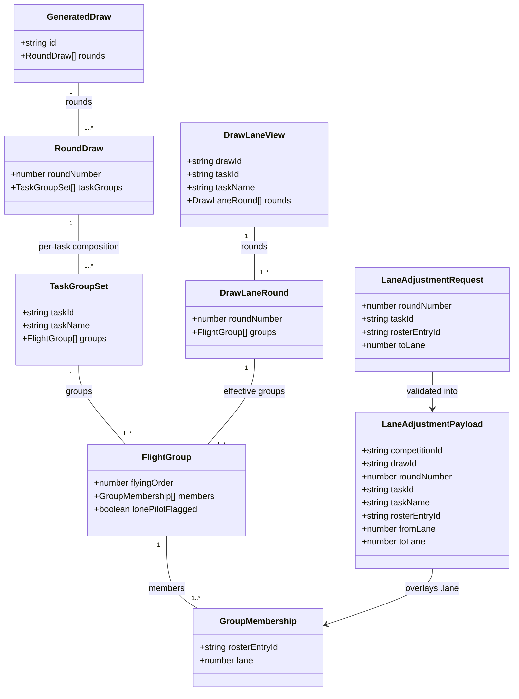

# Manual Lane Adjustment After the Draw

## Requirements

Let the Organiser correct a pilot's physical field-lane placement within an
already-accepted draw — for one task's group, in one round — without
disturbing that group's fair composition (`rosterEntryId` membership), any
other round, or the Contest Director's accepted anti-repeat evidence. The
correction must be rejected up front if it would duplicate a lane already
held by another pilot in the same group, or place the pilot outside that
group's valid lane range, so the field board never ends up in an
unresolvable state. This is a narrow, Organiser-authority field-practicality
tool — never a re-draw, never a group-membership change (Contest Director
and STORY-001-011 territory respectively) — and it must degrade to a single
implicit task with no selector for every single-task class, exactly as
STORY-001-020 already requires of the rest of the draw pipeline.

## Entities



**Conservative constraints applied**: no existing type is changed.
`GroupMembership`, `FlightGroup`, `TaskGroupSet`, `RoundDraw`, `GeneratedDraw`
(`packages/shared/src/draw.ts`) are read-only inputs to this story — lane
adjustment never mutates them in place, never renames or retypes a field,
and never touches `rosterEntryId`. Three new plain types are added
(`LaneAdjustmentPayload`, `DrawLaneRound`, `DrawLaneView`) plus one new Zod
request schema (`laneAdjustmentRequestSchema`); no new top-level aggregate,
no change to `DrawEvidenceView`. `DrawLaneRound`/`DrawLaneView` deliberately
reuse the existing `FlightGroup`/`GroupMembership` shapes rather than
inventing parallel "effective" types — the only thing that differs from the
stored accepted draw is the `.lane` values inside `members[]`, which the
service overlays before returning, so a client renders it with the exact
same component it already uses for the stored `taskGroups[].groups`.

## Approach

1. **Extend the existing `apps/base/src/draw/` module — service,
   projection, routes, errors — rather than create a new module.** Lane
   adjustment is a narrow, tightly-coupled extension of the accepted-draw
   concept the draw module already owns; a new module would duplicate the
   competition/model/roster cross-aggregate lookups `DrawService` already
   has.

2. **Named Assumption A — task scoping (resolved with product owner,
   2026-07-13).** Lane stays scoped **per task**:
   `GroupMembership.lane` lives inside each round's
   `TaskGroupSet.groups[].members[]`, unchanged from STORY-001-020's shape.
   For F3B the Organiser picks a task (Duration/Distance/Speed) before
   adjusting lanes; single-task classes (`model.tasks.length === 1`) never
   present a selector — the API still accepts an optional `taskId` and
   defaults it to `model.tasks[0].id` server-side, so the client simply
   never sends one. There is **no automatic cross-task propagation**: fixing
   the same physical concern (e.g. "can't hear the speakers from lane 1")
   across all three F3B tasks requires three separate adjustment calls, one
   per task. Deferred as a Future Enhancement, not built now.

3. **Named Assumption B — accepted draws only (AC1's literal wording).**
   Lane adjustment operates exclusively on the promoted `accepted`
   `GeneratedDraw`; a not-yet-accepted candidate cannot be lane-adjusted
   (attempting to reads as "no accepted draw exists yet" — the same
   rejection as a competition with no accepted draw at all). This is a
   stated assumption, not a silent one — the source story predates the
   candidate/accepted split and a future story could extend adjustment to
   candidates if the Organiser workflow wants it earlier.

4. **Overlay, never rewrite, mirroring the codebase's append-only
   discipline.** A lane adjustment is appended as its own small event,
   `draw.laneAdjusted` (`{ competitionId, drawId, roundNumber, taskId,
   taskName, rosterEntryId, fromLane, toLane }`, Organiser attribution) —
   never a rewrite of the `draw.accepted`/`draw.generated` payloads, which
   remain the untouched historical record of what was generated and
   accepted. `DrawProjection` gains a new overlay map (`competitionId →
   roundNumber|taskId|rosterEntryId → current lane`) that `apply` updates on
   `draw.laneAdjusted` and clears on `competition.deleted` — the same
   "pure loader, latest overlay wins" discipline already used for
   `candidates`. `DrawService` composes the *effective* lane state
   (accepted snapshot + overlay) on read; the projection itself computes
   nothing beyond storing the latest lane per key, keeping business logic
   out of the projection layer (matching `getEvidence`'s existing
   accepted/candidate/status composition split).

5. **Named Assumption C — required lane set = contiguous `1..groupSize`,
   and what "leaves a required lane empty" means under single-move
   semantics.** AC3 names two clash conditions: a duplicate lane, and "a
   required lane left empty." Because Assumption D below commits to
   sequential single-pilot moves (no atomic swap), a move's source lane is
   *always* vacated by construction — that vacancy cannot itself be the
   clash AC3 describes, or AC2's own example (moving Jane 2→5) would be
   impossible. The clash check is therefore defined as: **(a)** `toLane`
   must fall within the group's required range (`1..members.length`) — a
   `toLane` outside that range is rejected as abandoning a required lane
   without a valid claimant, which is the operational reading of "leaves a
   required lane empty" under a single-delta operation; **(b)** `toLane`
   must not already be held by a *different* `rosterEntryId` in the same
   group — the literal duplicate case. This reinterpretation of the second
   clause is called out explicitly as a genuinely new ambiguity this canvas
   resolves by design choice, not one settled by the prior analysis's
   Resolution — **flag for confirmation before/alongside generation.**

6. **Named Assumption D — sequential single-pilot moves only (Q4).** No
   atomic two-pilot swap operation exists. Swapping two pilots' lanes
   requires the Organiser to move one pilot to a currently-free lane first
   (impossible if the group is already a complete bijection with no spare
   lane) — in practice, at MVP scale, a genuine two-pilot swap is
   **not achievable via this story's API** unless a third, temporarily-free
   lane exists. This is a real, stated MVP limitation (matches the
   "Small/2-day" INVEST sizing), not silently glossed over — see
   Safeguards.

7. **Named Assumption E — no optimistic-concurrency guard (Q5).** No
   `drawId`/version check gates an adjustment (unlike `accept`/`cancel`'s
   `DrawCandidateSupersededError` pattern) — trusted single-Organiser club
   scale (CLAUDE.md trust model). The event payload still carries `drawId`
   (denormalised from the currently accepted draw at append time) purely
   for audit self-description, never for a staleness check.

8. **Read exposure (AC1) as a dedicated read-model, not a
   `DrawEvidenceView` extension.** `DrawEvidenceView` is oriented around the
   pre-acceptance generate/accept/cancel workflow; folding a
   fundamentally different post-acceptance capability into it would blur
   that read-model's single purpose (per the prior analysis's
   recommendation). A new `GET .../draw/lanes?taskId=` returns a
   `DrawLaneView` — the effective (accepted + overlaid) per-round lane
   state for one task, covering every round in one call (AC1: "every
   round" is visible without N requests).

## Structure

### Inheritance Relationships
1. No new class hierarchies. `LaneAdjustmentPayload`, `DrawLaneRound`,
   `DrawLaneView` are new plain TypeScript interfaces in
   `packages/shared/src/draw.ts`, siblings of `TaskGroupSet`/`RoundDraw`,
   not subtypes of them.
2. Three new `DomainError` subclasses in `apps/base/src/draw/errors.ts`,
   each following the established one-subclass-per-rejection-reason idiom:
   `DrawNotAcceptedError`, `LaneTargetNotFoundError`, `LaneClashError`.

### Dependencies
1. `DrawService.getLaneView` and `DrawService.adjustLane` both call
   `this.getCompetition` / `this.getModel` (existing private helpers,
   unchanged) to resolve the class model and default `taskId` when omitted.
2. `DrawService.adjustLane` calls `this.projection.getAccepted` to read the
   authoritative snapshot, `this.projection.getLaneAdjustments` (new) to
   read the current overlay, and — on success —
   `this.eventStore.append` + `this.projection.apply` to record the new
   `draw.laneAdjusted` event, mirroring `accept`/`cancel`'s exact
   append-then-apply-then-return sequence.
3. `DrawService.getLaneView` calls the same two projection reads (no
   append) to compose the effective view.
4. `DrawProjection.apply` gains one new `case "draw.laneAdjusted"` branch;
   `DrawProjection` gains a new private field `laneAdjustments: Map<string,
   Map<string, number>>` (competitionId → compositeKey → lane) and a new
   public getter `getLaneAdjustments(competitionId): Map<string, number>`.
5. `apps/base/src/routes/draw.ts` gains two new routes calling the two new
   `DrawService` methods, using the existing `attributionFromHeaders`
   helper (Organiser authority — lane adjustment is explicitly *not* a
   Contest Director action, unlike accept/cancel).
6. `apps/base/src/app.ts` gains three new `setErrorHandler` branches (one
   per new error class) and the three-line `DrawService`/`DrawProjection`
   construction is otherwise unchanged — no new constructor dependency is
   introduced (Norm 2 below).

### Layered Architecture
1. **Shared types layer** (`packages/shared/src/draw.ts`):
   `LaneAdjustmentPayload`, `DrawLaneRound`, `DrawLaneView` interfaces;
   `laneAdjustmentRequestSchema` (Zod, structural validation only).
2. **Service layer** (`apps/base/src/draw/service.ts`): all business
   logic — accepted-draw gating, task/round/rosterEntryId resolution, the
   clash check (Assumption C), the overlay-composition read path, and the
   append-on-success write path.
3. **Projection layer** (`apps/base/src/draw/projection.ts`): the new
   `laneAdjustments` overlay map, applied and read as a pure loader — no
   validation, no business rules, matching the file's existing header
   comment discipline.
4. **Error layer** (`apps/base/src/draw/errors.ts` +
   `apps/base/src/app.ts`): three new `DomainError` subclasses, each with
   exactly one `setErrorHandler` branch (Safeguard 6 below — a missing
   branch is a release blocker per the existing convention).
5. **Route layer** (`apps/base/src/routes/draw.ts`): two new endpoints,
   Organiser-attributed, following the existing `PUT` (idempotent
   state-setting) vs `POST` (action/decision) convention already used by
   `spec` vs `generate`/`accept`/`cancel` — lane adjustment is an action
   (`POST`), the lane view is a read (`GET`).

## Operations

### Update Shared Types — `packages/shared/src/draw.ts`
1. Responsibility: define the event payload, the request schema, and the
   read-model shapes for lane adjustment.
2. Add:
   ```ts
   export interface LaneAdjustmentPayload {
     competitionId: string;
     drawId: string;
     roundNumber: number;
     taskId: string;
     taskName: string;
     rosterEntryId: string;
     fromLane: number;
     toLane: number;
   }

   export const laneAdjustmentRequestSchema = z.object({
     roundNumber: z.number().int("Round number must be a whole number").positive(
       "Round number must be positive",
     ),
     taskId: z.string().min(1).optional(),
     rosterEntryId: z.string().min(1, "A roster entry id is required"),
     toLane: z.number().int("Lane must be a whole number").positive(
       "Lane must be a positive whole number",
     ),
   });
   export type LaneAdjustmentRequest = z.infer<typeof laneAdjustmentRequestSchema>;

   export interface DrawLaneRound {
     roundNumber: number;
     groups: FlightGroup[];
   }

   export interface DrawLaneView {
     drawId: string;
     taskId: string;
     taskName: string;
     rounds: DrawLaneRound[];
   }
   ```
3. Constraints: `taskId` is optional in the request schema only — the
   service resolves the default (Norm 2's structural/cross-aggregate
   split: "does this task exist on this model" is cross-aggregate, stays
   in the service). No change to any existing exported type or function in
   this file.

### Update Domain Errors — `apps/base/src/draw/errors.ts`
1. Responsibility: three new rejection reasons, each mapped to exactly one
   HTTP status via `app.ts`.
2. Add:
   ```ts
   // Lane adjustment operates only on an accepted draw (Assumption B,
   // AC1's literal wording). Fires when no accepted draw exists yet — the
   // Organiser must wait for CD acceptance first. 409 — the request
   // conflicts with the contest's current draw state.
   export class DrawNotAcceptedError extends DomainError {
     readonly code = "DRAW_NOT_ACCEPTED";
     constructor(message: string) { super(message); }
   }

   // The referenced round, task, or rosterEntryId does not resolve to a
   // member of the accepted draw's group (e.g. a stale round number, an
   // unknown taskId, or a rosterEntryId no longer seated that round). 404.
   export class LaneTargetNotFoundError extends DomainError {
     readonly code = "LANE_TARGET_NOT_FOUND";
     constructor(message: string) { super(message); }
   }

   // AC3: the requested lane duplicates another member's current lane, or
   // falls outside the group's required 1..groupSize range (Assumption C).
   // Nothing is appended. 409 — conflicts with the group's current lane
   // state until resolved.
   export class LaneClashError extends DomainError {
     readonly code = "LANE_CLASH";
     constructor(message: string) { super(message); }
   }
   ```

### Update Projection — `apps/base/src/draw/projection.ts`
1. Responsibility: store the latest lane per (round, task, rosterEntryId)
   as a pure, replayable overlay — never mutates the stored accepted
   snapshot.
2. Add field: `private laneAdjustments = new Map<string, Map<string,
   number>>();` (outer key: `competitionId`; inner key:
   `` `${roundNumber}|${taskId}|${rosterEntryId}` ``, reusing the existing
   `pairKey`-style composite-string idiom from `service.ts`).
3. `apply` — add:
   ```ts
   case "draw.laneAdjusted": {
     const payload = record.payload as LaneAdjustmentPayload;
     const key = `${payload.roundNumber}|${payload.taskId}|${payload.rosterEntryId}`;
     const perCompetition = this.laneAdjustments.get(record.scope) ?? new Map<string, number>();
     perCompetition.set(key, payload.toLane);
     this.laneAdjustments.set(record.scope, perCompetition);
     break;
   }
   ```
   Latest wins per key — supersede, never overwrite in place (matches the
   `draw.generated` candidate-supersession comment style).
4. `case "competition.deleted"` — add
   `this.laneAdjustments.delete(payload.competitionId);` alongside the
   three existing deletions.
5. `rebuild` — add `this.laneAdjustments = new Map();` alongside the three
   existing resets.
6. Add getter:
   ```ts
   getLaneAdjustments(competitionId: string): Map<string, number> {
     return new Map(this.laneAdjustments.get(competitionId) ?? []);
   }
   ```
   Returns a defensive copy (matches `getSpec`/`getCandidate`/`getAccepted`'s
   existing copy-on-read discipline) — a caller mutating the returned map
   must never corrupt projection state.

### Create Service Method — `DrawService.getLaneView`
1. Responsibility: AC1 — the effective (accepted + overlaid) per-round lane
   state for one task, all rounds in one call.
2. Signature: `getLaneView(competitionId: string, taskId?: string):
   DrawLaneView`
   - Logic:
     - `getCompetition`/`getModel` as usual.
     - `const accepted = this.projection.getAccepted(competitionId);` — if
       null, throw `DrawNotAcceptedError` (Assumption B).
     - Resolve `const resolvedTaskId = taskId ?? model.tasks[0]!.id;` — if
       `taskId` was supplied but no task on `model.tasks` matches it, throw
       `LaneTargetNotFoundError`.
     - `const overlay = this.projection.getLaneAdjustments(competitionId);`
     - Build `rounds: DrawLaneRound[]` by mapping `accepted.rounds`: for
       each round, find `taskGroups.find(tg => tg.taskId === resolvedTaskId)`
       (must exist — `TaskGroupSet[]` always has one entry per
       `model.tasks`, per STORY-001-020's invariant); map its `groups[]`,
       and for each `members[]` entry, overlay
       `overlay.get(`${round.roundNumber}|${resolvedTaskId}|${member.rosterEntryId}`)
       ?? member.lane` as the effective lane — never mutate the object
       read from the projection (build fresh objects, matching every other
       read path in this file).
     - Return `{ drawId: accepted.id, taskId: resolvedTaskId, taskName:
       <the resolved TaskGroupSet's taskName>, rounds }`.
3. Constraints: read-only — no event appended, no projection mutation.

### Create Service Method — `DrawService.adjustLane`
1. Responsibility: AC2/AC3 — validate and record one pilot's lane move
   within one round's one task's group.
2. Signature: `adjustLane(competitionId: string, input: unknown,
   attribution: Attribution): DrawLaneView`
   - Input Validation: `const parsed = parseOrThrow(laneAdjustmentRequestSchema,
     input);` (Norm 2's existing idiom, reused verbatim).
   - Business Logic:
     - `getCompetition`/`getModel` as usual.
     - `const accepted = this.projection.getAccepted(competitionId);` — if
       null, throw `DrawNotAcceptedError`.
     - Resolve `resolvedTaskId` exactly as in `getLaneView`; throw
       `LaneTargetNotFoundError` if `parsed.taskId` was supplied but
       unknown.
     - `const round = accepted.rounds.find(r => r.roundNumber ===
       parsed.roundNumber);` — if absent, throw `LaneTargetNotFoundError`
       ("round N is not part of this accepted draw").
     - `const taskGroup = round.taskGroups.find(tg => tg.taskId ===
       resolvedTaskId)!;` (always present per the invariant above once
       `resolvedTaskId` is confirmed valid on the model).
     - Locate the member's current group and effective lane: iterate
       `taskGroup.groups`, find the group containing
       `parsed.rosterEntryId` in `members[]`; if none found across all
       groups, throw `LaneTargetNotFoundError` ("rosterEntryId is not
       seated in this round/task").
     - Compute the group's effective lanes (accepted lane overlaid with
       any prior adjustment, exactly as `getLaneView` does, scoped to just
       this one group) to check against, not the raw stored lane — a
       clash check must see prior adjustments, not just the original
       generation.
     - `const fromLane = effectiveLaneOf(mover);`
     - If `parsed.toLane === fromLane`, throw a `ValidationError` ("the
       pilot is already in lane {toLane}") — a no-op is rejected rather
       than silently accepted or logged as a meaningless event
       (Assumption C's "why" — keeps the event log human-auditable, no
       noise entries).
     - If `parsed.toLane < 1 || parsed.toLane > group.members.length`,
       throw `LaneClashError` ("lane {toLane} is outside this group's
       valid range of 1–{group.members.length}") — Assumption C(a).
     - If any *other* member of the same group has effective lane ===
       `parsed.toLane`, throw `LaneClashError` ("lane {toLane} is already
       occupied by {that rosterEntryId} in this group") — Assumption
       C(b)/AC3's literal duplicate case.
     - On success, append:
       ```ts
       const record = this.eventStore.append({
         scope: competitionId,
         type: "draw.laneAdjusted",
         payload: {
           competitionId,
           drawId: accepted.id,
           roundNumber: parsed.roundNumber,
           taskId: resolvedTaskId,
           taskName: taskGroup.taskName,
           rosterEntryId: parsed.rosterEntryId,
           fromLane,
           toLane: parsed.toLane,
         },
         attribution,
       });
       this.projection.apply(record);
       ```
     - Return `this.getLaneView(competitionId, resolvedTaskId);` — the
       caller gets the freshly-composed effective view in one round trip,
       mirroring `accept`/`cancel`'s "return the updated evidence" pattern.
   - Exception Handling: nothing is appended before every check above
     passes (Safeguard 3's existing discipline, reused).
3. Constraints: never writes to `rosterEntryId`/`flyingOrder`/any other
   round — the event payload is scoped to exactly one seat's lane in one
   round/task.

### Update Route Registration — `apps/base/src/routes/draw.ts`
1. Responsibility: two new Organiser-attributed endpoints.
2. Add:
   ```ts
   // AC1: the effective per-round lane state for one task (defaults to the
   // class's single task when omitted).
   app.get<{ Params: CompetitionParams; Querystring: { taskId?: string } }>(
     "/api/competitions/:competitionId/draw/lanes",
     async (request) =>
       drawService.getLaneView(request.params.competitionId, request.query.taskId),
   );

   // AC2/AC3: reassign one pilot's lane within one round's one task's group.
   app.post<{ Params: CompetitionParams }>(
     "/api/competitions/:competitionId/draw/lanes/adjust",
     async (request) => {
       const attribution = attributionFromHeaders(request.headers as Record<string, unknown>);
       return drawService.adjustLane(request.params.competitionId, request.body, attribution);
     },
   );
   ```
3. Constraints: uses `attributionFromHeaders` (Organiser), never
   `cdAttributionFromHeaders` — lane adjustment is explicitly not a
   Contest Director action, matching Area 4.4 vs 4.3.

### Update App Wiring — `apps/base/src/app.ts`
1. Responsibility: map the three new error classes to HTTP status codes;
   no new constructor dependency.
2. Add, alongside the existing draw-related branches (before the generic
   `DomainError` fallback):
   ```ts
   if (error instanceof DrawNotAcceptedError) {
     reply.code(409).send({ code: error.code, message: error.message });
     return;
   }
   if (error instanceof LaneTargetNotFoundError) {
     reply.code(404).send({ code: error.code, message: error.message });
     return;
   }
   if (error instanceof LaneClashError) {
     reply.code(409).send({ code: error.code, message: error.message });
     return;
   }
   ```
3. Import the three new classes alongside the existing draw error imports;
   no change to the `DrawProjection`/`DrawService`/`registerDrawRoutes`
   construction lines — this story adds no new constructor argument to any
   existing class.

### Update Tests — `apps/base/test/draw.service.test.ts`
1. Responsibility: cover AC1–AC3 and the assumptions above.
2. New tests:
   - AC1: given an accepted draw for a single-task class (e.g. F5J, 6
     rounds), `getLaneView(competitionId)` returns exactly 6 `rounds[]`
     entries, each with the round's groups and every member's lane
     visible.
   - AC1 (F3B): given an accepted F3B draw, `getLaneView(competitionId,
     "<distance task id>")` returns only Distance's groups per round, and
     omitting `taskId` defaults to `model.tasks[0]` (Duration).
   - AC2: move a pilot from lane 2 to a valid alternate lane within their
     group; assert the returned view shows the new lane, the group's
     `rosterEntryId` membership set is unchanged, and every other round's
     `getLaneView` output is byte-for-byte identical to before the move.
   - AC3 (duplicate): attempt to move a pilot into a lane already held by
     another member of the same group → `LaneClashError`, nothing
     appended (assert a second `getLaneView` call is unchanged).
   - AC3 (out of range): attempt `toLane` outside `1..group.members.length`
     → `LaneClashError`.
   - No-op rejection: attempt `toLane === fromLane` → `ValidationError`.
   - Not-accepted gating: `getLaneView`/`adjustLane` on a competition with
     only a candidate (no accepted draw) → `DrawNotAcceptedError`.
   - Unknown round/task/rosterEntryId → `LaneTargetNotFoundError` for each.
   - Overlay composition: two sequential valid adjustments to the same
     rosterEntryId in the same round/task — the second adjustment's clash
     check must see the *first* adjustment's lane, not the original
     generated lane (proves the overlay, not the stale snapshot, is what's
     validated against).
   - Replay safety: rebuild `DrawProjection` from a log containing a
     `draw.laneAdjusted` event and assert `getLaneView` reflects it
     identically to the live (non-rebuilt) projection.

## Norms

1. **Annotation Standards**: none — matches the existing plain
   TypeScript/Fastify, no-decorator style throughout `apps/base/src/draw/`
   and `packages/shared/src/draw.ts`.
2. **Dependency Injection**: no new constructor dependency on
   `DrawService` or `DrawProjection` — all new logic is either a private
   helper reusing the existing four injected collaborators
   (`eventStore`, `projection`, `competitionProjection`,
   `classModelProjection`) or a new public method on the existing class,
   matching the file's existing convention exactly.
3. **Exception Handling**: three new `DomainError` subclasses, each with
   exactly one `setErrorHandler` branch (Safeguard, below) — the
   established one-class-per-reason idiom, no shared generic "lane error"
   class. The existing `ValidationError`/`parseOrThrow` idiom is reused
   unchanged for structural failures and the no-op-move rejection.
4. **Data Validation**: structural validation (Zod,
   `laneAdjustmentRequestSchema`) covers only shape (`roundNumber`/`toLane`
   positivity, non-blank `rosterEntryId`) — cross-aggregate validation
   (does this round/task/rosterEntryId exist in *this* accepted draw, is
   the target lane a duplicate) stays in `DrawService`, per the existing
   Norm 2 split documented in STORY-001-020's prompt.
5. **Logging**: none beyond the existing immutable event log (D4) — every
   lane adjustment is its own attributed `draw.laneAdjusted` event; no ad
   hoc logging added, no batching of multiple moves into one event.
6. **Documentation Standards**: match the codebase's existing terse,
   "why not what" comment style — the comment on `LaneClashError`
   explaining the reinterpretation of "required lane left empty" under
   single-move semantics (Assumption C) is worth keeping verbatim near the
   error class and the clash-check call site, since it is the one place a
   future reader would otherwise re-derive the same ambiguity from
   scratch.

## Safeguards

1. **Functional Constraints**: a lane adjustment must never change
   `rosterEntryId` membership of any `FlightGroup`, `flyingOrder`, or any
   round other than the one addressed — enforced by construction (the
   event payload carries only `roundNumber`/`taskId`/`rosterEntryId`/
   `toLane`; no code path touches any other field). `lonePilotFlagged`
   groups (size 1) are correctly, automatically unadjustable: the only
   valid lane (1) is always the current occupant's own lane, so every
   attempt hits the no-op rejection — no special-case code needed.
2. **Performance Constraints**: none beyond MVP scale (≤ 20 pilots, ≤ 8
   rounds) — the overlay map and per-round composition are O(rounds ×
   group size), trivially cheap; no new performance test required beyond
   the existing suite's implicit coverage.
3. **Security Constraints**: none beyond the existing trust model (D1) —
   unchanged by this story; Organiser attribution is recorded, not
   enforced.
4. **Integration Constraints**:
   - `draw.laneAdjusted` is a brand-new event type; replaying a log that
     predates this story must never throw — `DrawProjection.rebuild`
     initialises `laneAdjustments` to an empty map exactly like the other
     three maps, so a pre-story log simply produces an empty overlay (D4).
   - Draw reports (STORY-001-015, not yet built) and any other future
     consumer of "the current lane state" must read through
     `DrawService.getLaneView` (or an equivalent overlay-aware path), never
     `projection.getAccepted(...).rounds[...].taskGroups[...].groups[...]`
     directly — that raw path returns the *original*, un-adjusted lanes.
     This is flagged as a forward-compatibility note for whoever builds
     015, not enforced by this story's code.
   - `DrawEvidenceView` and its existing consumers
     (`apps/companion/src/draw/DrawView.tsx`, `routes/draw.ts`'s existing
     `GET .../draw`) are untouched — no new field, no shape change.
5. **Business Rule Constraints**:
   - Lane adjustment is accepted-draw-only (Assumption B) — both new
     service methods throw `DrawNotAcceptedError` before any other check
     when no accepted draw exists.
   - The anti-repeat matrix (`MatchupDistribution`/`taskDistributions`) the
     Contest Director already accepted is never recomputed or invalidated
     by a lane adjustment — membership never changes, so the accepted
     evidence remains valid by construction; no code path reads or writes
     `distribution`/`taskDistributions` from `adjustLane`.
   - **Known MVP limitation (Assumption D, stated not hidden, confirmed by
     the product owner 2026-07-13 as acceptable for now): no single-pilot
     move is achievable at all against a freshly generated/accepted draw,
     not just swaps.** `assignLanes` always produces a full `1..groupSize`
     bijection at generation time — every lane already has an occupant —
     and the clash rule (Assumption C) rejects any `toLane` that is already
     occupied. Since there is never a spare lane immediately after
     generation, `adjustLane` will reject every non-no-op request with
     `LaneClashError` until some other event first vacates a lane (there is
     currently no such event — `draw.laneAdjusted` only ever moves a pilot
     to another already-occupied lane, never frees one). In its generated
     form this story's API is therefore **not yet usable end-to-end from
     generate → accept → adjust**; it was verified correct only by priming
     projection state directly with a synthetic prior `draw.laneAdjusted`
     event in tests. This is an accepted MVP gap, not a defect to silently
     work around — a follow-up story is expected to add either an atomic
     two-pilot swap operation or a generation-time "spare lane" concept
     before this feature is field-usable.
6. **Exception Handling Constraints**: each of `DrawNotAcceptedError`,
   `LaneTargetNotFoundError`, `LaneClashError` gets exactly one
   `setErrorHandler` branch in `apps/base/src/app.ts` before the generic
   `DomainError` 500 fallback — a missing branch is a release blocker
   (existing "Safeguard 8" convention, reused verbatim for this story's
   three new classes).
7. **Technical Constraints**: no change to any existing persisted event
   payload shape (`draw.specSaved`, `draw.generated`, `draw.accepted`,
   `draw.cancelled`) — `draw.laneAdjusted` is purely additive, its own new
   event type layered on top.
8. **Data Constraints**: `taskId`/`taskName` on `LaneAdjustmentPayload` are
   denormalised at adjustment time from the resolved `TaskGroupSet`
   (mirrors `TaskGroupSet`/`TaskMatchupDistribution`'s existing
   denormalisation precedent), so the event remains self-describing even
   if the class model's task is later renamed or the model edited.
   `drawId` is denormalised from the accepted draw at append time purely
   for audit traceability — never used as a staleness/concurrency check
   (Assumption E).
9. **API Constraints**: two new endpoints only —
   `GET /api/competitions/:competitionId/draw/lanes` and
   `POST /api/competitions/:competitionId/draw/lanes/adjust` — no change to
   any existing route's request or response contract. Both new endpoints
   use Organiser attribution (`attributionFromHeaders`), never Contest
   Director attribution, matching Area 4.4's authority assignment.
