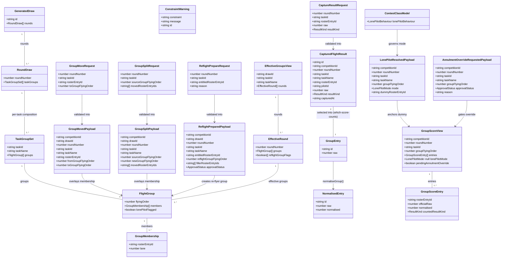

# STORY-001-011 — Group Management and Re-Flight Preparation

## Requirements

Let the Organiser adapt an **accepted** draw's running order — moving a pilot
between flight groups, splitting a group, and preparing a re-flight (with a
new re-flyer group filled to the class minimum) — always clash-checked before
applying, always as an overlay on the accepted `GeneratedDraw` that never
rewrites its historical payload, and always task-scoped (mirrors
STORY-001-010/STORY-001-020: F3B's three tasks move independently).

Because AC5–AC7 recompute a **rule-correct official score** once a re-flight
or a lone-pilot group is captured, and nothing in the codebase today captures
a flight result at all (`packages/shared/src/scoring.ts` has zero production
callers; `EntryScoresProvider` is still the no-op stub), this story also
builds the **minimal captured-flight-result aggregate** that closes that gap:
a way to record one raw result per pilot per round/task (two legitimately, for
a re-flight), and a pure, deterministic recompute over it that applies
which-score-counts (re-flight pilot: the re-flight, even if worse; everyone
else: the better of two), lone-pilot dummy insertion (dummy's own flight
excluded from the dummy's own score), and F3B's class-fixed annulment
(requiring the Contest Director's explicit per-contest override before any
dummy substitutes). Every Contest-Director-authority decision this story
touches (re-flight approval, the F3B annulment override) is **recorded as a
pending handoff, never granted here** — approval itself is out of scope.

Explicitly out of scope: live multi-scorer device capture, device sync, and
any capture UI (Scorer's domain); approving a re-flight, group change, or
annulment override (Contest Director's domain, a follow-up story); pilot
retirement and its re-draw (Area 5.5).

## Entities



Enums:
- `ApprovalStatus` = `"pending-contest-director-approval"` (the only value this
  story ever produces — a future story adds `"approved"` / `"rejected"`).
- `ResultKind` = `"original"` | `"reflight"` (two legitimate captures per
  pilot/round/task; never a capture conflict).
- `LonePilotMode` = `"dummy"` | `"annul"` (read from the new class-model field,
  resolved and persisted once per group so a random dummy choice is
  replayable — mirrors draw generation's "RNG in the service only, the
  materialised outcome is the fact" discipline).
- `LonePilotBehaviour` = `"dummy"` | `"annul"` — **new** additive field on
  `ContestClassModel` (default `"dummy"`; F3B's stock model seeded to
  `"annul"`).

**Conservative-design notes.** `GeneratedDraw`, `RoundDraw`, `TaskGroupSet`,
`FlightGroup`, `GroupMembership` (`packages/shared/src/draw.ts`) are read-only
inputs — this story never mutates them in place, exactly as STORY-001-010
already established for lane adjustment; `GroupMovedPayload`,
`GroupSplitPayload`, `ReflightPreparedPayload`, `EffectiveGroupsView`,
`EffectiveRound` are new sibling types alongside `LaneAdjustmentPayload`/
`DrawLaneView`, following that exact shape (denormalise `taskId`/`taskName` at
write time, overlay `.lane`-style — here overlay group membership — on read,
never invent a parallel `FlightGroup`-like type). `GroupEntry`/
`NormalisedEntry` are `scoring.ts`'s existing STORY-001-007 types, reused
verbatim as the recompute's input/output — this story adds two new pure
functions beside `normaliseGroup`/`deriveRoundScore`, it does not touch them.
`CapturedFlightResult` is the one genuinely new persisted aggregate; kept to
exactly the fields the which-score-counts/lone-pilot/annulment logic needs —
no landing detail, no penalty detail, no device/session metadata (those stay
Scorer-story territory). The only change to an existing shared type is the
**additive** `ContestClassModel.lonePilotBehaviour` field.

## Approach

1. **Two modules, one composition seam, no module cycle.**
   - **Group topology (AC1–AC4)** extends the existing `apps/base/src/draw/`
     triad in place (service, projection, errors), exactly as STORY-001-010
     planned for lane adjustment — new overlay events on the *accepted* draw,
     never a rewrite of `draw.generated`/`draw.accepted`, one domain-error
     subclass per rejection reason, `setErrorHandler` branch each.
   - **Captured results + recompute (AC5–AC7)** is a **new sibling module**,
     `apps/base/src/scoring/`, because it is a genuinely different aggregate
     (capture facts, not draw facts) with its own event type family and its
     own projection — folding it into `draw/` would blur two aggregates the
     way STORY-001-010 explicitly avoided blurring lane adjustment into
     `DrawEvidenceView`.
   - `ScoringService` needs the *effective* group composition (accepted draw
     **plus** any move/split overlay) to know who is in a group when it
     recomputes. Rather than importing `DrawService` directly (the two
     aggregates would then know about each other's internals) it depends on a
     new interface it owns, `GroupCompositionProvider`, implemented by the
     draw module (`DrawServiceGroupCompositionProvider`) and injected via
     `AppOptions` — the exact "interface owned by the consumer, implementation
     by the owner" shape `DrawStateProvider`/`ProjectionDrawStateProvider`
     already established for roster↔draw (STORY-001-017 Safeguard 8). No
     cycle: `scoring` → interface it owns; `app.ts` wires the draw-side
     implementation in.

2. **Group move/split — overlay event, clash-before-apply, task-scoped.**
   - `moveGroup`/`splitGroup` operate only on an accepted draw (Assumption
     mirrors STORY-001-010's Assumption B — attempting on a not-yet-accepted
     candidate reads as "no accepted draw exists yet", `DrawNotAcceptedError`,
     409). Both resolve `taskId` exactly as STORY-001-010's `getLaneView`/
     `adjustLane` do (`taskId` optional in the request, defaults to
     `model.tasks[0].id`, single-task classes never see a selector).
   - **Clash-before-apply (AC1)**: before appending, the service runs, in
     order: (a) target-exists checks (round, task, `rosterEntryId`, target
     group all resolve against the *effective* composition), (b) a **lane/seat
     clash** — the destination group must have room (task's `minGroupSize`
     is a floor, not a cap, so "room" here means the move doesn't itself
     starve the *source* group below the resolved minimum without a
     compensating fill), (c) the **consecutive-flight constraint** (AC2) —
     reusing STORY-001-009's rule verbatim: a moved seat must not end up in
     the last group of round *r* **and** the first group of round *r+1*
     (only checked when the *spec*'s `avoidConsecutiveFlights` was set for
     this draw — read from `DrawProjection.getSpec`, never recomputed). Any
     failure throws a specific `DomainError` naming the violated constraint
     (AC2's "states which constraint... and why") and **appends nothing**.
   - **Overlay, never rewrite**: `draw.groupMoved`/`draw.groupSplit` file
     under `scope = competitionId`; `DrawProjection` gains a
     `groupTopologyOverlay: Map<competitionId, Map<compositeKey, FlightGroup[]>>`
     (`compositeKey = roundNumber|taskId`) storing the **latest effective
     group set** for that round/task once at least one move/split has
     happened — same "pure loader, latest overlay wins" discipline as
     STORY-001-010's `laneAdjustments` map, just one level coarser (whole
     group sets, not single lanes, because a split changes group *count*,
     which a per-lane overlay cannot express).
   - **Split**: `sourceGroupFlyingOrder` plus the `movedRosterEntryIds[]`
     that leave it for a brand-new group (`newGroupFlyingOrder =
     max(existing flyingOrders) + 1` for that round/task) — reuses the same
     clash sequence, plus a floor check that neither resulting group drops
     below 2 (D1) unless the class's `minGroupSizeAllCompetitorsFallback`
     or an existing `lonePilotFlagged` already permits a singleton.

3. **Re-flight preparation — topology action with an approval handoff riding
   along (AC3/AC4).**
   - `prepareReflight` is a `draw/` module action (it *creates a group*,
     which is topology), but its payload carries the new
     `approvalStatus: "pending-contest-director-approval"` field — the
     genuinely new "recorded, not granted" shape this story introduces. It is
     **not** modelled as accept/cancel's after-the-fact promotion (017's
     idiom) because there is, by design, no corresponding "decision already
     made" event yet — the whole point of AC3 is that none exists.
   - The new re-flyer group is filled to the task's resolved minimum
     (`task.minGroupSize` / `minGroupSizeAllCompetitorsFallback`, reusing
     `DrawService`'s already-private `resolveGroupPlanForTask`-style
     resolution, exposed as a shared helper — **never** a hardcoded "4/6"; the
     AC's own prose numbers are illustrative, the class-model fields govern,
     exactly as they already do for generation) by **random draw from the
     other competitors** currently seated in that round/task (excludes the
     entitled pilot, anyone already in a re-flyer group this round, and —
     conservatively, flagged as an explicit assumption below — anyone whose
     own group is currently `lonePilotFlagged`, so a filler draw never
     creates a *second* lone-pilot group as a side effect). RNG lives only in
     the service call; the chosen fillers are persisted in
     `fillerRosterEntryIds` (materialised outcome, replayable, same
     discipline as draw generation's `runAttempt`).

4. **Minimal captured-flight-result aggregate (AC5–AC7's foundation).**
   - **Capture** (`ScoringService.captureResult`) is deliberately the
     smallest possible write: `{roundNumber, taskId, rosterEntryId, raw,
     resultKind}` → `scoring.resultCaptured` event, denormalising `pilotId`
     at capture time (mirrors `EntryScoresProvider`'s planted comment: "every
     captured score must record the pilotId of the seat's occupant at
     capture time"). **Two results per pilot/round/task is legitimate**
     (`resultKind` disambiguates `"original"` vs `"reflight"`); a third
     capture of the same `resultKind` for the same pilot/round/task
     **supersedes** (latest wins — same idiom as `draw.generated`), so a
     genuine mis-key never wedges the aggregate. No device identity, no
     concurrency/session model, no sync — this is the "Organiser or system
     records a raw number", not the Scorer's live-capture pipeline.
   - **Recompute is a pure, on-demand read**, not a stored fact — `GET
     .../scoring/groups/score` composes `CapturedResultProjection` (raw
     results) + `GroupCompositionProvider` (effective group membership,
     including any re-flight group) + the class model, and calls two new
     pure functions added to `scoring.ts` (`selectOfficialResult`,
     `resolveLonePilotNormalisation` — signature below) followed by the
     existing `normaliseGroup`. Because capture and move/split are both
     already persisted, deterministic facts, "the group is scored" needs no
     separate trigger event — it is simply "read the current recompute",
     always current, always replayable, honouring D4 without inventing a
     "scoring pipeline" state machine.
   - **Lone-pilot dummy selection is the one place recompute needs RNG**, so
     it cannot be a pure read the first time a group resolves to one scoring
     pilot: `ScoringService.resolveLonePilot` (a) reads
     `model.lonePilotBehaviour`; (b) if `"annul"`, appends
     `scoring.annulmentOverrideRequested` with
     `approvalStatus: "pending-contest-director-approval"` and **no dummy
     chosen** — recompute reports `pendingAnnulmentOverride: true` and
     produces **no normalised scores** for that group until a future story's
     CD-approval action supersedes it; (c) if `"dummy"`, randomly selects one
     eligible other pilot (same exclusion rules as re-flight filling) and
     appends `scoring.lonePilotResolved` with the chosen `dummyRosterEntryId`
     — a **materialised, replayable fact**, exactly like draw generation's
     lane assignment. Once resolved, every subsequent recompute is a pure
     read of the persisted resolution; it is never re-rolled.
   - **Which-score-counts (AC5)** is `selectOfficialResult` — pure, no I/O:
     given a pilot's captured results for a round/task and whether they are
     the round's entitled re-flyer, return the counting raw
     (entitled → the `"reflight"` result, even if numerically worse;
     everyone else with two results → the better one, `speedInverted`-aware
     via the same flag `normaliseGroup` already takes; one result → that
     result). Feeds straight into `GroupEntry[]` for `normaliseGroup`.

5. **F3B annulment vs. dummy — data, not a branch (AC7).**
   - `ContestClassModel.lonePilotBehaviour: "dummy" | "annul"` is read by
     `resolveLonePilot` and nothing else; no code anywhere switches on
     `basis`, `sourceClass`, or `discipline` — the class-agnostic-core law
     (CLAUDE.md) is satisfied by construction, and a future class wanting
     `separate-per-task` basis without annulment (or vice versa) needs no
     code change, only a model edit.

6. **Task-scoping (confirmed, carried from STORY-001-010's precedent).**
   Every new concept here — group move/split, re-flight preparation, capture,
   recompute, lone-pilot resolution — is keyed on `(roundNumber, taskId)`,
   never on the round alone. A move in F3B's Duration task never implies the
   same move in Distance or Speed; a lone-pilot situation in Speed can annul
   independently of Duration/Distance resolving normally. No cross-task
   propagation is built.

## Structure

### Inheritance Relationships
1. No new class hierarchies in the shared package — `GroupMovedPayload`,
   `GroupSplitPayload`, `ReflightPreparedPayload`, `EffectiveGroupsView`,
   `EffectiveRound` are new plain interfaces in `packages/shared/src/draw.ts`;
   `CapturedFlightResult`, `LonePilotResolvedPayload`,
   `AnnulmentOverrideRequestedPayload`, `GroupScoreView`, `GroupScoreEntry`
   are new plain interfaces in a new `packages/shared/src/scoring.ts`
   addition (same file as STORY-001-007's pure functions — it already owns
   the scoring vocabulary).
2. New `DomainError` subclasses in `apps/base/src/draw/errors.ts`:
   `DrawNotAcceptedError`, `GroupMoveTargetNotFoundError`,
   `GroupMoveClashError`, `GroupSplitInvalidError`,
   `ReflightEntitlementNotFoundError`. New subclasses in a new
   `apps/base/src/scoring/errors.ts`: `CaptureTargetNotFoundError`,
   `LonePilotAlreadyResolvedError`, `AnnulmentOverridePendingError`. Every
   subclass follows the established one-class-per-rejection-reason idiom.

### Dependencies
1. `DrawService` gains `moveGroup`, `splitGroup`, `prepareReflight`,
   `getEffectiveGroups` — all reuse its existing `eventStore`, `projection`,
   `competitionProjection`, `classModelProjection`, `rosterProjection`
   collaborators; no new constructor dependency.
2. `DrawProjection` gains two new maps (`groupTopologyOverlay`,
   `reflightPreparations`) and two new `apply` branches
   (`draw.groupMoved`/`draw.groupSplit` merge into the overlay;
   `draw.reflightPrepared` records the preparation), plus accessors
   `getEffectiveGroups(competitionId, roundNumber, taskId)` and
   `getReflightPreparations(competitionId)`.
3. New `apps/base/src/scoring/{projection,service,errors}.ts` +
   `routes/scoring.ts`, mirroring the `draw/` module's layering exactly.
   `ScoringService` depends on `EventStore`, `ScoringProjection` (new,
   captured results + lone-pilot resolutions + annulment requests),
   `ClassModelProjection`, `CompetitionProjection`, and the new
   `GroupCompositionProvider` interface (owned by `scoring/`, implemented by
   `apps/base/src/draw/group-composition-provider.ts`'s
   `DrawServiceGroupCompositionProvider`, injected via `AppOptions` —
   mirrors `DrawStateProvider`).
4. `apps/base/src/roster/state-providers.ts`'s planted `EntryScoresProvider`
   gets its first real implementation,
   `ProjectionEntryScoresProvider(scoringProjection)`, wired into
   `RosterService` via the existing `options.entryScoresProvider ?? …` seam —
   closing the seam the state-providers file's own comment anticipated,
   activating "a flown seat can never be replaced" for real for the first
   time.
5. `buildApp`'s `setErrorHandler` gains branches for every new `DomainError`
   in both modules.

### Layered Architecture
1. **Shared types + Zod layer** (`packages/shared`): the new `draw.ts`
   overlay types + request schemas; the new `scoring.ts` capture/recompute
   types, request schemas, and the two new pure functions
   (`selectOfficialResult`, `resolveLonePilotNormalisation`'s
   eligibility-filter half — the RNG pick itself lives in the service, per
   Norm 5); the additive `ContestClassModel.lonePilotBehaviour` field plus
   its `updateClassModelRequestSchema` slot and `deriveDeviations` diff line.
2. **Route layer** (`apps/base/src/routes/draw.ts` extended;
   `apps/base/src/routes/scoring.ts` new): HTTP surface, Organiser
   attribution for every route in this story (no CD-attributed route is
   added — approvals stay out of scope, so nothing here stamps
   `"contest-director"`).
3. **Service layer** (`draw/service.ts` extended; `scoring/service.ts` new):
   clash-checking, RNG (fillers, dummy selection), event append, the pure
   recompute composition.
4. **Projection layer** (`draw/projection.ts` extended;
   `scoring/projection.ts` new): pure replay only — no RNG, no recompute
   logic, no clash-checking; recompute's *composition* lives in the service,
   its *arithmetic* lives in `scoring.ts`'s pure functions.
5. **Error-mapping layer** (`app.ts setErrorHandler`): one branch per new
   `DomainError` code in both modules; a missing branch is a release blocker
   (Safeguard, existing convention).

## Operations

### Update shared types — `packages/shared/src/class-model.ts`
1. Add `export type LonePilotBehaviour = "dummy" | "annul";` and the field
   `lonePilotBehaviour: LonePilotBehaviour;` on `ContestClassModel`, with a
   comment citing general-rules §3 (no auto-1000) and f3b.md (annulment) —
   house rule 1 discipline, transcribed not invented.
2. `stockTask`'s sibling model-builder path: add `lonePilotBehaviour:
   "dummy"` as every `STOCK_CLASS_MODELS` entry's default except F3B's,
   which sets `lonePilotBehaviour: "annul"` (cited to f3b.md's one-valid-
   result rule).
3. Thread through `classModelToCreatedPayload` (add the field verbatim — it
   is a primitive, no deep copy needed), `updateClassModelRequestSchema`
   (add `lonePilotBehaviour: z.enum(["dummy", "annul"])`), and
   `deriveDeviations` (add `if (custom.lonePilotBehaviour !==
   source.lonePilotBehaviour) note("lonePilotBehaviour", source.…,
   custom.…);` alongside the existing `basis`/`speedInverted` checks).
4. Constraint: additive only (NFR-2); no code anywhere branches on
   `sourceClass`/`basis` to infer this value — every stock model states it
   explicitly, every custom clone inherits then may edit it.

### Update shared types — `packages/shared/src/draw.ts`
1. Add:
   ```ts
   export interface GroupMovedPayload {
     competitionId: string; drawId: string; roundNumber: number;
     taskId: string; taskName: string; rosterEntryId: string;
     fromGroupFlyingOrder: number; toGroupFlyingOrder: number;
   }
   export interface GroupSplitPayload {
     competitionId: string; drawId: string; roundNumber: number;
     taskId: string; taskName: string; sourceGroupFlyingOrder: number;
     newGroupFlyingOrder: number; movedRosterEntryIds: string[];
   }
   export type ApprovalStatus = "pending-contest-director-approval";
   export interface ReflightPreparedPayload {
     competitionId: string; drawId: string; roundNumber: number;
     taskId: string; taskName: string; entitledRosterEntryId: string;
     reflightGroupFlyingOrder: number; fillerRosterEntryIds: string[];
     approvalStatus: ApprovalStatus; reason: string;
   }
   export const groupMoveRequestSchema = z.object({
     roundNumber: z.number().int().positive(),
     taskId: z.string().min(1).optional(),
     rosterEntryId: z.string().min(1, "A roster entry id is required"),
     toGroupFlyingOrder: z.number().int().positive(),
   });
   export const groupSplitRequestSchema = z.object({
     roundNumber: z.number().int().positive(),
     taskId: z.string().min(1).optional(),
     sourceGroupFlyingOrder: z.number().int().positive(),
     movedRosterEntryIds: z.array(z.string().min(1)).min(1,
       "At least one pilot must move to the new group"),
   });
   export const reflightPrepareRequestSchema = z.object({
     roundNumber: z.number().int().positive(),
     taskId: z.string().min(1).optional(),
     entitledRosterEntryId: z.string().min(1, "A roster entry id is required"),
     reason: z.string().min(1, "A reason is required").max(500),
   });
   export interface EffectiveRound {
     roundNumber: number;
     groups: FlightGroup[];
     reflightGroupFlags: boolean[]; // parallel to groups[], true = re-flyer group
   }
   export interface EffectiveGroupsView {
     drawId: string; taskId: string; taskName: string; rounds: EffectiveRound[];
   }
   ```
2. `groupMoveRequestSchema`/`groupSplitRequestSchema`/
   `reflightPrepareRequestSchema`: structural validation only — the "does
   this round/task/rosterEntryId exist in *this* accepted draw" and clash
   checks stay in the service (Norm 2's split, reused verbatim).

### Update events — `packages/shared/src/events.ts`
1. Extend `DrawEventType` (already at `"draw.specSaved" | "draw.generated" |
   "draw.accepted" | "draw.cancelled"`, per the codebase's current state)
   with `"draw.groupMoved" | "draw.groupSplit" | "draw.reflightPrepared"`.
2. `DrawGroupMovedPayload = GroupMovedPayload`;
   `DrawGroupSplitPayload = GroupSplitPayload`;
   `DrawReflightPreparedPayload = ReflightPreparedPayload`; add to
   `DrawEventPayload` union. All three file under `scope = competitionId`.
3. New file section (or extend `scoring.ts`'s existing header comment) with:
   ```ts
   export type ScoringEventType =
     | "scoring.resultCaptured"
     | "scoring.lonePilotResolved"
     | "scoring.annulmentOverrideRequested";
   export type ResultKind = "original" | "reflight";
   export interface ResultCapturedPayload {
     competitionId: string; roundNumber: number; taskId: string;
     taskName: string; rosterEntryId: string; pilotId: string;
     raw: number; resultKind: ResultKind; capturedAt: string;
   }
   export type LonePilotMode = "dummy" | "annul";
   export interface LonePilotResolvedPayload {
     competitionId: string; roundNumber: number; taskId: string;
     taskName: string; groupFlyingOrder: number; mode: LonePilotMode;
     dummyRosterEntryId: string | null; // null when mode === "annul"
   }
   export interface AnnulmentOverrideRequestedPayload {
     competitionId: string; roundNumber: number; taskId: string;
     taskName: string; groupFlyingOrder: number;
     approvalStatus: ApprovalStatus; reason: string;
   }
   export type ScoringEventPayload =
     | ResultCapturedPayload | LonePilotResolvedPayload
     | AnnulmentOverrideRequestedPayload;
   ```
   All three file under `scope = competitionId`.

### Update shared logic — `packages/shared/src/scoring.ts`
1. Add `GroupEntryWithResults { rosterEntryId: string; results:
   { raw: number; resultKind: ResultKind }[] }` — the per-pilot capture
   history for one round/task.
2. `selectOfficialResult(entry: GroupEntryWithResults, isEntitled: boolean,
   speedInverted: boolean): number` — pure:
   - No results → `0` (no valid score, mirrors `normaliseGroup`'s `raw <= 0`
     convention).
   - One result → that result's `raw`.
   - Two results (`resultKind` "original" + "reflight") and `isEntitled` →
     the `"reflight"` result's `raw`, unconditionally (AC5 — even if worse).
   - Two results and **not** `isEntitled` → the numerically better of the
     two, `speedInverted`-aware (lower wins when inverted) (AC5).
3. `eligibleOtherPilots(allSeatIds: string[], excludeIds: Set<string>):
   string[]` — pure filter helper shared by re-flight filling and dummy
   selection (both exclude: the pilot(s) already central to the situation,
   anyone already in *their own* lone-pilot/re-flight situation this round,
   anyone not seated this round). The actual random pick stays in the
   respective service (Norm 5 — RNG never lives in a pure shared function).
4. Constraint: no I/O, no class branching beyond the injected
   `speedInverted` flag (mirrors the file's existing header discipline
   verbatim).

### Update errors — `apps/base/src/draw/errors.ts`
1. `DrawNotAcceptedError` (`DRAW_NOT_ACCEPTED`, 409) — group move/split/
   re-flight-prep all operate only on an accepted draw.
2. `GroupMoveTargetNotFoundError` (`GROUP_MOVE_TARGET_NOT_FOUND`, 404) — an
   unresolvable round/task/rosterEntryId/target group.
3. `GroupMoveClashError` (`GROUP_MOVE_CLASH`, 409) — AC1/AC2: names the
   violated constraint (`"consecutive-flight"` / `"group-size-minimum"`) in
   the message; nothing appended.
4. `GroupSplitInvalidError` (`GROUP_SPLIT_INVALID`, 409) — split would leave
   either resulting group below the class minimum without a permitted
   escape, or `movedRosterEntryIds` is not a strict subset of the source
   group.
5. `ReflightEntitlementNotFoundError` (`REFLIGHT_ENTITLEMENT_NOT_FOUND`,
   404) — the named pilot is not seated in the referenced round/task.
6. Each gets one `setErrorHandler` branch in `app.ts`.

### Create errors — `apps/base/src/scoring/errors.ts`
1. Re-export `DomainError`, `ValidationError` (the task-config idiom, reused
   verbatim, matching `draw/errors.ts`).
2. `CaptureTargetNotFoundError` (`CAPTURE_TARGET_NOT_FOUND`, 404) — the
   round/task/rosterEntryId being captured against doesn't resolve in the
   effective draw.
3. `LonePilotAlreadyResolvedError` (`LONE_PILOT_ALREADY_RESOLVED`, 409) — a
   second resolution attempt for a group already carrying a
   `scoring.lonePilotResolved`/`scoring.annulmentOverrideRequested` fact;
   protects the "resolved once, replayed forever" invariant (mirrors
   `DrawCandidateSupersededError`'s binding discipline).
4. `AnnulmentOverridePendingError` (`ANNULMENT_OVERRIDE_PENDING`, 409) — a
   recompute is requested for a group whose annulment override is still
   pending Contest-Director approval; the caller must wait (there is no
   dummy to compute against yet).
5. Each gets one `setErrorHandler` branch in `app.ts`.

### Update projection — `apps/base/src/draw/projection.ts`
1. Add `private groupTopologyOverlay = new Map<string, Map<string,
   FlightGroup[]>>();` (outer key `competitionId`; inner key
   `` `${roundNumber}|${taskId}` ``) and `private reflightPreparations =
   new Map<string, ReflightPreparedPayload[]>();` (outer key
   `competitionId`).
2. `apply` — add:
   - `draw.groupMoved`: recompute the affected round/task's full group set
     from the **current effective** composition (accepted snapshot, or the
     prior overlay entry if one already exists for that key) by moving the
     one `rosterEntryId` between the two named `flyingOrder` groups, then
     `set` the new full group list as the overlay's latest value for that
     key (supersede, never patch in place — same discipline as
     `draw.laneAdjusted`'s "latest wins").
   - `draw.groupSplit`: same effective-composition read, carve
     `movedRosterEntryIds` out of the source group into a freshly appended
     group at `newGroupFlyingOrder`, `set` the new full group list.
   - `draw.reflightPrepared`: push the payload onto
     `reflightPreparations.get(competitionId)`, **and** synthesize the new
     re-flyer group into the overlay the same way a split does (a
     re-flight group is, structurally, a split-off group whose membership
     is `[entitledRosterEntryId, ...fillerRosterEntryIds]`).
3. `competition.deleted` — extend to delete both new maps' entries; `rebuild`
   — reset both to empty `Map`s alongside the existing four.
4. Add accessors:
   - `getEffectiveGroups(competitionId, roundNumber, taskId): FlightGroup[]`
     — overlay value if present, else the accepted draw's stored
     `taskGroups[taskId].groups[roundNumber]`, else `[]` if not accepted.
     Deep-copy on return (matches every other getter's discipline).
   - `getReflightPreparations(competitionId): ReflightPreparedPayload[]` —
     deep-copy.
5. **No RNG, no recompute logic** here — this is pure replay of already-
   materialised group lists, identical in spirit to `getLaneAdjustments`.

### Create service methods — `DrawService.moveGroup` / `.splitGroup`
1. Responsibility: AC1/AC2 — validated, clash-checked group topology edits.
2. `moveGroup(competitionId, input, attribution): EffectiveGroupsView`
   - `parseOrThrow(groupMoveRequestSchema, input)`.
   - `getCompetition`/`getModel`; `accepted = projection.getAccepted(...)`
     — throw `DrawNotAcceptedError` if null.
   - Resolve `resolvedTaskId` (default `model.tasks[0].id`, same idiom as
     STORY-001-010's `getLaneView`).
   - Read `effective = projection.getEffectiveGroups(competitionId,
     roundNumber, resolvedTaskId)`; locate the mover's current group and the
     target group by `flyingOrder`; throw `GroupMoveTargetNotFoundError` if
     any of round/task/rosterEntryId/target group don't resolve.
   - **Clash sequence (AC1, in order)**:
     1. Resolve the task's minimum (`task.minGroupSize ?? 1`); if removing
        the mover would drop the *source* group strictly below that minimum
        (and the source isn't already `lonePilotFlagged` — a further drop
        from an already-flagged singleton is nonsensical, not newly
        clashing), throw `GroupMoveClashError` naming
        `"group-size-minimum"`.
     2. If `spec.avoidConsecutiveFlights` (read from `projection.getSpec`):
        check the mover isn't placed into the destination group when that
        would make them fly in the last group of round *r* and first group
        of round *r+1* for the **same task** (post-move state, checked
        against both the round before and after the moved round); throw
        `GroupMoveClashError` naming `"consecutive-flight"`.
   - On success: append `draw.groupMoved` with the resolved payload
     (denormalised `taskName`, `drawId: accepted.id`); `projection.apply`;
     return `getEffectiveGroups(competitionId, resolvedTaskId)` (the
     existing-shape read helper, extended to also carry the moved round).
   - Exception handling: nothing is appended before every check passes
     (Safeguard, reused verbatim from STORY-001-010).
3. `splitGroup(competitionId, input, attribution): EffectiveGroupsView` —
   identical resolution/clash sequence, substituting "the resulting two
   groups both clear the task minimum" for the single-group check; on
   success appends `draw.groupSplit`.

### Create service method — `DrawService.prepareReflight`
1. Responsibility: AC3/AC4 — build the re-flyer group to the class minimum
   by random draw, record the approval handoff.
2. `prepareReflight(competitionId, input, attribution): ReflightPreparedPayload`
   - `parseOrThrow(reflightPrepareRequestSchema, input)`; resolve
     competition/model/accepted draw/task exactly as `moveGroup`.
   - Confirm `entitledRosterEntryId` is seated in the round/task's effective
     composition — else `ReflightEntitlementNotFoundError`.
   - Resolve the task's minimum via the same `resolveGroupPlanForTask`-style
     helper `moveGroup` already reuses (extracted to a shared private/
     exported helper so AC4 never hardcodes a number).
   - Build the eligible-filler pool: every other seated rosterEntryId this
     round/task, minus anyone already in a re-flight group this round (from
     `projection.getReflightPreparations`), minus anyone in a group
     currently `lonePilotFlagged` (Assumption, stated below). Randomly draw
     `min - 1` fillers (`crypto.randomInt`, RNG in the service only, per
     Norm 5).
   - Append `draw.reflightPrepared` with `approvalStatus:
     "pending-contest-director-approval"` and the chosen `fillerRosterEntryIds`;
     `projection.apply`; return the appended payload.
   - **Never** appends a second event flipping `approvalStatus` — that is a
     future CD-approval story's job (Scope Out).

### Create module — `apps/base/src/draw/group-composition-provider.ts`
1. `export interface GroupCompositionProvider { getEffectiveGroups(
   competitionId: string, roundNumber: number, taskId: string):
   FlightGroup[]; }` — owned conceptually by `scoring/` (the consumer), but
   physically colocated here so the draw-side implementation and the
   interface it satisfies are easy to keep in sync; `scoring/service.ts`
   imports only the interface shape.
2. `export class DrawServiceGroupCompositionProvider implements
   GroupCompositionProvider` — constructor `(private readonly projection:
   DrawProjection)`; `getEffectiveGroups` delegates to
   `projection.getEffectiveGroups`. Read-only.

### Create projection — `apps/base/src/scoring/projection.ts`
1. Responsibility: pure replay of captured results and lone-pilot/annulment
   resolutions.
2. State: `results: Map<competitionId, Map<compositeKey, CapturedFlightResult[]>>`
   (`compositeKey = roundNumber|taskId|rosterEntryId`, array holds at most
   one `"original"` and one `"reflight"` entry — a repeat capture of the
   same kind replaces its slot, latest wins); `lonePilotResolutions:
   Map<competitionId, Map<groupKey, LonePilotResolvedPayload>>`
   (`groupKey = roundNumber|taskId|groupFlyingOrder`);
   `annulmentRequests: Map<competitionId, Map<groupKey,
   AnnulmentOverrideRequestedPayload>>`.
3. `apply(record)`:
   - `scoring.resultCaptured` → upsert into `results` by
     `(compositeKey, resultKind)`, replacing any prior entry of the same
     kind (supersede).
   - `scoring.lonePilotResolved` → `lonePilotResolutions.set(groupKey, …)`.
   - `scoring.annulmentOverrideRequested` →
     `annulmentRequests.set(groupKey, …)`.
   - `competition.deleted` → delete all three maps' entries for the id.
4. `rebuild(events)`, and getters `getResults(competitionId, roundNumber,
   taskId, rosterEntryId)`, `getLonePilotResolution(competitionId,
   roundNumber, taskId, groupFlyingOrder)`,
   `getAnnulmentRequest(...)`, `hasCapturedResults(competitionId,
   rosterEntryId)` (scans all `results` entries for that entry id across
   rounds/tasks — the exact query `EntryScoresProvider.hasCapturedScores`
   needs). Every getter deep-copies.

### Create service — `apps/base/src/scoring/service.ts` (`ScoringService`)
1. Constructor deps: `EventStore`, `ScoringProjection`, `ClassModelProjection`,
   `CompetitionProjection`, `GroupCompositionProvider`.
2. `captureResult(competitionId, input, attribution): CapturedFlightResult`
   - `parseOrThrow(captureResultRequestSchema, input)`; resolve competition/
     model; confirm `rosterEntryId` is seated in that round/task via the
     `GroupCompositionProvider` — else `CaptureTargetNotFoundError`.
   - Resolve `pilotId` for the seat at capture time (from
     `RosterProjection`, injected the same way `DrawService` reads roster —
     **note**: this adds a `RosterProjection` dependency too, alongside the
     four above, so the denormalisation the `EntryScoresProvider` comment
     requires is real, not a placeholder).
   - Append `scoring.resultCaptured`; `projection.apply`; return the
     appended, denormalised payload.
3. `getGroupScore(competitionId, roundNumber, taskId, groupFlyingOrder):
   GroupScoreView`
   - Resolve model/task; `members = groupCompositionProvider.getEffectiveGroups(
     competitionId, roundNumber, taskId).find(g => g.flyingOrder ===
     groupFlyingOrder)?.members` — `CaptureTargetNotFoundError` if absent.
   - If `members.length > 1`: build `GroupEntryWithResults[]` from
     `projection.getResults` per member; determine the entitled pilot (the
     one member with a `"reflight"` capture, if any — AC5 needs no separate
     "who is entitled" lookup because entitlement is *observable* from
     having a reflight capture at all); map through `selectOfficialResult`
     → `GroupEntry[]` → `normaliseGroup(entries, { speedInverted:
     task.speedInverted })`; return the composed `GroupScoreView` with
     `lonePilotMode: null`.
   - If `members.length === 1` (AC6/AC7's trigger — **the effective group's
     current size**, not the draw-time `lonePilotFlagged` flag; see
     Norms 4 below for why): look up
     `projection.getLonePilotResolution(...)`.
     - If absent: this is the **first** recompute to observe the singleton
       — call the private `resolveLonePilot` (below) to materialise and
       persist the resolution, then proceed as "present" (recursion of one
       level, or a direct fallthrough — implementation detail, not a
       repeated random draw).
     - If `mode === "annul"` and no matching `annulmentRequests` entry has
       since been superseded by an override-granted fact (none exists in
       this story's scope) → return `GroupScoreView` with
       `pendingAnnulmentOverride: true`, `entries: []`.
     - If `mode === "dummy"`: build `GroupEntry[]` from the lone pilot's
       own selected result **plus** the dummy's own captured result for
       this round/task (if any — `0` otherwise, `normaliseGroup`'s existing
       all-non-positive handling covers a dummy with no capture yet);
       normalise; return `GroupScoreView` with only the **lone pilot's**
       entry in `entries` (the dummy's flight anchors the ratio but "does
       not count toward the dummy pilot's own score" — AC6's literal
       requirement — so the dummy's own `GroupScoreEntry` is never
       surfaced from *this* group's view; the dummy's own real group, if
       any, scores them independently and unaffected).
4. `private resolveLonePilot(competitionId, roundNumber, taskId,
   groupFlyingOrder, model, allSeatedThisRoundTask, loneRosterEntryId):
   void`
   - If `model.lonePilotBehaviour === "annul"`: append
     `scoring.annulmentOverrideRequested` (`approvalStatus:
     "pending-contest-director-approval"`, reason: a fixed, class-cited
     string e.g. `"F3B annuls a one-valid-result group (f3b.md); Contest
     Director approval is required to override with a dummy"`).
   - Else: compute `eligibleOtherPilots(allSeatedThisRoundTask, {
     loneRosterEntryId, ...alreadyLonePilotThisRound })` (the shared pure
     helper from `scoring.ts`), pick one at random
     (`crypto.randomInt`), append `scoring.lonePilotResolved` with
     `mode: "dummy"`, `dummyRosterEntryId`.
   - `projection.apply` after each append; RNG lives only here (Norm 5).
5. `requestAnnulmentOverride` is **not** built — Scope Out (that is the
   future CD-approval story's action on top of the
   `scoring.annulmentOverrideRequested` fact this story already produces).

### Create routes — `apps/base/src/routes/draw.ts` (extend)
1. `POST /api/competitions/:competitionId/draw/groups/move` →
   `drawService.moveGroup`.
2. `POST /api/competitions/:competitionId/draw/groups/split` →
   `drawService.splitGroup`.
3. `POST /api/competitions/:competitionId/draw/reflight/prepare` →
   `drawService.prepareReflight`.
4. All three use `attributionFromHeaders` (Organiser) — never
   `cdAttributionFromHeaders`; the approval-handoff fields record that a CD
   decision is *needed*, they do not stamp CD authority on the preparing
   action itself.

### Create routes — `apps/base/src/routes/scoring.ts`
1. `POST /api/competitions/:competitionId/scoring/results` →
   `scoringService.captureResult` (Organiser attribution — this story's
   capture entry point is an Organiser/system action, e.g. manual entry
   after the pen-and-paper failure policy, D6/CLAUDE.md — not the Scorer
   device flow, which is a separate, later story).
2. `GET  /api/competitions/:competitionId/scoring/groups/:roundNumber/:taskId/:groupFlyingOrder`
   → `scoringService.getGroupScore`.

### Wire in `apps/base/src/app.ts`
1. Construct `ScoringProjection`, `scoringProjection.rebuild(eventStore.readAll())`
   after `DrawProjection` (scoring reads through the draw-composition
   interface, so draw must exist first, matching the existing ordering
   discipline).
2. Construct `DrawServiceGroupCompositionProvider(drawProjection)`; pass it
   into `new ScoringService(eventStore, scoringProjection,
   classModelProjection, competitionProjection, drawServiceProvider,
   rosterProjection)`.
3. Register `registerScoringRoutes(app, scoringService)`.
4. Replace the roster wiring's `options.entryScoresProvider ??
   new NoEntryScoresYetProvider()` default with `new
   ProjectionEntryScoresProvider(scoringProjection)` — keep the override
   seam intact for tests (mirrors STORY-001-017's `drawStateProvider`
   change exactly).
5. Add `setErrorHandler` branches for every new `DomainError` in both
   modules (10 new codes total across `draw/errors.ts` and
   `scoring/errors.ts`).

### Create provider — `apps/base/src/scoring/entry-scores-provider.ts`
1. `export class ProjectionEntryScoresProvider implements
   EntryScoresProvider` (imports the interface from
   `../roster/state-providers.js`, the roster-owned/scoring-implemented
   split, same shape as `ProjectionDrawStateProvider`).
2. Constructor: `(private readonly projection: ScoringProjection)`.
3. `hasCapturedScores(competitionId, rosterEntryId): boolean` →
   `this.projection.hasCapturedResults(competitionId, rosterEntryId)`.

### Tests (Vitest, alongside each module)
1. **AC1**: move a pilot between two groups in an accepted draw's round/task
   → `EffectiveGroupsView` reflects the move; other rounds/tasks unchanged.
   Splitting a group produces two groups whose combined membership equals
   the original, neither `flyingOrder` reused elsewhere in that round/task.
2. **AC2**: a move violating `avoidConsecutiveFlights` (spec has it set) is
   rejected with `GroupMoveClashError` naming `"consecutive-flight"`;
   nothing appended (assert event count unchanged).
3. **AC3**: `prepareReflight` for an entitled pilot appends
   `draw.reflightPrepared` with `approvalStatus:
   "pending-contest-director-approval"`; no second event ever flips it
   within this story's surface (no route exists to do so).
4. **AC4**: an F5J re-flight fills the new group to exactly `task.minGroupSize`
   (6) by random draw from eligible others, excluding the entitled pilot and
   anyone in an existing re-flight group; an F3B Speed re-flight resolves
   its task-specific minimum (8, or the all-competitors escape), not F5J's 6
   — proves the fields govern, not the AC's illustrative prose.
5. **AC5**: capture John Brown's original (850) and reflight (790), Jane
   Smith's original (920) and reflight (960) for the same round/task;
   `getGroupScore` reports John's counted raw as 790 (entitled, worse still
   wins) and Jane's as 960 (better of two); `normaliseGroup`'s output is
   consistent with those raws.
6. **AC6**: a non-F3B group whose effective membership is down to one
   (via a split that leaves a singleton) → first `getGroupScore` call
   persists a `scoring.lonePilotResolved` (`mode: "dummy"`) fact; the
   dummy's own raw does not appear in the lone pilot's `GroupScoreEntry`
   set, and the lone pilot is not `1000` unless the dummy's raw happens to
   be numerically worse (never *automatically* 1000). A second
   `getGroupScore` call does not re-roll the dummy (replay-stable).
7. **AC7**: an F3B group (model `lonePilotBehaviour: "annul"`) resolving to
   one valid result → `getGroupScore` returns `pendingAnnulmentOverride:
   true`, empty `entries`, and a persisted
   `scoring.annulmentOverrideRequested` fact; no dummy is ever chosen for
   this group within this story's surface.
8. **Determinism**: rebuild `DrawProjection`/`ScoringProjection` from a log
   containing one of each new event type → identical effective groups /
   captured results / lone-pilot resolution as the live (non-rebuilt)
   projections.
9. **Seam activation**: with the real `ProjectionEntryScoresProvider` and a
   captured result for a seat, `RosterService.replace` on that seat is
   rejected exactly as the `EntryScoresProvider` comment promises (a flown
   seat can never be replaced) — first-class assertion, not incidental.
10. **Not-accepted gating**: `moveGroup`/`splitGroup`/`prepareReflight` on a
    competition with only a candidate (no accepted draw) →
    `DrawNotAcceptedError`.
11. **Error mapping**: each of the 10 new `DomainError` codes returns its
    mapped HTTP status, not 500.

## Norms

1. **Module layout**: extend the existing `draw/` triad for topology
   (AC1–AC4); create a new, sibling `scoring/` triad for capture/recompute
   (AC5–AC7) — two aggregates, two modules, one cross-module interface
   (`GroupCompositionProvider`) owned by the consumer, exactly the shape
   `DrawStateProvider` already established.
2. **Validation split**: structural (shape, positivity, non-blank ids) in
   Zod; cross-aggregate (does this round/task/rosterEntryId/group exist,
   is it a clash, is the class minimum met) in the service. Reuse
   `parseOrThrow` → `ValidationError` verbatim in both modules.
3. **Error handling**: one `DomainError` subclass per rejection reason, one
   `setErrorHandler` branch per subclass; no shared generic error class;
   the fallback `DomainError` branch (500) makes a missing branch a bug,
   not silent behaviour.
4. **"When the group is scored" is defined as "the effective group's
   current membership size at recompute time"**, not the draw-time
   `lonePilotFlagged` flag. The two are related but distinct: a
   draw-time-flagged singleton and a post-disruption singleton (from a
   split, or a future retirement story) both resolve through the exact
   same `getGroupScore` path — `lonePilotFlagged` on `FlightGroup` remains
   a *generation-time* early-warning surfaced in `DrawEvidenceView`, never
   consulted by `getGroupScore`, which always re-derives the live
   membership count. This is a deliberate, stated resolution of the
   analysis's Requirement Ambiguity #2, not a silent assumption.
5. **RNG discipline (Norm 5, reused from the draw module)**: RNG lives only
   in `DrawService.prepareReflight` (filler draw) and
   `ScoringService.resolveLonePilot` (dummy draw) — never in a projection,
   never in a pure `scoring.ts` function. Every random outcome is
   materialised into an appended event before any read depends on it, so
   projection rebuild is always deterministic (D4).
6. **Event payloads**: denormalised (`taskName`, `pilotId` at capture time)
   and deep-copied on append/read, filed under `scope = competitionId`.
   Supersede-on-repeat (latest wins) for the topology overlay and for a
   repeated same-`resultKind` capture; append-only, one-shot for lone-pilot/
   annulment resolution (never re-rolled once persisted).
7. **Attribution**: every route in this story uses
   `attributionFromHeaders` (`authority: "organiser"`) — this story
   introduces **no** CD-attributed route; the approval-handoff fields
   record a pending need for CD authority without exercising it.
8. **Style**: TypeScript, ~80-col comments matching neighbouring modules;
   explain *why* (rule/decision/AC reference), not *what*.

## Safeguards

1. **Functional**: a group move/split never changes any round/task other
   than the one addressed, never renames `rosterEntryId` membership outside
   the two affected groups, and is rejected before any append if a clash
   check fails (AC1/AC2 — enforced by construction, event payload scoped to
   exactly the fields listed). `prepareReflight` never appends a second
   event that flips `approvalStatus` (Scope Out — enforced by there being
   no route/method that does so).
2. **Determinism (critical)**: `DrawProjection`/`ScoringProjection` rebuilds
   from the log MUST reproduce identical effective groups, captured
   results, and lone-pilot/annulment resolutions. No RNG in any `apply`/
   `rebuild` path — the one-time random picks (fillers, dummy) are
   materialised into the event before any projection state depends on
   them.
3. **Persistence / one-shot resolution**: `scoring.lonePilotResolved` and
   `scoring.annulmentOverrideRequested` are each appended **at most once**
   per `(competitionId, roundNumber, taskId, groupFlyingOrder)` —
   `LonePilotAlreadyResolvedError` guards a second attempt; a recompute
   after resolution is always a pure read of the persisted fact, never a
   fresh random draw.
4. **No lone-pilot auto-1000 (general-rules §3)**: `getGroupScore`'s dummy
   path always normalises the lone pilot against the dummy's own captured
   raw (or `0` if uncaptured, via `normaliseGroup`'s existing all-non-
   positive handling) — it never short-circuits to `1000`. The dummy's own
   `GroupScoreEntry` is never surfaced from the lone pilot's group view
   (AC6's "does not count toward the dummy's own score").
5. **F3B annulment is class-model data, never a code branch** (CLAUDE.md's
   core architectural law): the only read of "does this class annul or
   dummy" is `model.lonePilotBehaviour`; no code path inspects
   `sourceClass`, `basis`, or any class name string.
6. **Approval-handoff integrity**: every event carrying `approvalStatus`
   (`draw.reflightPrepared`, `scoring.annulmentOverrideRequested`) is
   appended with exactly the literal value
   `"pending-contest-director-approval"` — this story's code never writes
   any other value to that field; a future CD-approval story supersedes it
   with its own event, not an edit to this one.
7. **Class minimum**: `prepareReflight`'s filler count and the split/move
   clash checks all resolve minima via `task.minGroupSize`/
   `minGroupSizeAllCompetitorsFallback` — no numeric literal ("4", "6") is
   hardcoded anywhere in `draw/service.ts`'s new methods.
8. **Seam integrity**: `ProjectionEntryScoresProvider` answers only from
   genuinely captured results (`scoring.resultCaptured` facts) — never from
   draw membership alone; a seat with a draw slot but no capture still
   reports `hasCapturedScores === false`, preserving free roster
   replacement until a real result exists.
9. **No module cycle**: `scoring/` depends only on the
   `GroupCompositionProvider` interface it owns; `draw/` never imports
   anything from `scoring/`. The concrete wiring (`draw/`'s implementation
   satisfying `scoring/`'s interface) happens only in `app.ts`.
10. **Error mapping completeness**: all 10 new `DomainError` codes (5 in
    `draw/errors.ts`, 3 in `scoring/errors.ts`, plus the reused
    `ValidationError`) have exactly one `setErrorHandler` branch each; an
    unmapped code surfaces as 500 and is a release blocker.
11. **Offline-first (D6)**: capture, recompute, move, split, and prepare all
    operate entirely on the base with no external calls — consistent with
    the manual-entry failure-policy path this story's capture endpoint
    exists to serve (D6's "pen and paper, manual entry at the Base
    Station").
12. **Scope discipline**: no CD approval/rejection action is built for
    re-flights, group changes, or the annulment override (Scope Out — the
    handoff events exist, no event supersedes them here); no live
    multi-scorer device capture, sync, or UI; no pilot retirement or its
    re-draw (Area 5.5); no cross-task propagation of any move/split/
    resolution.

