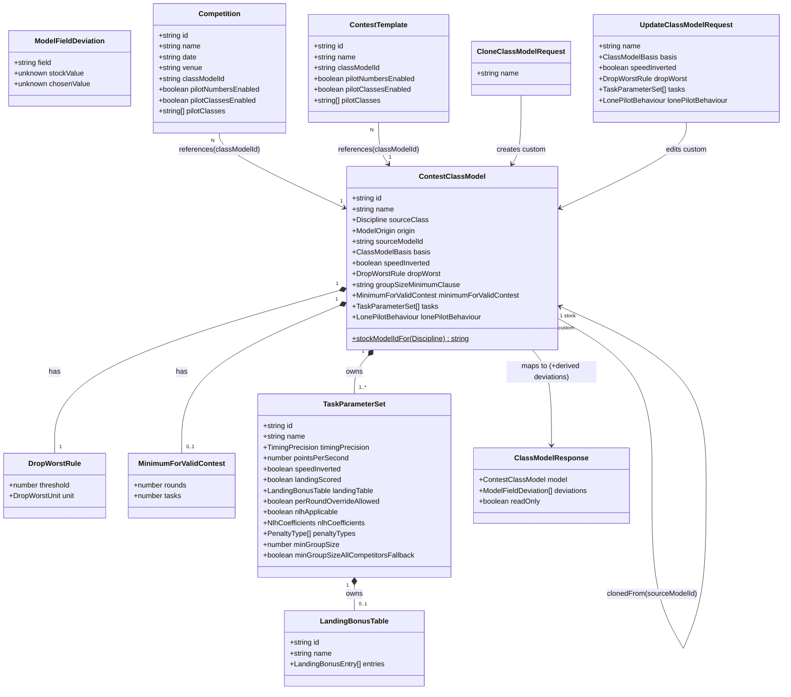

# Contest Class Model — Seeded Rulesets, Custom Clones, and the Competition→Model Pivot

## Requirements

Establish the **Contest Class Model** as the single, authoritative definition of
a class's scoring shape, so nothing in the system reads scoring numbers by
switching on a bare `discipline` enum (NFR-1), and a new class is added by
seeding a new model rather than changing code (NFR-2).

- **Seed** six read-only **stock models** (F3B, F3J, F3K, F5J, F5K, F5L),
  derived from the read-only rule docs, into the immutable event log — each
  carrying its group-score basis, drop-worst rule, points-per-second and its
  **own** landing table (or the explicit absence of these where the class does
  not fix them).
- **Clone** a stock model into a **named, editable custom model** and record how
  it **deviates** from its stock source — the only auditable path to a
  club-level rule variation (no silent per-field overrides).
- **Pivot** the `Competition` and `ContestTemplate` aggregates from an embedded
  `discipline` value to a **`classModelId` reference** (full replacement), so no
  bare discipline value stands alone anywhere on the write path. *(As built: on
  green-field grounds — no live data to preserve, per CLAUDE.md — `discipline`
  was **removed outright** from the write path and `classModelId` made a
  **required** field; the planned legacy-payload back-fill was not needed and
  not built.)*
- **Retire** the standalone landing-table library (routes + companion UI): a
  landing table is now **owned inside** a class model, never selected
  independently. *(As built: the whole standalone landing-tables module — service,
  projection, routes, checker — was removed, commit `4170e60`; the
  `LandingBonusTable` type survives, now owned per task.)*
- Enforce **stock immutability** (never editable or deletable) and
  **referential integrity** (a model referenced by a competition cannot be
  deleted) at the service layer, not only the UI.

**Boundary:** this story records the model, the clone/edit deviation, and the
reference linkage. It does **not** apply the scoring basis/drop-worst/landing
table during score computation (001-007 / per-discipline), and does not build the
model-**selection UX** or the change-with-captured-scores UX guard (001-004).
*(As built the model shape grew past this original boundary: the flat
`pointsPerSecond` + single `landingTable` became a per-task
`TaskParameterSet[]`, so STORY-001-008's per-task parameters/metrics/penalties,
STORY-001-011's `lonePilotBehaviour`, and STORY-001-026's `minimumForValidContest`
now ride this aggregate as additive slots rather than being deferred out of it.)*

## Entities

**Conservative-design notes (reuse over rebuild):**
- **Reuse `LandingBonusTable` / `LandingBonusEntry`** (`packages/shared/src/landing-table.ts`)
  verbatim as the model's owned-table shape — do **not** introduce a new
  entry/table type. The standalone *library* retires; the *type* is repurposed.
- **Keep `Discipline` / `DISCIPLINES`** — no longer a `Competition` field, but the
  model's `sourceClass` metadata and the seed's iteration set.
- **Nullable outlier fields (per task):** each `TaskParameterSet` carries its own
  `pointsPerSecond: number | null` and `landingScored` + `landingTable:
  LandingBonusTable | null`, `null` where that task fixes no single linear rate /
  no table (F3B Distance/Speed, F3K tenths-timing no-bonus, F5K all-up). `basis` +
  `dropWorst.unit` carry the model-level structural difference — no
  `switch (discipline)`.
- **Derive, don't store, deviations:** `ModelFieldDeviation[]` is computed by
  diffing a custom model against its `sourceModelId` stock model at read time —
  never persisted stale (matches D4's "state derivable from the log").

## Approach

1. **New event-sourced aggregate (`class-models`), same slice shape as
   `landing-tables`/`templates`:**
   - Domain type + Zod request schemas + deterministic-id helper in
     `packages/shared`; `classModel.*` event types + payload mappers in
     `events.ts`; `class-models/{projection,service,errors}.ts` in `apps/base`;
     `routes/class-models.ts`; wired in `buildApp`.
   - Data flow unchanged: **route → service (parse → guard → append event →
     apply to projection) → projection read**. Scope = `"master-data"` (as
     landing tables/templates).

2. **Idempotent seed-on-init (the new mechanism this repo lacks):**
   - Six stock definitions transcribed from the rule docs, each keyed on a
     **stable, deterministic id** (`stock-f3b` … `stock-f5l`).
   - On `buildApp`, after the projection rebuilds from the log, the service
     seeds any missing stock model via a `classModel.seeded` event under a
     **system attribution**. Runs on the single synchronous SQLite writer, so
     it is race-free and idempotent across restarts. Re-seed **upserts by id**
     (never duplicates, never orphans referencing competitions).

3. **Clone-and-edit as the auditable deviation:**
   - `clone` deep-copies a source model's rule-fixed values (including every
     `TaskParameterSet` via `copyTaskParameterSet`) into a new custom
     model (`origin: "custom"`, `sourceModelId` = source id, random UUID);
     accepts a stock **or** custom source.
   - `update` edits **custom models only**; stock edits are refused with a
     "clone it first" error. The editable surface is the full task list plus
     model-level `basis`/`speedInverted`/`dropWorst`/`lonePilotBehaviour`;
     identity/rule metadata (`origin`, `sourceModelId`, `sourceClass`,
     `groupSizeMinimumClause`, `minimumForValidContest`) is preserved
     server-side. Deviations are derived on read by diffing against the source.

4. **Full competition→model pivot (chosen scope):**
   - Replace `discipline` with `classModelId` on `Competition` and
     `ContestTemplate` — types, Zod fields, event payloads, projections,
     services, routes, companion forms, tests.
   - **As built — no back-fill:** on green-field grounds (no live data to
     preserve, per CLAUDE.md) `discipline` was removed outright and
     `classModelId` made a **required** field (`z.string().min(1)`). The planned
     `classModelId = payload.classModelId ?? stockModelIdFor(payload.discipline)`
     legacy-payload tolerance was **not** implemented — there were no legacy
     payloads to resolve.
   - The existing discipline-change guard (locked / captured-scores) is
     mechanically re-keyed to `classModelId`; the richer selection UX/guard is
     001-004.

5. **Retire the standalone landing-table library:**
   - Remove `/api/landing-tables` route registration and the companion
     LandingTable nav/library/form. Keep the shared type and existing
     landing-table events (D4 — repurpose, not purge). Drop the
     `NoTaskConfigYetChecker` wiring for the retired library.

6. **Referential integrity + immutability at the service layer:**
   - New `ClassModelReferenceChecker` backed by `CompetitionProjection` (mirrors
     `ProjectionRosterReferenceChecker`) blocks deletion of an in-use model;
     stock models are undeletable and uneditable regardless of references —
     enforced in the service so the API cannot be bypassed.
   - **Global error handling** follows the existing `app.setErrorHandler`
     pattern: new domain errors map to 404/409/400 `ErrorResponse` shapes.

## Structure

### Type / Inheritance Relationships
1. `ClassModelBasis = "single-group" | "separate-per-task"` and
   `DropWorstUnit = "round" | "task"` and `ModelOrigin = "stock" | "custom"`
   are string-literal unions in `packages/shared`.
2. `ContestClassModel` is a plain interface owning a `DropWorstRule`, an optional
   `MinimumForValidContest`, and a `TaskParameterSet[]` — each task owning an
   optional `LandingBonusTable` (reused type), `TimingPrecision`,
   `NlhCoefficients` and `PenaltyType[]`. `LonePilotBehaviour` and
   `ClassModelBasis`/`DropWorstUnit`/`ModelOrigin` are string-literal unions.
3. `ClassModelReferenceChecker` is an interface; `ProjectionClassModelReferenceChecker`
   implements it over `CompetitionProjection` (parallel to
   `ProjectionRosterReferenceChecker`).
4. New errors all extend the shared `DomainError` base (`ClassModelNotFoundError`
   → 404 via a `NOT_FOUND`-classed code, `StockModelReadonlyError` → 409,
   `ReferencedClassModelError` → 409 carrying referencing competitions), plus
   reuse of the shared `ValidationError` (→400) for name/shape violations.

### Dependencies
1. `ClassModelService` depends on `EventStore`, `ClassModelProjection`, and
   `ClassModelReferenceChecker`.
2. `ProjectionClassModelReferenceChecker` depends on `CompetitionProjection`.
3. `CompetitionService.create/update` depends on `ClassModelProjection` to
   validate that a submitted `classModelId` exists.
4. `TemplateService.seedCompetition` passes the template's `classModelId`
   through to `CompetitionService.create` (delegation preserved).
5. `buildApp` constructs `ClassModelProjection` → `ClassModelService` → seeds
   stock → registers routes; competition/template services receive the class-
   model projection for reference validation.
6. Companion `CompetitionForm` / `TemplateForm` depend on the class-model list
   (`GET /api/class-models`) to populate their selector.

### Layered Architecture
1. **Route layer** (`routes/class-models.ts`): HTTP verbs, attribution from
   headers, status codes; new competition/template routes unchanged in shape
   (body now carries `classModelId`).
2. **Service layer** (`class-models/service.ts`): parse → guard (stock
   immutability, name uniqueness, referential integrity) → append → apply;
   seed-on-init entry point.
3. **Projection layer** (`class-models/projection.ts`): in-memory `Map`, rebuilt
   from the log; `getAll/getById/findByName`; deviation derivation helper.
   Competition/template projections gain legacy back-fill mapping.
4. **Shared/domain layer** (`packages/shared`): types, Zod schemas, deterministic
   stock-id helper, stock seed definitions, payload mappers.
5. **Error-handling layer** (`app.setErrorHandler`): new class-model errors →
   uniform `ErrorResponse`.

## Operations

> Execution order follows dependencies: shared types/seed → events → base
> aggregate (projection/service/errors/routes) → wiring+seed → competition/
> template pivot → companion → tests.

### Create Shared Domain Module — `packages/shared/src/class-model.ts`
1. **Responsibility:** the single definition of the class-model shape, its Zod
   request schemas, the deterministic stock-id mapping, and the six stock seed
   definitions.
2. **Types** *(as built — the flat `pointsPerSecond`/`landingTable` became a
   per-task list; 008/011/026 slots folded in):*
   - `ClassModelBasis`, `DropWorstUnit`, `ModelOrigin`, `LonePilotBehaviour`
     (string-literal unions).
   - `DropWorstRule { threshold; unit }`, `MinimumForValidContest { rounds; tasks: number | null }`,
     `TimingPrecision { stepSeconds; rounding }`, `NlhCoefficients { belowPerMetre; above1to10PerMetre; above11PlusPerMetre }`,
     `PenaltyType { code; label; defaultDeduction }`.
   - `TaskParameterSet { id, name, timingPrecision, pointsPerSecond: number | null, speedInverted, landingScored, landingTable: LandingBonusTable | null, perRoundOverrideAllowed, nlhApplicable, nlhCoefficients: NlhCoefficients | null, penaltyTypes, minGroupSize: number | null, minGroupSizeAllCompetitorsFallback }`.
   - `ContestClassModel { id, name, sourceClass: Discipline, origin, sourceModelId: string | null, basis, speedInverted, dropWorst, groupSizeMinimumClause: string | null, minimumForValidContest: MinimumForValidContest | null, tasks: TaskParameterSet[], lonePilotBehaviour }`.
   - `ModelFieldDeviation { field: string; stockValue: unknown; chosenValue: unknown }`.
3. **Methods / helpers:**
   - `stockModelIdFor(discipline: Discipline): string` — pure map
     `F3B→"stock-f3b"`, …, `F5L→"stock-f5l"`. Used by the seed (the planned
     legacy back-fill was dropped — see the pivot below).
   - `copyTaskParameterSet(task)` — deep-copies a task (precision, coefficients,
     penalties, owned table) so a clone shares no nested object with its source.
   - `STOCK_CLASS_MODELS: ContestClassModel[]` — the six definitions, each with a
     `tasks[]` transcribed from the rule docs (values below verified against the
     shipped seed):
     - **F3J** `single-group`, `dropWorst {7,"round"}`, min 4 rounds; one Duration task, 0.1 s timing, 1 pt/s, fine 100→0 landing table, min group 6.
     - **F5J** `single-group`, `dropWorst {4,"round"}`, min 4 rounds; one Duration task, whole-sec truncated, 1 pt/s, coarser 50→0 table, min group 6.
     - **F5L** `single-group`, `dropWorst {5,"round"}`, min 4 rounds; one Duration task, whole-sec truncated, 2 pt/s, 100→0 fine table, no per-group min.
     - **F3K** `single-group`, `dropWorst {5,"round"}` (drop from 6th), min 5 rounds; one Flight-time task, 0.1 s truncated, `pointsPerSecond null`, no landing, `perRoundOverrideAllowed true`, min group 5.
     - **F5K** `single-group`, `dropWorst {6,"round"}` (drop from 7th), `minimumForValidContest null`, no per-group min; five tasks A–E, whole-sec truncated, `pointsPerSecond null`, `nlhApplicable true` with the F5K NLH slopes.
     - **F3B** `separate-per-task`, `speedInverted true`, `dropWorst {5,"task"}`, `minimumForValidContest {rounds:1, tasks:1}`, `lonePilotBehaviour "annul"`; three tasks (Duration 1 pt/s min 5; Distance no rate min 3; Speed 1/100 s inverted min 8 with `minGroupSizeAllCompetitorsFallback`).
   - Each stock definition: `id = stockModelIdFor(class)`, `name = class code`,
     `origin "stock"`, `sourceModelId null`, `sourceClass = the class`,
     `lonePilotBehaviour "dummy"` (except F3B `"annul"`).
   - `deriveDeviations(custom, source): ModelFieldDeviation[]` — compares model
     fields (`basis`, `speedInverted`, `dropWorst.threshold`/`.unit`,
     `lonePilotBehaviour`) and diffs `tasks` positionally by task id (each task's
     precision, rate, landing, NLH, penalties, min-group slots), emitting one
     entry per differing rule-fixed field (dotted-path `field`, `stockValue`,
     `chosenValue`); identity fields excluded.
4. **Zod schemas** (mirror the landing-table/competition field style — trim +
   named messages so `flatten().fieldErrors` names the field):
   - `cloneClassModelRequestSchema` = `{ name }` (trimmed, required, ≤100 chars).
   - `updateClassModelRequestSchema` = `{ name, basis, speedInverted, dropWorst {threshold: int ≥0, unit}, tasks: updateTaskSchema[] (≥1), lonePilotBehaviour }`, where `updateTaskSchema` carries the full editable task surface (timingPrecision, pointsPerSecond number|null ≥0, speedInverted, landingScored, nullable landingTable with ≥1 entry, perRoundOverrideAllowed, nlhApplicable, nullable nlhCoefficients, penaltyTypes, minGroupSize int>0|null, minGroupSizeAllCompetitorsFallback).
5. **Constraints:** `name` required/trimmed/≤100; per-task `pointsPerSecond`
   non-negative when present; `dropWorst.threshold` non-negative integer; ≥1 task.
   Export all; add `export * from "./class-model.js"` to `index.ts`.

### Update Events Module — `packages/shared/src/events.ts`
1. **Add** `ClassModelEventType = "classModel.seeded" | "classModel.created" | "classModel.updated" | "classModel.deleted"`.
2. **Add** payloads: `ClassModelSeededPayload` / `ClassModelCreatedPayload` /
   `ClassModelUpdatedPayload` = the full `ContestClassModel` shape;
   `ClassModelDeletedPayload { modelId: string }`. Add
   `classModelToCreatedPayload(model): ClassModelCreatedPayload` (deep-copies
   `dropWorst`, `minimumForValidContest`, and each task via `copyTaskParameterSet`)
   and export `copyTaskParameterSet` for reuse by the service/projection.
3. **Pivot competition/template payloads (full replacement):**
   - `CompetitionCreatedPayload`: **replace** `discipline: Discipline` with
     `classModelId: string`.
   - `ContestTemplateCreatedPayload`: **replace** `discipline` with `classModelId`.
   - Update `competitionToCreatedPayload` / `contestTemplateToCreatedPayload`
     to emit `classModelId`.
   - Keep the `Discipline` import (still used elsewhere).

### Create Projection — `apps/base/src/class-models/projection.ts`
1. **Responsibility:** derived in-memory catalogue of class models, rebuilt from
   the log; guards `scope === "master-data"`.
2. **Attributes:** `private models = new Map<string, ContestClassModel>()`.
3. **Methods:**
   - `apply(record)`: on `classModel.seeded | classModel.created | classModel.updated`
     → deep-copy the payload into the map (copy `dropWorst`,
     `minimumForValidContest`, and each task via `copyTaskParameterSet`);
     on `classModel.deleted` → delete by `modelId`.
   - `rebuild(events)`, `getAll()` (stock-first then name sort, or name sort —
     match the landing-table sort idiom), `getById(id)`,
     `findByName(name)` (trimmed, case-insensitive — as `TemplateProjection`).
4. **Constraints:** derived state only (D4/D7); no aliasing between stored models.

### Create Errors — `apps/base/src/class-models/errors.ts`
1. `ClassModelNotFoundError extends DomainError` (→404) — code `CLASS_MODEL_NOT_FOUND`.
2. `StockModelReadonlyError extends DomainError` (→409, code
   `CLASS_MODEL_STOCK_READONLY`) — message directs the Organiser to clone the
   model; thrown by both `update` and `delete`.
3. `ReferencedClassModelError extends DomainError` (→409) — carries the
   referencing `CompetitionRef[]`.
4. Reuse the shared `ValidationError` for name/shape failures (→400).

### Create Reference Checker — `apps/base/src/class-models/class-model-reference-checker.ts`
1. **Interface** `ClassModelReferenceChecker { getReferencingCompetitions(modelId): CompetitionRef[] }`.
2. **Impl** `ProjectionClassModelReferenceChecker` over `CompetitionProjection`:
   returns competitions whose `classModelId === modelId` (name-mapped
   `CompetitionRef`). Mirrors `ProjectionRosterReferenceChecker`.

### Implement Service — `apps/base/src/class-models/service.ts`
1. **Constructor deps:** `EventStore`, `ClassModelProjection`, `ClassModelReferenceChecker`.
2. **`list(): ContestClassModel[]`** / **`get(id): ContestClassModel`** (throws
   `ClassModelNotFoundError`).
3. **`getWithDeviations(id): { model, deviations, readOnly }`** — for a custom
   model, `deriveDeviations(model, source=getById(model.sourceModelId))`; for
   stock, empty. `readOnly = model.origin === "stock"`.
4. **`seedStockModels(attribution): void`** (called once in `buildApp`):
   - For each `STOCK_CLASS_MODELS` def, if `projection.getById(def.id)` is
     absent, `append({ scope:"master-data", type:"classModel.seeded", payload: classModelToCreatedPayload(def), attribution })` then `projection.apply(record)`.
   - Idempotent: present ids are skipped. System attribution
     `{ actorName:"system", originClient:"base-seed", authority:"system" }`.
5. **`clone(sourceId, input, attribution): ContestClassModel`:**
   - `source = get(sourceId)` (stock or custom).
   - `parsed = parseOrThrow(cloneClassModelRequestSchema, input)`; `assertNameAvailable(parsed.name)`.
   - Build custom: `id = randomUUID()`, `name = parsed.name`, `origin "custom"`,
     `sourceModelId = source.id`, `sourceClass = source.sourceClass`, all
     rule-fixed values deep-copied from `source`. Append `classModel.created`.
6. **`update(id, input, attribution): ContestClassModel`:**
   - `existing = get(id)`; if `existing.origin === "stock"` → `StockModelReadonlyError` (AC7).
   - `parsed = parseOrThrow(updateClassModelRequestSchema, input)`;
     `assertNameAvailable(parsed.name, id)`.
   - Rebuild the model over the same `id` preserving `origin/sourceModelId/sourceClass`;
     append `classModel.updated`.
7. **`delete(id, attribution): void`:**
   - `existing = get(id)`; if stock → `StockModelReadonlyError` (never deletable, AC9).
   - `referencing = referenceChecker.getReferencingCompetitions(id)`; if
     non-empty → `ReferencedClassModelError` (AC9).
   - Append `classModel.deleted` (tombstone); apply.
8. **`assertNameAvailable(name, excludeId?)`:** `projection.findByName` across
   **all** models (stock + custom); throw field-named `ValidationError` on
   collision (AC10; blank handled by the schema). Single synchronous writer →
   race-free (as `TemplateService`).

### Create Routes — `apps/base/src/routes/class-models.ts`
1. `GET /api/class-models` → `list()`.
2. `GET /api/class-models/:id` → `getWithDeviations(id)` (returns model +
   deviations + readOnly).
3. `POST /api/class-models/:id/clone` → `clone(...)`, 201.
4. `PUT /api/class-models/:id` → `update(...)`.
5. `DELETE /api/class-models/:id` → `delete(...)`, 204.
6. Attribution from headers via the existing `attributionFromHeaders` idiom.
   **No `POST /api/class-models`** (models are only seeded or cloned).

### Update App Wiring — `apps/base/src/app.ts`
1. Build `ClassModelProjection`, `rebuild(eventStore.readAll())`.
2. Build `ClassModelService(eventStore, classModelProjection, new ProjectionClassModelReferenceChecker(competitionProjection))`;
   call `classModelService.seedStockModels(systemAttribution)` after projections
   rebuild.
3. Pass `classModelProjection` into `CompetitionService` and `TemplateService`
   for `classModelId` existence validation.
4. `registerClassModelRoutes(app, classModelService)`.
5. **Remove** `registerLandingTableRoutes` and the `LandingTableService` /
   `NoTaskConfigYetChecker` wiring (library retired). Keep `LandingTableProjection`
   rebuild only if still read anywhere; otherwise remove. Register new error
   mappings (`ClassModelNotFoundError`→404, `StockModelReadonlyError`→409,
   `ReferencedClassModelError`→409 with `{competitions}`); drop the retired
   landing-table error mappings if their throw sites are gone.

### Pivot Competition — `packages/shared/src/competition.ts` + base slice
1. **Shared:** replace the `discipline` field in `Competition` with
   `classModelId: string`. In `competitionConfigurationFields`, replace the
   `discipline` enum with `classModelId: z.string().min(1, "A contest class is required")`.
2. **Projection** (`competitions/projection.ts`): store `classModelId` straight
   from the payload. *(As built: no `?? stockModelIdFor(payload.discipline)`
   legacy back-fill — green-field, `classModelId` is always present.)*
3. **Service** (`competitions/service.ts`): validate `classModelId` exists via
   the injected `ClassModelProjection` (throw field-named `ValidationError` if
   not); build the competition with `classModelId`. **Re-key the discipline-change
   guard** to fire on `classModelId` change (keep the locked / captured-scores
   ordering and error types; reword messages — richer UX is 001-004).
4. **Payload mapper / events:** already pivoted above.

### Pivot ContestTemplate — `packages/shared/src/contest-template.ts` + base slice
1. Replace `discipline` with `classModelId` on `ContestTemplate`, its create/
   update schemas (reuse the competition `classModelId` field), and the payload.
2. **Projection** (`templates/projection.ts`): store `classModelId` from the
   payload (no legacy back-fill — as above).
3. **Service** (`templates/service.ts`): validate `classModelId` exists;
   `createFromCompetition` copies `source.classModelId`; `seedCompetition`
   passes `template.classModelId` through to `CompetitionService.create`.

### Update Companion — forms, nav, client
1. **`api/client.ts`:** add `listClassModels()`, `getClassModel(id)`,
   `cloneClassModel(id, {name})`, `updateClassModel(id, body)`,
   `deleteClassModel(id)`. Remove standalone landing-table client calls from the
   retired nav path.
2. **`competitions/CompetitionForm.tsx`:** replace the `discipline` `<select>`
   (over `DISCIPLINES`) with a **class-model** `<select>` populated from
   `listClassModels()`, value = `classModelId`; rename the field in
   `CompetitionFormValues` / `CompetitionSubmitValues`. Keep the field-error
   rendering pattern (`fieldErrors.classModelId`).
3. **`templates/TemplateForm.tsx`:** same class-model selector pivot.
4. **New `class-models/ClassModelLibrary.tsx` + `ClassModelForm.tsx`:** list
   models with a **read-only "FAI stock" badge** (AC1), a **Clone** action
   (name prompt → `cloneClassModel`), an **Edit** form for custom models only
   (stock edit disabled with the "clone to vary" hint, AC7), a **Delete** action
   guarded by the 409 in-use message (AC9), and a **deviation display** showing
   stock-vs-chosen per changed field (AC6).
5. **`App.tsx`:** remove the **Landing Tables** nav entry / route (library
   retired); add a **Contest Classes** nav entry.

### Update Tests
1. **`class-models.service.test.ts`:** seed idempotency (exactly six, re-seed no
   dupes), stock read-only on update/delete, clone → custom with `sourceModelId`
   + stock unchanged (AC5), deviation derivation (AC6), name uniqueness incl. vs
   stock names + blank (AC10), in-use delete blocked (AC9).
2. **`class-models.routes.test.ts`:** the five endpoints + status codes + the
   409/404/400 error bodies; F3B markers (AC4), F5L/F5J numbers (AC3), F5L owned
   table (AC2), six stock present + read-only flag (AC1).
3. **Pivot existing suites:** update `competitions.*`, `templates.*`, and any
   roster/reference tests asserting `discipline` to `classModelId`. *(No
   legacy-back-fill test — the back-fill was not built; `classModelId` is
   required on every event.)* Remove the retired `landing-tables` route/service
   coverage for the dropped module.

### Create/confirm Global Error Mapping — `app.setErrorHandler`
1. `ClassModelNotFoundError` → 404 `{code,message}`.
2. `StockModelReadonlyError` → 409 `{code,message}`.
3. `ReferencedClassModelError` → 409 `{code,message,details:{competitions}}`.
4. `ValidationError` (existing) → 400 with `details` from `flatten()`.

## Norms

1. **Aggregate slice shape:** every new backend concern is
   `shared type+schema → events → projection → service → routes → app wiring`,
   matching `landing-tables`/`templates`. Do not deviate.
2. **Command pattern:** services **parse (Zod `safeParse` via `parseOrThrow`) →
   check invariants against the projection → `eventStore.append` →
   `projection.apply(record)` → return domain object**. Never mutate the
   projection without an appended event.
3. **Event/scope discipline:** class-model events use scope `"master-data"`;
   payloads are self-contained and denormalised for audit; projections guard
   `record.scope` first and deep-copy nested arrays/objects on apply (no
   aliasing between source and clone — the landing-table precedent).
4. **Determinism:** stock ids come only from `stockModelIdFor`; seeding is
   idempotent (upsert-by-id); the seed runs on the single SQLite writer.
5. **Validation messages:** trimmed strings, field-named refinements so
   `flatten().fieldErrors` maps to form fields; reuse the competition/landing-
   table field idioms.
6. **Errors:** new domain errors extend `DomainError`/`NotFoundError`, carry a
   stable `code`, and are mapped centrally in `app.setErrorHandler` to
   `ErrorResponse`; never expose internals. No `console.log`; the base logs via
   Fastify/`EventStore.onAppend`.
7. **Immutability enforcement lives in the service**, never only the UI —
   stock read-only and in-use-delete guards are API-authoritative.
8. **ESM + imports:** `.js` extension on relative imports; import shared symbols
   from `@soarscore/shared`.
9. **Style:** TypeScript strict; ~80-col comments explaining *why*; match
   existing naming (`assertNameAvailable`, `getById`, `findByName`).

## Safeguards

1. **Functional — seed (AC1/AC2/AC3/AC4):** a freshly initialised system exposes
   **exactly six** stock models via `GET /api/class-models`, each flagged
   read-only; F5L carries the mandated 100→0-over-15m owned table; F5L=2pt/s
   drop>5, F5J=1pt/s drop>4; F3B is `basis:"separate-per-task"` with
   `dropWorst.unit:"task"` (threshold 5). Re-running the seed (restart) adds no
   duplicates.
2. **Functional — clone/edit (AC5/AC6/AC7):** cloning a stock model yields a new
   custom model with the given name and `sourceModelId`, leaving the stock model
   byte-identical; editing a custom model records the correct
   stock-vs-chosen deviation set; **any** attempt to edit a stock model via the
   API returns 409 `StockModelReadonlyError` with a "clone it first" message.
3. **Functional — reference/delete (AC8/AC9):** a competition persists a
   `classModelId` and no bare `discipline` appears on any new event; deleting a
   model referenced by a competition returns 409 listing the competition;
   deleting a stock model returns 409 regardless of references.
4. **Functional — naming (AC10):** clone with a blank name → 400 field error;
   clone with a name already used by **any** model (stock or custom,
   case-insensitively, after trim) → 400; no model created in either case.
5. **Data — clean pivot (green-field):** `classModelId` is required on every new
   `competition.created` / `contestTemplate.created` event and no bare
   `discipline` is written; with no live data to preserve (CLAUDE.md) there is no
   legacy-payload back-fill path. Current state remains fully derivable from the
   log (D4).
6. **Business-rule — house rule 1 (NFR-1):** stock numbers are transcribed
   **only** from `docs/requirements/rules/` and must not contravene them;
   per-task nullable `pointsPerSecond`/`landingTable` (and `landingScored:false`)
   are used where a task fixes no single value (F3B Distance/Speed, F3K, F5K) — no
   placeholder numbers invented. No new consumer introduces `switch (discipline)`;
   class shape is read from the model.
7. **Business-rule — NFR-2:** adding a seventh class is achievable by appending
   one `STOCK_CLASS_MODELS` entry + its `stockModelIdFor` mapping — no change to
   the aggregate shape, existing data, or the other classes' behaviour.
8. **Integration — library retirement:** `/api/landing-tables` routes and the
   companion landing-table nav are removed; existing landing-table events are
   **retained** in the log (no purge); the shared `LandingBonusTable` type still
   compiles and is reused by the model.
9. **Exception-handling:** all class-model domain errors are handled by the
   central `app.setErrorHandler`, carry stable `code`s, expose no internals, and
   are classified 404 (not found) / 409 (read-only, referenced) / 400
   (validation).
10. **API contract:** class-model endpoints are `GET (list)`, `GET/:id`,
    `POST/:id/clone`, `PUT/:id`, `DELETE/:id` — no create endpoint; response
    shapes match the existing `{code,message,details}` `ErrorResponse` on error
    and the domain object (plus derived `deviations`/`readOnly` on `GET/:id`) on
    success.
11. **Concurrency/data-integrity:** all writes (seed, clone, edit, delete,
    competition pivot) go through the single synchronous SQLite writer;
    name-uniqueness and reference checks read the projection at command time —
    race-free by construction, no external locking.
