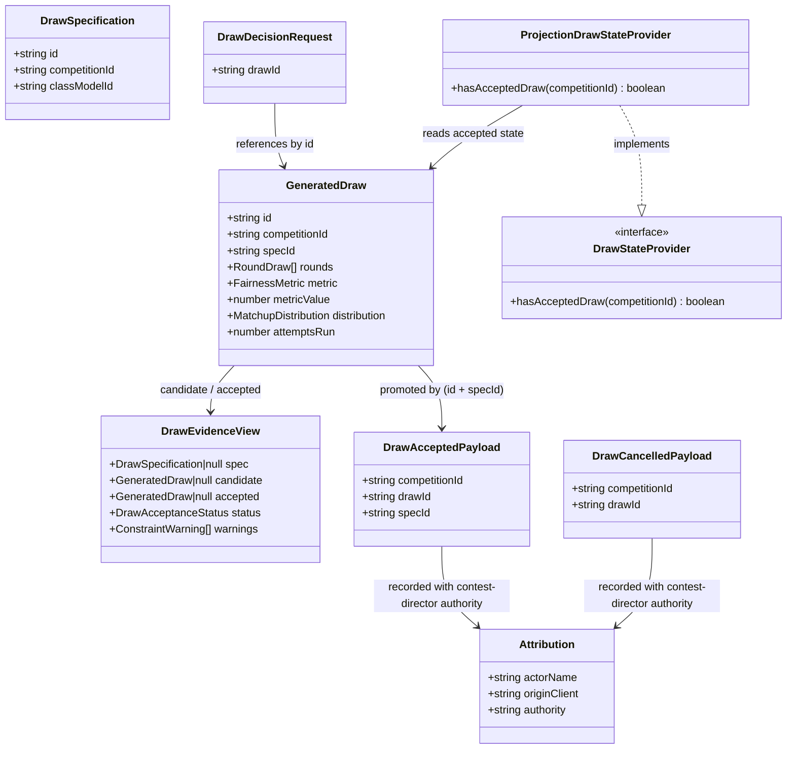

# STORY-001-017 — Draw Acceptance, Cancellation and Status

## Requirements

Implement the **acceptance layer** over the completed STORY-001-009 draw
generation: let the Contest Director **accept** the current generated candidate
as the competition's single authoritative **accepted draw**, **cancel** the
candidate so the competition has no accepted draw, and make the draw's
**acceptance status** readable — closing the Area 4.3 gap (Validate Draw →
accept / re-draw) that 009 deliberately deferred to "the Contest Director's
story".

- **Accept** the awaiting-decision candidate, committing it as the contest's
  one authoritative accepted draw, recorded with the acting person and
  **Contest Director** authority (D1: recorded, not enforced).
- **Cancel** the awaiting-decision candidate so the contest returns to a
  generatable no-draw state, likewise recorded.
- **Status**: expose a three-valued acceptance status (`no-draw` /
  `awaiting-decision` / `accepted`) plus the accepted draw itself on the
  existing draw read-model, so any client (STORY-001-018 UI) and every
  downstream capability (lanes 010, groups 011, reports 015, scoring) can tell
  where the draw stands and consume the accepted draw.
- **Activate the seam**: replace `NoAcceptedDrawProvider` with a real
  `DrawStateProvider` answering from the acceptance state — which turns on the
  previously-inert STORY-001-005 roster remove/replace gates **by design**.

Boundaries: this story does **not** re-implement generation or re-draw (009 is
reused unchanged — re-draw is simply re-running `generate` before acceptance);
does **not** build the companion screen (STORY-001-018); does **not** implement
re-draw *after* acceptance or pilot-retirement re-draw (Area 5.5, Future
Enhancement); does **not** enforce that only a CD may accept (no auth in MVP,
D1 — authority is the audit record, not an access gate).

Value: produces the accepted-draw fact and status that three already-specified
stories name as a prerequisite, unblocking the whole contest-setup chain, with
an auditable accept/re-draw decision as the trust model requires (D1/D4).

## Entities

Enums:
- `DrawAcceptanceStatus` = `"no-draw"` | `"awaiting-decision"` | `"accepted"`
  (AC2 — three distinguishable states; **no-draw** = no candidate generated,
  **awaiting-decision** = a candidate exists but is not accepted, **accepted** =
  a candidate has been committed).

**Conservative-design notes.** Reuse `GeneratedDraw`, `DrawSpecification`,
`Attribution`, `EventRecord`, `EventStore`, `DrawProjection`, `DrawService`,
`DomainError`/`ValidationError`, and the existing `DrawStateProvider` interface
**verbatim** — no refactor. The **only** change to an existing shared type is an
**additive** extension of `DrawEvidenceView` (new `accepted` and `status`
fields); `candidate`/`spec`/`warnings` are unchanged, so 009's callers keep
working. Do **not** alter `NoAcceptedDrawProvider` (it stays as the roster
tests' seam). Do **not** weaken the STORY-001-005 remove/replace gate design to
accommodate their newly-live state — activating them is this story's job.

## Approach

1. **Aggregate placement & module shape**
   - Acceptance is another **fact about the same per-competition draw**, not a
     new aggregate → two new `draw.*` events under `scope = competitionId`,
     following the 009 module template end-to-end (shared types + payload
     mappers → event types → service methods → pure projection branches →
     routes → error-handler branches). No new scope; the draw projection already
     drops on `competition.deleted`.

2. **Acceptance shape — id-referencing payload + resolved accepted entry**
   - The `draw.accepted` **payload carries only references** (`drawId`,
     `specId`, `competitionId`) — enough to bind the acceptance unambiguously to
     *which* candidate it promoted (self-describing replay, the 009
     "denormalised for audit" convention), without duplicating the large
     `GeneratedDraw` structure into a second event.
   - The **projection resolves** acceptance into a distinct `accepted` map by
     **promoting the current candidate**: on `draw.accepted`, look up the
     candidate for that scope and, when `candidate.id === payload.drawId`, store
     a deep copy in `accepted`. Downstream reads (AC3) then get the outcome
     directly without chasing the candidate map. This is pure promotion of a
     stored payload — deterministic, **no RNG, no re-materialisation** — so it
     honours the pure-loader contract (Safeguard 2 / Norm 5).

3. **Cancel semantics — discard the awaiting-decision candidate (AC4)**
   - AC4 is explicit: cancel targets *a generated candidate awaiting a decision,
     with no draw yet accepted* → "the candidate is discarded … generating
     again is possible". So `draw.cancelled` **removes the candidate** from the
     projection (deletes the `candidates` entry for the scope), returning the
     contest to `no-draw`/generatable. The spec is retained (re-generation is
     possible). Cancelling an *accepted* draw is **out of scope** (Future
     Enhancement).

4. **AC5 / cancel-with-no-candidate — first-class rejection**
   - `accept` with **no candidate** throws a domain error explaining there is no
     generated draw to accept; **nothing is appended**. `cancel` with **no
     candidate** is rejected **symmetrically** ("nothing to cancel") — the same
     error type with a context message. A `drawId` that no longer matches the
     current candidate (a superseding re-generate happened, AC6) is rejected as
     **superseded/stale** so a decision can never attach to the wrong candidate.

5. **Authority stamping — Contest Director, not organiser**
   - Every existing draw route hardcodes `authority: "organiser"`. Accept/cancel
     are Area 4.3 **CD** actions. Add a **CD-specific attribution builder**
     (`cdAttributionFromHeaders`, `authority: "contest-director"`) used **only**
     by the two new routes. Do **not** refactor the shared organiser helper (a
     wider change than this story needs). AC1/AC7 depend on this being correct,
     and it is silently wrong on a copy-paste, so an **explicit test asserts the
     recorded `authority`** on the appended events.

6. **Status computed in the service (projection stays pure)**
   - The three-valued `status` and the `accepted` reference are computed in
     `DrawService.getEvidence` from the projection's maps (accepted present →
     `accepted`; else candidate present → `awaiting-decision`; else `no-draw`).
     The projection remains a pure loader; the cross-map reasoning lives in the
     service (mirrors 009). No new read route — the existing
     `GET /api/competitions/:competitionId/draw` carries the new fields.

7. **Real DrawStateProvider — the one change that reaches outside the module**
   - Implement `ProjectionDrawStateProvider` reading the `DrawProjection`'s
     accepted state, wired as the `app.ts` default in place of
     `NoAcceptedDrawProvider`. Placed on the **draw side** and injected into the
     roster service via the existing `AppOptions` seam, so no roster→draw module
     cycle. This is the moment `hasAcceptedDraw` can return `true`, which
     **activates the STORY-001-005 remove/replace gates** — an **intended,
     asserted behaviour** of this story, not a side effect (RD4: the seat carries
     draw slots forward).

## Structure

### Type / interface relationships
1. `DrawAcceptanceStatus` is a new string-union type in
   `packages/shared/src/draw.ts`; `DrawEvidenceView` gains additive
   `accepted: GeneratedDraw | null` and `status: DrawAcceptanceStatus` fields.
2. New Zod request schema `drawDecisionRequestSchema` (`{ drawId: string }`) in
   the same file; `drawDecisionToPayload` helpers if needed (payloads are small
   reference objects, so a literal object is acceptable).
3. New event types in `packages/shared/src/events.ts`: `"draw.accepted"` and
   `"draw.cancelled"` added to the `DrawEventType` union with their
   reference-only payload types (`DrawAcceptedPayload`, `DrawCancelledPayload`).
4. New `DomainError` subclasses in `apps/base/src/draw/errors.ts`
   (`DrawCandidateNotFoundError`, `DrawCandidateSupersededError`).
5. `ProjectionDrawStateProvider` implements the existing
   `roster/state-providers.ts` `DrawStateProvider` interface — the interface is
   roster-owned, the implementation is draw-owned.

### Dependencies
1. `routes/draw.ts` → `DrawService` (new POST accept/cancel routes; attribution
   via a **new `cdAttributionFromHeaders`** with `authority: "contest-director"`).
2. `DrawService.accept` / `.cancel` depend on `EventStore` + `DrawProjection`
   (read current candidate, guard invariants, append event) — no new
   constructor deps.
3. `DrawProjection` gains an `accepted` map, `getAccepted` / `hasAccepted`
   accessors, and two new `apply` branches; drops the `accepted` entry on
   `competition.deleted` (extend the existing delete branch).
4. `ProjectionDrawStateProvider` depends on `DrawProjection`; injected into
   `RosterService` via `buildApp` (`options.drawStateProvider ?? new
   ProjectionDrawStateProvider(drawProjection)`).
5. `buildApp`'s `setErrorHandler` gains branches for the two new domain errors.

### Layered architecture (this stack)
1. **Shared types + Zod layer** (`packages/shared`): `DrawAcceptanceStatus`,
   the additive `DrawEvidenceView` fields, `drawDecisionRequestSchema`, the two
   event payload types. Structural validation only.
2. **Route layer** (`routes/draw.ts`): two new POST routes, CD attribution
   assembly, delegate to the service.
3. **Service layer** (`draw/service.ts`): `accept` / `cancel` invariant guards
   (candidate exists, id matches), event append; `getEvidence` extended to
   derive `status` + `accepted`.
4. **Projection layer** (`draw/projection.ts`): pure replay — promote candidate
   → accepted on `draw.accepted`, remove candidate on `draw.cancelled`.
5. **Provider layer** (`draw/draw-state-provider.ts`):
   `ProjectionDrawStateProvider` over the projection's accepted state.
6. **Error-mapping layer** (`app.ts setErrorHandler`): each new `DomainError`
   `code` → HTTP status (a missing branch surfaces as 500 — Safeguard 8).

## Operations

### Update shared types — `packages/shared/src/draw.ts`
1. Add `export type DrawAcceptanceStatus = "no-draw" | "awaiting-decision" |
   "accepted";` with a comment mapping each value to its AC2 meaning.
2. Extend `DrawEvidenceView` **additively**:
   - `accepted: GeneratedDraw | null` — the promoted outcome (AC3 downstream
     consumers read this), null until accepted.
   - `status: DrawAcceptanceStatus` — the three-valued state (AC2).
   - Keep `spec`, `candidate`, `warnings` unchanged.
3. Add `drawDecisionRequestSchema = z.object({ drawId: z.string().min(1,
   "A draw id is required to accept or cancel") });` and its inferred
   `DrawDecisionRequest` type. (Same schema for accept and cancel — both
   reference the candidate by id.)
4. No change to `generatedDrawToPayload` — reused when the projection copies the
   promoted candidate into the `accepted` map.

### Update events — `packages/shared/src/events.ts`
1. Extend the union:
   `export type DrawEventType = "draw.specSaved" | "draw.generated" |
   "draw.accepted" | "draw.cancelled";`
2. `export interface DrawAcceptedPayload { competitionId: string; drawId: string;
   specId: string; }` — reference-only (promotes the candidate; binds the
   acceptance to a specific `GeneratedDraw.id` for AC6).
3. `export interface DrawCancelledPayload { competitionId: string; drawId:
   string; }`.
4. Add both to `DrawEventPayload`; document that both file under
   `scope = competitionId` and that acceptance is a **promotion** fact (no new
   content), cancellation a **discard** fact.

### Update errors — `apps/base/src/draw/errors.ts`
1. `DrawCandidateNotFoundError` (`DRAW_CANDIDATE_NOT_FOUND`, **409**) — AC5 and
   cancel-with-no-candidate: there is no awaiting-decision candidate to accept or
   cancel. Carries a message stating a draw must be generated first; **nothing is
   appended** before it is thrown.
2. `DrawCandidateSupersededError` (`DRAW_CANDIDATE_SUPERSEDED`, **409**) — the
   supplied `drawId` does not match the current candidate (a re-generate
   superseded it, AC6). Protects the "decision binds to a specific candidate"
   invariant; message tells the client to re-read the draw and retry.
3. Each new class gets exactly one `setErrorHandler` branch in `app.ts`.

### Update projection — `apps/base/src/draw/projection.ts` (`DrawProjection`)
1. Add state: `private accepted = new Map<string, GeneratedDraw>();`.
2. `apply(record)` new branches:
   - `draw.accepted`: read `candidates.get(record.scope)`; if present **and**
     `candidate.id === payload.drawId`, `accepted.set(record.scope,
     copyDraw(candidate))`. Pure promotion of the already-stored outcome — **no
     RNG, no re-materialisation**. (A mismatched/absent candidate leaves accepted
     unset; the service guards this before appending, so replay of a
     well-formed log always finds the candidate.)
   - `draw.cancelled`: `candidates.delete(record.scope)` (AC4 — discard the
     awaiting-decision candidate; the spec is retained so re-generation is
     possible). `accepted` is untouched (cancel targets an *unaccepted*
     candidate by AC4).
3. Extend the `competition.deleted` branch to also `accepted.delete(...)`.
4. `rebuild(events)`: reset `accepted = new Map()` alongside `specs`/`candidates`.
5. Add accessors: `getAccepted(competitionId): GeneratedDraw | undefined`
   (deep copy via `copyDraw`) and `hasAccepted(competitionId): boolean`.

### Implement service — `apps/base/src/draw/service.ts` (`DrawService`)
1. `getEvidence` — extend the returned view:
   - `const accepted = this.projection.getAccepted(competitionId) ?? null;`
   - Derive `status`: `accepted ? "accepted" : candidate ? "awaiting-decision"
     : "no-draw"`.
   - Return `{ spec, candidate, accepted, status, warnings }`.
2. `accept(competitionId, drawId, attribution): DrawEvidenceView`
   - Resolve competition (404 idiom if absent).
   - `const candidate = this.projection.getCandidate(competitionId);`
   - If `!candidate` → throw `DrawCandidateNotFoundError` (AC5) — **append
     nothing**.
   - If `candidate.id !== drawId` → throw `DrawCandidateSupersededError` (AC6
     binding).
   - Append `draw.accepted` with payload `{ competitionId, drawId: candidate.id,
     specId: candidate.specId }` under the passed **CD attribution**;
     `projection.apply(record)`; return `getEvidence(competitionId)`.
3. `cancel(competitionId, drawId, attribution): DrawEvidenceView`
   - Resolve competition.
   - `const candidate = this.projection.getCandidate(competitionId);`
   - If `!candidate` → throw `DrawCandidateNotFoundError` ("nothing to cancel",
     symmetric with AC5).
   - If `candidate.id !== drawId` → throw `DrawCandidateSupersededError`.
   - Append `draw.cancelled` with `{ competitionId, drawId: candidate.id }`
     under CD attribution; `projection.apply(record)`; return
     `getEvidence(competitionId)`.
4. No new constructor dependencies (uses the existing `eventStore` +
   `projection`).

### Create provider — `apps/base/src/draw/draw-state-provider.ts`
1. `export class ProjectionDrawStateProvider implements DrawStateProvider`
   (imports the interface from `../roster/state-providers.js`).
2. Constructor: `(private readonly projection: DrawProjection)`.
3. `hasAcceptedDraw(competitionId): boolean` → `this.projection
   .hasAccepted(competitionId)`. Read-only, honours the interface contract
   ("exists" means **accepted**, not merely generated).

### Update routes — `apps/base/src/routes/draw.ts`
1. Add `cdAttributionFromHeaders(headers)` — identical to
   `attributionFromHeaders` but `authority: "contest-director"`. Do **not**
   change the existing organiser helper.
2. `POST /api/competitions/:competitionId/draw/accept` — parse body with
   `drawDecisionRequestSchema`, build CD attribution, call
   `drawService.accept(competitionId, drawId, attribution)`; returns the updated
   `DrawEvidenceView`.
3. `POST /api/competitions/:competitionId/draw/cancel` — same shape, calls
   `drawService.cancel(...)`; returns the updated `DrawEvidenceView`.

### Wire in `apps/base/src/app.ts`
1. `drawProjection` is already constructed **before** `rosterService`
   (line ~131 vs ~169) — no reordering needed.
2. Change the roster wiring default from `new NoAcceptedDrawProvider()` to
   `new ProjectionDrawStateProvider(drawProjection)` (keep the
   `options.drawStateProvider ?? …` override seam intact so tests can still
   inject `NoAcceptedDrawProvider`).
3. Add `setErrorHandler` branches:
   `DrawCandidateNotFoundError` → 409; `DrawCandidateSupersededError` → 409.
4. Update the `app.ts` seam comment (currently says the default stays
   `NoAcceptedDrawProvider` per 009 Decision #3) to record that STORY-001-017
   now supplies the real provider.

### Tests (Vitest, alongside the modules)
1. **AC1** accept: generate → accept the candidate id → view `status` becomes
   `accepted`, `accepted` equals the candidate; assert a `draw.accepted` event
   exists **with `attribution.authority === "contest-director"`** and the acting
   `actorName`.
2. **AC2** status: assert the three states across the lifecycle — no spec/no
   candidate → `no-draw`; after generate → `awaiting-decision`; after accept →
   `accepted`.
3. **AC3** downstream availability: before accept, `getEvidence.accepted` is null
   and `ProjectionDrawStateProvider.hasAcceptedDraw` is false; after accept both
   reflect the accepted draw.
4. **AC4** cancel: generate → cancel → `status` back to `no-draw`, no accepted
   draw, a `draw.cancelled` event recorded with the actor, and generate succeeds
   again.
5. **AC5** accept with no candidate → `DrawCandidateNotFoundError` (409),
   **nothing appended** (assert event count unchanged). Symmetric: cancel with no
   candidate → `DrawCandidateNotFoundError`.
6. **AC6** re-draw before acceptance: generate (id A) → generate (id B) →
   accepting id A → `DrawCandidateSupersededError`; accepting id B succeeds and
   no accepted state references A.
7. **AC7** auditability: after accept, `readAll()` contains the `draw.accepted`
   (and any prior `draw.cancelled`) with `actor_name` and `authority` columns.
8. **Determinism / purity**: generate → accept → `readAll()` → fresh
   `DrawProjection.rebuild` → `accepted` and `candidate` state identical
   (no re-randomisation, no re-materialisation on replay).
9. **Roster-gate activation (first-class)**: with the **real**
   `ProjectionDrawStateProvider` and an accepted draw, `RosterService.remove`
   throws `RosterRemoveRequiresReplacementError` and `replace` (without
   `confirmDrawAffected`) throws `RosterReplaceNeedsConfirmationError`; with only
   a generated-but-unaccepted candidate, both remove and replace still succeed
   (generation ≠ acceptance). Do **not** weaken the 005 gates to make this pass.
10. **Error mapping**: assert the accept-no-candidate path returns HTTP **409**,
    not 500 (the new `setErrorHandler` branch is present).

## Norms

1. **Module layout**: extend the existing draw triad in place —
   `apps/base/src/draw/{projection,service,errors}.ts`, new
   `draw/draw-state-provider.ts`, `routes/draw.ts`, shared types in
   `packages/shared/src/draw.ts`, events in the shared `events.ts`. No new
   aggregate, no new scope.
2. **Validation split**: structural (`drawId` presence) in the Zod schema;
   the "candidate exists / id matches" invariants in the service. Use the
   existing `parseOrThrow` → `ValidationError` idiom.
3. **Error handling** (this stack, not Spring):
   - Every domain error extends `DomainError` with a stable `readonly code`.
   - Every new code gets exactly one `setErrorHandler` branch → HTTP status; the
     fallback `DomainError` branch returns 500, so an unmapped error is a bug
     (Safeguard 8).
4. **Event payloads**: `draw.accepted` / `draw.cancelled` carry **references**
   (`drawId`, `specId`) — acceptance is a *promotion* fact, not a re-copy of the
   outcome. Filed under `scope = competitionId`. Supersede/append, never mutate.
5. **Determinism / pure loader**: the new projection branches are pure promotion
   (copy the stored candidate) / discard — **no RNG, no re-materialisation**. Any
   randomness or derivation in `apply`/`rebuild` is a defect (D4).
6. **Acceptance binds to a candidate id (AC6)**: accept/cancel reference the
   current `GeneratedDraw.id`; a mismatch is rejected, so a decision can never
   attach to a superseded candidate.
7. **Authority stamping**: accept/cancel stamp `authority: "contest-director"`
   via a dedicated `cdAttributionFromHeaders` — a deliberate, story-scoped
   divergence from the app-wide `"organiser"` default. Recorded, **not enforced**
   (D1). An explicit test asserts the recorded authority.
8. **Seam honesty**: the real `DrawStateProvider` answers **only** from the
   *accepted* state (never mere candidate existence) — the exact 009/005
   contract. `NoAcceptedDrawProvider` remains the roster tests' seam.
9. **Style**: TypeScript, ~80-col comments matching neighbouring modules;
   explain *why* (rule/decision reference), not *what*.

## Safeguards

1. **Functional**: `accept` requires an awaiting-decision candidate whose id
   matches (else AC5 `DrawCandidateNotFoundError` / AC6
   `DrawCandidateSupersededError`); `cancel` discards that candidate and returns
   the contest to `no-draw`/generatable (AC4); `status` is exactly one of
   `no-draw` / `awaiting-decision` / `accepted` (AC2). Accept, cancel and the two
   rejection paths are distinct.
2. **Determinism (critical)**: a projection rebuild from the log MUST reproduce
   identical `accepted` + `candidate` state. No RNG, seed-recompute, or
   re-materialisation in `apply`/`rebuild`. Enforced by the rebuild-equivalence
   test.
3. **Single unambiguous accepted draw (NFR)**: the projection's `accepted` map is
   single-valued per competition; downstream consumers never see two competing
   accepted draws. Acceptance references one specific candidate id.
4. **Supersede / AC6 binding**: a re-generate before acceptance supersedes the
   candidate (009 Decision #7); accept/cancel reference the current id, so no
   stale decision attaches to a superseded attempt.
5. **Seam activation is intended**: the real `ProjectionDrawStateProvider` flips
   `hasAcceptedDraw` to `true` once a draw is accepted, activating the
   STORY-001-005 remove/replace gates (RD4). This is an **asserted behaviour** of
   this story (test 9), not a regression to suppress; the 005 gate design is
   **not weakened**.
6. **Authority audit (AC1/AC7)**: `draw.accepted` / `draw.cancelled` record the
   acting person and `authority: "contest-director"`. A wrong authority (e.g.
   copy-pasting the organiser helper) is a silent AC1/AC7 failure — guarded by an
   explicit authority assertion.
7. **Error mapping completeness**: `DrawCandidateNotFoundError` and
   `DrawCandidateSupersededError` each have a `setErrorHandler` branch (409);
   AC5's no-candidate path must return **4xx, not 500**. Messages must not leak
   internals.
8. **No module cycle**: `ProjectionDrawStateProvider` lives on the draw side and
   is injected into the roster service via `AppOptions`; the roster module never
   imports the draw module (the interface is roster-owned, the implementation is
   not).
9. **Offline-first (D6)**: accept, cancel and status operate entirely on the base
   with no internet — no external calls introduced.
10. **Scope discipline**: no re-implementation of generation/re-draw (009
    reused), no companion screen (018), **no re-draw after acceptance** and no
    pilot-retirement re-draw (Area 5.5, Future Enhancement), no authorisation
    enforcement (D1).

## Open decisions (flag before/at implementation)

1. **Generate-after-accept guard (recommend: none in MVP).** "One-time" means no
   *re-draw after* acceptance, not a single lifetime accept — accept is
   permitted whenever a candidate awaits a decision (e.g. cancel → generate →
   accept is a valid cycle). Re-draw *after* acceptance is Scope-Out (Area 5.5).
   Recommendation: do **not** add an active guard blocking `generate` when an
   accepted draw exists (it is out of scope and won't be exercised by 018);
   revisit only if a consumer needs it. Confirm this interpretation.
2. **Downstream access shape for 010/011/015.** This story exposes the accepted
   draw on `DrawEvidenceView.accepted` **and** via
   `DrawProjection.getAccepted` / `ProjectionDrawStateProvider`. The unbuilt
   downstream stories may prefer a dedicated accessor; kept minimal here to avoid
   over-designing for unbuilt consumers.
