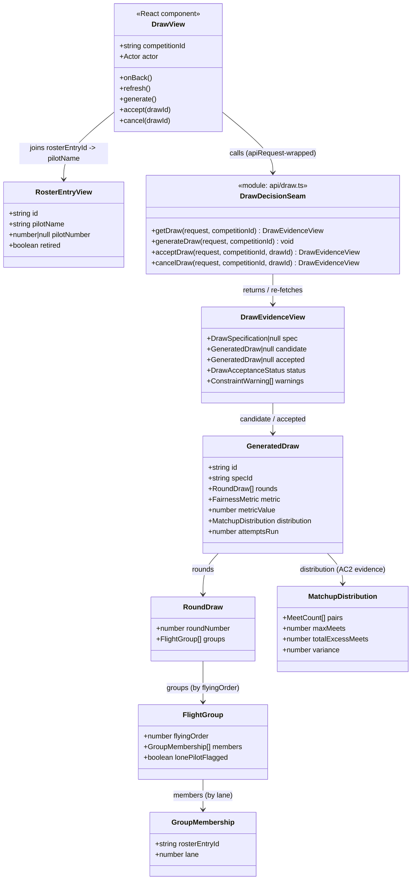

# STORY-001-018 — Companion-App Draw Workflow Screen

## Requirements

Give the Organiser / Contest Director one companion-app surface — a
competition-scoped **draw console** — to generate the contest draw, review it
and its fairness evidence, and take one of three decisions on the displayed
candidate: **accept**, **regenerate**, or **cancel**. The screen contributes
**no backend**; it is a stateless React view over the already-built
STORY-001-009 generation backend and the STORY-001-017 acceptance backend
(concrete contract below). It renders the draw's rounds → groups → lane-ordered
pilots (names joined from the roster, since the draw stores only
`rosterEntryId`s), presents the matchup distribution and fairness metric, and
surfaces generation failure clearly. Every mutating action carries the
name-pick actor identity and client id; the base stamps authority server-side
(D1/D4).

**Boundaries.** No backend routes, no persisted state, no draw-spec editing
(that is Scope Out — STORY-001-009's specification surface, and no companion
spec-editor exists yet), no lane reassignment (010), no group management (011),
no draw reports (015), no role authorisation (MVP, companion-app §1). The
accept/cancel/status **behaviour** is 017's; this screen only *drives* those
endpoints and *renders* the returned view.

**Concrete STORY-001-017 backend contract this screen builds against (do NOT
re-invent it):**
- **Read** — `GET /api/competitions/:competitionId/draw` → `DrawEvidenceView`
  `{ spec, candidate, accepted, status, warnings }`, where
  `status` ∈ `"no-draw" | "awaiting-decision" | "accepted"`, and
  `candidate` / `accepted` are `GeneratedDraw | null`.
- **Generate / regenerate** — `POST /api/competitions/:competitionId/draw/generate`
  (STORY-001-009, existing). Regenerate is the *same* call again; the projection
  replaces the single candidate.
- **Accept** — `POST /api/competitions/:competitionId/draw/accept`, body
  `{ drawId }` (= `candidate.id`). Returns the updated `DrawEvidenceView`.
- **Cancel** — `POST /api/competitions/:competitionId/draw/cancel`, body
  `{ drawId }`. Returns the updated `DrawEvidenceView`.
- **Error codes (HTTP 409)** to branch on: `DRAW_CANDIDATE_NOT_FOUND`,
  `DRAW_CANDIDATE_SUPERSEDED` (accept/cancel); plus `DRAW_SPEC_NOT_FOUND`
  (from generate, 009).
- Accept/cancel are stamped `authority: "contest-director"` **server-side**; the
  client still sends its `X-Actor-Name` / `X-Client-Id` via `apiRequest` as
  usual — it does not choose or send an authority.

## Entities

**Conservative-design notes.** Reuse `DrawEvidenceView`, `GeneratedDraw`,
`RoundDraw`, `FlightGroup`, `GroupMembership`, `MatchupDistribution`,
`MeetCount`, `ConstraintWarning`, `DrawSpecification`, `RosterEntryView`,
`FairnessMetric`, `Actor`, `apiRequest`, `ApiError` **verbatim** from
`@soarscore/shared` and the existing companion modules — this story adds **no
new shared type and no new backend type**. `DrawEvidenceView.accepted` and
`.status` come from STORY-001-017's additive extension; consume them
name-for-name. The only new artefacts are companion-app UI files (a view, a
thin API seam module, a name-join helper) and one CSS-reusing render.

**Missing prerequisite (do not build here).** `GET .../draw` returns
`spec: null` until a draw specification is saved (via the base's existing
`PUT .../draw/spec`), and **no companion screen creates or edits a draw spec**
today (spec-editing is Scope Out). So on a fresh competition, `spec === null`
and calling generate returns **`DRAW_SPEC_NOT_FOUND`**. This canvas handles both
gracefully (guidance state + alert) and flags the missing draw-spec-editor story
— it does **not** invent a spec form.

## Approach

1. **Screen placement — competition-scoped, hosted by `CompetitionLibrary`
   (RosterView idiom, not top-level nav).**
   - Add a `DrawView` component with the exact RosterView signature
     `{ competitionId, actor, onBack }`. Reach it from `CompetitionLibrary` via
     the same client-side `openId` selection that opens `RosterView` — introduce
     a small `openView: "roster" | "draw" | null` (or a second id-state) so a
     "Draw" row-action opens the console alongside "Open" (roster). **Not** an
     `App.tsx` top-level `Screen` — the draw is per-competition and needs
     `competitionId` in scope. Rationale: idiom parity, no new navigation
     concept, keeps the stateless-client model (open is a client-side selection
     only, D8).

2. **Data flow — stateless, base-authoritative (AC8).**
   - `refresh()` fires `GET .../draw` (evidence) and `GET .../roster` (name
     join) in parallel via `Promise.all`, exactly the RosterView idiom. Render
     **only** from the fetched read-model — no client-held draw truth, so a
     replacement client shows the same status (AC8 is satisfied by construction).
   - `generate()` = `POST .../draw/generate` then `refresh()`. **Regenerate** is
     the identical call (AC5 — projection overwrites the one candidate). `accept`
     / `cancel` = the 017 endpoints (body `{ drawId: candidate.id }`) then
     `refresh()`. After every mutation, re-fetch — never patch local state.

3. **The accept/cancel/status seam (isolate 017 coupling).**
   - Put the four calls behind a thin, clearly-marked module
     `apps/companion/src/draw/api.ts` (`getDraw`, `generateDraw`, `acceptDraw`,
     `cancelDraw`), each taking the `request` callback. The **pure-UI half**
     (generate / display / fairness / failure — AC1, AC2, AC7) depends only on
     `getDraw` + `generateDraw` (STORY-001-009, already deployed) and ships even
     if 017's routes are not yet live. `acceptDraw` / `cancelDraw` and any
     `status`/`accepted` rendering are the 017-coupled seam: localised to this
     module + the decision controls, finalised against the contract above.
   - **Graceful degradation without 017 routes:** treat `status` as optional in
     the render layer — if the fetched view lacks `status`/`accepted` (009-only
     base), fall back to `candidate ? "awaiting-decision" : "no-draw"` and hide
     Accept/Cancel behind that derived state. This lets AC1/AC2/AC7 run today and
     lights up AC3/AC6/AC8 the moment 017 is deployed, with no UI rework.

4. **Name resolution — client-side roster join (RD4, zero backend change).**
   - Build a `Map<rosterEntryId, RosterEntryView>` from the fetched roster and
     resolve every `GroupMembership.rosterEntryId` and every `MeetCount.a/b` to
     `pilotName` (+ `pilotNumber`). Key on **entry id, not pilot id** — a
     post-draw replacement inherits the seat (RD4). An id with **no** roster
     match degrades to a visible placeholder (e.g. `⟨entry …⟩`) rather than
     crashing (roster and draw are fetched independently and the roster is
     mutable).

5. **Failure handling (AC7) and 017 rejection branches — `ApiError.code`.**
   - Catch `ApiError`; branch on `error.response.code`:
     - `DRAW_GENERATION_FAILED` → `role="alert"` with `message`, keep Generate
       available, render no candidate.
     - `DRAW_SPEC_NOT_FOUND` → a **clear guidance alert** ("No draw
       specification has been configured for this competition yet — a draw
       cannot be generated until one exists"), **not** a crash; note the missing
       spec-editor prerequisite in a code comment. Do not offer a spec form.
     - `DRAW_CANDIDATE_NOT_FOUND` / `DRAW_CANDIDATE_SUPERSEDED` (accept/cancel,
       409) → the candidate changed under the operator (a concurrent client
       re-generated or cleared it); show the `message` in an alert **and
       `refresh()`** so the screen re-syncs to the base's current state, then
       let the operator re-decide. This is the last-action-wins reconciliation
       (companion-app §2).
   - Any non-`ApiError` rethrows (RosterView idiom).

6. **Rendering & reuse — no new design system.**
   - Reuse existing CSS classes verbatim: `toolbar`, `btn` / `btn-primary` /
     `btn-small` / `btn-danger`, `data-table` / `table-wrap`, `badge`,
     `status-text`, `field-error`, `dialog-backdrop` / `dialog` (role="dialog"
     for the cancel confirmation), `form-actions`. Render rounds as sections,
     each with a `data-table` of groups → lane-ordered pilot rows; annotate a
     `lonePilotFlagged` group with a `badge`. Fairness evidence: a metric header
     (`metric` + `metricValue`), the scalar summary (`maxMeets`,
     `totalExcessMeets`, `variance`, `attemptsRun`), and a `data-table` of
     matchup pairs with names substituted. `warnings[]` rendered as
     `role="alert"` non-blocking notices above the candidate.

7. **Pending / disabled states (double-fire guard).**
   - Generation runs `ATTEMPTS = 200` synchronously on the base; disable
     Generate/Regenerate/Accept/Cancel while a call is in flight (a `busy`
     flag), mirroring RosterView's in-flight button discipline, and show a
     `status-text` "Generating…". Disable actions the current `status` makes
     invalid (Accept/Cancel hidden unless `awaiting-decision`; Regenerate/Cancel
     hidden once `accepted`).

## Structure

### Type / interface relationships
1. No new shared types. Import `DrawEvidenceView`, `GeneratedDraw`, `RoundDraw`,
   `FlightGroup`, `GroupMembership`, `MatchupDistribution`, `MeetCount`,
   `ConstraintWarning`, `RosterEntryView`, `FairnessMetric` from
   `@soarscore/shared`; `Actor` from `../identity/useActor.js`; `apiRequest`,
   `ApiError` from `../api/client.js`.
2. `DrawAcceptanceStatus` (`"no-draw" | "awaiting-decision" | "accepted"`) is a
   STORY-001-017 shared type; import it if exported, else derive the render
   status defensively (Approach 3).

### Dependencies
1. `CompetitionLibrary` → `DrawView` (new competition-scoped child, opened via
   the `openId`/`openView` client-side selection — no `App.tsx` change).
2. `DrawView` → `draw/api.ts` seam → `apiRequest` (with actor headers) → base.
3. `DrawView` → a `nameFor(rosterEntryId)` helper backed by a roster map built
   from `GET .../roster`.
4. `DrawView` reuses `styles.css` classes only; no new stylesheet.

### Layered architecture (companion SPA, not Spring)
1. **Navigation layer** (`CompetitionLibrary.tsx`): host `DrawView` via the
   existing client-side open-selection; add the "Draw" entry-point action.
2. **View layer** (`draw/DrawView.tsx`): `{ competitionId, actor, onBack }`;
   owns `refresh()`, the `busy`/error UI state, generate/accept/cancel handlers,
   the roster-join map, and all rendering (candidate, fairness, warnings,
   accepted status, empty/guidance states).
3. **API-seam layer** (`draw/api.ts`): the four `request`-wrapping functions;
   the single place the 017 endpoint paths/bodies live (isolated coupling).
4. **Error-branching layer** (inside handlers): `ApiError.code` → alert /
   guidance / refresh-and-retry; non-`ApiError` rethrown.
5. **Shared/base contract layer** (unchanged): `@soarscore/shared` types and the
   009/017 routes — this story adds nothing here.

## Operations

### Create API seam — `apps/companion/src/draw/api.ts`
1. Responsibility: the only module that knows the draw endpoint paths and the
   017 accept/cancel bodies — the isolation seam.
2. Signatures (each takes a `request` = the `apiRequest`-wrapping callback):
   - `getDraw(request, competitionId): Promise<DrawEvidenceView>` →
     `request<DrawEvidenceView>(\`/api/competitions/${competitionId}/draw\`)`.
   - `generateDraw(request, competitionId): Promise<void>` →
     `request(\`/api/competitions/${competitionId}/draw/generate\`, "POST")`.
   - `acceptDraw(request, competitionId, drawId): Promise<DrawEvidenceView>` →
     `request<DrawEvidenceView>(\`…/draw/accept\`, "POST", { drawId })`.
   - `cancelDraw(request, competitionId, drawId): Promise<DrawEvidenceView>` →
     `request<DrawEvidenceView>(\`…/draw/cancel\`, "POST", { drawId })`.
3. Comment block: mark `acceptDraw`/`cancelDraw` as the STORY-001-017 seam;
   `getDraw`/`generateDraw` as the STORY-001-009 half that ships independently.

### Create name-join helper — inside `DrawView` (or `draw/roster-map.ts`)
1. `buildRosterMap(entries: RosterEntryView[]): Map<string, RosterEntryView>`
   keyed on `entry.id`.
2. `nameFor(map, rosterEntryId): { label: string; number: number | null }` —
   returns `pilotName` (+ `pilotNumber`) or a `⟨entry ${id.slice(0,8)}⟩`
   placeholder when unmatched (edge case: draw/roster drift). Never throws.

### Create view — `apps/companion/src/draw/DrawView.tsx`
1. Responsibility: the competition-scoped draw console — generate, display,
   fairness review, and the accept/regenerate/cancel decision, all from
   base-fetched state.
2. State:
   - `evidence: DrawEvidenceView | null`, `roster: RosterEntryView[]`,
     `competition: Competition | null`.
   - `loading: boolean` (initial guard), `busy: boolean` (in-flight guard),
     `alert: string | null` (top-level failure/guidance),
     `cancelPending: boolean` (drives the `role="dialog"` confirmation).
3. `request` callback: identical to RosterView —
   `apiRequest<T>(path, { method, body, actorName, clientId: actor.clientId })`,
   `actorName = actor.actorName ?? "unknown"`.
4. `refresh()` (AC8 — re-fetch all base state):
   - `setLoading(true)`; `Promise.all([ getDraw(request, competitionId),
     request<RosterEntryView[]>(\`…/roster\`), request<Competition>(\`…/${id}\`) ])`;
     set `evidence`, `roster`, `competition`; `finally setLoading(false)`.
   - `useEffect(() => { refresh(); }, [refresh])` on mount.
5. `handleGenerate()` / `handleRegenerate()` (same body):
   - `setBusy(true)`, `setAlert(null)`; `await generateDraw(request, competitionId)`;
     `await refresh()`. Catch `ApiError`: on `DRAW_SPEC_NOT_FOUND` set the
     guidance alert; on `DRAW_GENERATION_FAILED` (and any 009 spec/bound code)
     set `alert = message`; else rethrow non-`ApiError`. `finally setBusy(false)`.
6. `handleAccept()`:
   - Requires `evidence.candidate`; `setBusy(true)`;
     `const next = await acceptDraw(request, competitionId, candidate.id)`;
     `setEvidence(next)` then `await refresh()` (canonical re-sync). Catch
     `ApiError`: `DRAW_CANDIDATE_NOT_FOUND` / `DRAW_CANDIDATE_SUPERSEDED` → set
     alert + `refresh()`; else `alert = message`. `finally setBusy(false)`.
7. `handleCancel()`: opens the `role="dialog"` confirmation; on confirm, mirror
   `handleAccept` against `cancelDraw`. Post-cancel the view returns to
   `no-draw`; render the Generate call-to-action.
8. Render:
   - `if (loading || !competition) return 
Loading…
`.
   - Toolbar with `← Competitions` (`onBack`) and title `Draw — {competition.name}`.
   - `alert` (if any) as `role="alert" className="field-error"`.
   - Derive `status` (Approach 3 fallback). Branch:
     - `spec === null` → guidance `status-text`: "No draw specification
       configured yet — configure the draw before generating." (Generate
       disabled; note the missing prerequisite in a comment.)
     - `status === "no-draw"` (spec present, no candidate) → Generate CTA.
     - `awaiting-decision` → render `candidate` (rounds/groups/lanes + names),
       fairness evidence, `warnings`, and the **Accept / Regenerate / Cancel**
       controls.
     - `accepted` → render `accepted` draw with an "Accepted" `badge`; offer no
       Cancel/Regenerate (re-draw after acceptance is Scope Out); a `status-text`
       notes downstream work (lanes/groups/reports) can now use this draw (AC4
       is only *observably* the accepted status here — see Safeguards).
9. Constraints: no local persistence of the candidate; disable all action
   buttons while `busy`.

### Update navigation — `apps/companion/src/competitions/CompetitionLibrary.tsx`
1. Add a client-side open-selection for the draw console alongside the existing
   roster `openId` (e.g. `openView: { id: string; view: "roster" | "draw" }`),
   preserving the D8 "open is client-side only" comment.
2. Add a `Draw` row-action button (like `Open`) that selects the draw view; when
   selected, render `<DrawView competitionId={id} actor={actor}
   onBack={() => setOpenView(null)} />`. Do **not** touch `App.tsx`.

## Norms

1. **Component idiom**: mirror `RosterView` exactly — a `{ competitionId, actor,
   onBack }` component, a `useCallback` `request` wrapping `apiRequest` with
   `actorName`/`clientId`, a `useCallback` `refresh()` re-fetching all base
   state, `useEffect(refresh)` on mount, a `loading` guard returning
   `status-text`. No new state-management library, no router.
2. **Statelessness (D8/AC8)**: the screen holds **no** draw truth; every render
   derives from the last `getDraw` fetch, and every mutation is followed by
   `refresh()`. Never patch `evidence` locally as the source of truth (a returned
   view may be shown transiently, but `refresh()` re-canonicalises).
3. **Attribution**: all four calls go through `apiRequest`, which stamps
   `X-Actor-Name` / `X-Client-Id`. The client **never** sends an authority —
   the base stamps `contest-director` on accept/cancel server-side (017). Do not
   add an authority header or field.
4. **Error handling** (SPA, not Spring): catch `ApiError`, branch on
   `error.response.code`, surface `error.response.message` in `role="alert"`;
   rethrow anything that is not an `ApiError`. Confirmations use
   `role="dialog"` inside `dialog-backdrop`/`dialog`.
5. **Seam discipline**: the 017-coupled calls (`acceptDraw`, `cancelDraw`) and
   the `status`/`accepted` rendering live behind the `draw/api.ts` module and a
   derived-status fallback, so the 009-only half compiles and runs without them.
6. **Name join keys on entry id** (RD4): resolve `rosterEntryId → RosterEntryView`
   by `entry.id`, never `pilotId`; unmatched ids degrade to a placeholder.
7. **CSS reuse**: only existing `styles.css` classes (`toolbar`, `btn*`,
   `data-table`, `table-wrap`, `badge`, `status-text`, `field-error`,
   `dialog*`, `form-actions`). No new stylesheet, no external assets
   (offline-first, D6).
8. **Style**: TypeScript + React function components, `.js` import specifiers
   (NodeNext), ~80-col comments explaining *why* (rule/decision/AC reference),
   matching neighbouring companion modules.

## Safeguards

1. **Functional**: Generate shows rounds → groups → lane-ordered pilots with
   names (AC1); fairness distribution + metric are on-screen (AC2); Accept →
   `status: "accepted"` + `accepted` draw rendered (AC3); Regenerate replaces the
   candidate with a fresh one + its own evidence (AC5); Cancel returns to
   `no-draw` and offers Generate again (AC6); generation failure shows a clear
   reason and no acceptable/stored draw (AC7); a fresh client renders the current
   status from the base (AC8). Each action has one observable terminal state.
2. **Generate ≠ Accept**: a generated candidate is never presented as *the*
   contest draw — only `status === "accepted"` renders the accepted-draw
   treatment. AC7 failure leaves nothing acceptable.
3. **Stateless recovery (D8/AC8)**: no client-held candidate; `refresh()` on
   mount and after every mutation is the sole source of truth. A replaced laptop
   shows the same `status`/`accepted` because it re-fetches.
4. **Missing-spec prerequisite (AC1 gap)**: `spec === null` renders a guidance
   state and Generate is disabled/handled; a stray generate returning
   `DRAW_SPEC_NOT_FOUND` shows a clear message, **never a crash**. This screen
   does **not** create or edit a draw spec — that is a flagged missing
   prerequisite story (a draw-spec editor over the base's existing
   `PUT .../draw/spec`), not absorbed here.
5. **017 coupling isolated**: accept/cancel/status behaviour is 017's; the seam
   (`draw/api.ts` + derived-status fallback) lets AC1/AC2/AC7 ship and be tested
   against the deployed 009 backend today, and lights up AC3/AC6/AC8 when 017 is
   deployed without UI rework. The client builds strictly to the 017 contract in
   Requirements — it invents no path, verb, body, or field.
6. **AC4 honesty (downstream unlock)**: lane adjustment (010), group management
   (011) and reports (015) are separate unbuilt stories, so AC4 is **not fully
   observable on this screen alone**. This screen verifies AC4 only as "the
   accepted-draw fact/status is now present" (rendered accepted state); the
   actual downstream consumption is those stories' to demonstrate. State this in
   the accepted-state UI copy; do not claim more.
7. **Concurrency (companion-app §2, last-action-wins)**: a 409
   `DRAW_CANDIDATE_NOT_FOUND` / `DRAW_CANDIDATE_SUPERSEDED` on accept/cancel is
   reconciled by alert + `refresh()`, never by forcing the stale decision. Live
   streaming is out of MVP scope — refresh-on-action is acceptable.
8. **Edge cases**: unmatched `rosterEntryId` → placeholder, no crash;
   `lonePilotFlagged` group visibly badged so the CD sees the singleton before
   accepting; `busy` disables all actions to prevent double-fire during the
   synchronous 200-attempt generation; actions invalid for the current `status`
   are hidden/disabled.
9. **Offline-first (D6) / no new assets**: no external fonts, scripts, images, or
   network beyond the base; reuses existing CSS only.
10. **Scope discipline**: no backend, no shared-type change, no draw-spec editor,
    no lane/group/report UI, no authorisation enforcement, no re-draw after
    acceptance. UI-only over the 009 + 017 contracts.

## Open decisions (flag before/at implementation)

1. **Sequencing vs. 017 deployment.** The pure-UI half (AC1/AC2/AC7) is
   buildable and testable now against the deployed 009 backend; AC3/AC6/AC8 need
   017's routes live. Recommendation: build behind the seam now; verify the
   accept/cancel/accepted-status path once 017 is deployed. Confirm whether to
   merge the 009-half first or hold until 017 lands.
2. **Missing draw-spec-editor prerequisite.** AC1's "a valid draw specification
   exists" has no companion UI. Recommendation: raise a small prerequisite story
   (draw-spec editor over `PUT .../draw/spec`); until then this screen shows the
   guidance state. Confirm the owner is content shipping the console with that
   guidance rather than blocking on the spec editor.
3. **`DrawAcceptanceStatus` import vs. defensive derive.** If 017 exports the
   union from `@soarscore/shared`, import it; otherwise derive render-status from
   `accepted`/`candidate`. Recommendation: import if available, keep the derive
   as the 009-only fallback. Confirm 017's export surface.
4. **Entry-point label / placement in `CompetitionLibrary`.** A second row-action
   ("Draw") beside "Open" (roster). Recommendation: mirror the roster action;
   confirm the label and whether both should share one client-side open-selection
   enum.
