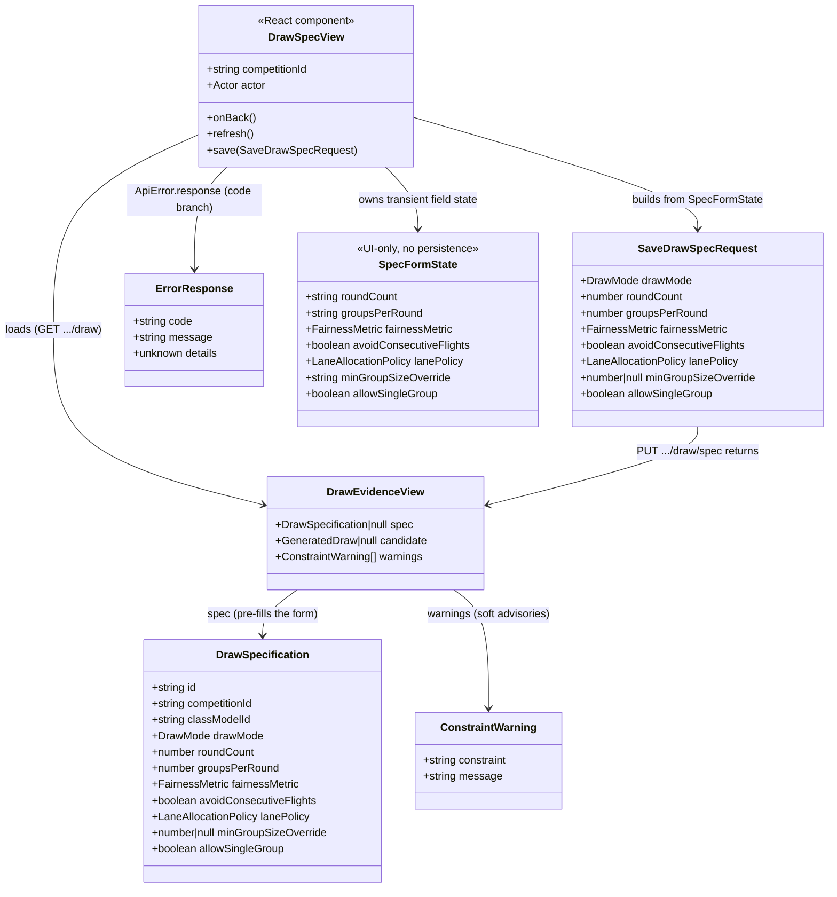

# STORY-001-019 — Companion-App Draw Specification Editor

## Requirements

Give the Organiser one competition-scoped companion-app surface — a **draw
specification editor** — to view, set and save the fair-draw policy for a
competition, so that a draw can later be generated at all (STORY-001-018's
precondition). The screen contributes **no backend and no new persisted
state**: it is a stateless React view over the already-built STORY-001-009
specification storage and validation (concrete contract below). It loads the
current specification, presents the eight editable `SaveDrawSpecRequest`
fields as a form (pre-filled from the saved spec, or sensible defaults on first
run), saves it to the base, and surfaces the base's verdict — acceptance with
any soft `warnings[]`, per-field validation errors, or the cross-aggregate
group-size bound rejection with its human explanation. Every save carries the
name-pick actor identity and client id via `apiRequest`; the base stamps
`authority: "organiser"` server-side (D4).

**Boundaries.** No backend routes, no shared-type change, no bound arithmetic
re-implemented client-side (the base is the single source of truth — Scope
Out), no draw generation / display / accept / cancel (that is STORY-001-018),
no roster or task-config editing (STORY-001-005 / STORY-001-004). The screen
only *drives* `PUT .../draw/spec` and *reads* `GET .../draw`, and *renders*
what the base returns.

**Concrete STORY-001-009 backend contract this screen builds against (CONFIRMED
— do NOT re-invent it). Dependency note (*2026-07-12*): STORY-001-009 has been
RE-OPENED (owner decision, option b) to add the Area 4.1 spare-scorer override
`allowSingleGroup`; its amended canvas is the authoritative contract below. The
original seven-field backend is deployed; the `allowSingleGroup` amendment is
not yet generated/deployed. This UI's AC3/AC4 are deliverable only once the
amended 009 backend lands — ship the rest of this screen against the deployed
backend first, and the override checkbox + AC3 message become live with the 009
re-generation (the request field is additive-optional, so the form can ship
with the checkbox present but AC3/AC4 unverifiable until then).**
- **Read** — `GET /api/competitions/:competitionId/draw` → `DrawEvidenceView`
  `{ spec, candidate, warnings }`, where `spec` is `DrawSpecification | null`.
  `spec: null` is a **first-run empty view, not an error** — it covers both AC1
  (author from scratch) and AC6 (fresh client shows no spec yet). `candidate`
  is a STORY-001-018 concern; this screen ignores it.
- **Save / replace** — `PUT /api/competitions/:competitionId/draw/spec`, body =
  `SaveDrawSpecRequest` (the **eight** editable fields only: `drawMode`,
  `roundCount`, `groupsPerRound`, `fairnessMetric`, `avoidConsecutiveFlights`,
  `lanePolicy`, `minGroupSizeOverride`, `allowSingleGroup` — the last is
  optional boolean, default `false`). Returns the full `DrawEvidenceView`
  (**200 with JSON, not 204**) — so a successful save hands back the persisted
  `spec` plus any soft `warnings[]`. The spec **id is stable across re-saves**
  (`existing?.id ?? randomUUID()`), so editing **replaces in place** (AC5).
  Attribution (`authority: "organiser"`) is stamped server-side from the
  `X-Actor-Name` / `X-Client-Id` headers `apiRequest` already sends (AC1/AC5
  "recorded with who saved it" — no UI work beyond using `apiRequest`).
- **Error codes to branch on:**
  - `VALIDATION_FAILED` (400) — Zod structural failures; `details` = Zod
    `flatten()` (`fieldErrors` keyed by field name). Fires for
    `groupsPerRound < 1`, `roundCount` outside 1–8, a non-positive/non-integer
    `minGroupSizeOverride`, and (*amended 2026-07-12*, the AC3 case) the
    cross-field refine `groupsPerRound === 1 && allowSingleGroup !== true` —
    field path `["groupsPerRound"]`, message exactly *"A round needs at least
    two groups unless the spare-scorer override is set"*.
    Render **per-field** via the existing `extractFieldErrors` idiom.
  - `DRAW_GROUP_SIZE_OUT_OF_BOUNDS` (409) — the AC2 cross-aggregate rejection
    (roster/class-model-derived bounds **only** — the two-group floor is now
    the 400 refine above, never this 409):
    the base returns a human `message` (*"Groups per round must be between 2 and
    N for a roster of R (each group needs at least M scoring pilots… would force
    groups below the minimum)"*). It is **not tied to one field**; surface the
    `message` **verbatim** in a top-of-form `role="alert"`. **Do NOT recompute
    the bound client-side** — the base is the single source of truth.
  - `DRAW_SPEC_NOT_FOUND` (404) — the *competition itself* is absent (not a
    normal editing path); surface `message` in an alert.

## Entities

**Conservative-design notes.** Reuse `DrawSpecification`,
`SaveDrawSpecRequest`, `DrawEvidenceView`, `ConstraintWarning`, `DrawMode`,
`FairnessMetric`, `LaneAllocationPolicy`, `ErrorResponse` **verbatim** from
`@soarscore/shared`; `Actor` from `../identity/useActor.js`; `apiRequest`,
`ApiError` from `../api/client.js`. This story adds **no new shared type and no
new backend type**. The only new artefacts are companion-app UI files (one
view, optionally a thin `draw/api.ts` seam, and a small `CompetitionLibrary`
sub-nav). `SpecFormState` is a purely local, string-backed form-input mirror
(numeric inputs are held as strings and coerced only at submit) — it is **not**
persisted and never treated as the source of truth (the base is).

**Field notes (the eight `SaveDrawSpecRequest` fields — no more, no less):**
- `drawMode` — a **single-value union** (`"random-anti-repeat"`). Present as a
  display-only / single-option control and always submit the constant; it is a
  required field with exactly one legal value (progressive modes are a Future
  Enhancement).
- `roundCount` — numeric input, 1–8 (D7). **The story's Scope-In field list
  omits it, but it is a required `SaveDrawSpecRequest` field** — include it or
  the `PUT` fails `VALIDATION_FAILED`.
- `groupsPerRound` — numeric input, Zod `.int().min(1)` (*amended 2026-07-12*);
  the two-group floor is a cross-field refine — `1` is only saveable when
  `allowSingleGroup` is ticked.
- `fairnessMetric` — **select** over the 3-value union.
- `avoidConsecutiveFlights` — **checkbox**, default **off** (Decision #5,
  schema `.default(false)`).
- `lanePolicy` — **select** over the 3-value union (`rotate` /
  `fixed-by-contest-number` / `random`).
- `minGroupSizeOverride` — numeric input | blank→`null`; the Organiser override
  of the rule-derived **per-group minimum SIZE** (allows *more, smaller*
  groups). **This is NOT the two-group-minimum bypass and must not be labelled
  as one** — that is `allowSingleGroup` below; the two fields are distinct
  concepts and must never be conflated (see OPEN ITEM 2 on the label copy).
- `allowSingleGroup` — **checkbox**, default **off** (*amended 2026-07-12*, the
  Area 4.1 spare-scorer override). Business meaning: *spare non-flying scorers
  are present*, so the D1 rationale for the two-group floor does not apply and
  a single group per round becomes saveable (`groupsPerRound = 1`). Label it by
  that meaning (e.g. "Spare non-flying scorers are present — allow a single
  group per round"), visually and verbally distinct from the numeric
  `minGroupSizeOverride`. All other bounds still apply when it is ticked.

## Approach

1. **Screen placement — competition-scoped, hosted by `CompetitionLibrary` via
   a small per-competition sub-nav (RosterView idiom, not top-level nav).**
   - Add a `DrawSpecView` component with the exact RosterView signature
     `{ competitionId, actor, onBack }`. The draw spec is per-competition and
     needs `competitionId` in scope, so it is **not** an `App.tsx` top-level
     screen.
   - **Host-nav collision (coordinate with STORY-001-018).** `CompetitionLibrary`
     today hard-renders `<RosterView>` whenever `openId` is set
     (lines 162–166). Both this spec editor and the 018 draw workflow screen are
     competition-scoped and both want that opened-competition slot. Introduce a
     **thin per-competition sub-nav** — replace the single `openId` with an
     `open: { id: string; view: "roster" | "draw-spec" | "draw" } | null` (or an
     `openId` + `openView` pair) client-side selection, and render a small tab/
     toolbar strip ("Roster" · "Draw spec" · "Draw") at the top of the opened
     competition. This is the same shared sub-nav the STORY-001-018 canvas
     assumed; build it once here so both siblings seat into it. Preserve the D8
     "open is a client-side selection only" comment.
2. **Data flow — stateless, base-authoritative (AC6).**
   - `refresh()` fires `GET .../draw` on mount, reads `evidence.spec`, and seeds
     the form: from `spec` when present, or from **defaults** when `spec === null`
     (drawMode fixed, roundCount e.g. 4, groupsPerRound 2, a default fairness
     metric + lane policy, `avoidConsecutiveFlights` false, `minGroupSizeOverride`
     blank/null, `allowSingleGroup` false). Hold no spec truth of its own — a replacement client re-derives
     from the fetched view (AC6 satisfied by construction).
   - `save()` = `PUT .../draw/spec` with the eight-field body → on success,
     re-seed the form from the **returned** `DrawEvidenceView.spec` (avoids a
     second GET) and render its `warnings[]` as advisories; then optionally
     `refresh()` to re-canonicalise. On `ApiError`, branch by `code`.
3. **Surface, never recompute (AC2/AC3).** For the group-size bound the UI
   relies entirely on the server's explanatory `message`; it does **not**
   duplicate `assertGroupBound` (which needs the class model's per-task
   `minGroupSize` and the live roster count — a second source of truth that
   would drift from the rule docs). A read-only roster-size hint is a possible
   non-authoritative enhancement, not required.
4. **Error-code branching (mirror RosterView `extractFieldErrors`).**
   - `VALIDATION_FAILED` → per-field `fieldErrors` rendered as `role="alert"`
     `field-error` paragraphs under each field (defensive fallback
     `{ field: [message] }` when `fieldErrors` is absent). **The AC3 rejection
     arrives here** (*amended 2026-07-12*): `groupsPerRound = 1` without the
     override is a 400 with `fieldErrors` path `["groupsPerRound"]` and the
     exact message *"A round needs at least two groups unless the spare-scorer
     override is set"* — rendered as the per-field error under
     `groupsPerRound`, **not** via the 409 alert path.
   - `DRAW_GROUP_SIZE_OUT_OF_BOUNDS` → a **single prominent top-of-form**
     `role="alert"` showing `message` verbatim (roster/class-model-derived
     bounds only; never the two-group floor).
   - `DRAW_SPEC_NOT_FOUND` → the same top-level alert with `message`.
   - Non-`ApiError` rethrows (RosterView idiom).
5. **Soft-warning rendering.** After a *successful* save, list the returned
   `warnings[]` as non-blocking advisories with distinct visual weight from an
   error (e.g. a `status-text` / `badge` block, not `field-error`) — the
   "constraints cannot be jointly satisfied" / roster-size notices that ride a
   200 response.
6. **Rendering & reuse — no new design system.** Reuse `form` / `form-actions`
   / `field-error` / `toolbar` / `btn` (`btn-primary`, `btn-small`) /
   `data-table` / `badge` / `status-text` / `dialog` verbatim from
   `styles.css`. No new stylesheet, no external assets (offline-first, D6).

### Key Design Decisions

- **Where the screen lives** — competition-scoped, hosted by
  `CompetitionLibrary` via the new shared sub-nav (idiom parity with RosterView,
  keeps `competitionId` in scope). Cost: the current "opened → RosterView"
  shortcut must grow into the small sub-nav; done once, shared with 018.
- **Validation ownership** — surface the backend's verdict rather than mirror
  the bound arithmetic. Trade-off: an out-of-bounds `groupsPerRound` only
  reveals itself on save (a round-trip) rather than live; accepted, because the
  base is the single source of truth and the rule minima live in the class model.
- **Save-response reuse** — treat the `PUT` response (`DrawEvidenceView`) as the
  post-save render source so the form reflects exactly what the base persisted
  and shows any `warnings[]`; avoids a redundant follow-up GET.
- **The `minGroupSizeOverride` field** — expose it as the editable override it
  actually is (relaxes the **per-group minimum SIZE**, allowing more/smaller
  groups) and label it per that real effect. **Do NOT claim it relaxes the
  two-group minimum** — that is `allowSingleGroup`'s job (see OPEN ITEMS /
  Safeguards).
- **Two overrides, two controls, kept visibly distinct** (*amended 2026-07-12*)
  — `allowSingleGroup` is a **checkbox** with a business-meaning label ("spare
  non-flying scorers are present → a single group per round is permitted");
  `minGroupSizeOverride` is a **numeric input** whose honest label stays
  "relaxes the per-group minimum size". Distinct control types + distinct
  helper copy prevent the conflation that caused OPEN ITEM 1 in the first place.

### Alternatives Considered

- **Top-level nav screen (like Pilots/Templates)** — rejected; the spec is
  per-competition and a global screen would have no `competitionId`.
- **Client-side bound preview as the gate** — rejected as the *authority*; it
  would duplicate `assertGroupBound` and the class-model/roster reads and risk
  drift from the rule-doc minima. Acceptable only as a non-authoritative hint.
- **A second GET after save** — rejected; the `PUT` already returns the full
  `DrawEvidenceView`.
- **Omitting the `allowSingleGroup` control (AC4)** — originally the plan while
  the backend lacked the field; superseded 2026-07-12 by the owner's option (b)
  decision re-opening STORY-001-009. The amended 009 contract now specifies the
  flag, so the checkbox is built here against that settled contract (deliverable
  once the amended backend is generated/deployed — see Requirements dependency
  note).

## Structure

### Type / interface relationships
1. No new shared types. Import `DrawSpecification`, `SaveDrawSpecRequest`,
   `DrawEvidenceView`, `ConstraintWarning`, `DrawMode`, `FairnessMetric`,
   `LaneAllocationPolicy`, `ErrorResponse` from `@soarscore/shared`; `Actor`
   from `../identity/useActor.js`; `apiRequest`, `ApiError` from
   `../api/client.js`.
2. `SpecFormState` and `FieldErrors` (`Record<string, string[]>`) are local
   UI-only types in `DrawSpecView.tsx` (mirrors RosterView's `FieldErrors`).

### Dependencies
1. `CompetitionLibrary` → per-competition sub-nav → `DrawSpecView` (new
   competition-scoped child, opened via the shared client-side open-selection —
   no `App.tsx` change).
2. `DrawSpecView` → (optional `draw/api.ts` seam) → `apiRequest` (stamps actor
   headers) → base `GET .../draw` and `PUT .../draw/spec`.
3. `DrawSpecView` reuses `styles.css` classes only; no new stylesheet.

### Layered architecture (companion SPA, not Spring)
1. **Navigation layer** (`CompetitionLibrary.tsx`): host `DrawSpecView` via the
   shared per-competition sub-nav; add the "Draw spec" entry-point.
2. **View layer** (`draw/DrawSpecView.tsx`): `{ competitionId, actor, onBack }`;
   owns `refresh()`, `loading`/`saving` guards, the `SpecFormState`, the save
   handler, per-field `fieldErrors`, the top-level `alert`, and the `warnings`
   render.
3. **API-seam layer** (optional `draw/api.ts`): `getDraw(request, competitionId)`
   and `saveDrawSpec(request, competitionId, body)` — the single place the two
   endpoint paths live. (May be inlined à la RosterView; a seam is preferred if
   018's `draw/api.ts` already exists so both share it.)
4. **Error-branching layer** (inside the handler): `ApiError.code` → per-field
   `fieldErrors` / top-level `alert`; non-`ApiError` rethrown.
5. **Shared/base contract layer** (unchanged): `@soarscore/shared` types and the
   009 routes — this story adds nothing here.

## Operations

### (Optional) Create API seam — `apps/companion/src/draw/api.ts`
1. Responsibility: the only module that knows the spec endpoint paths (share
   with STORY-001-018's `draw/api.ts` if it exists).
2. Signatures (each takes `request` = the `apiRequest`-wrapping callback):
   - `getDraw(request, competitionId): Promise<DrawEvidenceView>` →
     `request<DrawEvidenceView>(\`/api/competitions/${competitionId}/draw\`)`.
   - `saveDrawSpec(request, competitionId, body): Promise<DrawEvidenceView>` →
     `request<DrawEvidenceView>(\`/api/competitions/${competitionId}/draw/spec\`, "PUT", body)`.
3. If no shared seam is warranted, inline both calls in `DrawSpecView` exactly
   as RosterView inlines its `request` calls — either is idiomatic.

### Create view — `apps/companion/src/draw/DrawSpecView.tsx`
1. Responsibility: the competition-scoped draw-specification editor — load,
   edit, save, and surface the base's verdict/warnings, all from base-fetched
   state (no client-held spec truth).
2. State:
   - `competition: Competition | null`, `form: SpecFormState`,
     `warnings: ConstraintWarning[]`.
   - `loading: boolean` (initial guard), `saving: boolean` (in-flight guard,
     disables Save to prevent double-fire),
   - `fieldErrors: FieldErrors | undefined` (`VALIDATION_FAILED` per-field),
     `alert: string | null` (`DRAW_GROUP_SIZE_OUT_OF_BOUNDS` /
     `DRAW_SPEC_NOT_FOUND` top-level message).
3. `request` callback: identical to RosterView —
   `apiRequest<T>(path, { method, body, actorName, clientId: actor.clientId })`,
   `actorName = actor.actorName ?? "unknown"`.
4. `extractFieldErrors(error)` helper: `details.fieldErrors ?? { <first field>:
   [message] }` (mirror RosterView's defensive shape).
5. `refresh()` (AC6 — re-fetch base state on mount):
   - `setLoading(true)`; `Promise.all([ getDraw(request, competitionId),
     request<Competition>(\`/api/competitions/${competitionId}\`) ])`; seed
     `form` from `evidence.spec` (or defaults when `spec === null`), set
     `warnings` from `evidence.warnings`, set `competition`; `finally
     setLoading(false)`. `useEffect(() => { refresh(); }, [refresh])` on mount.
6. `buildRequestBody(form): SaveDrawSpecRequest`:
   - `drawMode: "random-anti-repeat"` (constant); `roundCount: Number(form.roundCount)`;
     `groupsPerRound: Number(form.groupsPerRound)`; `fairnessMetric`, `lanePolicy`
     as-is; `avoidConsecutiveFlights` as-is; `minGroupSizeOverride:
     form.minGroupSizeOverride === "" ? null : Number(form.minGroupSizeOverride)`;
     `allowSingleGroup` as-is (boolean checkbox state, *amended 2026-07-12*).
7. `handleSave(event)`:
   - `event.preventDefault()`; `setFieldErrors(undefined)`; `setAlert(null)`;
     `setSaving(true)`.
   - `const next = await saveDrawSpec(request, competitionId, buildRequestBody(form))`.
   - On success: re-seed `form` from `next.spec`, set `warnings` from
     `next.warnings` (may be non-empty on a 200 — render as advisories).
   - Catch `ApiError`: if `code === "VALIDATION_FAILED"` →
     `setFieldErrors(extractFieldErrors(error))`; else if `code ===
     "DRAW_GROUP_SIZE_OUT_OF_BOUNDS"` or `"DRAW_SPEC_NOT_FOUND"` →
     `setAlert(error.response.message)`; else rethrow.
   - `finally setSaving(false)`.
8. Render:
   - `if (loading || !competition) return 
Loading…
`.
   - Toolbar `← Competitions` (`onBack`); heading `Draw spec — {competition.name}`.
   - `alert` (if any) as a top-of-form `role="alert" className="field-error"`.
   - A `<form onSubmit={handleSave} className="form">` with, in order:
     - **Draw mode** — display-only value `random-anti-repeat` (single legal
       value; no real choice yet).
     - **Round count** — `type="number" min={1} max={8}`; `fieldErrors.roundCount`
       under it.
     - **Groups per round** — `type="number" min={1}` (*amended 2026-07-12*:
       the schema floor is now 1; `1` needs the spare-scorer checkbox below);
       `fieldErrors.groupsPerRound` under it — this is where the AC3 refine
       message lands.
     - **Spare-scorer override** — `<input type="checkbox">` for
       `allowSingleGroup`, default off; label carries the business meaning,
       e.g. "Spare non-flying scorers are present (allows a single group per
       round)". Keep it adjacent to Groups per round and clearly distinct —
       in control type, label, and helper copy — from the numeric Minimum
       group size override below (a different, size-relaxing concept).
     - **Fairness metric** — `<select>` over the three metric values.
     - **Lane allocation policy** — `<select>` over the three policy values.
     - **Avoid consecutive flights** — `<input type="checkbox">`, default off.
     - **Minimum group size override** — `type="number" min={1}`, blank = use
       the class default; helper text describing its REAL effect ("relax the
       per-group minimum size"), **not** a two-group bypass (that is the
       spare-scorer checkbox above); `fieldErrors.minGroupSizeOverride` under it.
     - `form-actions`: a `btn btn-primary` **Save** (`type="submit"`, disabled
       while `saving`).
   - Below the form (after a successful save with `warnings.length > 0`): a
     `status-text`/advisory block listing each `warning.message`, visually
     distinct from `field-error`.
9. Constraints: no local persistence of the spec; `saving` disables Save.

### Update navigation — `apps/companion/src/competitions/CompetitionLibrary.tsx`
1. Replace the single `openId: string | null` with a shared per-competition
   open-selection carrying the sub-view (e.g. `open: { id: string; view:
   "roster" | "draw-spec" } | null`, extensible to `"draw"` for 018),
   preserving the D8 "open is a client-side selection only" comment.
2. When `open` is set, render a small sub-nav strip (Roster · Draw spec [· Draw])
   and the selected child: `RosterView` or `<DrawSpecView competitionId={open.id}
   actor={actor} onBack={() => setOpen(null)} />`. Keep the existing row-action
   "Open" (defaults to the roster view); optionally add a "Draw spec" row-action.
   Do **not** touch `App.tsx`. Coordinate the sub-nav shape with STORY-001-018.

## Norms

1. **Component idiom**: mirror `RosterView` exactly — a `{ competitionId, actor,
   onBack }` component, a `useCallback` `request` wrapping `apiRequest` with
   `actorName`/`clientId`, a `useCallback` `refresh()` re-fetching base state,
   `useEffect(refresh)` on mount, a `loading` guard returning `status-text`. No
   new state-management library, no router.
2. **Statelessness (D8/AC6)**: the screen holds **no** spec truth; the form is a
   transient input mirror seeded from the last fetched/returned `spec`, and the
   base is authoritative. Never persist the spec client-side.
3. **Attribution (companion §1, D4)**: the `PUT` goes through `apiRequest`, which
   stamps `X-Actor-Name` / `X-Client-Id`; the base stamps `authority:
   "organiser"` server-side. The client never sends an authority. AC1/AC5
   "recorded with who saved it" is satisfied by header stamping alone.
4. **Save = replace in place (AC5)**: the spec id is stable, so re-`PUT`
   supersedes; the immutable log retains prior `draw.specSaved` events (D4).
   Treat every save as an idempotent "set the current spec".
5. **Error handling (SPA, not Spring)**: catch `ApiError`, branch on
   `error.response.code`; `VALIDATION_FAILED` → per-field `field-error`
   (`extractFieldErrors` fallback), `DRAW_GROUP_SIZE_OUT_OF_BOUNDS` /
   `DRAW_SPEC_NOT_FOUND` → top-level `role="alert"` with `message`; rethrow
   anything that is not an `ApiError`.
6. **Surface, don't recompute (Area 4.1 Scope Out)**: never re-implement the
   group-size bound; render the base's `message` verbatim.
7. **CSS reuse**: only existing `styles.css` classes (`form`, `form-actions`,
   `field-error`, `toolbar`, `btn*`, `data-table`, `badge`, `status-text`,
   `dialog*`). No new stylesheet, no external assets (offline-first, D6).
8. **Style**: TypeScript + React function components, `.js` import specifiers
   (NodeNext), ~80-col comments explaining *why* (rule/decision/AC reference),
   matching neighbouring companion modules.

## Safeguards

1. **Functional**: first-run `spec === null` renders the form at defaults and a
   valid save stores the spec + records who (AC1); an out-of-bounds
   `groupsPerRound` shows the base's bound explanation and stores nothing (AC2,
   `DRAW_GROUP_SIZE_OUT_OF_BOUNDS`); a too-few-groups value is rejected with the
   override-citing message (AC3, item 3 below); the spare-scorer checkbox makes
   a single-group spec saveable (AC4, item 4 below); toggling
   `avoidConsecutiveFlights` and re-saving replaces the spec in place and records
   the change (AC5); a fresh client fetches and shows the saved spec (AC6). Each
   save has one observable terminal state (accepted+warnings / field errors /
   bound alert).
2. **Server-authoritative validation**: the UI submits and displays the base's
   verdict; it never re-implements `assertGroupBound` (single source of truth,
   avoids rule-doc drift).
3. **AC3 IN SCOPE (*amended 2026-07-12*)**: saving `groupsPerRound = 1` with the
   spare-scorer checkbox **unticked** fails as `VALIDATION_FAILED` (400) with
   `fieldErrors` path `["groupsPerRound"]` and the exact message *"A round
   needs at least two groups unless the spare-scorer override is set"*. The UI
   renders exactly that message as the **per-field** error under Groups per
   round via `extractFieldErrors` — it is **not** the 409 top-of-form alert
   path, and the UI does not paraphrase the message.
4. **AC4 IN SCOPE (*amended 2026-07-12*)**: ticking the spare-scorer checkbox
   (`allowSingleGroup: true`) and saving `groupsPerRound = 1` succeeds; the
   returned spec re-seeds the form with the flag on, and the flag round-trips
   through `GET .../draw` (recovery/AC6 — a fresh client shows it ticked). The
   **two override fields stay distinct**: `allowSingleGroup` (checkbox —
   spare non-flying scorers present, permits a single group per round) vs.
   `minGroupSizeOverride` (numeric — relaxes the per-group minimum **size**,
   permitting more/smaller groups). Neither control's label may describe the
   other's effect. All other bounds still apply with the flag set (an
   over-the-roster-bound `groupsPerRound` is still the 409). **Delivery gate**:
   AC3/AC4 are verifiable only against the amended 009 backend — ship the rest
   of the screen first if the re-generation has not landed (Requirements
   dependency note).
5. **Stateless recovery (D8/AC6)**: no client-held spec; `refresh()` on mount is
   the sole source of truth. A replaced laptop shows the same saved spec because
   it re-fetches.
6. **Soft warnings are advisories, not errors**: `warnings[]` on a 200 save are
   rendered with distinct (non-`field-error`) weight; they never block. (An
   empty/near-empty roster, R < 2, skips the bound check server-side, so a spec
   can save with a roster-size warning that later surfaces at generate — this
   screen only displays it, it does not re-validate.)
7. **Field-error surface shape**: `VALIDATION_FAILED` `details` is Zod
   `flatten()` (`fieldErrors` + `formErrors`); the bound/not-found errors carry
   **no** `fieldErrors` (message only). The UI must not assume `fieldErrors`
   exists for every error — use the defensive `extractFieldErrors` fallback.
8. **Host-nav collision handled once (coordinate with 018)**: the shared
   per-competition sub-nav replaces `CompetitionLibrary`'s hard-render of
   `RosterView`, seating this editor and the 018 workflow screen side by side.
   Build it minimally here; both siblings register into it.
9. **Offline-first (D6) / no new assets**: no external fonts, scripts, images or
   network beyond the base; reuses existing CSS only.
10. **Scope discipline**: no backend, no shared-type change (`allowSingleGroup`
    is delivered by the re-opened STORY-001-009, not here), no draw generation/
    display/accept/cancel (018), no roster/task-config editing (005/004), no
    client-side bound recomputation. UI-only over the amended 009
    `GET .../draw` + `PUT .../draw/spec` contract.
11. **Acceptance checks for the override pair** (*amended 2026-07-12*): (i) save
    `groupsPerRound = 1` with the checkbox off → per-field error under Groups
    per round with the exact message *"A round needs at least two groups unless
    the spare-scorer override is set"*, nothing stored; (ii) tick the checkbox,
    save `groupsPerRound = 1` → success, form re-seeded with the flag on;
    (iii) reload / fresh client → `GET .../draw` returns the spec with
    `allowSingleGroup: true` and the checkbox renders ticked (round-trip,
    AC6); (iv) `minGroupSizeOverride` behaviour and labelling unchanged
    throughout.

## Open decisions (flag before/at implementation — do NOT self-reconcile)

1. **RESOLVED 2026-07-12 — AC3/AC4 spare-scorer override divergence.** Owner
   chose **option (b)**: STORY-001-009 was re-opened and its amended canvas now
   specifies `allowSingleGroup` (optional boolean, default false) with the
   `groupsPerRound = 1` cross-field refine and the exact rejection message.
   AC3 and AC4 are now **IN SCOPE** for this UI (Safeguards 3/4/11); delivery
   is gated on the amended 009 backend being generated/deployed (Requirements
   dependency note).
2. **`minGroupSizeOverride` label/UX.** Confirm the field's label and helper
   copy describe its real effect (relax the per-group minimum size, the
   spare-timer exception) rather than the story's opposite mental model.
3. **`drawMode` presentation.** Single-value union — confirm display-only vs. a
   one-option disabled select (recommend display-only so the form is honest).
4. **Sub-nav shape / labels in `CompetitionLibrary`.** Confirm the sub-nav tabs
   and whether "Open" defaults to Roster, plus the exact `open`-selection type,
   coordinated with STORY-001-018 so both screens share one host.
5. **Whether to render soft `warnings[]`** (unmentioned in this story's ACs but
   they ride every successful save). Recommendation: render them as advisories.

## Changelog

- **2026-07-12** — OPEN ITEM 1 resolved (owner decision, option b): adopted the
  re-opened STORY-001-009 `allowSingleGroup` contract. AC3/AC4 moved IN SCOPE:
  AC3 = the cross-field refine rejection ("A round needs at least two groups
  unless the spare-scorer override is set") rendered as the per-field error on
  `groupsPerRound` via the `VALIDATION_FAILED` branch (not the 409 alert path);
  AC4 = ticking the new spare-scorer checkbox then saving `groupsPerRound = 1`
  succeeds and round-trips through GET. Added `allowSingleGroup` to
  `DrawSpecification` / `SaveDrawSpecRequest` / `SpecFormState`, the request
  body assembly, and the rendered form as a checkbox labelled by its business
  meaning (spare non-flying scorers are present → a single group per round is
  permitted), kept distinct from the numeric `minGroupSizeOverride` (per-group
  minimum-size relaxation — unchanged). `groupsPerRound` input `min` 2 → 1.
  Dependency note added: this UI's AC3/AC4 deliver only after the amended 009
  backend is generated/deployed; ship the rest first. Sections touched:
  Requirements (contract + dependency note), Entities (diagram + field notes),
  Approach (2, 4, key decisions, alternatives), Operations (buildRequestBody,
  render), Safeguards (1, 3, 4, 10, new 11), Open decisions (1 resolved).
  Open items 2–5 (minGroupSizeOverride label, drawMode display-only, sub-nav
  labels, warnings advisories) untouched.
