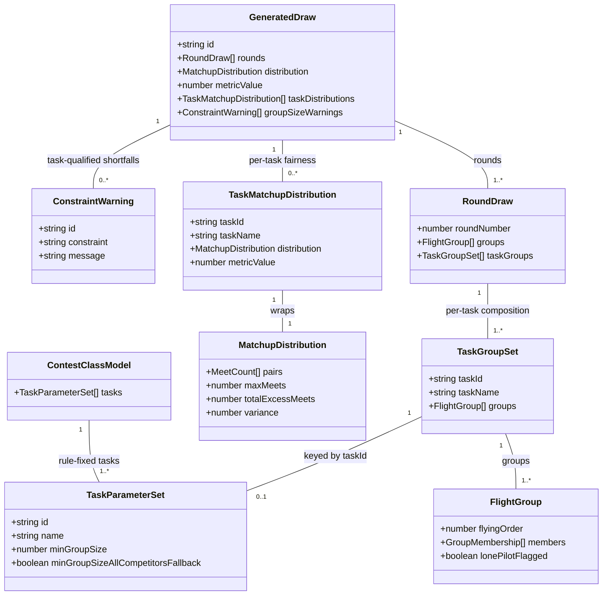

# Per-Task Draw Grouping and Generation for Multi-Task Classes

## Requirements

Replace the single shared group composition per round with an **independent
group composition per task**, so a multi-task class (F3B: Duration, Distance,
Speed) draws each task's groups against its own rule-fixed per-group minimum
(F3B.1.8b: 5 / 3 / 8-or-all) rather than the largest minimum among the
class's tasks (today: every F3B task is forced to Speed's minimum of 8). Each
task's composition, minimum validation and fairness evidence are resolved
independently within a round; a task that cannot meet its own minimum warns
(reusing STORY-001-022's warn-and-generate mechanism, now task-qualified)
without blocking the other tasks or the round. Single-task classes
(F3J/F3K/F5J/F5K/F5L) must be byte-for-byte unaffected — the per-task
structure degenerates to exactly one task with no discipline branch anywhere
in the pipeline (NFR-2). Scope is the domain model, generation/validation
algorithm and fairness evidence only; presenting per-task groupings in the
companion app (STORY-001-021) and updating draw acceptance/group
management/draw-report consumers to read the new shape are explicit
follow-on work, not built here — this story only guarantees those consumers
keep working unchanged via a back-compat flat view.

## Entities



**Conservative constraints applied**: `RoundDraw` (`packages/shared/src/draw.ts:83`)
keeps its existing `groups: FlightGroup[]` field untouched and gains one new
additive field, `taskGroups: TaskGroupSet[]`. `GeneratedDraw` keeps its
existing `distribution`/`metricValue` fields untouched and gains one new
additive field, `taskDistributions: TaskMatchupDistribction[]` (empty array
is never valid — always populated, see Approach). `ConstraintWarning` is
reused exactly as STORY-001-022 left it (no shape change) — only the `id`
and `message` values it's constructed with become task-qualified. No
existing field is renamed, retyped or removed; no new top-level aggregate or
event type is introduced.

## Approach

1. **Per-task generation as independent, self-contained attempt loops**:
   - `DrawService.generate` currently resolves one `effectiveG` and runs
     `ATTEMPTS` randomised attempts once per round-set via `runAttempt`,
     which already builds its own fresh `meet` map internally per call. This
     means calling `runAttempt`'s existing `ATTEMPTS`-budget search
     **once per task** — unchanged internally — already isolates each
     task's anti-repeat accounting from every other task's, with zero
     changes needed to `runAttempt`, `improveRound` or `globalRefine`
     themselves. The per-task loop is the natural extension of an already
     self-contained unit of work, not a rewrite of it.
   - For each `TaskParameterSet` on `model.tasks`, resolve that task's own
     `effectiveG` (a task-scoped analogue of STORY-001-022's
     `resolveEffectiveGroupsPerRound`, reading `task.minGroupSize`/
     `task.minGroupSizeAllCompetitorsFallback` instead of the whole-model
     `Math.max` reduction), run the existing `ATTEMPTS` attempt/refine/score
     pipeline against that `effectiveG`, and keep the fairest placement by
     the spec's `fairnessMetric` — exactly today's inner loop, just invoked
     once per task instead of once per round.
   - A single-task class's `model.tasks` has length 1, so this loop runs
     exactly once — the identical code path as today, guaranteeing AC5's
     byte-for-byte non-regression with no discipline branch (`model.tasks`
     drives the iteration count generically, satisfying NFR-2 for any future
     class with 2, 4 or 5 tasks without further change).
   - `avoidConsecutiveFlights` is evaluated **per task, per its own
     round-to-round sequence** — since each task's placement is now its own
     independent multi-round attempt with its own `prevGroupIndex`
     threading (exactly as `runAttempt` already does internally across the
     rounds it's given), "consecutive" naturally means "this task's last
     group in round *r* vs this task's first group in round *r+1*", never
     compared across a different task's groups in the same round. This
     falls out of running each task as its own independent
     `runAttempt`/`globalRefine` call — no new bookkeeping is required
     beyond calling the existing pipeline once per task.

2. **Task-scoped minimum resolution and warning generation, replacing the
   whole-model `resolveMin`**:
   - `DrawService.resolveMin` (the `Math.max(...task minima)` reduction) is
     no longer used to gate generation. Each task resolves its own minimum
     directly from its own `TaskParameterSet.minGroupSize`/
     `minGroupSizeAllCompetitorsFallback` via a new
     `resolveEffectiveGroupsPerRoundForTask` helper — the same search
     algorithm STORY-001-022 already built, parameterised per task instead
     of per whole model.
   - A task's own escape (`minGroupSizeAllCompetitorsFallback`) governs only
     *that* task's single-group floor: `floorG = (spec.allowSingleGroup ||
     task.minGroupSizeAllCompetitorsFallback) ? 1 : 2`. This directly
     replaces the whole-model `modelAllowsAllCompetitorsFallback` check
     inside the fallback search for the *per-task* resolution path (AC3);
     `modelAllowsAllCompetitorsFallback` itself is untouched and remains
     correct for its existing whole-spec `assertGroupBound`/
     `saveSpec` single-group-consent use (that check is about whether the
     Organiser's requested `groupsPerRound = 1` is legal at all, a
     spec-level question orthogonal to per-task generation).
   - Each task's fallback (if it fires) produces its own
     `ConstraintWarning` with a task-qualified `id`
     (`group-size-minimum:${task.id}`) and a message naming the specific
     task (AC4: "Speed" named distinctly from "Duration"/"Distance"). All
     tasks' warnings are collected into the existing
     `groupSizeWarnings: ConstraintWarning[]` array — no shape change to
     that field, only to how many entries it can now carry and how their
     `id`/`message` are built. This is the exact debt flagged in the
     current code's own comment (`service.ts:483-484`) — implement it now
     rather than reusing the single hardcoded literal.
   - The `resolveGroupPlan`/`computeGroupSizeMinimumWarning` split from
     STORY-001-022 continues to exist as the algorithm shape, just called
     once per task with per-task inputs instead of once per round with
     model-wide inputs; no separate save-time per-task warning is added
     (see Safeguards — save-time `computeWarnings` is explicitly out of
     scope for group-size minima, matching the story's ACs which all
     exercise `generate`, never `saveSpec`).

3. **Domain-model shape — additive, dual-view, no consumer migration**:
   - `RoundDraw` gains `taskGroups: TaskGroupSet[]`, one entry per
     `model.tasks` entry, each carrying that task's own `FlightGroup[]` for
     the round. The existing `groups: FlightGroup[]` field is **always**
     populated too, as a back-compat view: for a single-task class it is
     that one task's groups (identical to today, verbatim); for a
     multi-task class it mirrors `taskGroups[0].groups` (F3B: Duration) —
     a real, valid grouping rather than an empty or misleading one, so any
     un-migrated consumer (`DrawView.tsx`, future reports) renders
     Duration's actual composition until STORY-001-021 gives them the full
     per-task view. This mirroring is a deliberate, temporary stopgap
     tracked as the same follow-on debt D13 already records — not a new
     design decision each future reader needs to rediscover.
   - `GeneratedDraw` gains `taskDistributions: TaskMatchupDistribution[]`,
     one entry per task, each wrapping a `MatchupDistribution` computed
     **only from that task's own placement's pairings** (never blended
     across tasks — AC6's whole point). The existing top-level
     `distribution`/`metricValue` fields are always populated too, mirroring
     `taskDistributions[0]` (Duration for F3B) exactly as `groups` mirrors
     `taskGroups[0]` — the same pairing rule, so the flat view and the
     task-keyed view are always consistent with each other for whichever
     task is at index 0. For a single-task class `taskDistributions` has
     exactly one entry, identical to the top-level fields (AC5).
   - No new top-level aggregate, no new event type. `generatedDrawToPayload`
     and `DrawProjection.copyDraw` are extended to deep-copy the two new
     array fields, following the exact same field-by-field pattern already
     used for `distribution.pairs` and (from STORY-001-022)
     `groupSizeWarnings` — including the same defensive-default-on-replay
     rule (`draw.taskGroups ?? []` / `draw.taskDistributions ?? []`) so any
     `draw.generated` event logged before this story ships still replays
     without throwing (D4).

## Structure

### Inheritance Relationships
1. No new class hierarchies. `TaskGroupSet` and `TaskMatchupDistribution`
   are new plain TypeScript interfaces in `packages/shared/src/draw.ts`,
   siblings of `FlightGroup`/`MatchupDistribution`, not subtypes of them.
2. No new `DomainError` subclasses — this story raises no new hard-rejection
   path; the D1 floor and STORY-001-022's warn-and-generate error handling
   are reused unchanged.

### Dependencies
1. `DrawService.generate` calls a new private helper,
   `resolveEffectiveGroupsPerRoundForTask(R, requestedG, task, spec)`, once
   per `model.tasks` entry, replacing the single whole-model
   `resolveGroupPlan` call for the per-task generation path.
2. `DrawService.generate` calls `runAttempt`/`globalRefine`/
   `computeDistribution` once per task (each call already self-contained,
   per Approach §1) instead of once per round.
3. `DrawService.materialise` is extended to build `TaskGroupSet[]` per round
   from each task's own placement, alongside the existing flat
   `FlightGroup[]` mirror.
4. A new private helper, `computeGroupSizeMinimumWarningForTask(model, task,
   R, requestedG, effectiveG)`, depends on the plain data field
   `ContestClassModel.groupSizeMinimumClause` (a per-class-model rule-clause
   string, `null` when the class has none) and appends the task name for
   multi-task classes. This supersedes the earlier module-level
   `groupSizeMinimumClauseFor(model)` switch-on-`sourceClass` helper, which
   was deleted as part of the "core system must not know about any specific
   competition class" architectural principle — the six clause
   strings/nulls it used to compute per class now live as data on each
   `STOCK_CLASS_MODELS` entry instead of in a code branch.
5. `DrawProjection.copyDraw`/`copySpec` and
   `generatedDrawToPayload`/`drawSpecToPayload` (`packages/shared/src/draw.ts`)
   depend on the two new fields existing on `RoundDraw`/`GeneratedDraw` to
   deep-copy them.
6. `apps/base/src/routes/draw.ts`, `apps/base/src/draw/errors.ts`, and
   `apps/companion/src/draw/DrawView.tsx` have **no** required changes in
   this story (explicit Scope Out) — they continue to read the unchanged
   flat `groups`/`distribution`/`metricValue` fields exactly as today.

### Layered Architecture
1. **Shared types layer** (`packages/shared/src/draw.ts`): `TaskGroupSet`,
   `TaskMatchupDistribution` interfaces; `RoundDraw.taskGroups`,
   `GeneratedDraw.taskDistributions` additive fields; `generatedDrawToPayload`
   extended to deep-copy both.
2. **Service layer** (`apps/base/src/draw/service.ts`): all business logic —
   the per-task generation loop, per-task minimum/escape resolution, the
   per-task warning construction with task-qualified ids, and the
   flat-field mirroring rule (`taskGroups[0]`/`taskDistributions[0]`).
3. **Projection layer** (`apps/base/src/draw/projection.ts`): `copyDraw`
   extended to deep-copy the two new fields, with the same
   defensive-default-on-replay pattern as `groupSizeWarnings`.
4. **Unaffected layers (explicit Scope Out, verified not broken)**: route
   layer (`apps/base/src/routes/draw.ts`), error-handling layer
   (`apps/base/src/app.ts`), companion presentation layer
   (`apps/companion/src/draw/DrawView.tsx`) — no new endpoints, no new
   errors, no new UI in this story.

## Operations

### Update Shared Type — `RoundDraw` (`packages/shared/src/draw.ts`)
1. Responsibility: hold a multi-task class's independent per-task group
   compositions alongside the existing flat, back-compat view.
2. Attributes:
   - `taskGroups: TaskGroupSet[]` — one entry per `ContestClassModel.tasks`
     entry, in the same order as `model.tasks`. Never empty when a round
     has been generated (a single-task class still gets exactly one entry).
3. Constraints: `groups` remains required and always populated (never
   derived lazily by a consumer) — it must equal `taskGroups[0].groups`
   exactly, by construction in the service, not by convention alone.

### Create Shared Type — `TaskGroupSet` (`packages/shared/src/draw.ts`)
1. Responsibility: attribute one task's group composition within a round.
2. Attributes:
   - `taskId: string` — the owning `TaskParameterSet.id`.
   - `taskName: string` — denormalised from the task at generation time
     (mirrors `DrawSpecification.classModelId`'s denormalisation precedent),
     so a stored draw is self-describing even if the class model's task is
     later renamed.
   - `groups: FlightGroup[]` — identical shape/semantics to `RoundDraw.groups`
     today (flyingOrder, members, lonePilotFlagged), just scoped to this task.

### Update Shared Type — `GeneratedDraw` (`packages/shared/src/draw.ts`)
1. Responsibility: carry per-task fairness evidence alongside the existing
   flat, back-compat distribution/metric.
2. Attributes:
   - `taskDistributions: TaskMatchupDistribution[]` — one entry per
     `model.tasks` entry, same ordering rule as `taskGroups`.
3. Update `generatedDrawToPayload` to deep-copy `rounds[].taskGroups` (each
   `TaskGroupSet`'s `groups` copied exactly like the existing `groups`
   mapping) and `taskDistributions` (each entry's nested `distribution`
   copied exactly like the existing top-level `distribution` mapping) —
   mirror the existing field-by-field style, no shared helper extraction
   (matches this file's existing repetition-over-abstraction convention).

### Create Shared Type — `TaskMatchupDistribution` (`packages/shared/src/draw.ts`)
1. Responsibility: attribute one task's fairness evidence within a
   generated draw.
2. Attributes:
   - `taskId: string`, `taskName: string` — same denormalisation rule as
     `TaskGroupSet`.
   - `distribution: MatchupDistribution` — identical shape to the existing
     top-level field, computed only from this task's own placement.
   - `metricValue: number` — this task's own reduction of `distribution` by
     `spec.fairnessMetric`, via the existing `metricValueOf` helper.

### Update Service Method — `DrawService.generate`
1. Responsibility: run one independent generation/fairness search per task
   instead of one shared search per round, and materialise both the
   task-keyed and flat back-compat views.
2. Core method changes:
   - Keep the existing whole-spec `assertGroupBound` re-check unchanged
     (D1 floor + single-group consent — a spec-level gate, orthogonal to
     per-task minima).
   - Replace the single `resolveGroupPlan(model, R, spec.groupsPerRound,
     resolvedMin, singleGroupPermitted)` call with a loop over
     `model.tasks`:
     ```
     const perTask = model.tasks.map((task) => {
       const { effectiveG, warning } = this.resolveGroupPlanForTask(
         task, R, spec.groupsPerRound, spec.allowSingleGroup,
       );
       let bestPlacement, bestDistribution, bestKey = null;
       for (let i = 0; i < ATTEMPTS; i++) {
         const placement = this.runAttempt(seatIds, spec, effectiveG);
         if (!placement) continue;
         const distribution = this.computeDistribution(placement, seatIds);
         const key = scoreKey(distribution, spec.fairnessMetric);
         if (bestKey === null || keyLess(key, bestKey)) { ...retain... }
       }
       if (!bestPlacement) throw new DrawGenerationFailedError(...naming the task...);
       return { task, placement: bestPlacement, distribution: bestDistribution, warning };
     });
     ```
   - `DrawGenerationFailedError`'s message must name which task's search
     dead-ended (AC6-adjacent traceability), not a generic "could not
     generate" string, when the failure is task-specific.
   - Materialise: for each round index, build
     `taskGroups: perTask.map(({ task, placement }) => ({ taskId: task.id,
     taskName: task.name, groups: materialiseOneTasksGroups(placement,
     roundIdx, spec.lanePolicy, contestNumbers) }))`, and set
     `groups: taskGroups[0].groups` (the flat mirror).
   - Build `taskDistributions: perTask.map(({ task, distribution }) => ({
     taskId: task.id, taskName: task.name, distribution, metricValue:
     metricValueOf(distribution, spec.fairnessMetric) }))`, and set the
     top-level `distribution`/`metricValue` to `taskDistributions[0]`'s
     values (the flat mirror, same pairing rule as `groups`).
   - Collect `groupSizeWarnings: perTask.map(p => p.warning).filter(w => w
     !== null)` — replaces the single-entry array from STORY-001-022 with
     however many tasks actually fell short this generation.
3. Exception Handling: unchanged shape (`DrawGenerationFailedError` still
   thrown before anything is appended, Safeguard 3) — now potentially
   thrown by any one task's exhausted attempt loop, not only a
   whole-round one.

### Update Service Method — `DrawService.materialise`
1. Responsibility: become a per-task materialiser, callable once per task's
   best placement, reused for both the task-keyed and (via task[0]) flat
   views.
2. Methods:
   - Rename/refactor into `materialiseOneTasksGroups(placement: string[][][],
     roundIdx: number, policy: LaneAllocationPolicy, contestNumbers: Map<...>):
     FlightGroup[]` — the existing per-round mapping logic
     (`flyingOrder`/`lonePilotFlagged`/`assignLanes`) unchanged, just
     narrowed to operate on one task's placement for one round instead of
     the whole `placement` array across all rounds at once. The caller in
     `generate` loops rounds × tasks to assemble the final `RoundDraw[]`.
3. Constraints: lane assignment (`assignLanes`) continues to operate
   per-task-per-round exactly as it does today per-round — no cross-task
   lane coordination is introduced (out of scope; F3B's per-task lane
   semantics are not addressed by this story).

### Create Service Method — `DrawService.resolveGroupPlanForTask`
1. Responsibility: the task-scoped analogue of the existing
   `resolveGroupPlan`, resolving one task's own minimum/escape instead of
   the whole model's `Math.max` reduction.
2. Methods:
   - `resolveGroupPlanForTask(task: TaskParameterSet, R: number, requestedG:
     number, allowSingleGroup: boolean): { effectiveG: number; warning:
     ConstraintWarning | null }`
     - Logic:
       - `resolvedMin = task.minGroupSize ?? 1`; if `resolvedMin <= 1` or
         `Math.floor(R / requestedG) >= resolvedMin`, return
         `{ effectiveG: requestedG, warning: null }` — no shortfall for
         this task.
       - `floorG = (allowSingleGroup || task.minGroupSizeAllCompetitorsFallback)
         ? 1 : 2`.
       - Search `g` from `requestedG - 1` down to `floorG`; return the
         first `g` where `Math.floor(R / g) >= resolvedMin`.
       - If none found, `effectiveG = floorG`. If
         `effectiveG === 1 && task.minGroupSizeAllCompetitorsFallback`,
         return `{ effectiveG: 1, warning: null }` (AC3: the escape is
         always rule-legal for this task, no warning) — this is the
         task-scoped equivalent of the existing model-level bug-fix check
         at `service.ts:472`, now correctly scoped to just this task rather
         than "does any task in the model have the escape".
       - Otherwise build the warning via
         `computeGroupSizeMinimumWarningForTask` (below) and return it.
3. Constraints: never searches above `requestedG` ("closest" means fewer,
   larger groups only — mirrors STORY-001-022's existing rule, applied per
   task).

### Create Service Method — `DrawService.computeGroupSizeMinimumWarningForTask`
1. Responsibility: build a task-qualified, individually-acknowledgeable
   warning when a task's own minimum cannot be met.
2. Methods:
   - `computeGroupSizeMinimumWarningForTask(model: ContestClassModel, task:
     TaskParameterSet, R: number, requestedG: number, effectiveG: number):
     ConstraintWarning`
     - Logic:
       - `ruleClause = model.groupSizeMinimumClause ?? "the class's
         group-size rule"` — reads the plain data field on
         `ContestClassModel` (populated per stock model in
         `STOCK_CLASS_MODELS`, e.g. `"F3B.1.8 b"` for F3B) rather than
         calling a helper function; still yields the shared F3B.1.8b clause
         for any F3B task, since the clause text itself doesn't differ by
         task, only the numeric minimum does. This field replaces the
         deleted module-level `groupSizeMinimumClauseFor(model)` switch —
         the class-specific clause strings now live as data on the class
         model instead of a code branch in the draw service, per the
         core-system/class-model separation principle.
       - `id: `group-size-minimum:${task.id}`` — task-qualified, so AC4's
         Speed warning and any co-occurring Duration/Distance warning stay
         independently acknowledgeable via `accept()`'s existing by-id
         filter (`DrawService.accept`, unchanged).
       - `message`: `` `${model.name}: ${task.name} — ${ruleClause} requires
         at least ${task.minGroupSize} per group; a roster of ${R}
         requesting ${requestedG} group(s) cannot meet it, so ${effectiveG}
         group(s) were generated instead` `` — the task name is named
         explicitly in the message text (AC4's literal requirement:
         "naming Speed").
3. Constraints: for a single-task class this still produces one
   task-qualified warning if that class's one task falls short (e.g. F3J
   below its minimum of 6) — the `id`/`message` simply always carry that
   one task's name now; STORY-001-022's existing single-task tests must be
   updated to expect the new `id` format (`group-size-minimum:<taskId>`
   instead of the bare literal `group-size-minimum`) and the task name now
   present in the message text (see Update Tests below).

### Update Projection Method — `DrawProjection.copyDraw`
1. Responsibility: deep-copy the two new per-task fields on replay,
   defensively defaulting when replaying a pre-existing event payload that
   predates this story.
2. Methods:
   - Extend the `rounds.map(...)` mapping to also copy
     `taskGroups: (round.taskGroups ?? []).map(tg => ({ taskId: tg.taskId,
     taskName: tg.taskName, groups: tg.groups.map(g => ({ flyingOrder:
     g.flyingOrder, lonePilotFlagged: g.lonePilotFlagged, members:
     g.members.map(m => ({ rosterEntryId: m.rosterEntryId, lane: m.lane }))
     })) }))`.
   - Extend the top-level draw copy to also copy
     `taskDistributions: (draw.taskDistributions ?? []).map(td => ({
     taskId: td.taskId, taskName: td.taskName, metricValue: td.metricValue,
     distribution: { maxMeets: td.distribution.maxMeets, totalExcessMeets:
     td.distribution.totalExcessMeets, variance: td.distribution.variance,
     pairs: td.distribution.pairs.map(p => ({ a: p.a, b: p.b, count: p.count
     })) } }))`.
3. Constraints: matches the exact `groupSizeWarnings ?? []` defensive
   pattern already established for STORY-001-022 — every event logged by
   this codebase before this story ships lacks both new fields entirely;
   replay must default to `[]`, never throw (D4).

### Update Shared Function — `generatedDrawToPayload` (`packages/shared/src/draw.ts`)
1. Responsibility: mirror `DrawProjection.copyDraw`'s deep-copy of the two
   new fields when materialising the event payload at generation time (not
   replay time — the source here is always freshly-generated, so no
   defensive default is needed on this side, only on the projection's
   replay side).
2. Methods: extend the existing `rounds.map(...)`/top-level mapping with
   the identical field lists as `copyDraw` above (`taskGroups`,
   `taskDistributions`).

### Update Tests — `apps/base/test/draw.service.test.ts`
1. Responsibility: migrate the STORY-001-022 tests whose asserted warning
   `id` is the bare literal `"group-size-minimum"` to the new task-qualified
   form (`` `group-size-minimum:${taskId}` ``), and assert the message now
   includes the task's name.
2. Add new tests covering this story's ACs, using `stockModelIdFor("F3B")`
   (already imported and used elsewhere in this file):
   - AC1: F3B roster of 12, `groupsPerRound: 2` → `candidate.rounds[0].taskGroups`
     has exactly 3 entries (Duration/Distance/Speed); their `groups` are not
     required to be identical (assert at least one differs in membership).
   - AC2: same fixture → Duration's and Distance's `taskGroups` entries each
     have 2 groups of 6 members; no `groupSizeWarnings` entry for Duration
     or Distance (their own minima of 5 and 3 are cleared by 6).
   - AC3: same fixture → Speed's `taskGroups` entry is a single group of all
     12 members, and no `groupSizeWarnings` entry exists for Speed (the
     "or all competitors" escape applies with zero warning, per the
     existing STORY-001-019 precedent now re-verified at task granularity).
   - AC4: F3B roster of 6, `groupsPerRound: 2` → Duration's and Distance's
     `taskGroups` entries generate 2 groups normally; Speed's `taskGroups`
     entry collapses to 1 group of all 6; `groupSizeWarnings` has exactly
     one entry, its `id` is `group-size-minimum:<Speed's taskId>`, and its
     `message` names "Speed" and cites `F3B.1.8 b`.
   - AC5 (regression): an F5J fixture identical to the existing pre-story
     tests must produce an unchanged `rounds[].groups`, `distribution`,
     `metricValue` — assert these against a captured pre-story snapshot (or
     the existing test's original assertions, unmodified) to prove
     byte-for-byte non-regression; additionally assert
     `rounds[].taskGroups` has exactly one entry equal to `rounds[].groups`,
     and `taskDistributions` has exactly one entry equal to the top-level
     `distribution`/`metricValue`.
   - AC6: the F3B AC1 fixture's `taskDistributions` — assert each of the
     three entries' `distribution.pairs` only ever pairs seats that
     actually shared a group *within that task's own placement*, never a
     pairing that only co-occurred in a different task's grouping (a direct
     check that the meet-matrices are genuinely isolated per task, not
     blended).
   - NFR: a timing assertion (or an explicit skip-with-comment if vitest
     timing assertions are not this repo's convention — check existing
     tests for a precedent before adding one) that F3B generation for a
     20-pilot, 8-round fixture completes within a generous wall-clock bound
     (e.g. a few seconds), documenting the ~3× attempt-loop cost this
     design accepts.

## Norms

1. **Annotation Standards**: none — matches the existing plain
   TypeScript/Fastify, no-decorator style throughout `apps/base/src/draw/`
   and `packages/shared/src/draw.ts`.
2. **Dependency Injection**: no new constructor dependencies — all new
   logic is private methods on the existing `DrawService` or module-level
   pure functions, matching the existing file's convention exactly.
3. **Exception Handling**: no new error classes. `DrawGenerationFailedError`
   is reused, with its message parameterised by which task's attempt loop
   exhausted (when the failure is task-specific) rather than a generic
   whole-round message — still a single-argument human-readable message,
   matching every other error in `apps/base/src/draw/errors.ts`.
4. **Data Validation**: structural validation (Zod) is untouched by this
   story — no new request/response schema fields are introduced;
   cross-aggregate per-task minimum resolution stays in `DrawService`, per
   the existing Norm 2 split.
5. **Logging**: none beyond the existing immutable event log (D4) — the
   per-task warnings are recorded as part of `draw.generated`'s payload
   exactly as STORY-001-022's single warning was; no ad hoc logging added.
6. **Documentation Standards**: match this codebase's existing terse,
   "why not what" comment style. Any comment explaining *why* a per-task
   loop reuses `runAttempt` unchanged (its self-contained `meet` map is
   what makes per-task isolation free) is worth keeping; do not add
   comments restating what a task-keyed array obviously already is.

## Safeguards

1. **Functional Constraints**: a task's own rule-fixed minimum governs only
   that task's own groups (AC2) — no code path may resolve a per-task
   `effectiveG` using another task's `minGroupSize`. The whole-model
   `resolveMin`/`Math.max` reduction must not be called anywhere in the
   per-task generation path (it may remain used elsewhere only if some
   other consumer still legitimately needs a single whole-model figure —
   verify no such use survives inside `generate` after this story).
2. **Performance Constraints**: F3B's generation may run up to
   `model.tasks.length × ATTEMPTS` (600 for F3B's 3 tasks) randomised
   attempts per `generate` call instead of `ATTEMPTS` (200) today. This
   must be verified to complete within a few seconds at MVP scale (≤ 20
   pilots, ≤ 8 rounds) — the Non-Functional Expectation's "same practical
   time budget" claim must be backed by a measured test, not assumed.
3. **Security Constraints**: none beyond the existing trust model (D1) —
   unchanged by this story.
4. **Integration Constraints**:
   - `RoundDraw.taskGroups` and `GeneratedDraw.taskDistributions` must
     default to `[]` on replay of any `draw.generated` event logged before
     this story ships — never throw (D4).
   - The existing flat `groups`/`distribution`/`metricValue` fields must
     remain present and populated on every `GeneratedDraw`, for every class,
     with no consumer-visible removal — `DrawView.tsx`, `routes/draw.ts`,
     and any existing test fixture reading these flat fields must continue
     to pass unmodified for single-task classes, and must render a real
     (if provisional) grouping for F3B via the `taskGroups[0]` mirror
     rather than an empty/undefined value.
   - `accept()`/`cancel()` are unchanged: acceptance remains one decision
     for the whole round's draw (D13 consequence 3), never task-by-task,
     even though `groupSizeWarnings` may now carry several task-qualified
     entries that all need acknowledging together via the existing
     `acknowledgedWarningIds` array (STORY-001-022's mechanism, unchanged).
5. **Business Rule Constraints**:
   - Single-task classes must be byte-for-byte unaffected (AC5) — verified
     by a regression test asserting the flat fields are identical to a
     pre-story baseline, not merely "still present."
   - Speed's (or any task's) "or all competitors" escape must never produce
     a warning when it resolves to a single whole-roster group for that
     task (AC3) — the task-scoped escape check
     (`task.minGroupSizeAllCompetitorsFallback`) must be evaluated per task,
     never via the whole-model `modelAllowsAllCompetitorsFallback` inside
     the per-task warning path.
   - A task-qualified warning's `id` must be unique per task
     (`group-size-minimum:<taskId>`) so multiple simultaneous warnings on
     one candidate (AC4) remain independently addressable by
     `accept()`'s existing by-id acknowledgement filter with no code change
     to `accept()` itself.
   - The D1 two-scoring-pilot floor remains a single whole-spec hard
     rejection (`assertGroupBound`, unchanged) — it is not evaluated per
     task; a task's own effectiveG search never needs to independently
     re-check the D1 floor, since `assertGroupBound` already gates
     `spec.groupsPerRound` before any per-task resolution begins, and no
     per-task search is permitted to go below `floorG` (1 or 2 per the
     escape rule above).
6. **Exception Handling Constraints**: `DrawGenerationFailedError`'s message
   must name the specific task whose attempt loop exhausted when the
   failure is task-specific (e.g. `avoidConsecutiveFlights` unsatisfiable
   for Speed's grouping alone while Duration/Distance succeed) — never a
   generic message that hides which task's search failed.
7. **Technical Constraints**: no new persisted aggregate or event type;
   `RoundDraw`/`GeneratedDraw` are extended additively only. `runAttempt`,
   `improveRound`, `globalRefine`, `computeDistribution`, `scoreKey`,
   `metricValueOf`, `assignLanes` — none of these pure helper functions'
   signatures change; they are only called more times (once per task)
   than before.
8. **Data Constraints**: `taskId`/`taskName` on `TaskGroupSet` and
   `TaskMatchupDistribution` are denormalised at generation time from the
   class model's `TaskParameterSet` (mirrors `DrawSpecification.classModelId`'s
   existing denormalisation precedent) — a generated draw remains
   self-describing even if the class model is later edited or cloned.
9. **API Constraints**: no route, request schema, or response envelope
   changes in this story — `GET .../draw`, `PUT .../draw/spec`,
   `POST .../draw/generate`, `POST .../draw/accept`, `POST .../draw/cancel`
   all keep their exact existing contracts, with the response body's
   `GeneratedDraw`/`RoundDraw` shapes gaining only the two additive fields
   described above.
