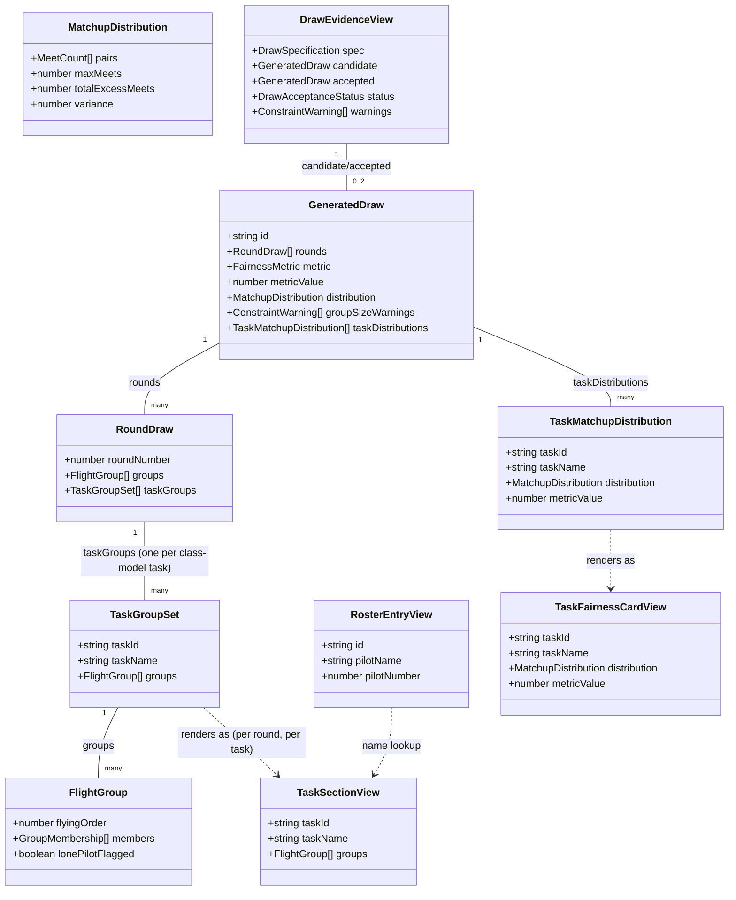

# Per-Task Draw Presentation in the Workflow Screen

## Requirements

Extend the companion app's draw workflow screen so a multi-task class's
per-task group compositions and per-task fairness evidence — already produced
end-to-end by STORY-001-020 — become visible and independently reviewable to
the Organiser and Contest Director, while every single-task class continues to
render exactly as it does today and the accept/re-draw decision remains one
act for the whole draw.

## Entities

**Conservative note**: `TaskSectionView` and `TaskFairnessCardView` are
presentation-only shapes describing what a render function consumes — they
are not new domain types and must not be added to `packages/shared`. No
change to `GeneratedDraw`, `RoundDraw`, `TaskGroupSet`, or
`TaskMatchupDistribution` — STORY-001-020 already fully populates them, for
every class, including single-task classes (which get exactly one
`TaskGroupSet`/`TaskMatchupDistribution` entry).

## Approach

1. **Rendering strategy — reuse, don't rewrite**:
   - `DrawRounds` and `FairnessEvidence` in
     `apps/companion/src/draw/DrawView.tsx` already contain the correct
     per-round/per-pair rendering logic (group/lane sorting, `lonePilotFlagged`
     badge, `nameFor` lookup, metric summary line, pairs table).
   - Extract the per-round-group-table body and the per-fairness-card body
     into small internal render helpers, each taking one task's slice of data
     (`FlightGroup[]` for a round; one `TaskMatchupDistribution` for a card).
   - Keep the existing `DrawRounds`/`FairnessEvidence` function signatures and
     bodies as the literal single-task path (called with the flat
     `groups`/`distribution`/`metricValue` fields, completely unchanged) —
     this is the strongest guarantee for AC3.
   - Add new multi-task wrapper rendering (inline in `DrawView.tsx` or as two
     small new components, e.g. `TaskDrawSections` and `TaskFairnessRow`) that
     iterates `taskGroups`/`taskDistributions` and calls the extracted helpers
     once per entry.

2. **Display-mode detection**:
   - Derive `isMultiTask = draw.rounds.every(r => r.taskGroups.length > 1)` —
     in practice `taskGroups.length` is constant across rounds for a given
     draw (one entry per class-model task), so checking the first round's
     `taskGroups.length > 1` (guarded for an empty `rounds` array) is
     sufficient and avoids a second source of truth (no class-model fetch).
   - This condition gates which of the two render paths runs; it must
     evaluate `false` for every existing single-task class's draw.

3. **Layout decisions** (per Strategic Approach in the analysis):
   - Composition tables: stacked sections, one per task, each task's full
     round-by-round tables shown top-to-bottom under a task heading —
     consistent with `DrawRounds`'s existing per-round stacked-section
     convention.
   - Fairness evidence: a side-by-side row of fairness cards, one per task —
     required by AC2's explicit "side by side" wording; stacked sections or
     tabs would hide or require scrolling between task figures, undermining
     the comparison AC2 asks for.
   - Task ordering follows array order as emitted by the base
     (`model.tasks` order) — never re-sorted by name or re-ordered in the UI.

4. **Data flow — unchanged**: `DrawView`'s existing `refresh()` →
   `getDraw()` call already returns the full `GeneratedDraw` including
   `taskGroups`/`taskDistributions`. No new endpoint, no new fetch call, no
   new loading state.

5. **Non-regression guarantee for AC3**: the single-task call sites
   (`<DrawRounds draw={candidate|accepted} .../>` and `<FairnessEvidence
   draw={candidate|accepted} .../>`) remain textually present and unmodified
   in both the `awaiting-decision` and `accepted` branches of `DrawView`,
   gated behind `!isMultiTask`. The multi-task branch is strictly additive —
   a sibling conditional, not a modification of the existing call.

## Structure

### Inheritance Relationships
1. No new classes, interfaces, or exceptions — this is a React functional
   component change only; no OOP inheritance hierarchy is introduced.
2. `TaskSectionView`/`TaskFairnessCardView` (Entities section) are TypeScript
   prop-shape aliases/inline types local to `DrawView.tsx`, not exported types.

### Dependencies
1. `DrawView` depends on `DrawRounds`, `FairnessEvidence` (existing,
   single-task path) and new `TaskDrawSections`, `TaskFairnessRow` (or
   equivalent extracted helpers) for the multi-task path.
2. Both paths depend on the same `buildRosterMap`/`nameFor` utilities already
   in `DrawView.tsx` — no duplication of name-resolution logic.
3. `DrawView` continues to depend only on `getDraw`, `generateDraw`,
   `acceptDraw`, `cancelDraw` from `apps/companion/src/draw/api.ts` — no new
   API dependency.
4. New render helpers depend only on `@soarscore/shared` types already
   imported (`GeneratedDraw`, `TaskGroupSet`, `TaskMatchupDistribution`,
   `RosterEntryView`) — add `TaskGroupSet`/`TaskMatchupDistribution` to the
   existing type-only import list.

### Layered Architecture
1. **Component Layer** (`DrawView.tsx`): owns fetch/status/decision
   orchestration — unchanged.
2. **Presentation Layer** (`DrawRounds`, `FairnessEvidence`, and new
   per-task render helpers/wrapper components): pure rendering over an
   already-fetched `GeneratedDraw` — this is the only layer this story
   touches.
3. **Shared Types Layer** (`packages/shared/src/draw.ts`): read-only for this
   story — no additions, no edits.
4. **API/Service Layer** (`apps/companion/src/draw/api.ts`,
   `apps/base/src/draw/service.ts`): untouched — no new endpoint, no new
   fetch.

## Operations

### Update Component - `DrawRounds` (single-task path, `DrawView.tsx`)
1. Responsibility: render the flat `groups` field for a single-task draw,
   exactly as today.
2. Change: none to its external behaviour or signature. Internally, extract
   the per-round-table body (the `<section>` block keyed by
   `round.roundNumber`, containing the group/lane-sorted table) into a shared
   helper function, e.g. `renderRoundGroupsTable(groups: FlightGroup[],
   rosterMap): JSX.Element`, and have `DrawRounds` call it once per round
   using `round.groups` — net output must be byte-for-byte identical to the
   current JSX.
3. Constraints: no new props; no new conditional logic inside the existing
   function body beyond the extraction itself.

### Update Component - `FairnessEvidence` (single-task path, `DrawView.tsx`)
1. Responsibility: render the flat `metric`/`metricValue`/`distribution`
   fairness summary and pairs table for a single-task draw, exactly as today.
2. Change: extract the fairness-summary-line + pairs-table body into a shared
   helper, e.g. `renderFairnessCard(label: string | null, metricValue:
   number, distribution: MatchupDistribution, attemptsRun: number | null,
   rosterMap): JSX.Element`, called once with the flat fields (label omitted/
   null for the single-task case, since AC3 forbids any new labelling here).
3. Constraints: output for the single-task call must remain identical to
   today's rendering — no visible task label introduced in this path.

### Create Component - `TaskDrawSections` (new, multi-task composition view)
1. Responsibility: render one labelled section per `TaskGroupSet` entry
   across all rounds, satisfying AC1.
2. Props: `{ draw: GeneratedDraw; rosterMap: Map<string, RosterEntryView> }`.
3. Methods/Logic:
   - Derive the task list from `draw.rounds[0]?.taskGroups ?? []` (ordering
     and identity — `taskId`/`taskName` — are constant across rounds for a
     given draw, per STORY-001-020's construction).
   - For each task (in array order), render a `<section>` with a heading
     showing `taskName` (e.g. `<h2>{taskName}</h2>` at a level below the
     round-level headings used inside), then iterate `draw.rounds` and for
     each round find that task's `TaskGroupSet` (`round.taskGroups.find(tg
     => tg.taskId === taskId)`) and call `renderRoundGroupsTable(taskGroups
     .groups, rosterMap)` under a "Round N" heading.
   - Must not deduplicate or collapse sections even if two tasks' `groups`
     arrays are structurally identical (edge case from the analysis).
   - Must preserve `lonePilotFlagged` badge rendering per task (inherited
     via the shared `renderRoundGroupsTable` helper).
4. Constraints: generic over array length — must not hardcode "three tasks"
   or F3B-specific task names; must work for 2, 3, 4+ tasks.

### Create Component - `TaskFairnessRow` (new, multi-task fairness view)
1. Responsibility: render one fairness card per `TaskMatchupDistribution`
   entry, laid out side by side, satisfying AC2.
2. Props: `{ draw: GeneratedDraw; rosterMap: Map<string, RosterEntryView> }`.
3. Methods/Logic:
   - Iterate `draw.taskDistributions` in array order.
   - For each entry, call `renderFairnessCard(taskName, metricValue,
     distribution, null, rosterMap)` (attemptsRun is a whole-draw figure, not
     per-task — STORY-001-020 does not produce a per-task `attemptsRun`, so
     omit it from each per-task card rather than repeating the whole-draw
     value under a misleading per-task label).
   - Wrap the per-task cards in a flex/grid container (`className="task-
     fairness-row"` or equivalent) that lays them out horizontally, wrapping
     to a new line on narrow viewports — satisfies AC2's "side by side"
     without breaking on the companion app's phone-sized screens.
   - Each card must show its own `metricValue`/`distribution` figures — never
     summed or averaged across tasks (per the analysis's fairness-must-stay-
     separately-attributable rule).
4. Constraints: generic over array length, same as `TaskDrawSections`.

### Update Component - `DrawView` (orchestration, `DrawView.tsx`)
1. Responsibility: choose which rendering path runs for each of the
   `awaiting-decision` and `accepted` branches, without touching the decision
   toolbar.
2. Logic:
   - Compute `const isMultiTask = (draw: GeneratedDraw) => (draw.rounds[0]
     ?.taskGroups.length ?? 1) > 1;` once, reusable for both `candidate` and
     `accepted`.
   - In the `awaiting-decision` branch: replace the two existing render calls
     with a conditional — `isMultiTask(candidate) ? (<><TaskDrawSections
     draw={candidate} rosterMap={rosterMap} /><TaskFairnessRow
     draw={candidate} rosterMap={rosterMap} /></>) : (<><DrawRounds
     draw={candidate} rosterMap={rosterMap} /><FairnessEvidence
     draw={candidate} rosterMap={rosterMap} /></>)`.
   - Apply the identical conditional in the `accepted` branch using
     `accepted` in place of `candidate`.
   - No change to `handleGenerate`, `handleDecision`, the toolbar buttons, or
     `cancelPending` dialog — AC4 is satisfied by non-interference.
3. Constraints: the toolbar/decision JSX blocks must remain textually
   unmodified — only the render-tree lines below them change.

### Add Tests - `DrawView` per-task rendering (new test file, since none
exist today for this component per the analysis's confirmed gap)
1. Responsibility: give the AC3 non-regression guarantee and the new
   multi-task path an automated harness, since no test file currently covers
   `DrawView.tsx`/`DrawRounds`/`FairnessEvidence`.
2. Location: `apps/companion/src/draw/DrawView.test.tsx` (or the project's
   established companion-app test convention/location — check for a sibling
   `*.test.tsx` pattern elsewhere in `apps/companion/src` before creating a
   new one).
3. Cases:
   - Single-task fixture (`taskGroups.length === 1`, e.g. an F5J-shaped
     draw): assert the rendered output contains no task-name heading beyond
     round headings, and matches today's expected DOM shape (AC3).
   - Multi-task fixture with 3 tasks (F3B-shaped): assert three labelled
     sections appear, each task's groups rendered under its own heading, and
     three fairness cards appear side by side (AC1, AC2).
   - A task-count-other-than-1-or-3 fixture (e.g. 2 tasks): assert the
     per-task loop still renders correctly and generically (per the
     analysis's edge case).
   - A task whose groups include a `lonePilotFlagged` singleton: assert the
     "lone pilot" badge renders inside that task's section (edge case).
   - Assert `accepted` status renders identically to `awaiting-decision`
     status for the same multi-task draw shape (shared-rendering edge case).
4. Constraints: use existing test fixture/mock conventions from sibling
   companion-app test files if any exist elsewhere in the repo (e.g. under
   `apps/companion/src/*/**.test.tsx`); do not introduce a new testing
   framework or fixture format.

## Norms

1. **Component naming**: new components follow the existing PascalCase
   convention already in `DrawView.tsx` (`DrawRounds`, `FairnessEvidence` →
   `TaskDrawSections`, `TaskFairnessRow`); extracted render helpers use
   camelCase function names prefixed `render` (`renderRoundGroupsTable`,
   `renderFairnessCard`), matching no existing convention violation.
2. **No new domain types**: all new types introduced are local, non-exported
   prop-shape aliases in `DrawView.tsx` — never added to
   `packages/shared/src/draw.ts`.
3. **Dependency injection**: none — this is a presentational React component
   change; existing `rosterMap`/`draw` prop-passing convention continues.
4. **Data validation**: none required — this story consumes already-typed,
   already-validated data (`GeneratedDraw` shape is validated at the API
   boundary elsewhere); no new Zod schema needed.
5. **Styling**: reuse existing CSS classes (`table-wrap`, `data-table`,
   `status-text`, `badge`) for consistency; introduce one new class only for
   the side-by-side fairness row layout (e.g. `task-fairness-row`), added to
   the companion app's existing stylesheet in the same location as related
   `.data-table`/`.badge` rules.
6. **Comments**: preserve the file's existing convention of a short "why"
   comment above each component/function explaining its story/AC linkage
   (as seen throughout current `DrawView.tsx`), applied to each new
   component/helper.
7. **No new endpoint or API client method**: `getDraw`/`acceptDraw`/
   `cancelDraw`/`generateDraw` in `apps/companion/src/draw/api.ts` remain
   unchanged.

## Safeguards

1. **Functional Constraints**: AC1–AC4 must all pass; specifically, the
   single-task rendering path (AC3) must be verifiably unchanged — achieved
   by keeping `DrawRounds`/`FairnessEvidence` call sites textually identical
   to today, gated by `!isMultiTask`, and covered by a new regression test.
2. **Performance Constraints**: no new network request is introduced; render
   cost scales linearly with `taskGroups.length` × `rounds.length`, bounded
   by existing contest-scale limits (≤ 8 rounds, ≤ 20 pilots, small fixed
   task counts per class) — no pagination or virtualisation needed.
3. **Security Constraints**: none beyond existing — no new data enters the
   client beyond what `getDraw` already returns; no auth changes (club-level
   trust model, D-series decisions).
4. **Integration Constraints**: must not alter the shape or contract of
   `GET .../draw`, `getDraw`, `acceptDraw`, `cancelDraw`, or `generateDraw`;
   must not alter `handleDecision`'s `candidate.id`-keyed call in any way.
5. **Business Rule Constraints**:
   - Per-task fairness figures must never be summed, averaged, or otherwise
     blended into one number for a multi-task draw (AC2's separability
     requirement).
   - Task display order must follow the order `taskGroups`/
     `taskDistributions` already arrive in (base-determined, `model.tasks`
     order) — no client-side re-sorting by name or any other key.
   - The multi-task branch must never render a per-task accept/reject
     control — `handleDecision` remains the sole, whole-draw decision path
     (AC4).
6. **Exception Handling Constraints**: none new — existing `ApiError`/
   `alert` handling in `DrawView` is untouched; the new render paths assume
   `draw` is always a fully-populated `GeneratedDraw` (per STORY-001-020's
   AC5/AC6 guarantee that `taskGroups`/`taskDistributions` are never empty)
   and do not need additional null-guarding beyond the existing `rounds[0]?.`
   optional-chaining in the multi-task detection.
7. **Technical Constraints**: the multi-task detection and rendering must be
   generic over array length (2, 3, 4+ tasks) — no hardcoded "three sections"
   assumption anywhere in the new code, verified by the task-count-other-
   than-1-or-3 test fixture.
8. **Data Constraints**: `groupSizeWarnings` (per-task shortfall warnings)
   are explicitly **out of scope** for this story — do not add any rendering
   of `candidate.groupSizeWarnings`/`accepted.groupSizeWarnings` or any
   `acknowledgedWarningIds` wiring; that gap belongs to STORY-001-017's
   unfinished acknowledgement mechanics and must be left for separate,
   explicitly scoped follow-on work.
9. **API Constraints**: no new route, no new request/response schema, no
   change to `DrawEvidenceView`, `GeneratedDraw`, `RoundDraw`, `TaskGroupSet`,
   or `TaskMatchupDistribution` in `packages/shared/src/draw.ts` — this story
   is presentation-only.
