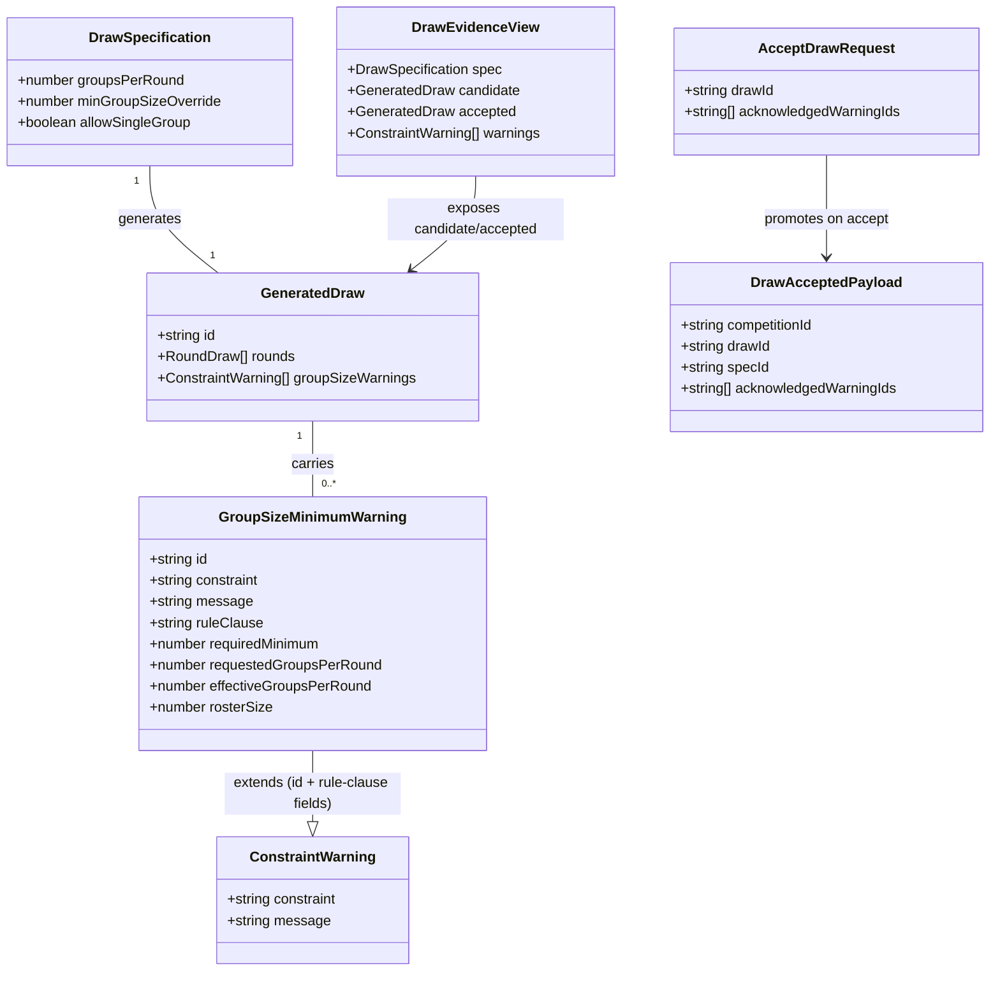

# Warn-and-Override for Rule-Fixed Group-Size Minima

## Requirements

Replace the pre-emptive, silent `minGroupSizeOverride` numeric field with a
generate-time policy that always attempts a draw against the roster and
groups-per-round the Organiser actually asked for, and — only when a task's
rule-fixed per-group minimum genuinely cannot be met — materialises the
closest achievable grouping anyway, attaches a warning naming the shortfall
and its exact FAI rule clause, and blocks the Contest Director from accepting
that draw until each such warning is explicitly acknowledged. This lets small
club rosters below an FAI Championship-scaled minimum actually run a class's
task instead of being locked out or silently guessing an override number, while
keeping the deviation visible and auditable (D14). Scope is bounded to today's
per-round `resolveMin` model (D13/STORY-001-020's per-task grouping is not yet
built); AC2 (naming F3B Speed's shortfall distinctly from Duration/Distance)
is explicitly deferred until STORY-001-020 lands and must not be reported as
complete. The general D1 two-scoring-pilot floor is untouched and stays a
hard rejection.

## Entities



**Conservative constraints applied**: `ConstraintWarning` (`packages/shared/src/draw.ts:120`)
is extended with an optional `id` field rather than replaced — the existing
anti-repeat/consecutive-flight warnings keep working unchanged and simply
never populate `id` (they are not acknowledgement-gated). `GeneratedDraw`
gains one new array field (`groupSizeWarnings`); no existing field is
renamed or removed. `DrawSpecification.minGroupSizeOverride` and
`saveDrawSpecRequestSchema`'s field are left in place (deprecated-in-place,
per the analysis's recommendation) — no schema removal, no migration.

## Approach

1. **Validation/generation split**:
   - `DrawService.assertGroupBound`'s rule-fixed-minimum branch (`maxByMin`)
     stops being a hard rejection. Only the D1 branch (`maxByD1 = floor(R/2)`,
     minimum 2 groups needed to keep ≥ 2 scoring pilots each) remains a thrown
     `GroupSizeOutOfBoundsError`. This is a narrowing of an existing hard
     bound into two independently-governed halves, not a new validation
     pipeline.
   - `resolveMin` stops reading `minGroupSizeOverride` (deprecation:
     supersedes it as the "primary route past a minimum" per D14/Scope In) and
     always resolves the model's own rule-fixed minima. The override field
     stays in the schema and on `DrawSpecification` for backward
     compatibility with already-saved specs, but no longer changes generation
     or save behaviour.
   - Existing tests that rely on `minGroupSizeOverride` to set a custom
     resolved minimum (`AC1`, `AC7 "all other bounds still apply"` in
     `apps/base/test/draw.service.test.ts`) must be updated in this story to
     exercise the new warn-and-generate path instead of the deprecated
     override — this is an intentional, scoped test migration, not
     incidental breakage.

2. **Generation fallback ("closest available grouping")**:
   - Inside `DrawService.generate`, before running `runAttempt`, compute the
     effective groups-per-round to actually generate: if the requested
     `groupsPerRound` already clears the resolved minimum
     (`floor(R / groupsPerRound) >= resolvedMin`), generate exactly as
     requested — no warning.
   - Otherwise, search downward from the requested `groupsPerRound` to `1`
     for the largest `G'` in `[1, floor(R/2)]` such that
     `floor(R / G') >= resolvedMin`. If a `G'` is found, generate with `G'`
     groups instead of the requested count. If no `G'` clears the minimum
     even at `G' = 1` (the roster itself is smaller than the rule-fixed
     minimum), generate a single group containing the whole roster anyway —
     this is the literal AC1 scenario (roster of 5 vs. F3J's minimum of 6).
   - Either way a fallback fired, attach a `GroupSizeMinimumWarning` to the
     `GeneratedDraw`, naming the resolved minimum, the requested and
     effective groups-per-round, the roster size, and the rule clause.
   - This reuses the existing all-or-nothing `runAttempt`/`globalRefine`
     machinery unchanged — only the `G` passed into it differs from the
     spec's stored `groupsPerRound`.

3. **Acknowledgement-gated acceptance**:
   - `DrawService.accept` gains a new required input,
     `acknowledgedWarningIds: string[]`, threaded from a new
     `acknowledgedWarningIds` field on the existing accept route's body
     (`drawDecisionRequestSchema`).
   - Before appending `draw.accepted`, `accept` checks that every id in
     `candidate.groupSizeWarnings` appears in `acknowledgedWarningIds`. If
     any is missing, throw a new `DrawGroupSizeWarningUnacknowledgedError`
     (409) whose message names the missing warning(s) by their `message`
     text (AC3: "states which warning must be acknowledged first").
   - `acknowledgedWarningIds` defaults to `[]` when omitted (a draw with no
     group-size warnings accepts exactly as today, no behaviour change).
   - Using an id array (not a single boolean) is forward-compatible with
     STORY-001-020: when per-task warnings land, `groupSizeWarnings` simply
     grows to one entry per shortfall task, and the same acknowledgement
     mechanism covers it unchanged.

4. **Event-log auditability (D4)**:
   - `DrawAcceptedPayload` gains an additive `acknowledgedWarningIds: string[]`
     field. Existing `draw.accepted` events in the log (and their tests) have
     no such field; the projection must treat it as `[]` when replaying an
     event payload that predates this change, never throw on its absence.
   - The warning itself is already durably recorded as part of
     `draw.generated`'s payload (`GeneratedDraw.groupSizeWarnings`), so no
     separate warning-record event is needed — the deviation is
     reconstructable from the pairing of one `draw.generated` (which
     warning was raised) and one `draw.accepted` (which ids were
     acknowledged) event.

## Structure

### Inheritance Relationships
1. `GroupSizeMinimumWarning` is not a separate TypeScript interface — it is
   modelled as a `ConstraintWarning` (`packages/shared/src/draw.ts:120`) whose
   `id` field is populated (existing anti-repeat/consecutive-flight warnings
   leave `id` undefined).
2. `DrawGroupSizeWarningUnacknowledgedError extends DomainError` (mirrors
   every existing draw error in `apps/base/src/draw/errors.ts`).

### Dependencies
1. `DrawService.generate` calls a new private helper,
   `resolveEffectiveGroupsPerRound(R, requestedG, resolvedMin)`, before
   `runAttempt`.
2. `DrawService.materialise`/`generate` call a new private helper,
   `computeGroupSizeMinimumWarning(model, R, requestedG, effectiveG,
   resolvedMin)`, that builds the warning (or returns none) by reading
   `model.groupSizeMinimumClause` directly off the class model — no
   service-layer lookup table.
3. `DrawService.accept` depends on `candidate.groupSizeWarnings` (read from
   the projection) and the new `acknowledgedWarningIds` input.
4. The route layer (`apps/base/src/routes/draw.ts`) depends on an extended
   `drawDecisionRequestSchema` (`packages/shared/src/draw.ts`) to parse
   `acknowledgedWarningIds` from the accept request body.
5. `apps/base/src/app.ts`'s `setErrorHandler` depends on the new
   `DrawGroupSizeWarningUnacknowledgedError` class to add its one required
   branch (Safeguard 8: a missing branch is a release blocker).

### Layered Architecture
1. **Shared types layer** (`packages/shared/src/draw.ts`,
   `packages/shared/src/events.ts`, `packages/shared/src/class-model.ts`):
   `ConstraintWarning.id`, `GeneratedDraw.groupSizeWarnings`,
   `drawDecisionRequestSchema`'s new field,
   `DrawAcceptedPayload.acknowledgedWarningIds`, the payload copy functions
   (`generatedDrawToPayload`) extended to carry the new array through
   deep-copy, and `ContestClassModel.groupSizeMinimumClause` (the
   data-driven rule-clause field, per CLAUDE.md's core architectural law —
   the core system must not know about any specific competition class, so
   this citation lives on the class model, not a service-layer lookup).
2. **Service layer** (`apps/base/src/draw/service.ts`): all business logic —
   the fallback grouping search, the warning construction (reading the
   clause off `model.groupSizeMinimumClause`), and the acknowledgement
   check in `accept`.
3. **Error layer** (`apps/base/src/draw/errors.ts`): the one new error class.
4. **Route layer** (`apps/base/src/routes/draw.ts`): passes the new field
   from the parsed body into `accept` unchanged (no new endpoint).
5. **Error-handling layer** (`apps/base/src/app.ts`): the one new
   `setErrorHandler` branch, 409, matching the existing draw-error
   convention.

## Operations

### Update Shared Type — `ConstraintWarning` (`packages/shared/src/draw.ts`)
1. Responsibility: carry an optional stable identifier so an acknowledgement
   can reference a specific warning instance.
2. Attributes:
   - `id?: string` — present only for warnings that gate acceptance
     (group-size-minimum kind); absent for the existing non-gating
     anti-repeat/consecutive-flight warnings.
3. Constraints: adding an optional field is additive — no existing caller of
   `ConstraintWarning` needs to change.

### Update Shared Type — `GeneratedDraw` (`packages/shared/src/draw.ts`)
1. Responsibility: carry the authoritative, post-materialisation group-size
   shortfall warning(s) for this specific generated outcome (mirrors
   `FlightGroup.lonePilotFlagged`'s "computed after the fact" pattern).
2. Attributes:
   - `groupSizeWarnings: ConstraintWarning[]` — empty when the resolved
     minimum was met by the requested groups-per-round.
3. Update `generatedDrawToPayload` to copy this array (each entry
   shallow-copied) so the persisted event payload never aliases the
   generator's working data, matching the existing deep-copy convention for
   `distribution.pairs`.

### Update Shared Schema — `drawDecisionRequestSchema` (`packages/shared/src/draw.ts`)
1. Responsibility: accept the Contest Director's acknowledgement alongside
   the existing `drawId` on the accept route only (cancel keeps using the
   same schema but ignores the new field, matching today's shared-schema
   pattern).
2. Attributes:
   - `acknowledgedWarningIds: string[]` — `z.array(z.string()).default([])`.
3. Constraints: no structural cross-field refine needed; the actual
   completeness check (every `groupSizeWarnings` id present) is a
   cross-aggregate concern and belongs in `DrawService.accept`, per Norm 2
   (structural-only validation in Zod).

### Update Shared Payload — `DrawAcceptedPayload` (`packages/shared/src/events.ts`)
1. Responsibility: durably record which warnings the Contest Director
   acknowledged, so the deviation is auditable after the contest (AC4, D4).
2. Attributes:
   - `acknowledgedWarningIds: string[]`.
3. Constraints: additive field on an append-only log payload — the
   projection's `draw.accepted` handler must default a missing value to
   `[]` when replaying an older event, never throw.

### Add Data Field — `ContestClassModel.groupSizeMinimumClause` (`packages/shared/src/class-model.ts`)
1. Responsibility: carry the exact FAI rule clause string to cite in a
   warning message as a plain, data-driven field on the class model itself
   (sourced from `docs/requirements/rules/`, house rule 1 — read-only
   reference, never altered), rather than a core-system function that
   branches on discipline — per CLAUDE.md's core architectural law, the core
   system must not know about any specific competition class, so this
   citation lives in the Contest Class Model, not a `switch` in
   `DrawService`.
2. Attributes:
   - `groupSizeMinimumClause: string | null` — `null` where the class fixes
     no per-group minimum (F5K, F5L — AC6) and so never raises the warning;
     otherwise the clause string, identity metadata like `sourceClass`
     (preserved verbatim through clone/edit, never user-editable, excluded
     from the Zod request schemas).
   - Populated per stock model in `STOCK_CLASS_MODELS`: `"F3B.1.8 b"` (F3B;
     shared by Duration/Distance/Speed per the rule doc — distinct per-task
     naming is STORY-001-020's concern, deferred per AC2), `"F3J.6.1"`
     (F3J), `"F3K.9.1"` (F3K), `"5.5.11.8"` (F5J), `null` (F5K, F5L).
3. Threading: `classModelToCreatedPayload()` (`packages/shared/src/events.ts`)
   carries the field into the persisted event payload; `ClassModelService`'s
   `clone()`/`update()` (`apps/base/src/class-models/service.ts`) preserve it
   verbatim from the source/existing model — the same pattern as
   `sourceClass`. No lookup function exists in the service layer; a seventh
   class only adds one entry to `STOCK_CLASS_MODELS` (NFR-2), no code change
   outside the class model.

### Update Service Method — `DrawService.resolveMin`
1. Responsibility: resolve the class model's rule-fixed per-group minimum,
   no longer influenced by the Organiser's pre-emptive override (deprecated
   per D14 consequence 3).
2. Methods:
   - `resolveMin(model: ContestClassModel): number`
     - Logic: drop the `override` parameter; return
       `Math.max(...model.tasks.map(t => t.minGroupSize).filter(v => v !== null))`
       or `1` if no task fixes a minimum (unchanged fallback).
3. Update both call sites (`getEvidence`, `saveSpec`, `generate`) to stop
   passing `spec.minGroupSizeOverride`.

### Update Service Method — `DrawService.assertGroupBound`
1. Responsibility: remain the *only* hard-rejection gate, now solely for the
   D1 two-scoring-pilot floor; the rule-fixed-minimum branch is removed from
   this function (it moves to the new warn-and-generate path below).
2. Methods:
   - `assertGroupBound(R, G, allowSingleGroup, allowsAllCompetitorsFallback): void`
     - Logic:
       - `G === 1` case: unchanged (spare-scorer override or all-competitors
         escape gate).
       - `G >= 2` case: `upper = floor(R / 2)`; reject (`GroupSizeOutOfBoundsError`)
         only if `upper < 2 || G > upper` — the rule-fixed-minimum
         (`maxByMin`) term is deleted from this bound entirely.
     - The `resolvedMin` parameter is removed from this method's signature;
       both call sites (`saveSpec`, `generate`) drop the argument.
3. Update the error message to describe only the D1 bound (drop the
   "each group needs at least N scoring pilots" clause from the thrown
   text, since that is no longer this function's concern).

### Create Service Method — `DrawService.resolveEffectiveGroupsPerRound`
1. Responsibility: compute the actual groups-per-round to generate with,
   applying the "closest available grouping" fallback when the requested
   count cannot meet the resolved rule-fixed minimum.
2. Methods:
   - `resolveEffectiveGroupsPerRound(R: number, requestedG: number, resolvedMin: number): number`
     - Logic:
       - If `resolvedMin <= 1` (no rule-fixed minimum, e.g. F5K/F5L) or
         `Math.floor(R / requestedG) >= resolvedMin`, return `requestedG`
         unchanged — no shortfall.
       - Otherwise, for `G' = requestedG - 1` down to `1`, return the first
         `G'` for which `Math.floor(R / G') >= resolvedMin`.
       - If no `G' >= 1` satisfies it (roster smaller than the minimum
         itself), return `1` — the whole-roster fallback (AC1).
     - Note: this only searches within `[1, requestedG - 1]`, never above
       the requested count — "closest" means fewer, larger groups, never
       more groups than the Organiser asked for.

### Create Service Method — `DrawService.computeGroupSizeMinimumWarning`
1. Responsibility: build the named, clause-citing warning when
   `resolveEffectiveGroupsPerRound` returned something other than the
   requested count.
2. Methods:
   - `computeGroupSizeMinimumWarning(model, R, requestedG, effectiveG, resolvedMin): ConstraintWarning | null`
     - Logic:
       - Return `null` if `effectiveG === requestedG` (no fallback fired).
       - Read the rule clause directly from
         `model.groupSizeMinimumClause ?? "the class's group-size rule"`
         (defensive fallback text, not `null`, since a fallback only fires
         when `resolvedMin > 1`, i.e. the model does carry a clause).
       - Return `{ id: "group-size-minimum", constraint: "group-size-minimum", message: `<model.name>: <clause> requires at least <resolvedMin> per group; a roster of <R> requesting <requestedG> group(s) cannot meet it, so <effectiveG> group(s) were generated instead` }`.
     - AC1 wording check: for F3J roster 5, `requestedG = 1`,
       `resolvedMin = 6`, `effectiveG = 1` (already 1, fallback search finds
       nothing better) — message must still fire because
       `floor(5/1) = 5 < 6`, i.e. the "no shortfall" check above must key
       off whether the minimum is met, not off whether `effectiveG` changed
       from `requestedG`. Correct this in the logic: compute the warning
       whenever `Math.floor(R / effectiveG) < resolvedMin`, independent of
       whether `effectiveG === requestedG`.

### Update Service Method — `DrawService.generate`
1. Responsibility: use the effective groups-per-round (not the spec's raw
   `groupsPerRound`) for the actual attempt loop, and attach the resulting
   warning to the materialised `GeneratedDraw`.
2. Core method changes:
   - After resolving `resolvedMin = this.resolveMin(model)` and re-checking
     `assertGroupBound(R, spec.groupsPerRound, spec.allowSingleGroup, modelAllowsAllCompetitorsFallback(model))`
     (D1 bound only, now argument-reduced), compute:
     - `effectiveG = this.resolveEffectiveGroupsPerRound(R, spec.groupsPerRound, resolvedMin)`
     - `groupSizeWarning = this.computeGroupSizeMinimumWarning(model, R, spec.groupsPerRound, effectiveG, resolvedMin)`
   - Pass `effectiveG` (not `spec.groupsPerRound`) into every `runAttempt`
     call inside the `ATTEMPTS` loop.
   - Attach `groupSizeWarnings: groupSizeWarning ? [groupSizeWarning] : []`
     onto the constructed `GeneratedDraw` before appending `draw.generated`.
3. Exception Handling: unchanged — `DrawGenerationFailedError` still fires
   only when every attempt at `effectiveG` groups dead-ends (e.g. the
   no-back-to-back rule is unsatisfiable), which is an orthogonal failure
   mode to the group-size fallback.

### Update Service Method — `DrawService.accept`
1. Interface Definition:
   `accept(competitionId: string, drawId: string, acknowledgedWarningIds: string[], attribution: Attribution): DrawEvidenceView`
2. Core Method:
   - After the existing candidate-not-found and superseded-id checks, read
     `candidate.groupSizeWarnings` and compute
     `missing = candidate.groupSizeWarnings.filter(w => w.id && !acknowledgedWarningIds.includes(w.id))`.
   - Input Validation: if `missing.length > 0`, throw
     `DrawGroupSizeWarningUnacknowledgedError` with a message listing each
     missing warning's `message` text (AC3).
   - Business Logic: otherwise append `draw.accepted` with
     `acknowledgedWarningIds` included in the payload (AC4).
   - Return Value: `this.getEvidence(competitionId)`, unchanged.
3. Dependency Injection: none new — reuses the existing constructor deps.

### Create Domain Error — `DrawGroupSizeWarningUnacknowledgedError` (`apps/base/src/draw/errors.ts`)
1. Inheritance: `extends DomainError` (matches every other error in this
   file — no new base class).
2. Attributes:
   - `readonly code = "DRAW_GROUP_SIZE_WARNING_UNACKNOWLEDGED"`.
3. Constructors: single `constructor(message: string) { super(message); }`,
   matching the file's existing convention exactly.
4. Usage Scenarios: thrown by `DrawService.accept` when one or more
   `groupSizeWarnings` ids are absent from the request's
   `acknowledgedWarningIds`.

### Update Route — accept (`apps/base/src/routes/draw.ts`)
1. Responsibility: thread the newly-parsed `acknowledgedWarningIds` from
   the request body into `drawService.accept`.
2. Core method: change
   `drawService.accept(request.params.competitionId, drawId, attribution)`
   to
   `drawService.accept(request.params.competitionId, drawId, acknowledgedWarningIds, attribution)`,
   where `acknowledgedWarningIds` is destructured from the same
   `parseDecision(request.body)` call already in use (the schema now
   returns it alongside `drawId`).

### Update Error Handling — `setErrorHandler` (`apps/base/src/app.ts`)
1. Responsibility: map the one new domain error to its HTTP status,
   preserving Safeguard 8 (every code needs exactly one branch).
2. Methods:
   - Add, alongside the existing `DrawCandidateSupersededError` branch:
     ```ts
     if (error instanceof DrawGroupSizeWarningUnacknowledgedError) {
       reply.code(409).send({ code: error.code, message: error.message } satisfies ErrorResponse);
       return;
     }
     ```
3. Response Format: matches the existing `ErrorResponse` shape used by
   every other draw error — no new response envelope.

### Update Tests — `apps/base/test/draw.service.test.ts`
1. Responsibility: migrate the two existing tests that construct a custom
   resolved minimum via `minGroupSizeOverride` (`"AC1: rejects
   groups-per-round..."` and `"AC7: all other bounds still apply..."`), since
   the override no longer affects `resolveMin` — these must be rewritten to
   assert against the model's real rule-fixed minimum (F3J's 6) instead of
   the deprecated override value of 5.
2. Add new tests directly covering this story's ACs:
   - AC1: F3J roster of 5, `groupsPerRound: 1` (or any requested count) →
     `generate` succeeds, `groupSizeWarnings` has one entry citing `F3J.6`
     and mentioning "5" and "6".
   - AC3: accept a candidate carrying a `groupSizeWarnings` entry with
     `acknowledgedWarningIds: []` → throws
     `DrawGroupSizeWarningUnacknowledgedError`.
   - AC4: accept the same candidate with
     `acknowledgedWarningIds: ["group-size-minimum"]` → succeeds; the
     appended `draw.accepted` event's payload carries
     `acknowledgedWarningIds`.
   - AC5: F3J roster of 12, `groupsPerRound: 2` → `groupSizeWarnings` is
     empty (boundary: `12/2 = 6` meets the minimum exactly, not below it).
   - AC6: F5J or F5L roster of any size → `groupSizeWarnings` is always
     empty, because the model's `groupSizeMinimumClause` field is `null` and
     `resolvedMin` resolves to `1`.

## Norms

1. **Annotation Standards**: none — this is a plain TypeScript/Fastify repo
   with no decorator-based DI; match the existing file's plain-class,
   plain-function style exactly (no new conventions introduced).
2. **Dependency Injection**: constructor injection only, matching
   `DrawService`'s existing pattern — no new dependencies are added by this
   story; all new logic is private methods/module-level pure functions on
   the existing service.
3. **Exception Handling**:
   - New domain error extends the shared `DomainError` base
     (`apps/base/src/pilots/errors.js`), carries a `readonly code` string
     constant and a single-argument human-readable `message` constructor —
     the exact shape every other draw error already follows. No error codes
     or messages should expose internal implementation detail (e.g. no
     stack traces, no raw object dumps) — a plain sentence naming the
     shortfall and its rule clause, matching the existing message style in
     `GroupSizeOutOfBoundsError`.
   - Every new `DomainError` subclass gets exactly one `setErrorHandler`
     branch in `app.ts` (Safeguard 8) — a missing branch is a release
     blocker, not an oversight to defer.
4. **Data Validation**: structural validation (types, required fields,
   array-of-string shape) stays in Zod schemas (`packages/shared`);
   cross-aggregate validation (does an acknowledgement cover every warning
   present on this specific candidate) stays in `DrawService`, per the
   existing Norm 2 split already documented in the code.
5. **Logging**: none beyond the existing immutable event log (D4) — no ad
   hoc console logging is introduced; the event log IS the audit trail.
6. **Documentation Standards**: match the existing file's terse, "why not
   what" comment style — a comment only where a non-obvious constraint or
   rule citation needs explaining (e.g. why the clause is a plain data field
   on the class model rather than a service-layer lookup keyed on
   `sourceClass`), never restating what the code already says.

## Safeguards

1. **Functional Constraints**: draw generation must never throw solely
   because a task's rule-fixed minimum cannot be met by the roster on hand
   (D14 consequence 1) — the only remaining hard-rejection path through
   `assertGroupBound` is the D1 two-scoring-pilot floor. AC2 (per-task
   distinct naming for F3B) is explicitly out of reach until
   STORY-001-020's per-task grouping model lands; this story must not claim
   AC2 as satisfied — it is a scoped, deliberate, tracked gap.
2. **Performance Constraints**: the new fallback search
   (`resolveEffectiveGroupsPerRound`) is O(requestedG) in the worst case,
   negligible at MVP scale (≤ 20 pilots, ≤ 8 groups); it runs once per
   `generate` call, not once per attempt inside the 200-attempt loop.
3. **Security Constraints**: none beyond the existing trust model (D1: no
   auth, club-level tool) — the acknowledgement is a recorded fact of intent
   by whichever attribution called `accept`, not an authorization check.
4. **Integration Constraints**: `DrawAcceptedPayload`'s new
   `acknowledgedWarningIds` field must not break replay of any
   already-appended `draw.accepted` event from STORY-001-017's existing
   fixtures — the projection must default a missing field to `[]`, never
   throw on an old-shape payload. `ConstraintWarning.id` being optional must
   not require changes anywhere `ConstraintWarning` is currently consumed
   (e.g. companion-app display of anti-repeat warnings, if any exists) —
   check for such consumers before merging.
5. **Business Rule Constraints**:
   - The D1 general floor (every group needs ≥ 2 scoring pilots) is
     unaffected by this story and must remain a hard `GroupSizeOutOfBoundsError`
     — verify no test or code path accidentally routes a D1 violation
     through the new warn-and-generate mechanism instead.
   - No group-size-minimum warning may ever be raised for a class whose
     every task has `minGroupSize === null` (F5K, F5L) — AC6.
   - The boundary is inclusive: a roster exactly meeting the resolved
     minimum (`floor(R / effectiveG) === resolvedMin`) must produce zero
     warnings (AC5) — do not use a strict `<` vs. `<=` inconsistently
     between `resolveEffectiveGroupsPerRound` and
     `computeGroupSizeMinimumWarning`.
   - `minGroupSizeOverride` must have zero effect on `resolveMin`,
     `assertGroupBound`, or the new fallback logic once this story lands —
     verify by a regression test that setting a non-null override no longer
     changes generation behaviour.
6. **Exception Handling Constraints**: `DrawGroupSizeWarningUnacknowledgedError`
   must state which specific warning(s) are missing an acknowledgement
   (quoting their `message` text), never a generic "warnings unacknowledged"
   string, satisfying AC3's explicit requirement.
7. **Technical Constraints**: no new persisted aggregate or event type is
   introduced — this story extends three existing shapes
   (`ConstraintWarning`, `GeneratedDraw`, `DrawAcceptedPayload`) additively;
   no existing field is renamed, retyped, or removed, preserving D4's
   append-only replay guarantee.
8. **Data Constraints**: the rule-clause citation strings on
   `ContestClassModel.groupSizeMinimumClause` must source only from
   `docs/requirements/rules/` (house rule 1 — read-only, never edited to fit
   this story) — the four citations to use are `F3J.6.1`, `F3K.9.1`,
   `5.5.11.8` (F5J), and `F3B.1.8 b` (shared across F3B's three tasks in
   this story's per-round scope).
9. **API Constraints**: the accept route's request body shape gains one
   optional-with-default field (`acknowledgedWarningIds`, default `[]`) — a
   client that never sends it behaves exactly as before this story for any
   draw carrying no group-size warnings; no existing accept-route caller
   needs to change unless its draw actually carries a warning to
   acknowledge.
