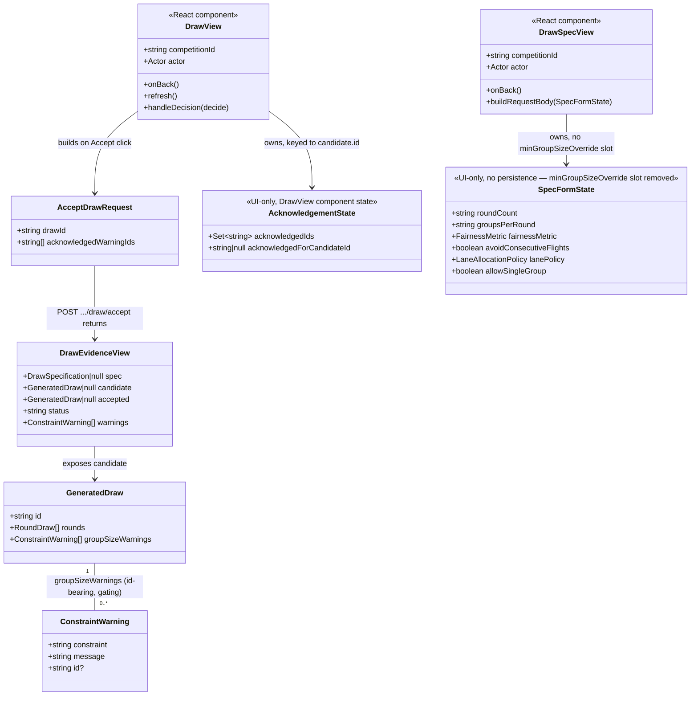

# Group-Size-Warning Acknowledgement in the Companion App

## Requirements

Give the Contest Director a companion-app way to see and explicitly
acknowledge each rule-fixed group-size-minimum warning STORY-001-022's
backend attaches to a candidate draw, and thread that acknowledgement into
the existing single Accept action — without it, `acceptDraw()` never sends
`acknowledgedWarningIds`, so a warned draw always 409s
`DrawGroupSizeWarningUnacknowledgedError` with no route through. Also retire
the Draw Specification Editor's `minGroupSizeOverride` field, which
STORY-001-022 superseded as the mechanism for getting past a rule-fixed
minimum and which now has zero effect on generation while still presenting
as live. Scope is confined to `apps/companion/src/draw/DrawView.tsx`,
`apps/companion/src/draw/api.ts`, and
`apps/companion/src/draw/DrawSpecView.tsx` — no base, event-log, or shared-
schema change; the entire backend contract (STORY-001-022) is already
shipped and tested. A draw with no group-size warnings must accept exactly
as it does today, with zero new UI and zero new friction.

## Entities

**Conservative constraints applied**: no shared type changes — `ConstraintWarning`,
`GeneratedDraw`, `DrawEvidenceView`, and `AcceptDrawRequest`'s wire shape
(`drawDecisionRequestSchema`) already carry everything this story needs
(STORY-001-022, done). `AcknowledgementState` is a new *local* React state
shape only, not a shared/persisted entity — consistent with D8 statelessness.
`SpecFormState` loses one field (`minGroupSizeOverride`); `DrawSpecification`
and `SaveDrawSpecRequest` (the shared types) are unchanged — the field stays
in the wire schema for backward compatibility, only its form presentation is
removed, per the story's own scoping note.

## Approach

1. **Presentation over an already-fetched field, no new fetch**:
   - `DrawView`'s existing `refresh()` already fetches the full
     `DrawEvidenceView` (including `candidate.groupSizeWarnings`) via
     `getDraw()`. No new API call is introduced for display — the warning
     data is already in hand on every render.
   - Render `candidate.groupSizeWarnings` as a new block distinct from the
     existing `evidence.warnings` advisory rendering (`DrawView.tsx:402-407`)
     both in data source (`GeneratedDraw.groupSizeWarnings` vs.
     `DrawEvidenceView.warnings`) and visual treatment (a new `warning`
     badge class vs. the existing `advisory` badge) — AC2's "distinguishable"
     requirement is structural (different array, different badge), not just
     cosmetic.
2. **Acknowledgement as local, candidate-keyed React state**:
   - One `useState<Set<string>>` in `DrawView` holding the ticked
     `groupSizeWarnings[].id`s. A companion `useRef<string | null>` (or
     equivalent) tracks the candidate id the acknowledgement set was built
     for; a `useEffect`/inline check compares `candidate?.id` against that
     ref on every render and clears the set (silently, no dialog) whenever
     the candidate id changes — covers regenerate (AC5-adjacent edge case)
     and the AC4 stale-candidate reconciliation by construction, not by a
     special-cased branch.
   - A per-warning `<input type="checkbox">` toggles membership in the set;
     each checkbox's `id`/`htmlFor` and `key` are the warning's own `id`,
     giving the 1:1 audit correspondence the analysis recommends over a
     single "acknowledge all" control.
3. **Accept-gating is client-side UX only; the base remains authoritative**:
   - The Accept button's existing `disabled={busy}` condition is extended to
     `disabled={busy || !allGroupSizeWarningsAcknowledged}`, where
     `allGroupSizeWarningsAcknowledged` is derived each render as
     `candidate.groupSizeWarnings.every(w => acknowledgedIds.has(w.id))`
     (vacuously true when the array is empty — AC1's zero-friction path
     falls out of this derivation with no separate `length === 0` branch
     needed for the button itself, though the warning block's own
     conditional render still guards on non-empty).
   - `handleDecision("accept")` passes
     `[...acknowledgedIds]` as `acknowledgedWarningIds` into the extended
     `acceptDraw()` call. The base's `DrawService.accept()` re-validates
     independently (STORY-001-022) — the client disable is convenience, the
     409 catch/refresh path (already present in `handleDecision`, lines
     356-365) remains the authoritative backstop for AC4's race, reused
     completely unmodified.
4. **Dead-field retirement is a pure deletion, no replacement UI**:
   - Remove the `minGroupSizeOverride` slot from `SpecFormState`, its
     `defaultForm`/`seedForm` seeding, its `spec-min-group-size` input/label/
     helper-paragraph/field-error block (`DrawSpecView.tsx:282-302`), and its
     form-state setter. Keep `buildRequestBody` sending
     `minGroupSizeOverride: null` as a hardcoded literal (not sourced from
     form state at all) — the shared `SaveDrawSpecRequest` schema still
     requires the key; only the field's presence in the UI is retired.

#### Key Design Decisions
- **Per-warning checkbox, not a single "acknowledge all" control**: gives a
  clean 1:1 correspondence between `ConstraintWarning.id` and the ticked
  state, generalises to multiple concurrent warnings (a future
  STORY-001-020 per-task scenario) without rework, and the friction cost is
  negligible since today's MVP surfaces at most one warning per draw.
- **Reset keyed on `candidate.id` change, not on every `refresh()`**: a
  `refresh()` can fire for reasons unrelated to the candidate changing;
  keying the reset off the candidate's own identity is the precise semantic
  (a stale acknowledgement must never survive a candidate swap, AC4) without
  over-clearing on an unrelated re-fetch.
- **`minGroupSizeOverride` stays `null`-hardcoded in `buildRequestBody`,
  never omitted**: dictated by the still-required shared schema field; no
  dead state is carried in `SpecFormState` to produce it.
- **New `warning` badge class distinct from `advisory`**: reuses the
  existing `` pattern (no new UI primitive) with a
  new, more attention-grabbing class/label ("acknowledgement required") so
  AC2's "distinguishable" requirement is met without inventing a new visual
  vocabulary.

#### Alternatives Considered
- **Single "acknowledge all warnings" checkbox**: rejected per the analysis's
  resolved recommendation — loses per-item audit granularity and would need
  to map to *all* current ids regardless of count; per-warning checkboxes
  cost almost nothing extra today and avoid a future rework.
- **Server-round-trip-only gating (no client-side Accept disable)**: rejected
  as the sole mechanism — AC2 permits it literally ("disabled *or* rejected
  with the base's message") but a client-side disable avoids a guaranteed-
  failing round trip for the common case and costs nothing given the
  acknowledgement state already exists locally; the server rejection stays
  as the authoritative backstop regardless (needed anyway for AC4).
- **Removing `minGroupSizeOverride` from the shared schema/type**: rejected —
  explicitly out of scope per the story's own Integration-points note (kept
  for backward compatibility with already-saved specs); would be an
  unrequested shared-schema change.

## Structure

### Inheritance Relationships
No new classes or interfaces are introduced anywhere in this story — it is a
presentation and request-wiring change over existing shared types
(`ConstraintWarning`, `GeneratedDraw`, `DrawEvidenceView`,
`DrawDecisionRequest`) and existing React components (`DrawView`,
`DrawSpecView`).

### Dependencies
1. `DrawView` depends on `acceptDraw` (`apps/companion/src/draw/api.ts`),
   whose signature gains one new parameter.
2. `DrawView`'s Accept button and the new acknowledgement checkboxes depend
   on the new local `acknowledgedIds` state and its candidate-keyed reset
   logic.
3. `handleDecision`'s existing `catch (error instanceof ApiError)` branch
   (already calling `setAlert` + `refresh()`) depends on nothing new — AC4
   is satisfied by the existing branch receiving a different underlying
   error code, not by a new branch.
4. `DrawSpecView`'s `SpecFormState`, `defaultForm`, `seedForm`, and
   `buildRequestBody` lose their `minGroupSizeOverride` dependency on form
   state (the field becomes a hardcoded `null` literal in
   `buildRequestBody`).

### Layered Architecture
1. **API-seam layer** (`apps/companion/src/draw/api.ts`): `acceptDraw` gains
   an `acknowledgedWarningIds: string[]` parameter, threaded into the
   existing POST body alongside `drawId`. No new function, no new endpoint.
2. **View layer — draw workflow** (`apps/companion/src/draw/DrawView.tsx`):
   owns the new `acknowledgedIds` state, the group-size-warning render
   block, the extended Accept `disabled` condition, and the unmodified
   `handleDecision` call site (now passing the new argument).
3. **View layer — draw spec editor** (`apps/companion/src/draw/DrawSpecView.tsx`):
   loses the `minGroupSizeOverride` form field, its `SpecFormState` slot, and
   its `seedForm`/`defaultForm` wiring; `buildRequestBody` keeps emitting the
   key as a hardcoded `null`.
4. **Shared/base contract layer** (unchanged): `packages/shared/src/draw.ts`
   and every base-side file — this story adds nothing here; STORY-001-022's
   contract is consumed exactly as shipped.

## Operations

### Update API seam — `acceptDraw` (`apps/companion/src/draw/api.ts`)
1. Responsibility: thread the Contest Director's acknowledgement selection
   into the existing accept POST body.
2. Methods:
   - `acceptDraw(request: DrawRequest, competitionId: string, drawId: string, acknowledgedWarningIds: string[]): Promise<DrawEvidenceView>`
     - Logic:
       - Change the POST body from `{ drawId }` to
         `{ drawId, acknowledgedWarningIds }`.
       - No other change — `drawDecisionRequestSchema` already defaults this
         field to `[]` server-side, so this is purely additive on the wire.
3. Constraints: `cancelDraw`'s signature and call are untouched — the
   acknowledgement concept only applies to accept.

### Update View — `DrawView` (`apps/companion/src/draw/DrawView.tsx`)
1. Responsibility: render `candidate.groupSizeWarnings`, collect the Contest
   Director's per-warning acknowledgement, gate Accept on it, and pass the
   acknowledged ids through to `acceptDraw`.
2. New state:
   - `acknowledgedIds: Set<string>` — `useState<Set<string>>(new Set())`.
   - A way to detect "the candidate changed since the set was built" — e.g.
     `useRef<string | null>(null)` holding the last-seen `candidate.id`,
     compared on each render (or in a `useEffect` keyed on
     `candidate?.id`), resetting `acknowledgedIds` to `new Set()` and
     updating the ref whenever the ids differ (including candidate → null,
     e.g. after cancel).
3. New render logic (inside the existing `status === "awaiting-decision" && candidate` block, placed near the existing `evidence.warnings` advisory block but as a visually and structurally separate block):
   - Logic:
     - If `candidate.groupSizeWarnings.length === 0`, render nothing new
       (AC1 — zero-friction path, satisfied by this guard alone).
     - Otherwise, for each entry in `candidate.groupSizeWarnings`, render:
       - A `acknowledgement
         required` (or equivalent distinct class — see Norms) next to
         the warning's full `message`, rendered verbatim (Non-Functional
         Expectation — never truncated/summarised).
       - A `<label>` wrapping an `<input type="checkbox" id={warning.id}
         checked={acknowledgedIds.has(warning.id)} onChange={...}>` that
         toggles membership of `warning.id` in `acknowledgedIds` (new `Set`
         constructed on each toggle, not mutated in place, matching React
         state-update convention).
4. Updated Accept button:
   - Logic:
     - Compute
       `const allAcknowledged = candidate.groupSizeWarnings.every(w => acknowledgedIds.has(w.id))`
       once per render (before the return, alongside the existing
       destructuring).
     - Change `disabled={busy}` to `disabled={busy || !allAcknowledged}` on
       the Accept button only (Regenerate and Cancel draw keep their
       existing `disabled={busy}`, unaffected by acknowledgement state).
5. Updated `handleDecision`:
   - Logic:
     - Change the accept branch from
       `await acceptDraw(request, competitionId, candidate.id)` to
       `await acceptDraw(request, competitionId, candidate.id, [...acknowledgedIds])`.
     - No change to the `cancel` branch, the `try`/`catch`, or the existing
       `catch (error instanceof ApiError) { setAlert(...); await refresh(); }`
       block — AC4 is satisfied by this existing branch now also catching
       `DrawGroupSizeWarningUnacknowledgedError` (409) exactly as it already
       catches `DrawCandidateSupersededError`, with no new `if` branch
       needed since both surface as an `ApiError` with a `.message`.
6. Exception Handling: no new catch branch — `DrawGroupSizeWarningUnacknowledgedError`
   arrives as an `ApiError` and is caught by the existing generic branch,
   consistent with every other draw error already handled on this screen.
7. Constraints: `acknowledgedIds` must never be read or written outside
   `DrawView`'s own render/handlers — no prop drilling, no external state
   store (D8).

### Update View — `DrawSpecView` (`apps/companion/src/draw/DrawSpecView.tsx`)
1. Responsibility: stop presenting the inert `minGroupSizeOverride` field
   while keeping the shared-schema submission unchanged.
2. Changes:
   - Remove `minGroupSizeOverride: string` from the `SpecFormState`
     interface (line 26).
   - Remove `minGroupSizeOverride: ""` from `defaultForm` (line 37).
   - Remove `minGroupSizeOverride: spec.minGroupSizeOverride?.toString() ?? ""`
     from `seedForm` (line 49).
   - In `buildRequestBody`, replace
     `minGroupSizeOverride: values.minGroupSizeOverride === "" ? null : Number(values.minGroupSizeOverride)`
     with a hardcoded `minGroupSizeOverride: null` — the function no longer
     reads this key from `values` at all.
   - Delete the `spec-min-group-size` label, input, helper `
`, and its `fieldErrors?.minGroupSizeOverride`
     rendering block (lines 282-302) from the JSX in full.
3. Constraints: `extractFieldErrors`'s fallback
   (`{ groupsPerRound: [error.response.message] }`) is unaffected — verify
   during implementation (per the analysis's flagged minor risk) that no
   remaining code path can produce a `fieldErrors.minGroupSizeOverride`
   entry that would now have nowhere to render; if the base never validates
   this field (confirmed by STORY-001-022 having moved that check
   elsewhere), no further action is needed beyond this confirmation.

### Update Tests — companion draw workflow and spec editor
1. Responsibility: cover the five ACs directly.
2. Additions/changes (exact test file locations follow the existing
   companion test conventions for these two views):
   - AC1: a candidate with `groupSizeWarnings: []` renders no warning block
     and no acknowledgement checkbox; Accept is enabled exactly as today
     (`disabled={busy}` only).
   - AC2: a candidate with one `groupSizeWarnings` entry renders its
     `message` verbatim with a distinguishing badge, and Accept is disabled
     until the checkbox is ticked.
   - AC3: ticking the checkbox and clicking Accept calls `acceptDraw` with
     `acknowledgedWarningIds` containing exactly that warning's `id`.
   - AC4: simulate `acceptDraw` rejecting with an `ApiError` carrying
     `DRAW_GROUP_SIZE_WARNING_UNACKNOWLEDGED` (or a superseded-candidate
     409) → assert `setAlert` fires with the error's message and `refresh()`
     is called, mirroring the existing superseded-candidate test if one
     exists for this screen.
   - Regenerate/candidate-change: acknowledging a warning, then triggering a
     new `candidate.id` (regenerate or refresh-driven reconciliation) clears
     `acknowledgedIds` — Accept becomes disabled again without a new tick.
   - AC5: `DrawSpecView` renders no `spec-min-group-size` input/label/hint
     for a spec saved with a non-null `minGroupSizeOverride` (pre-story
     data) and for a fresh spec; a save always submits
     `minGroupSizeOverride: null` in the request body regardless of the
     loaded spec's prior value.

## Norms

1. **Component idiom**: extend `DrawView` and `DrawSpecView` in place — no
   new component file, no new state-management library, no router change.
   New state (`acknowledgedIds`) is a plain `useState`/`useRef` pair,
   matching every other piece of transient state already on these screens
   (`busy`, `alert`, `cancelPending`).
2. **Statelessness (D8)**: `acknowledgedIds` is never persisted client-side
   ahead of the accept call and is derived fresh (reset to empty) whenever
   the candidate it applies to changes — it must never survive a candidate
   swap or a page reload as meaningful state.
3. **Error handling (SPA idiom, mirrors STORY-001-019/022)**: no new
   `ApiError` branch is added anywhere — `DrawGroupSizeWarningUnacknowledgedError`
   is caught by the existing generic `ApiError` branch in `handleDecision`,
   consistent with the "surface the base's message verbatim" convention
   used throughout `DrawView` and `DrawSpecView`.
4. **CSS reuse**: reuse the existing `badge`, `status-text`,
   `checkbox-label`, `toolbar`, `btn*`, `field-error`, `dialog*` classes from
   `styles.css`; the one new visual element (the gating-warning badge) is a
   new *class name* (e.g. `badge-warning`) added to `styles.css` following
   the existing `.badge` styling pattern — no new stylesheet, no external
   assets (offline-first, D6).
5. **Message fidelity**: `ConstraintWarning.message` (both the existing
   non-gating advisories and this story's new gating warnings) is always
   rendered as received — no truncation, ellipsizing, or paraphrasing
   anywhere in either view.
6. **Style**: TypeScript + React function components, `.js` import
   specifiers (NodeNext), ~80-col comments explaining *why* (rule/decision/
   AC reference), matching the surrounding companion modules exactly.

## Safeguards

1. **Functional Constraints**: a candidate with `groupSizeWarnings.length === 0`
   must render zero new UI elements and Accept must behave identically to
   pre-story behaviour (AC1) — verify by a test asserting no
   `acknowledgement-required` badge or checkbox exists in that case. A
   candidate with one or more warnings must block Accept until every one is
   individually ticked (AC2) — no "select all" shortcut satisfies this
   unless every id is explicitly present in the ticked set.
2. **Performance Constraints**: none — this is synchronous local React state
   over data already fetched; no new network round trip is added for
   display, only the one additional field on the existing accept POST body.
3. **Security Constraints**: none beyond the existing trust model (D1) — the
   acknowledgement is a recorded fact of Contest Director intent via the
   existing attribution headers, not a new authorization boundary.
4. **Integration Constraints**: `acceptDraw`'s new parameter must not break
   any other existing caller — grep the companion app for every call site of
   `acceptDraw` before merging (currently only `DrawView.handleDecision`) to
   confirm none needs updating separately. `SaveDrawSpecRequest`'s wire shape
   is unchanged — `DrawSpecView` must still submit all eight fields
   including the hardcoded `minGroupSizeOverride: null`, or the PUT fails
   `VALIDATION_FAILED` against the still-required shared schema.
5. **Business Rule Constraints**:
   - Acceptance remains one decision for the whole draw (STORY-001-017) —
     acknowledging warnings must never introduce a second, separate accept
     action or a per-warning "accept" button; it is strictly a precondition
     gating the single existing Accept.
   - Only `ConstraintWarning` entries carrying an `id` are treated as
     gating — the pre-existing non-gating `evidence.warnings` (anti-repeat/
     consecutive-flight advisories, which never carry an `id`) must continue
     rendering exactly as today, via the unmodified existing block, and must
     never be folded into the new acknowledgement mechanism or its checkbox
     list.
   - A stale/superseded candidate's acknowledgement selection must never
     silently attach to a different candidate's warnings (AC4) — verify the
     candidate-id-keyed reset actually fires before the accept call can ever
     reach the base with a mismatched selection, and that the base's own
     409 rejection (the authoritative backstop) is never suppressed or
     swallowed by client-side gating.
6. **Exception Handling Constraints**: `DrawGroupSizeWarningUnacknowledgedError`
   surfaces to the operator via the existing `setAlert(error.response.message)`
   path — verify manually during implementation that the base's message
   (which lists the missing warnings by their own text) reads sensibly as a
   top-of-screen alert, per the Risk & Gap Analysis's flagged coverage note
   for AC4.
7. **Technical Constraints**: no shared-schema, base, or event-log file is
   touched by this story — confine all changes to
   `apps/companion/src/draw/DrawView.tsx`,
   `apps/companion/src/draw/api.ts`, and
   `apps/companion/src/draw/DrawSpecView.tsx` (plus `styles.css` for the one
   new badge class and any test files for the three views). Touching any
   file under `apps/base/` or `packages/shared/` is out of scope and a sign
   the implementation has drifted from this story.
8. **Data Constraints**: the acknowledgement checkbox's `id`/checked-state
   key must be `ConstraintWarning.id` exactly (never `constraint`, which is
   not guaranteed unique across a future multi-warning draw) — using the
   wrong key risks two distinct warnings sharing acknowledgement state.
9. **API Constraints**: `acceptDraw`'s new `acknowledgedWarningIds` parameter
   is required (not optional) at the TypeScript call-site level in this
   story's one caller, even though the wire schema defaults it to `[]` —
   `DrawView` must always pass the current `acknowledgedIds` set (empty or
   not) explicitly, never omit the argument, so the zero-warning path is
   exercised through the same code path as the warned path (defense against
   an accidental future omission bypassing acknowledgement silently).
