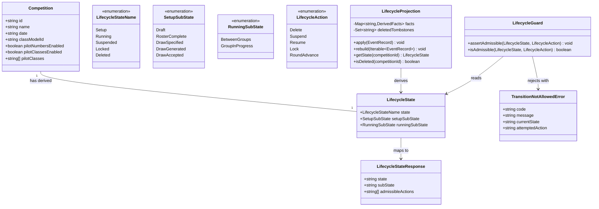

# Competition Lifecycle — Authoritative State & Transition Legality (STORY-001-024)

## Requirements

Implement a **single authoritative lifecycle state** for every competition,
derived purely from the immutable event log, so that any client can read exactly
one current state — **Setup** (with a readiness sub-state), **Running** (with a
BetweenGroups vs GroupInProgress sub-state), **Suspended**, **Locked** or
**Deleted** — and so that the **legality of every lifecycle action** (Delete,
Suspend, Resume, Lock, round-advance) is decided in one place against that state
rather than by scattered ad-hoc guards.

Create a **generic, class-agnostic transition-legality guard** that admits an
action only from the state the state machine allows and rejects it everywhere
else with a clear reason and no state change, recording every admitted
transition in the event log (D4).

Boundaries and constraints:
- The core system interprets the state machine **generically** and must never
  branch on any specific competition class (F3B/F3J/…); all class variance stays
  in the Contest Class Model (CLAUDE.md class-model law, NFR-1/NFR-2).
- This story **owns** state derivation + the generic guard. It does **not**
  originate the Suspend/Resume/Lock/round-advance/group-run domain events —
  those belong to their owning stories; this story defines their event-type
  contracts and consumes them when present.
- Setup readiness is **derived** from existing roster (STORY-001-005) and draw
  (STORY-001-009/017) facts, not a new parallel status.
- Missing foundational facts degrade gracefully to their default state (Setup /
  BetweenGroups), so the model is shippable now and extended additively later.
- All derivation and legality checks are base-local and offline-first (D6).

## Entities

Conservative note: `Competition` is **unchanged** — no `lifecycleState` column is
added. Lifecycle is a derived projection over the existing log, matching every
other module. `LifecycleState` is a plain read DTO, not a stored aggregate.

## Approach

1. **State derivation (class-agnostic projection)**:
   - Add a `LifecycleProjection` in `apps/base/src/lifecycle/`, mirroring the
     existing `*/projection.ts` idiom (pure loader, `apply`/`rebuild`/getters,
     no RNG, no side effects, rebuilt from `eventStore.readAll()` on init).
   - Derive `{ state, setupSubState, runningSubState }` per competition by folding
     four fact sources: competition existence/tombstone, roster presence
     (RosterProjection), draw spec/candidate/accepted (DrawProjection), and the
     new lifecycle-transition event types (started / suspended / resumed / locked
     / group-opened / group-scored) **when they exist in the log**.
   - **Graceful degradation (resolves "missing facts" risk)**: absent any
     "started" fact ⇒ `Setup`; a started competition with no open-group fact ⇒
     `Running/BetweenGroups`; no lock/suspend fact ⇒ not Locked/Suspended. The
     model is complete on paper and forward-compatible; real events swap in
     additively without touching this projection's shape.
   - The derivation contains **no `switch` on discipline** and reads nothing from
     the Contest Class Model — it operates only on generic roster/draw/lifecycle
     facts (CLAUDE.md law).

2. **Generic transition legality**:
   - Add a `LifecycleGuard` driven by a single static table keyed on
     `(LifecycleStateName [+ subState], LifecycleAction) → admissible?`. One
     interpreter, no per-action bespoke code, no class branching.
   - `assertAdmissible` throws `TransitionNotAllowedError` (a `DomainError`
     subtype) carrying the current state and attempted action; `isAdmissible`
     returns a boolean for read-side "what may be done now" reporting.
   - **Ownership (resolves ownership-boundary question)**: this story provides
     the guard and refactors the existing `CompetitionService.delete` locked
     guard to consult it. It does **not** emit Suspend/Resume/Lock/round-advance
     events; the owning stories (STORY-001-013 suspend/resume, the Lock story,
     STORY-001-011 group-run) call `LifecycleGuard.assertAdmissible(...)` before
     appending their own domain event. This story ships the shared event-type
     definitions so those stories emit consistently.

3. **Business logic — Setup readiness ladder with deterministic left-fallback**:
   - Readiness rungs map directly to existing facts: roster non-empty ⇒
     `RosterComplete`; `DrawProjection.getSpec` ⇒ `DrawSpecified`;
     `getCandidate` ⇒ `DrawGenerated`; `hasAccepted` ⇒ `DrawAccepted` (READY).
   - **"Roster complete" definition (resolves ambiguity)**: a competition is
     `RosterComplete` when its roster holds **≥ 1 entry**. This is the concrete,
     defensible, class-agnostic definition — group-size minima are a class-model
     concern (STORY-001-022) and must never enter the core state machine. No new
     "roster complete" event is introduced; the rung is derived. (Revisable
     additively if an explicit Organiser "mark complete" action ever lands.)
   - **Left-fallback as deterministic staleness derivation (resolves AC3)**: the
     projection compares event **sequence numbers** — if the highest-seq
     roster.* or `draw.specSaved` event for a competition is **greater** than the
     seq of its latest `draw.generated`, the candidate is stale and readiness
     falls back to the earliest affected rung (roster edit ⇒ `RosterComplete`;
     draw-spec edit ⇒ `DrawSpecified`). This is a pure read-side derivation over
     log ordering — it does **not** reach into or mutate the roster/draw
     services, and it does not require a `draw.cancelled` cascade to fire.
   - **READY/roster coupling (resolves ambiguity)**: `DrawAccepted` is reported
     only when an accepted draw exists **and** is not stale by the seq rule
     above; since acceptance sits over a current candidate and any later input
     edit invalidates it, `DrawAccepted` always implies a complete, current
     roster — no separate coupling rule needed.

4. **Deleted observability (resolves tombstone risk)**:
   - `CompetitionProjection` continues to drop the row on `competition.deleted`.
     The new `LifecycleProjection` **retains a tombstone marker** (a `Set` of
     deleted ids) so that reading a deleted competition's state reports
     `Deleted` (AC1) rather than being indistinguishable from never-existed.

5. **Exposure & recording**:
   - Add `GET /api/competitions/:id/lifecycle` returning
     `{ state, subState, admissibleActions }`, following the existing
     `routes/competitions.ts` pattern; the companion consumes it.
   - Admitted transitions are recorded via `EventStore.append` (by the owning
     services, using this story's event-type contracts); rejected ones throw
     `TransitionNotAllowedError` and append nothing (AC7). Global error handling
     reuses the existing `DomainError → setErrorHandler` branch mechanism.

## Structure

### Inheritance Relationships
1. `TransitionNotAllowedError` extends `DomainError` (reusing the existing
   `apps/base/src/pilots/errors.js` base, exported through
   `competitions/errors.ts`), with a stable `code` = `TRANSITION_NOT_ALLOWED`.
2. `LifecycleProjection` follows the same structural contract as
   `CompetitionProjection` / `DrawProjection` / `RosterProjection`
   (`apply`, `rebuild`, getters) — a convention, not a base class.
3. `LifecycleGuard` is a stateless collaborator (pure functions over a static
   table); no inheritance.

### Dependencies
1. `LifecycleProjection` depends on `RosterProjection` and `DrawProjection`
   (read-only, injected via constructor) plus its own consumption of
   competition.* and lifecycle.* events; it never imports the draw/roster
   *services* (no cycle — matches the app-wiring provider-injection discipline).
2. `LifecycleGuard` depends on nothing — it is a pure interpreter of
   `(state, action)`.
3. `CompetitionService` depends on `LifecycleProjection` + `LifecycleGuard` to
   replace its ad-hoc locked-delete guard with a state-driven check.
4. Route layer (`routes/competitions.ts`) depends on `LifecycleProjection`
   (read) and, for actions, on services that consult `LifecycleGuard`.
5. `buildApp` (`app.ts`) constructs `LifecycleProjection` after
   `RosterProjection` and `DrawProjection` (ordering discipline), rebuilds it
   from `eventStore.readAll()`, and wires it into `CompetitionService`.

### Layered Architecture
1. Route Layer: `GET /api/competitions/:id/lifecycle` read endpoint;
   attribution-from-headers reuse for any action route.
2. Service Layer: `CompetitionService` (refactored to consult the guard);
   future owning services call `LifecycleGuard.assertAdmissible` before append.
3. Projection Layer: `LifecycleProjection` derives state; `LifecycleGuard`
   decides legality — both pure, base-local, offline.
4. Event Store Layer: `EventStore.append` records admitted transitions;
   projections rebuild from the single append-only table (D4/D7).
5. Exception Handling Layer: existing centralised `setErrorHandler` maps
   `TransitionNotAllowedError` (a `DomainError`) to a domain-coded 4xx response.

## Operations

### Create Shared Types - lifecycle state & events (`packages/shared/src/lifecycle.ts`)
1. Responsibility: define the class-agnostic lifecycle vocabulary shared by base
   and companion.
2. Attributes / Types:
   - `LifecycleStateName`: `"Setup" | "Running" | "Suspended" | "Locked" | "Deleted"`.
   - `SetupSubState`: `"Draft" | "RosterComplete" | "DrawSpecified" | "DrawGenerated" | "DrawAccepted"`.
   - `RunningSubState`: `"BetweenGroups" | "GroupInProgress"`.
   - `LifecycleAction`: `"Delete" | "Suspend" | "Resume" | "Lock" | "RoundAdvance"`.
   - `LifecycleState`: `{ state, setupSubState?, runningSubState? }` (sub-state
     present only within its composite).
   - `LifecycleStateResponse`: `{ state, subState, admissibleActions }` read DTO.
3. Constraints: enums are **additive-only** (NFR-2) — never renamed or reshaped.
4. Note: exported from `packages/shared/src/index.ts` alongside existing shared
   types.

### Create Shared Types - lifecycle transition events (`packages/shared/src/events.ts` additions)
1. Responsibility: define event-type contracts so **owning** stories emit
   consistently; this story consumes them and does not emit them.
2. Event types (additive to existing union):
   - `"competition.started"` (Setup → Running; owned by STORY-001-025).
   - `"competition.suspended"` / `"competition.resumed"` (owned by STORY-001-013).
   - `"competition.locked"` (owned by the Lock story).
   - `"group.opened"` / `"group.scored"` (owned by STORY-001-011 / Area 6).
   - `"competition.roundAdvanced"` (owned by the round story).
3. Payloads: minimal reference shape `{ competitionId, ... }` filed under
   `scope = "competitions"` for registry-level lifecycle facts (started/
   suspended/resumed/locked) and `scope = competitionId` for content-level
   run facts (group.opened/group.scored/roundAdvanced), matching the existing
   scope convention.
4. Constraints: this story adds only the **type declarations**; no service in
   this story appends these except in test seeding.

### Create Projection - LifecycleProjection (`apps/base/src/lifecycle/projection.ts`)
1. Responsibility: derive one `LifecycleState` per competition from the log;
   retain a Deleted tombstone marker; pure loader (no RNG, no side effects).
2. Attributes:
   - `started: Set<string>` - competitions with a `competition.started` fact.
   - `suspended: Set<string>` - currently suspended (set on suspended, cleared on resumed).
   - `locked: Set<string>` - terminal lock marker.
   - `openGroups: Map<string, number>` - count/flag of currently open groups per competition (set on group.opened, cleared on group.scored).
   - `deletedTombstones: Set<string>` - retained so Deleted is reportable.
   - `latestInputSeq: Map<string, number>` - highest seq of a roster.* or draw.specSaved event per competition (for staleness).
   - `latestGeneratedSeq: Map<string, number>` - seq of the latest draw.generated per competition.
   - Injected read-only collaborators: `rosterProjection`, `drawProjection`.
3. Methods:
   - `apply(record: EventRecord): void`
     - Logic:
       - On `competition.deleted` (scope `competitions`): add id to `deletedTombstones`.
       - On `competition.started`: add to `started`.
       - On `competition.suspended`: add to `suspended`; on `competition.resumed`: remove from `suspended`.
       - On `competition.locked`: add to `locked`.
       - On `group.opened`: mark open for scope; on `group.scored`: clear open for scope.
       - On any `roster.*` or `draw.specSaved`: set `latestInputSeq[scope] = max(existing, record.seq)`.
       - On `draw.generated`: set `latestGeneratedSeq[scope] = record.seq`.
       - Unrecognised types: no-op (guard by type, ignore the rest).
   - `rebuild(events): void` - reset all maps/sets, replay in seq order.
   - `getState(competitionId: string): LifecycleState`
     - Logic (evaluated in strict precedence, exactly one state):
       - If `deletedTombstones.has(id)` ⇒ `{ state: "Deleted" }`.
       - Else if `locked.has(id)` ⇒ `{ state: "Locked" }`.
       - Else if `suspended.has(id)` ⇒ `{ state: "Suspended" }`.
       - Else if `started.has(id)` ⇒ `{ state: "Running", runningSubState: openGroups>0 ? "GroupInProgress" : "BetweenGroups" }`.
       - Else ⇒ `{ state: "Setup", setupSubState: deriveSetupSubState(id) }`.
   - `deriveSetupSubState(id): SetupSubState` (private)
     - Logic:
       - Compute stale = `latestInputSeq[id] > latestGeneratedSeq[id]` (missing generated ⇒ treat as no candidate).
       - If `drawProjection.hasAccepted(id)` and not stale ⇒ `DrawAccepted`.
       - Else if `drawProjection.getCandidate(id)` present and not stale ⇒ `DrawGenerated`.
       - Else if `drawProjection.getSpec(id)` present ⇒ `DrawSpecified`.
       - Else if `rosterProjection.getRoster(id).length >= 1` ⇒ `RosterComplete`.
       - Else ⇒ `Draft`.
       - (Stale candidate/accepted collapses to `DrawSpecified` if a spec still
         exists, else to `RosterComplete` — deterministic left-fallback, AC3.)
   - `isDeleted(id): boolean`.
4. Constraints: no discipline/class branching; rebuildable at will; single guard
   on record type before touching state.

### Create Guard - LifecycleGuard (`apps/base/src/lifecycle/guard.ts`)
1. Responsibility: decide, generically, whether a `LifecycleAction` is admissible
   from a `LifecycleState`.
2. Core table (the single source of legality):
   - `Delete`: admissible **iff** `state === "Setup"` (any sub-state).
   - `Suspend`: admissible iff `state === "Running" && runningSubState === "BetweenGroups"`.
   - `Lock`: admissible iff `state === "Running" && runningSubState === "BetweenGroups"`.
   - `RoundAdvance`: admissible iff `state === "Running" && runningSubState === "BetweenGroups"`.
   - `Resume`: admissible iff `state === "Suspended"`.
   - `Deleted` / `Locked` are terminal: nothing is admissible from them.
3. Methods:
   - `isAdmissible(state: LifecycleState, action: LifecycleAction): boolean` - pure table lookup.
   - `assertAdmissible(state, action): void` - throws `TransitionNotAllowedError`
     with a human-readable reason (e.g. "A competition can be deleted only during
     Setup") when not admissible; returns silently otherwise.
   - `admissibleActions(state): LifecycleAction[]` - for the read DTO.
4. Constraints: no class knowledge; the table is the only place legality lives.

### Create Error - TransitionNotAllowedError (`apps/base/src/lifecycle/errors.ts` or competitions/errors.ts)
1. Inheritance: extends `DomainError`.
2. Attributes:
   - `code: "TRANSITION_NOT_ALLOWED"`.
   - `currentState: string` - the state the competition was in.
   - `attemptedAction: string` - the rejected action.
3. Constructors: `(message, currentState, attemptedAction)`.
4. Usage: thrown by `LifecycleGuard.assertAdmissible` and surfaced by the
   centralised `setErrorHandler` as a domain-coded 4xx (no state mutation, AC7).

### Update Service - CompetitionService (`apps/base/src/competitions/service.ts`)
1. Responsibility: route the existing delete guard through the new authoritative
   layer so legality lives in one place (no second opinion).
2. Core change: in `delete(...)`, after not-found, replace the direct
   `lockState.isLocked` locked-guard with
   `lifecycleGuard.assertAdmissible(lifecycleProjection.getState(id), "Delete")`.
   - Input Validation: not-found still first (`CompetitionNotFoundError`).
   - Business Logic: guard now rejects Running/Suspended/Locked deletes uniformly
     with `TransitionNotAllowedError`; the captured-scores confirmation flow for
     a Setup-state delete is preserved unchanged.
   - Exception Handling: preserve existing error codes for behaviours other
     stories still assert; only the "cannot delete non-Setup" path is unified.
3. Dependency Injection: add `lifecycleProjection` and `lifecycleGuard` to the
   constructor (defaulted in `buildApp`).
4. Backward compatibility: STORY-001-003 Setup-path delete behaviour is
   unchanged; existing tests must still pass.

### Create Route - lifecycle read (`apps/base/src/routes/competitions.ts`)
1. Responsibility: expose the derived state.
2. Method: `GET /api/competitions/:id/lifecycle`
   - Logic: 404 (`CompetitionNotFoundError`) only if the competition never
     existed AND is not a Deleted tombstone; otherwise return
     `{ state, subState, admissibleActions }` from
     `lifecycleProjection.getState(id)` + `lifecycleGuard.admissibleActions(...)`.
     A Deleted competition returns `200` with `state: "Deleted"` (AC1).
3. Annotations/pattern: same Fastify typed-params + attribution-from-headers
   idiom as the existing routes.

### Update Wiring - buildApp (`apps/base/src/app.ts`)
1. Construct `LifecycleProjection(rosterProjection, drawProjection)` after those
   two projections; `rebuild(eventStore.readAll())`.
2. Construct a single `LifecycleGuard`.
3. Inject both into `CompetitionService`.
4. Register the lifecycle read route.
5. Feed the new projection from the same append stream as the others (rebuild on
   init; `apply` on each append via the existing wiring pattern).

### Add Tests (`apps/base/src/lifecycle/*.test.ts`)
1. Setup ladder Draft→RosterComplete→DrawSpecified→DrawGenerated→DrawAccepted (AC2).
2. Left-fallback: roster edit after a candidate ⇒ RosterComplete; spec edit ⇒
   DrawSpecified (AC3) — driven by seeding events with ascending seq.
3. Delete rejected from Running/Suspended/Locked, admitted from Setup (AC4) —
   using seeded `competition.started` / `competition.locked` facts.
4. Suspend/Lock/RoundAdvance rejected from GroupInProgress, admitted from
   BetweenGroups (AC5) — using seeded `group.opened`/`group.scored`.
5. Resume rejected when Running, admitted when Suspended (AC6).
6. Admitted transition recorded, rejected transition appends nothing (AC7).
7. Deleted competition reports `Deleted`, not 404 (observability).
8. A guard/derivation grep-level assertion that no discipline literal appears in
   the lifecycle module (class-agnostic law).

## Norms

1. Module layout: new code lives in `apps/base/src/lifecycle/`
   (`projection.ts`, `guard.ts`, `errors.ts`, tests) and
   `packages/shared/src/lifecycle.ts`; mirrors the one-folder-per-concern
   convention already in `apps/base/src`.
2. Projection standards: pure loader only — `apply` guards on record type/scope
   before mutating; `rebuild` fully resets then replays in seq order; no RNG, no
   network, no side effects; derived state is discardable and rebuildable (D4/D7).
3. Guard standards: legality lives in exactly one static table; `isAdmissible`
   is pure; `assertAdmissible` throws a `DomainError` subtype — never returns an
   ad-hoc boolean/null for an illegal action.
4. Exception handling:
   - `TransitionNotAllowedError extends DomainError`; carries `code`,
     `currentState`, `attemptedAction`; surfaced by the existing centralised
     `setErrorHandler` branch (no new error-handling framework).
   - Rejections never mutate state and never append an event (AC7).
   - Messages are operator-facing and reveal no internal implementation detail.
5. Class-agnostic rule (load-bearing, CLAUDE.md): no file in the lifecycle module
   references any discipline (`F3B`/`F3J`/…) or reads the Contest Class Model.
   Any such reference is a defect.
6. Additive extensibility (NFR-2): new event types and states extend the existing
   unions; never rename or reshape. Consuming a not-yet-emitted event type is a
   no-op today and becomes live automatically when its owning story emits it.
7. Dependency direction: the lifecycle module imports other *projections*
   (read), never other *services* — preserving the acyclic module graph and the
   provider-injection discipline used elsewhere in `app.ts`.
8. Attribution: any admitted lifecycle transition (emitted by owning stories)
   carries the standard `Attribution` stamp; this story adds no new attribution
   shape.

## Safeguards

1. Functional Constraints:
   - Exactly one `state` is reported per competition at all times (AC1);
     sub-states appear only within their composite (Setup ⇒ setupSubState;
     Running ⇒ runningSubState).
   - Setup readiness advances Draft → RosterComplete → DrawSpecified →
     DrawGenerated → DrawAccepted strictly from existing roster/draw facts (AC2),
     with no parallel status store.
   - Editing an input (roster or draw spec) after a candidate exists
     deterministically falls the state back to the earliest affected rung and
     reports no current draw (AC3).
   - Delete admissible only from Setup (AC4); Suspend/Lock/RoundAdvance
     admissible only from Running/BetweenGroups (AC5); Resume only from
     Suspended (AC6).
2. Performance Constraints: `getState` is O(1)/O(roster-size) map/set lookups;
   `better-sqlite3` is synchronous single-connection so appends serialise
   naturally; no added latency budget concern at MVP scale (≤ 20 pilots,
   ≤ 8 rounds).
3. Security Constraints: club-trust model — no auth added; auditability comes
   from the immutable event log (D4). Error messages expose no internals.
4. Integration Constraints:
   - `Competition` aggregate shape is unchanged (no state column); backward
     compatible with STORY-001-003/004/005/009/017.
   - Consumes STORY-001-017's draw acceptance facts and STORY-001-005's roster
     facts directly; does not re-implement them.
   - Suspend/Resume/Lock/RoundAdvance/group-run **event emission is owned by
     other stories** — this story provides only the type contracts and the guard
     they call; missing emitters degrade to default state, never an error.
5. Business Rule Constraints:
   - "Roster complete" ≡ roster has ≥ 1 entry (concrete, class-agnostic;
     group-size minima stay in the class model, STORY-001-022).
   - `DrawAccepted` (READY) is reported only when an accepted, non-stale draw
     exists, which structurally implies a current complete roster.
   - Terminal states (Locked, Deleted) admit no further action.
6. Exception Handling Constraints:
   - Every rejected transition throws `TransitionNotAllowedError` with a clear
     code, current state, and attempted action; state is unchanged and no event
     is appended (AC7).
   - All lifecycle legality rejections flow through the centralised error
     handler; none expose internal state.
7. Technical Constraints:
   - The lifecycle module contains **no branch on any competition class**
     (CLAUDE.md class-model law) — verified by test.
   - Derivation and guarding are entirely base-local and offline (D6).
   - Projection is a strict pure loader; any RNG or side effect in
     apply/rebuild is a defect.
8. Data Constraints:
   - State is derived from the log, never stored; the log (D4) is the sole record
     of change.
   - Deleted competitions retain a tombstone marker in the lifecycle projection
     so `Deleted` is reportable and distinguishable from never-existed, even
     though `CompetitionProjection` still drops the row.
   - Left-fallback staleness is decided by event **sequence-number ordering**
     (input-event seq vs draw.generated seq), giving deterministic replay.
9. API Constraints:
   - `GET /api/competitions/:id/lifecycle` returns
     `{ state, subState, admissibleActions }`; a Deleted competition returns
     `200` with `state: "Deleted"`, a never-existed id returns `404`.
   - New event-type names are additive and stable; enum values are never renamed.
