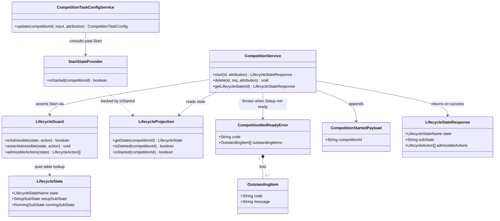

# Start Proceedings — Open a Competition for Running (STORY-001-025)

## Requirements

Implement the **Start Proceedings** command: a single deliberate Contest-Director
action that transitions a competition from **Setup** to **Running
(BetweenGroups)**, recorded in the immutable event log with contest-director
authority.

- Gate the transition on readiness — admissible **only** from `Setup` with
  sub-state `DrawAccepted` (roster complete *and* draw accepted). A blocked start
  changes nothing and returns the **list of outstanding prerequisites**, each as a
  stable machine code plus a human-readable message.
- Reject a start from any non-ready state (Running / Suspended / Locked / Deleted)
  with no second start recorded.
- Establish the **configuration-authority boundary** the running phase keys off:
  the same scoring/running-config edit is stamped `authority: "organiser"` while
  in Setup and `authority: "contest-director"` once proceedings have started.

**Boundary / constraints (authoritative — from Resolved Clarifications 2026-07-14):**
- **AC6 is RECORD-ONLY.** After Start, a config edit is **never rejected**; the
  boundary only flips the *recorded* authority attribution (organiser →
  contest-director). No authentication, no 4xx path for AC6 (D1 trust model).
- **"Roster complete" ≡ the existing `RosterComplete` rung (≥1 roster entry)** as
  derived in `LifecycleProjection.deriveSetupSubState`. No stricter/minimum-size
  rule; thin-roster judgement stays upstream at draw time (D14).
- **AC6 config scope = the task-config (3.7) path only** this story. Establish a
  shared "past-Start" predicate seam that the remaining 3.5–3.8 config commands
  adopt as they are built; do not gate config surfaces that do not yet exist.
- The readiness gate and the Setup/Running boundary carry **no knowledge of any
  competition class** (CLAUDE.md class-model law). Reads only roster count + draw
  acceptance, both already class-agnostic. Offline-first (D6): all reads are
  local, log-derived facts.

## Entities

**Conservative-design notes (do not over-build):**
- `CompetitionStartedPayload` and the `competition.started` event type **already
  exist** in `packages/shared/src/events.ts` (declared by STORY-001-024). Do not
  redeclare — this story is the owner-emitter.
- `LifecycleProjection.apply` **already** folds `competition.started` into
  `Running`. No projection change beyond exposing an `isStarted(id)` reader for
  the config-boundary seam.
- `OutstandingItem` is a small `{ code: string; message: string }` DTO in shared —
  do not model a class hierarchy.
- Reuse the existing `Attribution` type and `cdAttributionFromHeaders` idiom; do
  not invent an authority framework.

## Approach

1. **Guard table extension (legality lives in one place):**
   - Add `"Start"` to the `LifecycleAction` union (`packages/shared/src/lifecycle.ts`)
     — additive-only (NFR-2).
   - Add one `Start` branch to `LifecycleGuard.isAdmissible`: admissible iff
     `state.state === "Setup" && state.setupSubState === "DrawAccepted"`. Add its
     entry to `ALL_ACTIONS` and `REJECTION_REASON`. AC7 (no double-start; not from
     Running/Suspended/Locked/Deleted) then falls out of the table for free; Start
     also surfaces in the read-side `admissibleActions` set automatically.

2. **Command → assert → append → apply (mirrors the existing `delete` command):**
   - New `CompetitionService.start(id, attribution)`. Order: not-found check →
     read derived state → **readiness split** → guard assert → append
     `competition.started` (scope `"competitions"`, payload `{ competitionId }`)
     → `projection.apply` → return the fresh `getLifecycleState(id)`.
   - **Readiness split (load-bearing):** if `state.state === "Setup"` and
     `setupSubState !== "DrawAccepted"`, throw `CompetitionNotReadyError` with the
     outstanding-items list (409 `COMPETITION_NOT_READY`) — AC2/AC3. Otherwise call
     `guard.assertAdmissible(state, "Start")`, which admits Setup/DrawAccepted and
     rejects every other state with `TransitionNotAllowedError` (409
     `TRANSITION_NOT_ALLOWED`) — AC7. This keeps the guard a pure boolean table
     (the readiness *list* is computed service-side, never in the guard).

3. **Outstanding-items derived from the Setup sub-state ladder (no new reads):**
   - `ROSTER_INCOMPLETE` when sub-state is `Draft` (roster below the
     `RosterComplete` rung).
   - `DRAW_NOT_ACCEPTED` whenever sub-state is below `DrawAccepted`
     (`Draft` / `RosterComplete` / `DrawSpecified` / `DrawGenerated`).
   - AC2 (Draft) → both items; AC3 (DrawGenerated) → the draw item alone.
   - A stale-collapsed candidate (roster edited after acceptance) reports its
     *collapsed* rung, so Start correctly re-blocks — already handled by
     `deriveSetupSubState`; assert it in tests.

4. **Config-authority boundary — RECORD-ONLY (AC6):**
   - Introduce a shared, class-agnostic seam `StartStateProvider { isStarted(id) }`,
     mirroring the existing `LockStateProvider` / `DrawStateProvider` provider
     pattern so config modules never import the lifecycle module.
   - Back it with `ProjectionStartStateProvider` reading a new
     `LifecycleProjection.isStarted(id)` (the `started` set membership — true also
     while Suspended/Locked, i.e. genuinely "past Start").
   - Inject it into `CompetitionTaskConfigService`. In `update`, after all existing
     validation and **immediately before the append**, if `isStarted(competitionId)`
     is true, stamp the appended event's attribution `authority` as
     `"contest-director"`; otherwise leave the route-supplied `"organiser"`. The
     base **verifies and rejects nothing** — the only observable before/after
     difference is the recorded authority string on `taskConfig.updated`.

5. **Routes:**
   - `POST /api/competitions/:id/start` on `registerCompetitionRoutes`, stamping CD
     authority via the `cdAttributionFromHeaders` idiom (copied from the draw
     route; recorded, not enforced — D1). Returns 200 with the new
     `LifecycleStateResponse`.
   - Task-config route is unchanged (still passes organiser attribution); the
     service overrides the authority when past Start.

6. **Companion (presentation only; the base gate is authoritative):**
   - A Start action on the competition/lifecycle view, enabled only when
     `admissibleActions` includes `Start`.
   - A blocked-start surface that renders `outstandingItems[].message`, switching
     on `.code` for localisation.

## Structure

### Inheritance Relationships
1. `CompetitionNotReadyError extends DomainError` (`apps/base/src/competitions/errors.ts`),
   carrying `readonly outstandingItems: OutstandingItem[]`; `code =
   "COMPETITION_NOT_READY"`.
2. `TransitionNotAllowedError extends DomainError` — reused unchanged for AC7.
3. `ProjectionStartStateProvider implements StartStateProvider`.
4. `LifecycleAction` (shared union) gains member `"Start"`.

### Dependencies
1. `CompetitionService.start` depends on `LifecycleProjection` (read state) +
   `LifecycleGuard` (assert) + `EventStore` (append) — all already injected.
2. `CompetitionTaskConfigService` newly depends on `StartStateProvider` (injected;
   never imports the lifecycle module directly).
3. `ProjectionStartStateProvider` depends on `LifecycleProjection.isStarted`.
4. `registerCompetitionRoutes` depends on `CompetitionService.start`; the Start
   route injects `cdAttributionFromHeaders`.
5. `app.setErrorHandler` gains a `CompetitionNotReadyError` branch (409 with
   `details.outstandingItems`).

### Layered Architecture
1. Route Layer: `POST /:id/start` assembles CD attribution, delegates to service,
   returns lifecycle DTO; task-config route unchanged.
2. Service Layer: `CompetitionService.start` (transition + readiness split);
   `CompetitionTaskConfigService.update` (authority stamping past Start).
3. Guard Layer: `LifecycleGuard` — pure `(state, action)` legality table.
4. Projection Layer: `LifecycleProjection` — derives state; new `isStarted` reader.
5. Event Store Layer: append `competition.started`; append `taskConfig.updated`
   with boundary-selected authority.
6. Error-Handling Layer: centralised `setErrorHandler` maps
   `CompetitionNotReadyError` → 409, `TransitionNotAllowedError` → 409.

## Operations

### Update Shared Vocabulary — `packages/shared/src/lifecycle.ts`
1. Add `"Start"` to the `LifecycleAction` union: `"Delete" | "Suspend" | "Resume"
   | "Lock" | "RoundAdvance" | "Start"`.
2. Do **not** touch `LifecycleStateName` / `SetupSubState` / `RunningSubState`.
3. Constraint: additive-only; existing members unchanged (NFR-2).

### Add Shared DTO — `OutstandingItem`
1. Location: `packages/shared/src/lifecycle.ts` (or the events/DTO module beside
   `LifecycleStateResponse`), exported from the shared barrel.
2. Shape: `interface OutstandingItem { code: string; message: string }`.
3. Optionally a `type OutstandingItemCode = "ROSTER_INCOMPLETE" |
   "DRAW_NOT_ACCEPTED"` union for `code`, kept additive-only.

### Update Guard — `apps/base/src/lifecycle/guard.ts`
1. Add `"Start"` to `ALL_ACTIONS`.
2. Add to `REJECTION_REASON`: `Start: "Proceedings can be started only when the
   roster is complete and the draw accepted"`.
3. Add case to `isAdmissible`:
   - `case "Start": return state.state === "Setup" && state.setupSubState ===
     "DrawAccepted";`
4. Constraint: guard stays a pure boolean table — **no** readiness-list logic
   here (class-agnostic law; guard-purity contract from STORY-001-024).

### Add Reader — `apps/base/src/lifecycle/projection.ts`
1. Add `isStarted(competitionId: string): boolean { return
   this.started.has(competitionId); }`.
2. Semantics: true once `competition.started` is folded, and stays true while
   Suspended/Locked (genuinely past Start). No behaviour change to `getState` /
   `apply` / `rebuild`.

### Create Error — `CompetitionNotReadyError` (`apps/base/src/competitions/errors.ts`)
1. Inheritance: `extends DomainError`.
2. Attributes: `readonly code = "COMPETITION_NOT_READY"`; `readonly
   outstandingItems: OutstandingItem[]`.
3. Constructor: `(message: string, outstandingItems: OutstandingItem[])`.
4. Usage: thrown by `CompetitionService.start` when the competition is in `Setup`
   below `DrawAccepted`.

### Implement Command — `CompetitionService.start`
1. Signature: `start(id: string, attribution: Attribution): LifecycleStateResponse`.
2. Dependencies: existing `eventStore`, `projection`, `lifecycleProjection`,
   `lifecycleGuard` (no new constructor args).
3. Logic (strict order):
   - **Not-found:** if `!this.projection.getById(id) &&
     !this.lifecycleProjection.isDeleted(id)` → throw `CompetitionNotFoundError`.
   - **Read state:** `const state = this.lifecycleProjection.getState(id)`.
   - **Readiness split:** if `state.state === "Setup" && state.setupSubState !==
     "DrawAccepted"` → build `outstandingItems` from `state.setupSubState` (see
     helper) → throw `CompetitionNotReadyError`.
   - **Guard:** `this.lifecycleGuard.assertAdmissible(state, "Start")` — admits
     Setup/DrawAccepted; rejects Running/Suspended/Locked/Deleted with
     `TransitionNotAllowedError` (AC7).
   - **Append + apply:** append `{ scope: "competitions", type:
     "competition.started", payload: { competitionId: id }, attribution }`;
     `this.lifecycleProjection.apply(record)` (and any other projection wired via
     the `onEvent` hook is fed automatically by the event store).
   - **Return:** `this.getLifecycleState(id)` (now `Running` / `BetweenGroups`).
4. Constraints: appends exactly one event on success and none on any rejection
   (AC7). Idempotent-blocking, never idempotent-succeeding.

### Implement Helper — outstanding-items derivation
1. Signature (private): `outstandingItemsFor(subState: SetupSubState):
   OutstandingItem[]`.
2. Logic:
   - `const items: OutstandingItem[] = []`.
   - if `subState === "Draft"` → push `{ code: "ROSTER_INCOMPLETE", message: "The
     roster is not complete" }`.
   - if `subState !== "DrawAccepted"` → push `{ code: "DRAW_NOT_ACCEPTED", message:
     "The draw has not been accepted" }`.
   - return `items`.
3. Guarantees: AC2 (Draft) → both; AC3 (DrawGenerated) → draw item only; cannot
   emit "draw not accepted" alone with an empty roster because the ladder forbids
   an accepted draw over an empty roster (assert in tests).

### Implement Boundary — `CompetitionTaskConfigService.update` (AC6, record-only)
1. New constructor dependency: `private readonly startState: StartStateProvider`.
2. In `update`, keep every existing validation path unchanged. Immediately before
   the `eventStore.append`, compute the effective attribution:
   - `const effectiveAttribution = this.startState.isStarted(competitionId) ? {
     ...attribution, authority: "contest-director" } : attribution;`
   - Pass `effectiveAttribution` to the append. **Reject nothing.**
3. Constraint: the only observable before/after-Start difference is the recorded
   `authority` on `taskConfig.updated`. No new error, no 4xx, no verification.

### Create Provider Seam — `StartStateProvider` (`apps/base/src/competitions/state-providers.ts`)
1. `interface StartStateProvider { isStarted(competitionId: string): boolean }`.
2. Default test stub `NotStartedProvider implements StartStateProvider` →
   `isStarted() { return false }` (mirrors `AlwaysUnlockedProvider`).
3. Real `ProjectionStartStateProvider implements StartStateProvider` wrapping
   `LifecycleProjection.isStarted` (place beside the other projection-backed
   providers; wired in `app.ts`).

### Update Routes — `apps/base/src/routes/competitions.ts`
1. Add `cdAttributionFromHeaders(headers)` helper (copy the draw-route idiom:
   `authority: "contest-director"`).
2. Add `app.post<{ Params: { id: string } }>("/api/competitions/:id/start", ...)`:
   assemble CD attribution → `competitionService.start(id, attribution)` → return
   the result (implicit 200).
3. Task-config route (`routes/task-config.ts`) unchanged.

### Wire Dependencies — `apps/base/src/app.ts`
1. Construct `const startStateProvider = options.startStateProvider ?? new
   ProjectionStartStateProvider(lifecycleProjection);` after `lifecycleProjection`.
2. Pass it into `new CompetitionTaskConfigService(eventStore, taskConfigProjection,
   competitionProjection, classModelProjection, startStateProvider)`.
3. Add `startStateProvider?` to `AppOptions` for test injection.
4. `CompetitionService` construction is unchanged (all deps already present).

### Update Error Handler — `apps/base/src/app.ts`
1. Add branch: `if (error instanceof CompetitionNotReadyError) { reply.code(409)
   .send({ code: error.code, message: error.message, details: { outstandingItems:
   error.outstandingItems } }); return; }` — placed with the other competition
   error branches, before the generic `DomainError` fallthrough.

### Companion (presentation)
1. Enable a Start control only when `admissibleActions` includes `"Start"`.
2. On a 409 `COMPETITION_NOT_READY`, render `details.outstandingItems[].message`;
   switch on `.code` for localisation.

## Norms

1. **Additive-only vocabulary:** grow `LifecycleAction` / code unions by appending;
   never rename or reshape existing members (NFR-2) — keeps the append-only log and
   every client forward-compatible.
2. **Command idiom:** every mutation follows *not-found → read state → assert →
   append → apply → return read-DTO*, matching the existing `delete` command. One
   event per successful command; zero events on any rejection.
3. **Guard purity:** `LifecycleGuard` returns only a boolean / throws
   `TransitionNotAllowedError`. No presentation, no lists, no class reads inside it.
4. **Attribution:** authority is a recorded free-string, **recorded not enforced**
   (D1). CD actions reuse `cdAttributionFromHeaders`; never add authentication or
   caller rejection on authority.
5. **Provider seams for cross-module state:** a module that needs another module's
   derived state consults an injected interface (`StartStateProvider`), never a
   direct import — mirroring `LockStateProvider` / `DrawStateProvider`.
6. **Error handling:** every domain error subclasses `DomainError`, carries a
   stable `code`, and is mapped once in the centralised `setErrorHandler` to a
   coded 4xx with structured `details`. Messages are operator-facing and expose no
   internal detail.
7. **Structured, machine-switchable results:** the outstanding-items list carries
   stable `code` + human `message` per item so the companion switches on identity
   rather than parsing prose.
8. **Class-agnostic law:** neither the gate nor the config boundary reads the
   Contest Class Model or branches on discipline; reads are limited to roster count
   + draw acceptance + lifecycle state.
9. **Documentation:** annotate new code with the story id and the AC it satisfies,
   matching the surrounding comment style.

## Safeguards

1. **Functional — transition:** Start succeeds **only** from `Setup` /
   `DrawAccepted`, producing `Running` / `BetweenGroups` with exactly one
   `competition.started` event under CD authority (AC1). A thin-but-acknowledged
   roster starts with no further override — the gate reads only roster count + draw
   acceptance (AC4).
2. **Functional — readiness block:** a start below `DrawAccepted` changes nothing
   and returns 409 `COMPETITION_NOT_READY` listing every unmet prerequisite —
   Draft → both `ROSTER_INCOMPLETE` and `DRAW_NOT_ACCEPTED`; DrawGenerated →
   `DRAW_NOT_ACCEPTED` alone (AC2/AC3).
3. **Functional — non-ready / double-start:** a start from Running / Suspended /
   Locked / Deleted returns 409 `TRANSITION_NOT_ALLOWED` and appends nothing
   (AC7). A never-existed id returns 404; a Deleted id is non-startable.
4. **Functional — AC6 record-only:** post-Start a task-config edit is **never
   rejected**; the only change is the recorded `authority` on `taskConfig.updated`
   (`organiser` before Start → `contest-director` after). No 4xx path, no
   verification, no authentication (D1). Wired into the task-config (3.7) path
   **only**; the shared `StartStateProvider` predicate is the adoption point for
   future 3.5–3.8 surfaces (deferral noted in memory
   `config-authority-boundary-deferred`).
5. **Functional — AC5:** nothing runs before Running. `RoundAdvance` is already
   inadmissible from Setup (guard). No group-open command exists yet (Area 6); this
   story forward-establishes the shared guard the future group-open command must
   consult — it does not implement a missing command. **Known coverage gap:** the
   group-open half of AC5 cannot be exercised end-to-end today.
6. **Business rules:** "roster complete" ≡ `RosterComplete` rung (≥1 entry); no
   size override at Start (D14 handled upstream). Guard re-evaluates freshly-derived
   state per command (append log serialises writes) so concurrent double-start is
   rejected on the second. A stale-collapsed candidate re-blocks Start with its
   collapsed rung.
7. **Exception handling:** `CompetitionNotReadyError` and `TransitionNotAllowedError`
   subclass `DomainError`, carry stable codes, are mapped in the central handler,
   and expose no internal detail.
8. **Non-functional:** operates entirely on the base with no internet
   (offline-first, D6); all reads are local, log-derived facts. No read of the
   Contest Class Model anywhere in the gate or the boundary (class-model law).
9. **API contract:** `POST /api/competitions/:id/start` → 200
   `LifecycleStateResponse` on success; 409 `COMPETITION_NOT_READY` (with
   `details.outstandingItems`) when not ready; 409 `TRANSITION_NOT_ALLOWED` when
   not startable; 404 when the id never existed. Start appears in the
   `admissibleActions` read set exactly when the transition would succeed.
