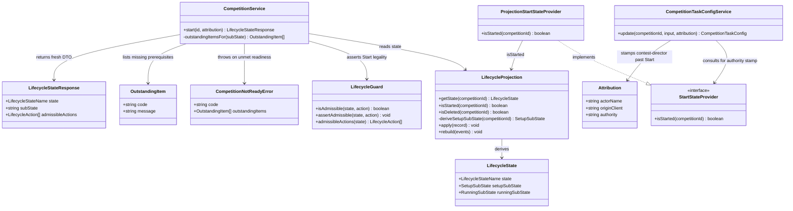

# Start Proceedings — Open a Competition for Running (STORY-001-025)

## Requirements

Implement the **Start Proceedings** command: give the Contest Director one
deliberate act that opens a competition for running, transitioning it from
`Setup` to `Running`. Gate the act on a **hard readiness check** (roster complete
AND draw accepted) that, when unmet, refuses the start and enumerates exactly
what is missing. Record the start in the immutable event log with the acting
person and Contest-Director authority. Establish the **Setup/Running boundary**
past which scoring/running configuration edits are attributed Contest-Director
authority and logged — the boundary that Area 3 mid-contest configuration changes
key off.

Boundaries:
- Start only *reads* roster/draw results; it owns neither their mechanics nor the
  too-thin-roster judgement (settled upstream at draw time, D14) — no size
  override lives here.
- CD authority is **recorded, not enforced** (D1): the endpoint stamps
  contest-director authority; it never verifies the caller is a CD.
- **Class-agnostic law (CLAUDE.md):** neither the guard, the readiness ladder,
  nor the config boundary reads the Contest Class Model.
- Offline-first (D6): Start operates entirely on the headless base with no
  internet.

## Entities

Conservative note: every entity above **already exists** in the codebase
(`packages/shared/lifecycle.ts`, `apps/base/src/lifecycle/*`,
`apps/base/src/competitions/*`, `apps/base/src/task-config/service.ts`). This
canvas describes the established shape; it introduces no new wrappers and mandates
no refactor. `OutstandingItem` stays a **flat DTO** `{ code, message }` — never a
class hierarchy.

## Approach

1. Start command (event-sourced, over the STORY-001-024 state layer):
   - Reuse the established delete-command idiom: *not-found guard → read
     lifecycle state → readiness split → pure guard assert → append one event →
     apply to projection → return fresh read DTO*.
   - Data flow: `POST /api/competitions/:id/start` → `CompetitionService.start`
     → `EventStore.append(competition.started)` → `LifecycleProjection.apply`
     → `LifecycleStateResponse`.
   - Append **exactly one** `competition.started` event on success; **zero**
     events on any rejection (AC7).

2. Readiness vs. legality separation:
   - Keep `LifecycleGuard` **pure** — a boolean table lookup keyed on
     `(state[+sub-state], action)`; `Start` admissible only from
     `Setup/DrawAccepted`. No class read, no human message logic.
   - Compute the human-facing **outstanding-items list in the service** from the
     Setup readiness ladder with **no new reads**, so the list can never disagree
     with the gate. `Draft` → both items; any rung below `DrawAccepted` → the draw
     item only.
   - Two distinct rejection codes: `409 COMPETITION_NOT_READY` (startable state,
     prerequisites unmet — carries `outstandingItems`) vs. `409
     TRANSITION_NOT_ALLOWED` (wrong state entirely, e.g. already Running/Locked).

3. Config-authority boundary (record-only, D1):
   - Realise the Setup/Running boundary through the injected `StartStateProvider`
     seam, **not** a direct lifecycle import — the config module (task-config,
     3.7) consults `isStarted` and stamps authority, decoupling the modules and
     avoiding an import cycle.
   - Past Start, the identical config edit is stamped `contest-director`
     authority and logged; in Setup it keeps route-supplied `organiser`
     attribution. The base **rejects nothing** — the only observable difference
     is the recorded authority string.
   - `isStarted` stays true through `Suspended`/`Locked` (genuinely past Start),
     so config authority never silently reverts.

4. Global exception handling:
   - Route the domain errors through the centralised `setErrorHandler` in
     `app.ts` — `CompetitionNotReadyError` → 409 with
     `details.outstandingItems`; `TransitionNotAllowedError` → 409
     `TRANSITION_NOT_ALLOWED`; `CompetitionNotFoundError` → 404. No bespoke
     try/catch in the route.

## Structure

### Inheritance Relationships
1. `StartStateProvider` interface defines the class-agnostic past-Start
   predicate (`isStarted`).
2. `ProjectionStartStateProvider` implements `StartStateProvider`, answering from
   `LifecycleProjection.isStarted` (lifecycle-owned, injected via `AppOptions`).
3. `NotStartedProvider` implements `StartStateProvider` as a test stub (always
   false).
4. `CompetitionNotReadyError` extends `DomainError` (extends `Error`), carrying
   `outstandingItems[]`.
5. `TransitionNotAllowedError` extends `DomainError`.

### Dependencies
1. `registerCompetitionRoutes` (route) calls `CompetitionService.start`, passing
   contest-director attribution built from request headers.
2. `CompetitionService` depends on `EventStore`, `CompetitionProjection`,
   `LifecycleProjection`, and `LifecycleGuard`.
3. `ProjectionStartStateProvider` depends on `LifecycleProjection`.
4. `CompetitionTaskConfigService` depends on `StartStateProvider` (injected;
   real = `ProjectionStartStateProvider`) to attribute config edits.
5. `LifecycleProjection` depends on `RosterProjection` and `DrawProjection`
   (read-only) to derive the Setup sub-state.
6. `app.ts` wires `ProjectionStartStateProvider` as the default
   `StartStateProvider`, replacing the `NotStartedProvider` stub.

### Layered Architecture
1. Route Layer (`routes/competitions.ts`): exposes
   `POST /api/competitions/:id/start`; builds contest-director attribution from
   `x-actor-name` / `x-client-id` headers.
2. Service Layer (`competitions/service.ts`): the Start command pipeline and the
   `outstandingItemsFor` derivation.
3. Guard Layer (`lifecycle/guard.ts`): pure transition legality.
4. Projection Layer (`lifecycle/projection.ts`): authoritative state derivation
   from the log, including `isStarted` and the readiness ladder.
5. Event Store Layer (`eventstore/event-store.ts`): append-only source of truth.
6. Exception Handling Layer (`app.ts` `setErrorHandler`): uniform domain-coded
   4xx mapping.

## Operations

### Update Command — CompetitionService.start(id, attribution)
1. Responsibility: transition a `Setup/DrawAccepted` competition to
   `Running/BetweenGroups`, recording one `competition.started` event; reject
   every non-ready or non-startable case with zero side effects.
2. Method: `start(id: string, attribution: Attribution): LifecycleStateResponse`
   - Logic:
     - Not-found guard: if `!projection.getById(id)` AND
       `!lifecycleProjection.isDeleted(id)` → throw `CompetitionNotFoundError`
       (404). A Deleted tombstone deliberately falls through to the guard, not
       404 (AC7 edge).
     - Read `state = lifecycleProjection.getState(id)`.
     - Readiness split: if `state.state === "Setup"` AND
       `state.setupSubState !== "DrawAccepted"` → throw
       `CompetitionNotReadyError("The competition is not ready to start",
       outstandingItemsFor(state.setupSubState ?? "Draft"))` — appends nothing
       (AC2/AC3).
     - Legality: `lifecycleGuard.assertAdmissible(state, "Start")` — throws
       `TransitionNotAllowedError` for Running/Suspended/Locked/Deleted, i.e.
       double-start and start-from-terminal (AC7), appending nothing.
     - On pass: `eventStore.append({ scope: "competitions", type:
       "competition.started", payload: { competitionId: id }, attribution })`,
       then `lifecycleProjection.apply(record)`.
     - Return `getLifecycleState(id)` — the fresh
       `Running/BetweenGroups` DTO (AC1).
3. Constraints: exactly one event on success; zero on any rejection; no read of
   the Contest Class Model.

### Create Private Helper — CompetitionService.outstandingItemsFor(subState)
1. Responsibility: derive the unmet Start prerequisites purely from the Setup
   readiness ladder, with no new reads (AC2/AC3).
2. Method: `outstandingItemsFor(subState: SetupSubState): OutstandingItem[]`
   - Logic:
     - `items: OutstandingItem[] = []`.
     - If `subState === "Draft"` → push
       `{ code: "ROSTER_INCOMPLETE", message: "The roster is not complete" }`.
     - If `subState !== "DrawAccepted"` → push
       `{ code: "DRAW_NOT_ACCEPTED", message: "The draw has not been accepted" }`.
     - Return `items`.
   - Invariant: the ladder forbids an accepted draw over an empty roster, so
     "draw not accepted alone with an empty roster" is unreachable (assert in
     tests).

### Update Guard — LifecycleGuard (Start branch)
1. Responsibility: decide `Start` legality as a pure boolean.
2. Logic: `case "Start": return state.state === "Setup" && state.setupSubState
   === "DrawAccepted";` — every other state inadmissible, so double-start and
   start-from-terminal fall out for free. `REJECTION_REASON.Start` =
   "Proceedings can be started only when the roster is complete and the draw
   accepted".
3. Constraints: no class branch; no Contest Class Model read.

### Update Projection — LifecycleProjection.isStarted / apply
1. Responsibility: fold `competition.started` and answer "genuinely past Start".
2. `apply`: `case "competition.started": this.started.add(competitionIdOf(record))`.
3. `isStarted(competitionId: string): boolean` → `this.started.has(competitionId)`
   — true once folded, stays true while Suspended/Locked. `getState` returns
   `Running` (BetweenGroups when no open groups) whenever `started` holds and the
   competition is not Deleted/Locked/Suspended.
4. `getState` precedence (unchanged): Deleted → Locked → Suspended → Running →
   Setup(sub-state). Constraint: pure loader — no RNG, no network, no side
   effects; correct after full replay (offline-first suspend/resume).

### Create Provider — ProjectionStartStateProvider
1. Responsibility: the real `StartStateProvider`, app default (replaces
   `NotStartedProvider`).
2. Method: `isStarted(competitionId: string): boolean` →
   `this.projection.isStarted(competitionId)`.
3. Dependency Injection: constructed with `LifecycleProjection`; wired in
   `app.ts` via `AppOptions` so a config module never imports the lifecycle
   module (no cycle).

### Adopt Boundary — CompetitionTaskConfigService.update (AC6 witness, record-only)
1. Responsibility: stamp the config-authority boundary on the sole current config
   surface (task-config, 3.7).
2. Logic: after building the config, compute
   `effectiveAttribution = startState.isStarted(competitionId) ? { ...attribution,
   authority: "contest-director" } : attribution`, and append `taskConfig.updated`
   with `effectiveAttribution`.
3. Constraint: **record-only** — verifies and rejects nothing; the only
   observable before/after difference is the recorded authority string (D1).

### Create/Confirm Error — CompetitionNotReadyError
1. Inheritance: extends `DomainError`.
2. Attributes: `code = "COMPETITION_NOT_READY"`; `outstandingItems:
   OutstandingItem[]`.
3. Constructor: `(message: string, outstandingItems: OutstandingItem[])`.
4. Mapping: in `app.ts` `setErrorHandler` → HTTP 409, body
   `{ code, message, details: { outstandingItems } }`.
5. Usage: thrown only by `CompetitionService.start` on a Setup rung below
   DrawAccepted.

### Add Route — POST /api/competitions/:id/start
1. Responsibility: the CD action endpoint.
2. Logic: build `cdAttributionFromHeaders(request.headers)` — `actorName` from
   `x-actor-name` (default "unknown"), `originClient` from `x-client-id` (default
   "unknown-client"), `authority: "contest-director"` (stamped, not verified);
   call `competitionService.start(id, attribution)`; return the DTO (200).
3. Responses: 200 `LifecycleStateResponse`; 409 `COMPETITION_NOT_READY` (with
   `details.outstandingItems`); 409 `TRANSITION_NOT_ALLOWED`; 404 for a
   never-existed id.

## Norms
1. Annotation / wiring standards: dependencies injected via constructor and
   `AppOptions`; providers registered in `app.ts`. No service imports the
   lifecycle module directly — always through the `StartStateProvider` seam.
2. Dependency injection: interface seams (`StartStateProvider`,
   `LockStateProvider`, `CapturedScoresProvider`) with a real projection-backed
   implementation plus a test stub; swap via `AppOptions` with zero rework.
3. Exception handling:
   - Domain errors extend `DomainError` and carry a stable string `code`.
   - `CompetitionNotReadyError` carries `outstandingItems[]`; every other domain
     error carries just a message (+ optional structured details).
   - Mapping is centralised in `app.ts` `setErrorHandler` — one branch per code;
     no route-level try/catch.
   - Operator-facing messages reveal no internal implementation detail.
4. Data validation: request bodies parsed via Zod `safeParse` → `ValidationError`
   on failure (400). Cross-aggregate checks (sibling projections) live in the
   service, not Zod.
5. Event-sourcing discipline: mutations append exactly one event; projections are
   **pure loaders** (guard on record type/scope; no RNG/network/side effects) and
   must rebuild correctly from the full log. Rejections append nothing.
6. Class-agnostic discipline: no guard, ladder, or boundary reads the Contest
   Class Model. Any such reference is a defect (CLAUDE.md law, NFR-1/NFR-2).
7. Attribution: every event carries `{ actorName, originClient, authority }`;
   `authority` is `"organiser" | "contest-director"`, recorded not enforced (D1).
8. Documentation: keep the transition table comment in `guard.ts` and the
   readiness-ladder comment in `projection.ts` authoritative and current.

## Safeguards
1. Functional Constraints:
   - Start succeeds **iff** the competition is in `Setup/DrawAccepted`; result is
     `Running/BetweenGroups`, one `competition.started` logged with CD authority
     (AC1).
   - A blocked start (Setup below DrawAccepted) changes nothing and returns the
     exact outstanding items: `Draft` → both; `RosterComplete`/`DrawSpecified`/
     `DrawGenerated` → `DRAW_NOT_ACCEPTED` only (AC2/AC3).
   - No size override at Start; readiness is clean pass/fail (AC4, D14 upstream).
   - Double-start and start-from-terminal (Running/Suspended/Locked/Deleted) are
     rejected with `TRANSITION_NOT_ALLOWED`, zero events (AC7).
2. Performance Constraints: Start is O(1)–O(roster) in-memory over projections;
   no I/O beyond one append. Fully operable offline on the base (D6).
3. Security / Trust Constraints: no auth; CD authority is **recorded, not
   enforced** (D1). The start endpoint stamps `contest-director` without
   verifying the caller. Auditability comes from the immutable event log (D4).
4. Integration Constraints:
   - Start establishes the `Running` state that Area 6 run-commands will read;
     the config boundary is exposed only through the `StartStateProvider` seam
     (no import cycle).
   - **Documented deferral / forward obligation (AC5 — ACCEPTED SCOPE-OUT, not a
     defect):** "nothing may run before proceedings are open" is enforced by
     Area 6 group/round-run surfaces (STORY-001-011 and later) that are **not yet
     built**. This story establishes only the `Running`-state precondition those
     gates will read; the rejection of a group-open/round-advance in Setup is a
     forward obligation on the Area 6 stories and is not verifiable end-to-end in
     this story's code today.
5. Business Rule Constraints:
   - "Roster complete" ≡ ≥ 1 roster entry — the class-agnostic MVP definition;
     group-size minima are a class-model concern and never enter the ladder.
   - Stale accepted/candidate draw (an input logged after the latest
     `draw.generated`) collapses the sub-state below `DrawAccepted`
     (left-fallback), so a start correctly re-blocks — targeted edge test.
   - `isStarted` remains true through Suspended/Locked so config authority never
     reverts.
6. Exception Handling Constraints: business exceptions carry clear codes and
   operator-safe messages; classified by domain; all mapped centrally by
   `setErrorHandler`; no sensitive internals exposed.
7. Technical Constraints: pure guard (boolean table only); outstanding-items
   logic lives in the service; projections stay pure loaders; a single derived
   source (`LifecycleProjection.isStarted`) backs both the state and the boundary
   — no second "started" flag that could drift.
8. Data Constraints: `OutstandingItem` is a flat `{ code, message }`; codes drawn
   from the additive union `ROSTER_INCOMPLETE | DRAW_NOT_ACCEPTED`; the
   `LifecycleStateResponse` returns `subState` null when the state has none.
9. API Constraints: `POST /api/competitions/:id/start` → 200
   `LifecycleStateResponse` | 409 `COMPETITION_NOT_READY`
   (`details.outstandingItems`) | 409 `TRANSITION_NOT_ALLOWED` | 404
   `COMPETITION_NOT_FOUND`. Attribution taken from `x-actor-name` / `x-client-id`
   headers.

### Assumptions carried forward (ACCEPTED, not blockers)
- **AC5 run-time enforcement is deferred to Area 6** (see Integration Constraint
  4): the Running state exists; the gate that consumes it does not yet — a tracked
  forward obligation, consistent with this story's own Scope Out.
- **AC6 config-authority boundary is witnessed only at task-config (3.7)**: the
  guarantee for the remaining Area 3 config surfaces (3.5/3.6/3.8) rests on the
  discipline of adopting the shared `StartStateProvider` past-Start predicate as
  each surface is built (record-only, D1) — additive-only by design, not a defect
  in this story.
