# Lock & Finalisation — Freeze the Contest and Resolve Its Validity (STORY-001-026)

## Requirements

Implement the **Lock** command: give the Contest Director one deliberate act that
**seals a running competition**, transitioning it from `Running/BetweenGroups` to
the terminal `Locked` state. Locking **freezes** the competition (no further score
correction, manual entry or penalty change is admitted) while **keeping reports
available**, and records the seal in the immutable event log under Contest-Director
authority.

At the moment of Lock, run the **minimum-rounds validity guard**: compare the
completed-round (and, where the class requires, completed-task) count against the
**Contest Class Model's** `minimumForValidContest` value and resolve the terminal
`Locked` state into one of two recorded outcomes — **OfficialResults** (the flown
count meets the class minimum, or the class fixes no minimum) or **NoContest** (the
flown count falls short: locked, no official results, all captured data and the
full event log retained). Lock is **never blocked** by a short count; the count
only selects the outcome.

Boundaries:
- Lock rides the STORY-001-024 state layer and does **not** re-implement transition
  legality — `LifecycleGuard` already admits `Lock` only from
  `Running/BetweenGroups` and treats `Locked` as terminal.
- The validity threshold is **read** from the class model (`minimumForValidContest`,
  already present per STORY-001-016); this story never *defines* it and never
  branches on discipline (CLAUDE.md class-model law).
- The pre-Lock validation pass (5.6 flagging, 5.8 manual entry/override) is owned by
  STORY-001-012 / Area 5.8; Lock is the distinct **final seal after** that pass and
  does not itself hard-block on outstanding flags (advisory boundary, AC2).
- Score computation, drop-worst arithmetic and final report layout are out of scope
  (STORY-001-007, STORY-001-016, Area 7); finalisation only *triggers* the aggregate
  and records the OfficialResults/NoContest outcome for reports to reflect.
- CD authority is **recorded, not enforced** (D1); offline-first (D6).

## Entities

```mermaid
classDiagram
direction TB

class CompetitionService {
    +lock(id, attribution) LifecycleStateResponse
    -resolveFinalisation(competitionId) FinalisationOutcome
}

class LifecycleProjection {
    +getState(competitionId) LifecycleState
    +isLocked(competitionId) boolean
    +apply(record) void
    +rebuild(events) void
}

class LifecycleGuard {
    +assertAdmissible(state, action) void
    +admissibleActions(state) LifecycleAction[]
}

class ClassModelProjection {
    +getById(id) ContestClassModel
}

class ContestClassModel {
    +MinimumForValidContest minimumForValidContest
    +DropWorstRule dropWorst
}

class MinimumForValidContest {
    +number rounds
    +number tasks
}

class FinalisationProgressProvider {
    <<interface>>
    +completedRounds(competitionId) number
    +completedTasks(competitionId) number
}

class ProjectionFinalisationProgressProvider {
    +completedRounds(competitionId) number
    +completedTasks(competitionId) number
}

class ZeroProgressProvider {
    +completedRounds(competitionId) number
    +completedTasks(competitionId) number
}

class LockStateProvider {
    <<interface>>
    +isLocked(competitionId) boolean
}

class ProjectionLockStateProvider {
    +isLocked(competitionId) boolean
}

class CompetitionLockedPayload {
    +string competitionId
    +FinalisationOutcome outcome
    +number completedRounds
}

class LifecycleStateResponse {
    +LifecycleStateName state
    +string subState
    +LifecycleAction[] admissibleActions
}

CompetitionService --> LifecycleProjection : reads state
CompetitionService --> LifecycleGuard : asserts Lock legality
CompetitionService --> ClassModelProjection : reads minimumForValidContest
CompetitionService --> FinalisationProgressProvider : reads completed counts
CompetitionService --> CompetitionLockedPayload : appends (enriched)
CompetitionService --> LifecycleStateResponse : returns fresh DTO
ProjectionLockStateProvider ..|> LockStateProvider : implements
ProjectionLockStateProvider --> LifecycleProjection : isLocked
ProjectionFinalisationProgressProvider ..|> FinalisationProgressProvider : implements
ZeroProgressProvider ..|> FinalisationProgressProvider : stub (0/0)
ContestClassModel --> MinimumForValidContest : holds (nullable)
```

Conservative note: `LifecycleProjection`, `LifecycleGuard`, `ClassModelProjection`,
`ContestClassModel.minimumForValidContest`, `LockStateProvider` /
`AlwaysUnlockedProvider`, `CompetitionLockedPayload` and `competition.locked` (type +
fold) **already exist**. This story adds only: the `lock` command, the additive
`outcome`/`completedRounds` fields on `CompetitionLockedPayload`, the
`FinalisationOutcome` union, the `FinalisationProgressProvider` seam, and the real
`ProjectionLockStateProvider`. No wrapper is introduced where a scalar suffices and
no existing structure is reshaped (NFR-2).

## Approach

1. Lock command (event-sourced, over the STORY-001-024 state layer):
   - Reuse the established `start()` command idiom exactly: *not-found guard → read
     lifecycle state → guard-assert legality → (new) resolve finalisation outcome →
     append one enriched event → apply to projection → return fresh read DTO*.
   - Data flow: `POST /api/competitions/:id/lock` → `CompetitionService.lock` →
     `resolveFinalisation` (read class model + completed counts) →
     `EventStore.append(competition.locked{ outcome, completedRounds })` →
     `LifecycleProjection.apply` → `LifecycleStateResponse` (`Locked`).
   - Append **exactly one** `competition.locked` event on success; **zero** events on
     any rejection (mirrors `start()`).

2. Minimum-rounds validity guard (class-agnostic):
   - `resolveFinalisation(competitionId)`: read `model.minimumForValidContest`.
     - `null` → short-circuit to `OfficialResults` (F5K: no rule to test against;
       CD's judgement, distinct from `rounds: 0`).
     - otherwise → `OfficialResults` **iff** `completedRounds >= min.rounds`
       **AND** (`min.tasks === null` **OR** `completedTasks >= min.tasks`); else
       `NoContest`. Comparison is **inclusive** ("meets or exceeds").
   - Reads only the model value and the derived counts — **no** `switch (discipline)`
     anywhere (CLAUDE.md law); F3B's compound `{rounds,tasks}` and F5K's `null` are
     handled by the same generic predicate.
   - Lock is **never** gated on the outcome — a `NoContest` still locks.

3. Completed-count derivation — **LIVE DEPENDENCY, made explicit via a seam:**
   - The requirement asserts the count is "derivable from the event log," but no
     emitter appends `competition.roundAdvanced`, `group.opened` or `group.scored`
     today (confirmed: only `competition.started` is appended anywhere). So the
     count source does **not yet exist in shipped code**.
   - Resolve this exactly as the codebase resolves every other not-yet-owned state:
     an injected `FinalisationProgressProvider` seam (mirroring `LockStateProvider` /
     `CapturedScoresProvider` / `StartStateProvider`). This story **defines and
     consumes** the seam; the **round story (Area 6 / `competition.roundAdvanced`
     emitter) supplies the real projection-backed implementation with zero rework**.
   - Default wiring: `ProjectionFinalisationProgressProvider` derived from the log —
     `completedRounds` = count of distinct `competition.roundAdvanced` facts folded
     in `LifecycleProjection`; `completedTasks` derived from `ScoringProjection`
     (fully-resolved task groups) when that fact is defined. **Until the round story
     emits those facts these read `0`**, so today every real contest resolves to
     `NoContest` for classes with a minimum — correct-but-empty behaviour, and the
     seam makes the dependency swap-in additive. Tests inject a stub returning the
     per-AC counts to exercise both outcomes independently of the emitter.

4. Activate the freeze (light up existing gates for free):
   - Swap the production `AlwaysUnlockedProvider` for a real
     `ProjectionLockStateProvider` backed by `LifecycleProjection.isLocked`
     (a new thin accessor over the existing `locked` set, mirroring `isStarted`).
   - This activates the freeze gates already coded against `LockStateProvider.isLocked`
     (class-change reject in `update`, delete reject in `delete`, and the
     score-correction/manual-entry/penalty gates other stories built against
     "locked rejects changes") with **no rework** — the intended payoff of the seam.

5. Validation-pass gate (D3, AC2) is presentational/sequential, not new enforcement:
   - The pre-Lock pass (5.6/5.8) is owned upstream; Lock treats it as a distinct
     prior step and does **not** re-implement flagging/correction or hard-block on
     unresolved flags.

6. Global exception handling:
   - Route domain errors through the centralised `setErrorHandler` in `app.ts`:
     `TransitionNotAllowedError` → 409 `TRANSITION_NOT_ALLOWED` (Lock from a
     non-BetweenGroups or terminal state, incl. double-lock); `CompetitionNotFoundError`
     → 404. No bespoke try/catch in the route.

## Structure

### Inheritance Relationships
1. `LockStateProvider` interface defines the class-agnostic locked predicate
   (`isLocked`).
2. `ProjectionLockStateProvider` implements `LockStateProvider`, answering from
   `LifecycleProjection.isLocked` (lifecycle-owned, injected via `AppOptions`),
   replacing the `AlwaysUnlockedProvider` stub as the app default.
3. `FinalisationProgressProvider` interface defines the completed-round/task counts
   the guard reads (`completedRounds`, `completedTasks`).
4. `ProjectionFinalisationProgressProvider` implements it from the log; a
   `ZeroProgressProvider` test/bootstrap stub returns `0/0`.
5. `FinalisationOutcome` is an additive string union
   `"OfficialResults" | "NoContest"` in `@soarscore/shared` (NFR-2), not a class.
6. `TransitionNotAllowedError` / `CompetitionNotFoundError` extend `DomainError`.

### Dependencies
1. `registerCompetitionRoutes` (route) calls `CompetitionService.lock`, passing
   contest-director attribution built from request headers (reuses the existing
   `cdAttributionFromHeaders`).
2. `CompetitionService` depends on `EventStore`, `CompetitionProjection`,
   `LifecycleProjection`, `LifecycleGuard`, `ClassModelProjection`, and the new
   `FinalisationProgressProvider` (injected).
3. `ProjectionLockStateProvider` depends on `LifecycleProjection`.
4. `ProjectionFinalisationProgressProvider` depends on `LifecycleProjection`
   (round-advanced count) and/or `ScoringProjection` (task-completion), read-only.
5. `LifecycleProjection` already folds `competition.locked`; it gains `isLocked`
   and a `completedRoundCount` accessor over folded `competition.roundAdvanced`.
6. `app.ts` wires `ProjectionLockStateProvider` as the default `LockStateProvider`
   (replacing `AlwaysUnlockedProvider`) and the finalisation-progress default.

### Layered Architecture
1. Route Layer (`routes/competitions.ts`): exposes `POST /api/competitions/:id/lock`;
   builds contest-director attribution from `x-actor-name` / `x-client-id` headers.
2. Service Layer (`competitions/service.ts`): the Lock command pipeline and the
   `resolveFinalisation` minimum-rounds guard.
3. Guard Layer (`lifecycle/guard.ts`): pure transition legality (`Lock` unchanged).
4. Projection Layer (`lifecycle/projection.ts`): authoritative state derivation,
   `isLocked`, and completed-round count from the log.
5. Class-Model Layer (`class-models/projection.ts`): supplies
   `minimumForValidContest` and `dropWorst` (read-only).
6. Event Store Layer: append-only source of truth.
7. Exception Handling Layer (`app.ts` `setErrorHandler`): uniform domain-coded 4xx.

## Operations

### Add Shared Type — FinalisationOutcome (`packages/shared/src/lifecycle.ts`)
1. Responsibility: name the two recorded finalisation outcomes for base and companion.
2. Definition: `export type FinalisationOutcome = "OfficialResults" | "NoContest";`
3. Constraints: additive union (NFR-2); no discipline appears in the vocabulary.

### Enrich Event Payload — CompetitionLockedPayload (`packages/shared/src/events.ts`)
1. Responsibility: record the resolved outcome on the terminal lock event (AC8).
2. Change: add `outcome: FinalisationOutcome;` and `completedRounds: number;` to the
   existing `CompetitionLockedPayload` (currently `{ competitionId }`).
3. Constraint: **additive only** — a hypothetical older `competition.locked` without
   the field must replay without throwing; consumers default a missing `outcome`
   (treat as unknown/legacy) rather than error, matching the `acknowledgedWarningIds`
   default-on-read pattern. `LifecycleProjection`'s fold of `competition.locked` reads
   only `competitionId`, so it is unaffected.

### Add Command — CompetitionService.lock(id, attribution)
1. Responsibility: seal a `Running/BetweenGroups` competition into terminal `Locked`,
   resolving and recording the finalisation outcome; reject every non-BetweenGroups /
   terminal case with zero side effects. Never blocked by a short round count.
2. Method: `lock(id: string, attribution: Attribution): LifecycleStateResponse`
   - Logic:
     - Not-found guard: if `!projection.getById(id)` AND
       `!lifecycleProjection.isDeleted(id)` → throw `CompetitionNotFoundError` (404).
     - Read `state = lifecycleProjection.getState(id)`.
     - Legality: `lifecycleGuard.assertAdmissible(state, "Lock")` — throws
       `TransitionNotAllowedError` (409) for Setup / GroupInProgress / Suspended /
       Locked / Deleted, so a mid-group lock and a double-lock fall out for free
       (AC1 precondition, edge cases). Appends nothing on rejection.
     - Resolve: `outcome = this.resolveFinalisation(id)` and
       `completedRounds = this.progress.completedRounds(id)`.
     - Append `eventStore.append({ scope: "competitions", type:
       "competition.locked", payload: { competitionId: id, outcome, completedRounds },
       attribution })`, then `lifecycleProjection.apply(record)`.
     - Return `getLifecycleState(id)` — the fresh `Locked` DTO (state `Locked`,
       `subState: null`, `admissibleActions: []`).
3. Constraints: exactly one event on success; zero on any rejection; the outcome is
   computed **once** at Lock and frozen on the terminal event.

### Add Private Helper — CompetitionService.resolveFinalisation(competitionId)
1. Responsibility: the class-agnostic minimum-rounds validity guard (AC3–AC7).
2. Method: `resolveFinalisation(competitionId: string): FinalisationOutcome`
   - Logic:
     - Resolve the class model: `competition = get(competitionId)`;
       `model = classModelProjection.getById(competition.classModelId)`.
     - `min = model.minimumForValidContest`.
     - If `min === null` → return `"OfficialResults"` (F5K: no minimum to test —
       CD's judgement; must NOT collapse `null` into `rounds: 0`, AC7).
     - `rounds = progress.completedRounds(competitionId)`.
     - `roundsMet = rounds >= min.rounds` (inclusive boundary — AC5: 4 ≥ 4 passes).
     - `tasksMet = min.tasks === null || progress.completedTasks(competitionId) >=
       min.tasks` (F3B compound: rounds:1 AND tasks:1 — AC6).
     - Return `roundsMet && tasksMet ? "OfficialResults" : "NoContest"`.
3. Constraints: reads only `minimumForValidContest` and the derived counts; **no**
   branch on `discipline`/`sourceClass`; never conflates `minimumForValidContest`
   with `dropWorst.threshold` (they are different numbers — AC3).

### Add Accessor — LifecycleProjection.isLocked / completedRoundCount
1. Responsibility: expose the already-folded `locked` membership and the
   round-advanced count from the log.
2. `isLocked(competitionId: string): boolean` → `this.locked.has(competitionId)`
   (over the existing `locked` set folded from `competition.locked`).
3. `completedRoundCount(competitionId: string): number`: fold
   `competition.roundAdvanced` into a per-competition counter in `apply`/`rebuild`
   (registry-scoped, keyed on `payload.competitionId`) and return it (0 when none
   folded). Additive-only: consuming a not-yet-emitted type is a no-op today (Norm 5).
4. Constraints: pure loader — no RNG/network/side effects; correct after full replay.

### Create Provider — ProjectionLockStateProvider (`competitions/state-providers.ts`)
1. Responsibility: the real `LockStateProvider`, app default (replaces
   `AlwaysUnlockedProvider`), activating every existing freeze gate.
2. Method: `isLocked(competitionId: string): boolean` →
   `this.projection.isLocked(competitionId)`.
3. Dependency Injection: constructed with `LifecycleProjection`; wired in `app.ts`
   via `AppOptions` so the competitions module never imports lifecycle internals.

### Create Seam + Provider — FinalisationProgressProvider (`competitions/state-providers.ts`)
1. Responsibility: supply the completed-round/task counts the guard reads, decoupling
   Lock from the not-yet-built round/scoring emitters (the LIVE DEPENDENCY).
2. Interface:
   - `completedRounds(competitionId: string): number`
   - `completedTasks(competitionId: string): number`
3. `ProjectionFinalisationProgressProvider` (default): `completedRounds` →
   `lifecycleProjection.completedRoundCount(id)`; `completedTasks` → derived from
   `ScoringProjection` (or `0` until a task-completion fact is defined). Returns `0`
   for both until the round story emits `competition.roundAdvanced` — correct,
   additive, no rework when the emitter ships.
4. `ZeroProgressProvider` test/bootstrap stub: returns `0/0` (mirrors
   `AlwaysUnlockedProvider` / `NotStartedProvider`). Tests inject a fixed-count stub
   to drive each finalisation AC independently of the emitter.

### Add Route — POST /api/competitions/:id/lock (`routes/competitions.ts`)
1. Responsibility: the CD Lock action endpoint.
2. Logic: build `cdAttributionFromHeaders(request.headers)` (reused — `authority:
   "contest-director"`, stamped not verified); call
   `competitionService.lock(id, attribution)`; return the DTO (200).
3. Responses: 200 `LifecycleStateResponse` (`Locked`); 409 `TRANSITION_NOT_ALLOWED`
   (not BetweenGroups / already terminal); 404 `COMPETITION_NOT_FOUND`.

### Wire Defaults — app.ts
1. Replace `AlwaysUnlockedProvider` with `ProjectionLockStateProvider(lifecycleProjection)`
   as the default `lockStateProvider` (keep the `AppOptions` override for tests).
2. Add `finalisationProgressProvider` to `AppOptions`, defaulting to
   `ProjectionFinalisationProgressProvider`; inject into `CompetitionService`.

## Norms
1. Wiring: dependencies injected via constructor and `AppOptions`; providers
   registered in `app.ts`. No service imports the lifecycle module directly — always
   through the `LockStateProvider` / `FinalisationProgressProvider` seams.
2. Dependency injection: interface seams with a real projection-backed implementation
   plus a test stub; swap via `AppOptions` with zero rework (the established idiom).
3. Exception handling:
   - Domain errors extend `DomainError` with a stable string `code`; reuse
     `TransitionNotAllowedError` and `CompetitionNotFoundError` — introduce no new
     error type (Lock invents no bespoke precondition beyond the guard).
   - Mapping centralised in `app.ts` `setErrorHandler`; no route-level try/catch.
   - Operator-facing messages reveal no internal implementation detail.
4. Event-sourcing discipline: mutations append exactly one event; projections are
   pure loaders (guard on record type/scope; no RNG/network/side effects) and must
   rebuild correctly from the full log. Rejections append nothing.
5. Additive-only payload evolution (NFR-2): new `CompetitionLockedPayload` fields
   default on read; a replay of any prior lock event must not throw. New event/enum
   members are appended, never renamed.
6. Class-agnostic discipline: neither the guard, the finalisation resolver, nor any
   projection reads the Contest Class Model to *branch on discipline*; the resolver
   reads only the model's `minimumForValidContest` scalar shape and compares
   generically. Any `switch (discipline)` is a defect (CLAUDE.md law, NFR-1/NFR-2) —
   covered by a class-agnostic test mirroring `lifecycle.class-agnostic.test.ts`.
7. Attribution: every event carries `{ actorName, originClient, authority }`;
   Lock stamps `"contest-director"`, recorded not enforced (D1).
8. Documentation: keep the `minimumForValidContest` doc-comment in `class-model.ts`,
   the transition-table comment in `guard.ts`, and the seam comments in
   `state-providers.ts` authoritative and current.

## Safeguards
1. Functional Constraints:
   - Lock succeeds **iff** the competition is `Running/BetweenGroups`; result is
     terminal `Locked`, one `competition.locked` event logged with CD authority and
     the resolved `outcome` (AC1/AC8). Reports remain available (no report path is
     removed on Lock).
   - Lock is **never** blocked by a short round count — a below-minimum contest still
     locks, as `NoContest` (AC4).
   - Lock from any non-BetweenGroups state (Setup / GroupInProgress / Suspended /
     already-Locked / Deleted) is rejected with `TRANSITION_NOT_ALLOWED`, zero events;
     double-lock falls out because `Locked` is terminal (edge cases).
2. Finalisation Outcome Constraints (class-driven, AC3–AC7):
   - `minimumForValidContest === null` (F5K) → always `OfficialResults`; `null` must
     never collapse into `{ rounds: 0 }` (AC7).
   - Numeric minimum → `OfficialResults` iff `completedRounds >= rounds` (inclusive)
     AND (`tasks === null` OR `completedTasks >= tasks`); else `NoContest`
     (AC3/AC5/AC6).
   - Boundary is "meets or exceeds": 4 vs min 4 → OfficialResults; 4 vs min 5 →
     NoContest (AC5).
   - F3B compound: 1 completed round AND 1 completed task → OfficialResults; before
     any round completes → NoContest (AC6).
   - `NoContest` produces **no** official results and applies **no** drop-worst
     (mutually exclusive by construction); all captured data + the event log are
     retained (append-only log — retention is inherent) (AC4).
   - The guard never conflates `minimumForValidContest` with `dropWorst.threshold`
     (different fields, AC3).
3. Security / Trust Constraints: no auth; CD authority is recorded, not enforced (D1);
   auditability comes from the immutable event log — the lock records actor, CD
   authority and resolved outcome (D4/AC8).
4. Integration / Freeze Constraints:
   - Making `LockStateProvider` real activates the freeze gates already coded against
     it (`update` class-change reject, `delete` reject, and the score-correction /
     manual-entry / penalty gates other stories built) — **broad blast radius, small
     change**: every "locked rejects changes" path must be confirmed to now trip on a
     genuinely-locked competition (regression coverage required).
   - The pre-Lock validation pass (5.6/5.8) is owned by STORY-001-012 / Area 5.8; Lock
     is the distinct final seal and does not re-implement it or hard-block on flags
     (AC2 advisory boundary).
5. **Live Dependency (EXPLICIT, non-blocking) — completed-count emitter:**
   - No code appends `competition.roundAdvanced`, `group.opened` or `group.scored`
     today (only `competition.started` is emitted). The completed-round/task count the
     guard needs therefore has **no live source yet**.
   - This story ships the `FinalisationProgressProvider` seam + a log-backed default
     that reads `0` until the **round story (Area 6 / `competition.roundAdvanced`
     emitter)** lands; that story supplies the real counts with **zero rework** (the
     seam is the swap point). Consequence today: a real contest with a class minimum
     resolves to `NoContest` (0 < min) until the emitter exists — correct-but-empty,
     not a defect. Each finalisation AC is proven in tests via an injected fixed-count
     stub, independent of the emitter. **This is a tracked forward obligation, not a
     blocker for this story's own surface.**
   - "Completed round/task" needs a precise class-agnostic definition when the emitter
     lands (all groups scored? a `roundAdvanced` fact?); the seam contract fixes the
     *shape* (two integer counts) so the definition can be settled in the round story
     without touching Lock.
6. Exception Handling Constraints: reuse existing domain codes with operator-safe
   messages, classified by domain, mapped centrally by `setErrorHandler`; no sensitive
   internals exposed.
7. Technical Constraints: pure guard (unchanged boolean table); the finalisation
   resolver lives in the service; projections stay pure loaders; the outcome is
   derived once at Lock and frozen on the terminal event (a locked contest's round
   count is immutable, so no read-time re-derivation and no staleness).
8. Data Constraints: `CompetitionLockedPayload` gains `outcome: FinalisationOutcome`
   and `completedRounds: number`, both additive with default-on-read; `FinalisationOutcome`
   is the flat union `OfficialResults | NoContest`; `LifecycleStateResponse` returns
   `subState: null` for `Locked`.
9. API Constraints: `POST /api/competitions/:id/lock` → 200 `LifecycleStateResponse`
   (`Locked`) | 409 `TRANSITION_NOT_ALLOWED` | 404 `COMPETITION_NOT_FOUND`. Attribution
   taken from `x-actor-name` / `x-client-id` headers, stamped `contest-director`.

### Assumptions carried forward (ACCEPTED, not blockers)
- **Completed-round/task counts read 0 until the round-advanced emitter ships** (see
  Safeguard 5): the finalisation guard, the seam and every outcome are fully built and
  unit-tested via stubbed counts; the end-to-end OfficialResults path over real flown
  rounds is a tracked forward obligation on the round story, consistent with this
  story's own Scope Out.
- **AC2 validation pass is advisory, not blocking**: Lock is the seal *after* the
  5.6/5.8 pass, owned upstream; Lock enforces no hard precondition on outstanding
  flags. Confirmed consistent with the analysis and D3.
- **`competition.locked` stays the single finalisation event** (no separate
  `competition.finalised`): Lock and finalisation happen atomically; the outcome rides
  the lock event additively (analysis-recorded design decision).
