# Run-Control Authority over a Running Group

## Requirements
Give the Contest Director a bounded, attributable authority slice over a
live group — pause/fast-forward/add-time on preparation only, an abort that
restarts a group from preparation and annuls its captured run, two distinct
forms of prep-confirmation-gate release that never let a comms fault silently
become a pilot's no-score, and an explicit "advance anyway" override that
routes each item blocking a round advance to its own defined consequence —
so a small-crew contest keeps moving through real-world holds without ever
breaching the fixed working-time/landing-window durations or hiding what was
overridden and by whom.

## Entities

```mermaid
classDiagram
direction TB

class GroupRunPhase {
  <<external contract, owned by STORY-001-040>>
  +string competitionId
  +number roundNumber
  +number groupFlyingOrder
  +"Preparation"|"WorkingTime"|"Landing" phase
  +number remainingSeconds
  +boolean prepGateHeld
  +string[] blockingDeviceIds
}

class GroupRunControlEvent {
  <<abstract event family, this story>>
  +string competitionId
  +number roundNumber
  +number groupFlyingOrder
  +Attribution attribution
  +string recordedAt
}

class PrepPausedEvent {
  +groupRun.prepPaused type
}
class PrepResumedEvent {
  +groupRun.prepResumed type
}
class PrepFastForwardedEvent {
  +groupRun.prepFastForwarded type
  +number secondsRemoved = 60
}
class PrepTimeAddedEvent {
  +groupRun.prepTimeAdded type
  +number secondsAdded = 60
}
class GroupAbortedEvent {
  +groupRun.aborted type
  +AnnulledFactRef[] annulledFacts
  +string reason
}
class AnnulledFactRef {
  +string factType
  +string rosterEntryId
  +string taskId
}
class PrepGateReleasedDeviceOfflineEvent {
  +groupRun.gateReleasedDeviceOffline type
  +string rosterEntryId
  +string deviceId
}
class PrepGateReleasedPilotUnconfirmedEvent {
  +groupRun.gateReleasedPilotUnconfirmed type
  +string rosterEntryId
  +string deviceId
}
class RoundAdvanceOverriddenEvent {
  +roundAdvance.overridden type
  +OutstandingItemResolution[] resolutions
}
class OutstandingItemResolution {
  +string code
  +"flagged-anomaly"|"zeroed"|"reflight-lapsed" consequence
  +string referenceId
}

class Attribution {
  +string actorName
  +string originClient
  +string authority
}

class RunControlActionRequest {
  +string competitionId
  +number roundNumber
  +number groupFlyingOrder
}
class GateReleaseRequest {
  +string rosterEntryId
  +string deviceId
}
class AdvanceAnywayRequest {
  +string competitionId
  +number roundNumber
}

class RunControlActionResponse {
  +string status
  +GroupRunPhase phase
}

GroupRunControlEvent <|-- PrepPausedEvent
GroupRunControlEvent <|-- PrepResumedEvent
GroupRunControlEvent <|-- PrepFastForwardedEvent
GroupRunControlEvent <|-- PrepTimeAddedEvent
GroupRunControlEvent <|-- GroupAbortedEvent
GroupRunControlEvent <|-- PrepGateReleasedDeviceOfflineEvent
GroupRunControlEvent <|-- PrepGateReleasedPilotUnconfirmedEvent
GroupRunControlEvent <|-- RoundAdvanceOverriddenEvent

GroupAbortedEvent "1" -- "0..*" AnnulledFactRef : discards
RoundAdvanceOverriddenEvent "1" -- "0..*" OutstandingItemResolution : routes
GroupRunControlEvent "1" -- "1" Attribution : carries
GroupRunControlEvent "0..*" -- "1" GroupRunPhase : reads/mutates via STORY-001-040

RunControlActionRequest --> GroupRunControlEvent : issues
GateReleaseRequest --> PrepGateReleasedDeviceOfflineEvent : issues
GateReleaseRequest --> PrepGateReleasedPilotUnconfirmedEvent : issues
AdvanceAnywayRequest --> RoundAdvanceOverriddenEvent : issues
GroupRunControlEvent --> RunControlActionResponse : maps to
```

Conservative note: `Attribution` is the existing `packages/shared/src/attribution.ts`
type reused verbatim (no new attribution shape). `GroupRunPhase` is drawn as an
**external contract** this story consumes, not a class it defines — the phase/
timer engine itself is STORY-001-040's scope. `OutstandingItemResolution` reuses
the existing `OutstandingItem` shape's `{code, message}` idiom, extended
(additively) with a `consequence`/`referenceId` pair rather than inventing an
unrelated structure.

**Resolved decisions reflected in this diagram** (user-confirmed, 202607160945
canvas review — see Approach/Operations/Safeguards for the implications):
- The prep-confirmation gate is a **single group-level hold** —
  `GroupRunPhase.prepGateHeld` is one boolean for the whole group, backed by
  `blockingDeviceIds` (the set of devices still outstanding); it clears only
  when that set is empty. Each device is still released individually (its own
  `PrepGateReleasedDeviceOfflineEvent`/`PrepGateReleasedPilotUnconfirmedEvent`,
  each choosing its own form), but the group does not proceed until every
  blocking device has been resolved.
- `GroupAbortedEvent` is legal **only** when `GroupRunPhase.phase ===
  "WorkingTime"` — never during `"Preparation"` (nothing to abort) or
  `"Landing"` (abort no longer applies once landing/touchdown has begun; the
  flight runs to touchdown as normal).
- `AnnulledFactRef.factType` spans **both** raw captures
  (`scoring.resultCaptured`) **and** derived scoring facts
  (`scoring.lonePilotResolved`, `scoring.annulmentOverrideRequested`) — a
  full annulment, not a raw-captures-only one; a re-flight of the group
  starts completely clean.
- `OutstandingItemResolution`'s `"reflight-lapsed"` consequence applies to a
  not-yet-flown re-flight entitlement in **either** `ApprovalStatus` state —
  `"pending-contest-director-approval"` (prepared) or `"approved"` — not
  approved-only.
- The full `ApprovalStatus` union (see Operations §"Extend Shared
  ApprovalStatus") is fixed by this canvas as `"pending-contest-director-
  approval" | "approved" | "declined" | "lapsed"` — STORY-001-028 implements
  against it rather than redesigning it.
- Add-time (`PrepTimeAddedEvent`) carries no repeat cap — confirmed as a
  deliberate scope decision (CD discretion governs), not an omission.

## Approach
1. **Event-sourced authority slice, no new architectural pattern**:
   - Model every one of the seven actions as its own CD-attributed,
     append-only event (`groupRun.*`, `roundAdvance.overridden`), exactly
     mirroring the existing `draw.accepted`/`draw.cancelled`/`draw.groupMoved`
     one-payload-per-type discipline. No polymorphic "control applied" event
     — four distinct prep-hold events, one abort event, two gate-release
     events, one override event (eight total).
   - Reuse `cdAttributionFromHeaders()` (from `apps/base/src/routes/draw.ts`)
     unmodified for all eight routes — every action here is Contest-Director
     authority, never the Organiser default.

2. **Two-speed build to respect the sequencing dependency**:
   - Build now, fully: the Fastify routes, request-validation (Zod schema +
     `ValidationError`, matching `parseDecision`'s idiom), the CD-attributed
     event construction, and the domain-error/`setErrorHandler` branches for
     every rejection this story defines. These have zero dependency on the
     four unbuilt prerequisites and are pure, testable today.
   - Build against a **stubbed phase-state reader interface**
     (`GroupRunPhaseProvider`, analogous to the existing
     `DrawStateProvider`/`start-state-provider.ts` seam pattern) for anything
     that needs to know current phase/remaining-time/gate-held state. Ship a
     test double now; STORY-001-040/034/043 later provide the real
     implementation of the same interface — the seam, not the runtime
     behaviour, is this story's deliverable for those four checks.
   - Do not build a stand-in timer, gate, or no-score aggregate inside this
     story — that duplicates scope explicitly reserved to STORY-001-040/034/
     031 (Scope Out is authoritative here).

3. **Class-agnostic by construction**: no event payload, guard, or route in
   this story carries a class/discipline field or branches on one. Phase
   durations, prep-gate rules and no-score semantics are read from
   configuration/other aggregates (`CompetitionTaskConfig`, the
   `GroupRunPhaseProvider` seam, STORY-001-031's no-score state) — never
   hard-coded per class. This satisfies CLAUDE.md's core law; any deviation
   (e.g. "if class === F3B do X" anywhere in this story's code) is a
   violation and must be flagged, not written.

4. **Business logic / validation strategy**:
   - Every guard is phase-keyed, not group- or round-keyed (Key Business
     Rule: preparation is the only adjustable phase).
   - Fast-forward's one-minute floor and the annulment/override consequence
     routing are pure functions over the request + current phase-state
     snapshot — no side effects beyond the single event append per action.
   - The "advance anyway" override is one atomic event with a structured
     `resolutions[]` payload (not three independently-attributed events) so
     the single act is auditable as one Contest-Director decision, per the
     existing `draw.reflightPrepared` precedent of bundling a fact + its
     pending-approval handoff in one payload.
   - All eight new domain errors extend the existing `DomainError` base
     (`apps/base/src/pilots/errors.ts`) and get one `setErrorHandler` branch
     each in `apps/base/src/app.ts`, ordered with the existing lifecycle/
     draw/scoring block (Safeguard 8 in that file's own comment: a missing
     branch is a release blocker).

## Structure

### Inheritance Relationships
1. `GroupRunControlError` (new) extends the existing `DomainError` base
   (`apps/base/src/pilots/errors.ts`) — the shared parent every domain error
   in this codebase already extends.
2. Eight concrete error subclasses extend `GroupRunControlError`: one per
   rejection reason (`GroupNotInPreparationError`, `PrepAtFloorError`,
   `PrepGateNotHeldError`, `RoundAdvanceNotBlockedError`,
   `ReflightNotGrantedError`, plus structural `ValidationError` reuse for bad
   request bodies).
3. `GroupRunPhaseProvider` (new interface) is the seam STORY-001-040 will
   implement; this story defines the interface and a test-double
   implementation only, matching the existing `DrawStateProvider`/
   `StartStateProvider` seam pattern in `apps/base/src/draw/` and
   `apps/base/src/lifecycle/`.
4. `GroupRunControlEvent` payload types are plain interfaces (no class
   hierarchy) added to `packages/shared/src/events.ts` alongside
   `DrawEventType`/`LifecycleEventType`/`ScoringEventType`, following the
   existing flat-union-of-payload-interfaces discipline — never a class-based
   event hierarchy.

### Dependencies
1. `apps/base/src/routes/group-run.ts` (new route file, mirroring
   `routes/draw.ts`) calls `GroupRunControlService` (new service, mirroring
   `DrawService`).
2. `GroupRunControlService` depends on: the `EventStore` (append), a
   `GroupRunPhaseProvider` (read current phase/remaining-time/gate state —
   stubbed until STORY-001-040/034 land), and, for gate-release/advance-
   anyway only, the as-yet-undefined no-score-creation intake
   (STORY-001-031) and outstanding-items reader (STORY-001-043) — both
   consumed as **interfaces this story does not implement**.
3. `apps/base/src/app.ts` injects `GroupRunControlService` the same way it
   injects `DrawService`/`TaskConfigService` today, and registers
   `registerGroupRunRoutes(app, groupRunControlService)` alongside the
   existing `registerDrawRoutes` call.
4. `GroupRunControlService` never imports or depends on any
   `ClassModel`/discipline-specific module — a structural check, not just a
   convention, since the class-agnostic law is a release gate per CLAUDE.md.

### Layered Architecture
1. **Route layer** (`apps/base/src/routes/group-run.ts`): header-based CD
   attribution (`cdAttributionFromHeaders`, reused verbatim), Zod body
   validation, one route per action (8 routes), no business logic.
2. **Service layer** (`apps/base/src/group-run/service.ts`, new): one method
   per action (`pausePrep`, `resumePrep`, `fastForwardPrep`, `addPrepTime`,
   `abort`, `releaseGateDeviceOffline`, `releaseGatePilotUnconfirmed`,
   `overrideRoundAdvance`) — reads phase state via the provider seam,
   applies the guard/business rule, constructs and appends the event.
3. **Provider/seam layer**: `GroupRunPhaseProvider` interface + in-memory
   test double (this story) — real implementation is STORY-001-040's.
4. **Event store / projection layer**: new event types appended to
   `EventStore` under `scope = competitionId` (content-level, matching
   `draw.*`/`scoring.*` convention, not the registry-level `competitions`
   scope used by `competition.*` lifecycle facts). Projection-side folding
   of `groupRun.aborted`'s annulment and `roundAdvance.overridden`'s
   consequence fan-out is **out of this story's build** except for the
   event shape itself — the owning projections (`ScoringProjection`,
   a new `RoundAdvanceProjection`, `DrawProjection` for re-flight-lapse) are
   STORY-001-031/040/043/028's to extend, coordinated via the agreed payload
   shape.
5. **Exception handling layer**: new `instanceof` branches appended to the
   existing `apps/base/src/app.ts` `setErrorHandler`, in the same ordered,
   one-branch-per-error-class style as every existing module.

## Operations

### Create Shared Types — `packages/shared/src/events.ts` additions
1. Responsibility: declare the new event-type union and payload interfaces
   for the eight run-control facts.
2. Attributes (new exported types):
   - `GroupRunEventType`: `"groupRun.prepPaused" | "groupRun.prepResumed" |
     "groupRun.prepFastForwarded" | "groupRun.prepTimeAdded" |
     "groupRun.aborted" | "groupRun.gateReleasedDeviceOffline" |
     "groupRun.gateReleasedPilotUnconfirmed"`
   - `RoundAdvanceEventType`: `"roundAdvance.overridden"` (kept a separate
     union from `GroupRunEventType` since it acts on the round, not a group)
   - `GroupRunActionBasePayload { competitionId: string; roundNumber: number;
     groupFlyingOrder: number }` — common fields every group-scoped payload
     embeds (not inherited via class, per the flat-interface discipline)
   - `GroupAbortedPayload extends GroupRunActionBasePayload { annulledFacts:
     { factType: string; rosterEntryId: string; taskId: string }[]; reason:
     string }`
   - `PrepGateReleasedDeviceOfflinePayload extends
     GroupRunActionBasePayload { rosterEntryId: string; deviceId: string }`
   - `PrepGateReleasedPilotUnconfirmedPayload extends
     GroupRunActionBasePayload { rosterEntryId: string; deviceId: string }`
   - `OutstandingItemResolution { code: string; consequence:
     "flagged-anomaly" | "zeroed" | "reflight-lapsed"; referenceId: string }`
   - `RoundAdvanceOverriddenPayload { competitionId: string; roundNumber:
     number; resolutions: OutstandingItemResolution[] }`
3. Constraints: every payload is additive-only (NFR-2) — no field is ever
   removed/renamed once shipped; `PrepFastForwardedPayload`/
   `PrepTimeAddedPayload` carry no numeric delta field beyond the fixed
   60-second constant implied by type (matching AC2/AC3's fixed one-minute
   step — no configurable delta in v1).

### Create Domain Errors — `apps/base/src/group-run/errors.ts` (new file)
1. Responsibility: one error subclass per rejection this story introduces,
   matching the `draw/errors.ts` file-header discipline verbatim (reuse
   `DomainError`/`ValidationError` re-export pattern).
2. Classes:
   - `GroupNotInPreparationError extends DomainError` — `code =
     "GROUP_NOT_IN_PREPARATION"` — thrown by pause/resume/fast-forward/
     add-time when the phase provider reports phase ≠ Preparation (AC1).
   - `PrepAtFloorError extends DomainError` — `code = "PREP_AT_FLOOR"` —
     thrown by fast-forward when remaining time is already at or below one
     minute (AC2).
   - `PrepGateNotHeldError extends DomainError` — `code =
     "PREP_GATE_NOT_HELD"` — thrown by either gate-release action when the
     named device is not currently in the group's `blockingDeviceIds` set
     (AC4/AC5).
   - `GroupNotInWorkingTimeError extends DomainError` — `code =
     "GROUP_NOT_IN_WORKING_TIME"` — thrown by `abort` when phase is
     `"Preparation"` or `"Landing"`; abort is legal only during
     `"WorkingTime"` (AC6, confirmed 202607160945: abort does not extend
     into the landing window).
   - `RoundAdvanceNotBlockedError extends DomainError` — `code =
     "ROUND_ADVANCE_NOT_BLOCKED"` — thrown by "advance anyway" when the
     outstanding-items provider reports nothing blocking the round (AC7).
   - `GroupNotFoundError extends DomainError` (or reuse an existing
     not-found error if the round/group identity check already has one) —
     `code = "GROUP_NOT_FOUND"` — thrown when the competitionId/round/group
     triple does not resolve via the phase provider.
3. Constraints: every class carries exactly one `readonly code` string and a
   single-argument `message` constructor, matching every existing error class
   in `draw/errors.ts`/`lifecycle/errors.ts` byte-for-byte in shape.

### Implement Service — `apps/base/src/group-run/service.ts` (new)
1. Interface Definition: `GroupRunControlService` with eight public methods,
   one per action, each `(competitionId, roundNumber, groupFlyingOrder,
   ...actionSpecificArgs, attribution: Attribution) => Promise<RunControl
   ActionResponse>`.
2. Core Methods:
   - `pausePrep(...)`: Input Validation — none beyond route-level Zod.
     Business Logic — read phase via `GroupRunPhaseProvider`; if phase ≠
     `"Preparation"` throw `GroupNotInPreparationError`; else append
     `groupRun.prepPaused` with the given `Attribution`. Return value: the
     refreshed phase snapshot.
   - `resumePrep(...)`: same phase guard; append `groupRun.prepResumed`.
   - `fastForwardPrep(...)`: guard phase = Preparation (reuse
     `GroupNotInPreparationError`); read `remainingSeconds` from the
     provider; if `remainingSeconds <= 60` throw `PrepAtFloorError`; else
     append `groupRun.prepFastForwarded` with `secondsRemoved: 60`.
   - `addPrepTime(...)`: guard phase = Preparation; append
     `groupRun.prepTimeAdded` with `secondsAdded: 60` — **no upper bound is
     enforced, by deliberate decision** (CD discretion governs how many
     times add-time is invoked; confirmed 202607160945, not an oversight).
   - `abort(...)`: guard phase **=== "WorkingTime"** exactly — reject with a
     new `GroupNotInWorkingTimeError` when phase is `"Preparation"` (nothing
     to abort) or `"Landing"` (abort no longer applies once the landing/
     touchdown window has begun; the flight runs to touchdown as normal;
     confirmed 202607160945). When the guard passes, compute the
     `annulledFacts` list by querying the scoring read-model for **every**
     `resultCaptured`, `lonePilotResolved`, **and**
     `annulmentOverrideRequested` fact scoped to this exact group's current
     run (not the whole round) — a full annulment of raw captures **and**
     derived scoring facts, so a re-flight starts completely clean
     (confirmed 202607160945) — then append `groupRun.aborted` with that
     explicit list and a `reason` from the request body. Never deletes; the
     projection-side fold is STORY-001-031/040's to implement against this
     event shape.
   - `releaseGateDeviceOffline(...)`: guard "this device is currently in the
     group's `blockingDeviceIds` set" via the phase provider
     (`PrepGateNotHeldError` otherwise); append
     `groupRun.gateReleasedDeviceOffline` for that device — this method
     appends no other event (no no-score creation) per AC4. The gate itself
     is a **single group-level hold** (confirmed 202607160945): the group
     does not proceed to working time until `blockingDeviceIds` is empty —
     releasing one device does not release the group if others remain
     outstanding; the phase provider (STORY-001-034) owns recomputing the
     set and clearing `prepGateHeld` once it is empty.
   - `releaseGatePilotUnconfirmed(...)`: same per-device gate-held guard;
     append `groupRun.gateReleasedPilotUnconfirmed` for that device — the
     no-score-creation event itself is STORY-001-031's to define; this
     method's contract is to also invoke a `NoScoreIntake` seam (new,
     minimal interface: `createNoScore(competitionId, roundNumber,
     rosterEntryId, reason): Promise<void>`) which STORY-001-031 implements
     for real and this story stubs. Like device-offline, this is a
     per-device release; the group proceeds only once every blocking device
     has been resolved (whichever form each required).
   - `overrideRoundAdvance(...)`: guard "round advance currently blocked"
     via an `OutstandingItemsProvider` seam (new interface mirroring
     `OutstandingItem`; STORY-001-043 implements it for real) —
     `RoundAdvanceNotBlockedError` if the list is empty; otherwise map each
     outstanding item to its `OutstandingItemResolution` (missing score →
     `"flagged-anomaly"`; unresolved no-score → `"zeroed"`; a re-flight
     entitlement not yet flown → `"reflight-lapsed"`, **regardless of
     whether its `ApprovalStatus` is `"pending-contest-director-approval"`
     or `"approved"`** — confirmed 202607160945, both states lapse alike)
     and append one `roundAdvance.overridden` event carrying the full
     `resolutions[]` array.
3. Dependency Injection: `EventStore`, `GroupRunPhaseProvider`,
   `NoScoreIntake`, `OutstandingItemsProvider` — all four injected via
   constructor, matching `DrawService`'s existing constructor-injection
   style; the latter three ship as in-memory test doubles until their
   owning stories land.
4. Transaction Management: each method appends exactly one event (or, for
   `overrideRoundAdvance`, one event with a multi-item payload) — no
   multi-event transactions, matching the existing one-append-per-action
   discipline in `DrawService`.

### Create Routes — `apps/base/src/routes/group-run.ts` (new)
1. Responsibility: eight Fastify routes, each parsing the request body with
   a dedicated Zod schema (new, in `packages/shared/src/group-run.ts`),
   deriving `Attribution` via `cdAttributionFromHeaders` (imported/reused
   from the same helper `draw.ts` defines — extract it to a shared module if
   duplicated, per Norms below), and delegating to
   `GroupRunControlService`.
2. Routes:
   - `POST /api/competitions/:competitionId/group-run/prep/pause`
   - `POST /api/competitions/:competitionId/group-run/prep/resume`
   - `POST /api/competitions/:competitionId/group-run/prep/fast-forward`
   - `POST /api/competitions/:competitionId/group-run/prep/add-time`
   - `POST /api/competitions/:competitionId/group-run/abort`
   - `POST /api/competitions/:competitionId/group-run/gate/release-device-offline`
   - `POST /api/competitions/:competitionId/group-run/gate/release-pilot-unconfirmed`
   - `POST /api/competitions/:competitionId/round-advance/override`
3. Annotations/registration: `registerGroupRunRoutes(app, groupRunControlService)`
   called from `apps/base/src/app.ts` alongside `registerDrawRoutes`.
4. Constraints: every route body includes `roundNumber` and
   `groupFlyingOrder` (or just `roundNumber` for the round-advance override);
   gate-release bodies additionally require `rosterEntryId` and `deviceId`;
   abort requires a free-text `reason`.

### Update Exception Handler — `apps/base/src/app.ts`
1. Responsibility: extend the existing `setErrorHandler` with one branch per
   new error class, inserted after the existing scoring block
   (`LonePilotAlreadyResolvedError`/`AnnulmentOverridePendingError`) and
   before the generic `TransitionNotAllowedError`/`DomainError` fallback, to
   match the file's module-ordered convention.
2. Exception Types (new):
   - `GroupNotInPreparationError` → 409, `{code, message}`
   - `PrepAtFloorError` → 409
   - `PrepGateNotHeldError` → 409
   - `GroupNotInWorkingTimeError` → 409
   - `RoundAdvanceNotBlockedError` → 409
   - `GroupNotFoundError` (if new) → 404
3. Methods: no new handler methods — reuse the existing single
   `app.setErrorHandler((error, _request, reply) => { ... })` callback,
   append `if (error instanceof X) { ... }` blocks in the established
   `reply.status(...).send({code: error.code, message: error.message})`
   shape used throughout the file.
4. Constraints: a missing branch for any new error class is a release
   blocker per the file's own documented discipline (Safeguard 8 in
   `draw/errors.ts`'s header comment) — every new class added above must get
   a branch in this same change.

### Extend Shared ApprovalStatus — `packages/shared/src/draw.ts`
1. Responsibility: **fix the complete `ApprovalStatus` union now**, in this
   story's own change, rather than adding only the "lapsed" member and
   leaving `"approved"`/`"declined"` to a later, independently-designed
   STORY-001-028 change. **Decision (user-confirmed, 202607160945)**: this
   story's canvas is the single place the full union is defined; STORY-001-028
   implements against it as a fixed contract.
2. Change: `export type ApprovalStatus = "pending-contest-director-approval"
   | "approved" | "declined" | "lapsed";` — this is the **final, coordinated
   shape**, not a proposal to cross-check later. Whoever implements
   STORY-001-028 must use this exact union rather than redesigning it.
3. Constraints: additive-only (NFR-2) — no existing member renamed; a
   `"lapsed"` fact is applied only as a side-effect of
   `roundAdvance.overridden`'s fold, never as a direct CD action over the
   pending fact (that would collide with STORY-001-028's approve/decline
   surface); `"lapsed"` applies to a not-yet-flown re-flight regardless of
   whether its prior state was `"pending-contest-director-approval"` or
   `"approved"` (confirmed 202607160945 — both lapse alike, not
   approved-only).

## Norms
1. **Annotation Standards**: none beyond existing Fastify route-handler
   conventions (`app.post<{ Params: CompetitionParams; Body: X }>`) already
   used throughout `routes/draw.ts` — no decorator/annotation framework in
   this codebase.
2. **Dependency Injection**: constructor injection only, matching
   `DrawService`'s existing pattern; no DI container — services are
   instantiated once in `apps/base/src/app.ts` and passed to route
   registration functions.
3. **Exception Handling**:
   - Every new domain error extends `DomainError` (from
     `apps/base/src/pilots/errors.ts`), carries a `readonly code: string`
     and a single-argument `message` constructor — no multi-constructor
     overloads (this codebase's classes use exactly one).
   - One `setErrorHandler` branch per class, in `apps/base/src/app.ts`,
     inserted in module order (this story's block goes after scoring,
     before the generic lifecycle/`DomainError` fallback).
   - Response shape: `reply.status(<code>).send({ code: error.code, message:
     error.message })` — the uniform shape every existing branch already
     uses; no new `ErrorResponse` DTO needed.
   - Structural/body-validation failures reuse the existing shared
     `ValidationError` (400, `.flatten()` Zod detail) — never invent a
     parallel validation-error type.
4. **Data Validation**: one Zod schema per action request body, defined in
   `packages/shared/src/group-run.ts` (new, mirroring
   `drawDecisionRequestSchema`'s location/shape in `packages/shared/src/
   draw.ts`), parsed via a `parseOrThrow`-style helper identical to
   `parseDecision` in `routes/draw.ts`.
5. **Logging**: none beyond the existing event-log itself — this codebase
   has no separate application-log framework observed in the reviewed
   files; the append-only event store *is* the audit trail (D4). Do not
   introduce a parallel logging mechanism.
6. **Documentation Standards**: every new file/section carries a top-of-file
   or top-of-block comment stating which story it belongs to and which
   ACs/decisions it satisfies, matching the dense inline commentary style
   already present in `events.ts`, `draw.ts`, and `lifecycle.ts` (e.g. "STORY-
   001-032: ... (AC1) ...").

## Safeguards
1. **Functional Constraints**: pause/resume/fast-forward/add-time are legal
   only when `GroupRunPhaseProvider` reports `phase === "Preparation"` for
   the addressed group (AC1); any other phase throws
   `GroupNotInPreparationError` — verified by a unit test per phase value.
2. **Performance Constraints**: none distinct from the rest of this
   offline-first, single-Base-Station system — each action is a single
   synchronous event append; no batch/bulk operation is introduced.
3. **Security Constraints**: none beyond this codebase's existing trust
   model (D1: authority recorded, not enforced) — no new authentication/
   authorization mechanism; `x-actor-name`/`x-client-id` headers are trusted
   as-is, matching every existing CD-attributed route.
4. **Integration Constraints**: this story MUST NOT implement
   `GroupRunPhaseProvider`, `NoScoreIntake`, or `OutstandingItemsProvider`
   for real — only their interfaces and in-memory test doubles. Wiring the
   real implementations is explicitly STORY-001-040/031/043's scope; a PR
   for this story that includes a real timer/gate/no-score engine is
   over-scoped and must be split out.
5. **Business Rule Constraints**:
   - Fast-forward never drops remaining preparation time below 60 seconds
     (AC2) — enforced server-side in `fastForwardPrep`, verified by a test
     at exactly 60 seconds remaining (must throw) and 120 seconds remaining
     (must succeed, leaving 60).
   - Add-time (AC3) carries **no repeat cap** — confirmed 202607160945 as a
     deliberate decision (CD discretion governs); a test asserting an
     arbitrarily high invocation count still succeeds documents this as
     intentional, not a gap.
   - `abort` is legal **only** when phase `=== "WorkingTime"` (confirmed
     202607160945) — a test must assert `GroupNotInWorkingTimeError` for
     both `"Preparation"` and `"Landing"` phases, and success only for
     `"WorkingTime"`.
   - A device-offline gate release (AC4) MUST NOT append any no-score-
     related event — verified by asserting `NoScoreIntake.createNoScore` is
     never called on that path.
   - A pilot-unconfirmed gate release (AC5) MUST call
     `NoScoreIntake.createNoScore` exactly once, for exactly the named
     `rosterEntryId` — the two release forms are structurally distinct
     methods/events; no shared code path may infer one form from the other.
   - The prep-confirmation gate is a **single group-level hold** (confirmed
     202607160945): the phase provider's `prepGateHeld` must remain `true`
     while `blockingDeviceIds` is non-empty, even after one blocking device
     is released — a test must assert the group does not proceed to working
     time until every blocking device has been individually released or has
     confirmed.
   - `abort` (AC6) MUST record an explicit, non-empty-when-applicable list
     of annulled fact references covering **both** raw captures
     (`resultCaptured`) **and** derived scoring facts (`lonePilotResolved`,
     `annulmentOverrideRequested`) for the group's aborted run (confirmed
     202607160945: full annulment, not raw-captures-only) — a bare "exclude
     everything" flag with no enumerated list is not acceptable per the Key
     Design Decision favouring auditability under D4.
   - "advance anyway" (AC7) MUST throw `RoundAdvanceNotBlockedError` when
     the outstanding-items provider returns an empty list — it is never a
     no-op success; it must also correctly handle a partial set (only 1 or 2
     of the 3 consequence types present), per the noted edge case. The
     `"reflight-lapsed"` consequence applies whether the entitlement's prior
     `ApprovalStatus` was `"pending-contest-director-approval"` or
     `"approved"` (confirmed 202607160945) — a test must cover both prior
     states lapsing identically.
6. **Exception Handling Constraints**:
   - Every business exception in this story carries `code` and `message`
     and is classified under the `group-run` domain, matching the existing
     per-module `code` prefixing convention (`DRAW_*`, `GROUP_RUN_*`).
   - No exception message may leak internal implementation detail (event
     payload internals, provider class names) — messages stay
     operator-facing, matching existing error message tone in `draw/
     errors.ts`.
   - Every new error class gets its `setErrorHandler` branch in the same
     change that introduces the class — no error class may ship without
     one (this file's own Safeguard-8 discipline, applied literally).
7. **Technical Constraints**: no run-control route, service method, event
   payload, or guard may read or branch on a competition-class identifier
   (F3B/F3J/F3K/F5J/F5K/F5L) or import any `ClassModel`-adjacent module —
   this is a structural, testable constraint (grep for class-name literals
   or `ClassModel` imports under `apps/base/src/group-run/` must return
   zero hits), per CLAUDE.md's core architectural law. Any Structure/
   Operations content that would require a per-class branch is a violation
   of this story's own design and must be redirected into the Contest Class
   Model instead — none was found necessary in this canvas.
8. **Data Constraints**: all eight event payloads are additive-only
   (NFR-2) — no field removed/renamed once shipped; every payload embeds
   `competitionId` (content-level events scope on it per the existing
   `draw.*`/`scoring.*` convention) plus `roundNumber`/`groupFlyingOrder`
   where applicable, so replay/projection code can key on payload fields
   alone, matching `ResultCapturedPayload`'s existing shape.
9. **API Constraints**: every route requires `x-actor-name`/`x-client-id`
   headers (defaulted to `"unknown"`/`"unknown-client"` on absence, matching
   `cdAttributionFromHeaders`'s existing behaviour — never a hard 401);
   every route's `authority` field is hardcoded to `"contest-director"`,
   never derived from a role claim, per D1.
10. **Cross-Story Coordination Constraint**: the **full** `ApprovalStatus`
    union (Operations §"Extend Shared ApprovalStatus") is **fixed by this
    canvas** — `"pending-contest-director-approval" | "approved" |
    "declined" | "lapsed"` — as a user-confirmed decision (202607160945);
    STORY-001-028 implements against this exact union rather than
    redesigning it. The `GroupRunPhaseProvider`/`NoScoreIntake`/
    `OutstandingItemsProvider` interface *shapes* still MUST be confirmed
    against STORY-001-031, -034, -040, and -043's own REASONS Canvases
    before implementation proceeds on either side — building this story's
    events against an assumed contract that a sibling story later reshapes
    remains an accepted, explicitly-flagged risk for those three interfaces
    (see the source analysis), even though the `ApprovalStatus` union itself
    is no longer open.
