# Group Timer Engine and Shared Clock

## Requirements
Build the one authoritative, class-agnostic phase/clock engine that drives a
duration-shaped group automatically through preparation → working time →
landing window on the Base Station's own timeline, and expose that phase
state as a single read contract so the Contest Director's run-control
authority (STORY-001-032), the field board (STORY-001-042), the audio
callouts (STORY-001-041) and every Scorer device's mirror (STORY-001-038)
can never observe a different phase or remaining time from one another — all
without the engine ever judging, scoring, or knowing which competition class
it is timing.

## Entities

```mermaid
classDiagram
direction TB

class GroupRunPhase {
  <<shared read contract, this story's primary deliverable>>
  +string competitionId
  +number roundNumber
  +number groupFlyingOrder
  +"Preparation"|"WorkingTime"|"Landing" phase
  +number remainingSeconds
  +boolean prepGateHeld
  +string phaseStartedAt
}

class GroupRunPhaseProvider {
  <<interface, this story's implementation; STORY-001-032/038/041/042 are consumers>>
  +currentPhase(competitionId, roundNumber, groupFlyingOrder) GroupRunPhase
}

class GroupRunEvent {
  <<abstract event family, system-emitted, no Attribution>>
  +string competitionId
  +number roundNumber
  +number groupFlyingOrder
}

class PreparationStartedEvent {
  +groupRun.preparationStarted type
  +number durationSeconds
}
class WorkingTimeStartedEvent {
  +groupRun.workingTimeStarted type
  +number durationSeconds
}
class LandingWindowStartedEvent {
  +groupRun.landingWindowStarted type
  +number durationSeconds
}
class GroupRunCompletedEvent {
  +groupRun.completed type
}
class GatePlacedEvent {
  +groupRun.gatePlaced type
  +"pass-through slot, real gate lifecycle owned elsewhere"
}
class GateClearedEvent {
  +groupRun.gateCleared type
  +"pass-through slot, real gate lifecycle owned elsewhere"
}

class DurationSource {
  <<seam, not a new store>>
  +workingTimeSeconds(competitionId, roundNumber) number
  +preparationSeconds(competitionId) number
  +landingWindowSeconds(competitionId) number
}

class TaskShapeProvider {
  <<seam, stubbed pending TaskParameterSet field>>
  +isDurationShaped(competitionId, roundNumber) boolean
}

GroupRunEvent <|-- PreparationStartedEvent
GroupRunEvent <|-- WorkingTimeStartedEvent
GroupRunEvent <|-- LandingWindowStartedEvent
GroupRunEvent <|-- GroupRunCompletedEvent
GroupRunEvent <|-- GatePlacedEvent
GroupRunEvent <|-- GateClearedEvent

GroupRunPhaseProvider --> GroupRunPhase : reads
GroupRunPhaseProvider --> DurationSource : consults
GroupRunPhaseProvider --> TaskShapeProvider : consults
GroupRunEvent --> GroupRunPhase : folds into
```

Conservative note: `GroupRunPhase` and the field names on it are drawn
**verbatim** from STORY-001-032's already-committed prompt
(`spdd/prompt/STORY-001-032-202607160945-[Prompt]-run-control-authority.md`),
including the `(competitionId, roundNumber, groupFlyingOrder)` keying — this
story adopts that shape rather than inventing a competing one, resolving the
source analysis's open "what is the clock keyed on" ambiguity in 032's
favour. **`GroupRunPhase.phase` is always one of the three fixed values**
(`"Preparation"|"WorkingTime"|"Landing"`) — there is no fourth "idle" value
and `GroupRunPhaseProvider.currentPhase()` is never called for, nor expected
to answer, a `(competitionId, roundNumber, groupFlyingOrder)` with no active
run. **Whether a run currently exists at all is out of this story's/this
provider's scope** — that question is answered by `RunningSubState`
(`BetweenGroups`/`GroupInProgress`, `packages/shared/src/lifecycle.ts`,
folded by `LifecycleProjection` from `group.opened`/`group.scored`, owned by
STORY-001-044 — see Approach §8). Callers (STORY-001-032/038/041/042) check
`RunningSubState === "GroupInProgress"` first and only then call
`currentPhase()`; this story's projection is not required to guard against,
or represent, the absent case. This resolves the prior draft's "nullable
GroupRunPhase" design in STORY-001-032's favour — confirmed consistent with
032's own (already-updated) docs. One deliberate, confirmed departure from a
literal reading of 032's diagram remains: `prepGateHeld` is carried as a
**pass-through field** this story's projection folds from gate lifecycle
events it does not otherwise interpret — device-confirmation mechanics stay
STORY-001-034's, the hold state's display stays STORY-001-044's, and the
gate's release stays STORY-001-032's; this story only folds whatever those
three stories emit into one boolean slot. `DurationSource` and
`TaskShapeProvider` are new seam interfaces (mirroring the existing
`LockStateProvider`/`DrawStateProvider` pattern in
`apps/base/src/competitions/state-providers.ts`), not new persistent stores —
no entity here duplicates `CompetitionTaskConfig`/`TaskConfigEntry`, which
this story consumes unchanged for working-time duration.

## Approach
1. **Follow the established event-sourced/projection pattern exactly, as a
   new sibling module, not an architectural departure**:
   - A new `apps/base/src/group-run/` module shaped exactly like
     `apps/base/src/task-config/` and `apps/base/src/lifecycle/`: a service
     that appends phase-transition events, a projection that folds them into
     the current `GroupRunPhase` read model, a provider implementing the
     `GroupRunPhaseProvider` interface STORY-001-032 already depends on, and
     a route exposing the read model for board/audio/device polling.
   - The "shared clock" itself is **not a new component** — it is the
     Base Station's own system clock, the same one `EventStore.append()`
     already stamps onto every `EventRecord.timestamp` today
     (`apps/base/src/eventstore/event-store.ts`). This story's phase events
     use that existing mechanism verbatim; it does not invent a parallel
     clock service. This directly satisfies AC4/D9: flight-capture events
     (owned by the Scorer-device/scoring stories) already receive an
     `EventStore` timestamp on append, so "the same shared clock" for flight
     events falls out for free rather than requiring new plumbing here.
2. **Remaining time is a pure read, not a ticking value**:
   - Store only `{phase, phaseStartedAt, durationSeconds}` per phase-start
     event; compute `remainingSeconds = max(0, durationSeconds -
     (now - phaseStartedAt))` on every read. No in-memory countdown, no
     stored mutable "remaining" field — matches this codebase's D7 discipline
     (derived, rebuildable projections) and survives a Base Station restart
     by re-deriving from the log (D6 offline-first).
   - A lightweight interval/scheduler (checked on a short tick, e.g. every
     second, or lazily on each `currentPhase()` read) is still needed to
     **emit** the next phase-transition event once a duration elapses —
     this is the one genuinely new mechanism in this codebase (every other
     projection folds only discrete already-appended facts; this one also
     decides *when* to append the next fact). Implement it as a single
     `GroupRunScheduler` owned by this module, not scattered across routes.
3. **Distinct events per phase, matching the codebase's one-payload-per-fact
   discipline** (`draw.groupMoved`/`draw.groupSplit`, never a generic
   discriminated "edit"): `groupRun.preparationStarted` /
   `workingTimeStarted` / `landingWindowStarted` / `completed`. The
   end-of-working-time boundary (AC3) is **not** a separate event — it is
   exactly the instant `groupRun.landingWindowStarted` is appended;
   its `phaseStartedAt` timestamp *is* the boundary marker AC3 asks for. No
   extra event type is needed to satisfy AC3.
4. **No operator `Attribution` on any of these events** — an intentional,
   explicit departure from every other writable event in this codebase.
   These are system-emitted facts (a countdown reaching zero, or the
   group-start trigger), not an operator action; forcing an artificial
   `actorName`/`originClient`/`authority` onto them would misrepresent who
   (or what) acted. `EventRecord`'s existing `actorName`/`originClient`
   columns are populated with a fixed system sentinel (e.g.
   `"system"`/`"group-run-engine"`) purely to satisfy the non-null schema,
   never presented as if a person acted.
5. **Class-agnostic by construction (CLAUDE.md)**: this module reads
   `workingTimeSeconds`/`preparationSeconds`/`landingWindowSeconds` and
   `isDurationShaped` through seam interfaces populated from configuration
   (`CompetitionTaskConfigService` for working time; a new, minimal
   `FieldAidSettingsProvider` seam for prep/landing, since Area 3.8 is
   confirmed unbuilt) and never branches on a class/discipline identifier.
   Any code here that inspected `classModelId` or a discipline string to
   decide a duration or the phase sequence would be a violation of this
   story's own design and must be redirected into the Contest Class Model —
   none was found necessary.
6. **Field-aid settings (Area 3.8) treated as an external dependency, stubbed
   here, not built here**: this story's Scope In/Out is silent on which side
   of the 3.8 boundary it falls; per the source analysis's own
   recommendation, this story does **not** build the Area-3.8 configuration
   UI/route/persistence. It defines and consumes a `FieldAidSettingsProvider`
   seam (`preparationSeconds`/`landingWindowSeconds`) with an explicit,
   clearly-labelled test-double default (mirroring
   `AlwaysUnlockedProvider`) until the real 3.8 story lands — never a silent
   hard-coded number baked into the timer logic itself.
7. **Duration-shaped/manual-run classification consumed, not defined, here**:
   this story reads `TaskShapeProvider.isDurationShaped(...)` to decide
   whether to run its sequence at all for a given round's task. **Ownership
   is now settled: STORY-001-044 alone adds and owns the `isDurationShaped`
   field on `TaskParameterSet`** (it needs to branch on the field to choose
   between the phased sequence this story drives and its own reactive
   manual-run completion handling). This story is a **consumer only** — it
   never defines, adds, or mutates that field.
8. **`group.opened`/`group.scored` are emitted exclusively by
   STORY-001-044 — confirmed, not this story's concern.** STORY-001-044's
   group-start action appends `group.opened` (entering `GroupInProgress`)
   and its own group-completion handling appends `group.scored`; this
   story's `groupRun.preparationStarted`/`workingTimeStarted`/
   `landingWindowStarted`/`completed` are a finer-grained fact stream this
   engine emits on its own timeline, layered *underneath* those two
   lifecycle facts, not a replacement or alternate source for them. This
   engine's scheduler is **triggered by** STORY-001-044 (via
   `onGroupStarted(...)`, see Operations) after `group.opened` is appended,
   but this module never appends `group.opened`/`group.scored` itself, and
   neither does STORY-001-032's `GroupRunControlService`. This ownership is
   now settled (not an open question) and STORY-001-044's own canvas must
   be built consistently with it: STORY-001-044 is the sole emitter
   `LifecycleProjection` folds for `RunningSubState`.

## Structure

### Inheritance Relationships
1. `GroupRunError` (new) extends the existing `DomainError` base
   (`apps/base/src/pilots/errors.ts`), matching every other module's error
   hierarchy (`draw/errors.ts`, `lifecycle/errors.ts`).
2. Concrete subclasses: `NoDurationShapedTaskConfiguredError`,
   `FieldAidSettingsNotConfiguredError`, `GroupRunNotFoundError` — one per
   rejection this story's read/emission logic can hit.
3. `GroupRunPhaseProvider` (interface, this story's real implementation) —
   satisfies the seam STORY-001-032 already declared and stubbed with a test
   double; this story supplies `ProjectionGroupRunPhaseProvider`, mirroring
   `ProjectionLockStateProvider`/`ProjectionDrawStateProvider`'s existing
   shape in `apps/base/src/competitions/state-providers.ts` and
   `apps/base/src/draw/draw-state-provider.ts`.
4. `DurationSource` and `TaskShapeProvider` (new interfaces, this module) —
   `DurationSource`'s working-time method is implemented by a thin adapter
   over the existing `CompetitionTaskConfigService`; its prep/landing
   methods are implemented by `FieldAidSettingsProvider` (new interface, a
   stub default shipped here, real implementation deferred to the Area-3.8
   story). `TaskShapeProvider` ships an explicit, temporary stub (all tasks
   default duration-shaped, or a fixed-per-class-model manual list clearly
   labelled TEMPORARY) until STORY-001-044 — the confirmed sole owner of the
   real `isDurationShaped` field on `TaskParameterSet` — lands; this story's
   real `TaskShapeProvider` implementation then simply reads that field.
5. `GroupRunEvent` payload types are plain interfaces (no class hierarchy)
   added to `packages/shared/src/events.ts` alongside `DrawEventType`/
   `LifecycleEventType`, following the existing flat-union-of-payload
   discipline.

### Dependencies
1. `apps/base/src/routes/group-run.ts` (new route file, mirroring
   `routes/draw.ts`'s read-route shape) calls `GroupRunProjection` directly
   for reads (no write routes are exposed by this story — every mutation is
   system-emitted by the scheduler, not operator-triggered; STORY-001-032
   owns the CD-authority write routes over this engine's preparation phase).
2. `GroupRunScheduler` (new) depends on: the `EventStore` (append),
   `DurationSource`, `TaskShapeProvider`, and the `GroupRunProjection` (to
   read current state before deciding the next transition).
3. `GroupRunProjection` depends only on the `EventStore`'s replay stream,
   exactly like `LifecycleProjection`/`CompetitionTaskConfigProjection` — a
   pure loader, no side effects, safe to rebuild at any time (D4/D7).
4. `apps/base/src/app.ts` constructs `GroupRunProjection`, injects it into
   `ProjectionGroupRunPhaseProvider`, starts `GroupRunScheduler`, and
   registers `registerGroupRunReadRoutes(app, groupRunProjection)` alongside
   the existing route registrations — the same wiring shape as every other
   provider/projection pair in this file.
5. `GroupRunProjection`/`GroupRunScheduler`/`DurationSource` never import or
   depend on any `ClassModel`/discipline-specific module directly — a
   structural check (grep for class-name literals under
   `apps/base/src/group-run/` must return zero hits), matching STORY-001-032's
   own equivalent constraint.
6. STORY-001-032's `GroupRunControlService` becomes a **write-side consumer**
   of this story's `GroupRunPhaseProvider` (reading current phase to guard
   its pause/fast-forward/add-time/abort actions) and, for `abort` and the
   gate-release actions, an **event producer into this story's own
   projection** — `groupRun.aborted` (032) must be folded by
   `GroupRunProjection` to end the current phase run cleanly, and
   `groupRun.gatePlaced`/`gateCleared` (whichever story owns gate placement)
   must be folded to populate `prepGateHeld`. This story's projection must
   therefore be built to accept those additional fact types even though it
   does not itself append them — flagged explicitly since it is a real
   cross-story coupling, not a hypothetical one.

### Layered Architecture
1. **Route layer** (`apps/base/src/routes/group-run.ts`): read-only GET
   routes (e.g. `GET /api/competitions/:id/group-run/current`), no body
   validation beyond path params, delegates straight to the projection/
   provider — no business logic.
2. **Scheduler layer** (`apps/base/src/group-run/scheduler.ts`, new): the one
   new mechanism category in this codebase — decides when a phase's duration
   has elapsed and appends the next `groupRun.*` event; ticks on a short
   interval (implementation detail, not an AC) or lazily on read, but must
   guarantee the transition is appended at most once per boundary (idempotent
   under concurrent reads).
3. **Projection layer** (`apps/base/src/group-run/projection.ts`, new): folds
   `groupRun.preparationStarted`/`workingTimeStarted`/`landingWindowStarted`/
   `completed`/`aborted` (the last owned by 032) and `gatePlaced`/`gateCleared`
   (owned by whichever gate story) into the current `GroupRunPhase` per
   `(competitionId, roundNumber, groupFlyingOrder)` key. `currentPhase(...)`
   is a **partial function over active runs only** — it is only ever called
   for a key with a currently-open run (callers check `RunningSubState ===
   "GroupInProgress"` first, per Approach §8/lifecycle territory) and always
   answers with one of the three fixed phase values; it is not this story's
   concern to represent, or guard against, the absent case. AC6's clean
   reset is still achieved structurally via per-run keying — each new
   group's `(competitionId, roundNumber, newGroupFlyingOrder)` key starts
   from a fresh internal entry with no leftover state from the previous
   group's run, with no explicit "reset" mutation needed.
4. **Provider/seam layer**: `GroupRunPhaseProvider` (real implementation,
   satisfying STORY-001-032's stubbed interface), `DurationSource`,
   `TaskShapeProvider`, `FieldAidSettingsProvider` — this story's seams
   outward to configuration it does not own.
5. **Exception handling layer**: new `instanceof` branches appended to the
   existing `apps/base/src/app.ts` `setErrorHandler`, inserted after the
   task-config block and before the draw block (module-ordered, matching the
   file's existing convention).

## Operations

### Create Shared Types — `packages/shared/src/events.ts` additions
1. Responsibility: declare the new event-type union and payload interfaces
   for this story's four phase-transition facts.
2. Attributes (new exported types):
   - `GroupRunEventType`: `"groupRun.preparationStarted" |
     "groupRun.workingTimeStarted" | "groupRun.landingWindowStarted" |
     "groupRun.completed"`
   - `GroupRunEventBasePayload { competitionId: string; roundNumber: number;
     groupFlyingOrder: number }`
   - `PreparationStartedPayload extends GroupRunEventBasePayload {
     durationSeconds: number }`
   - `WorkingTimeStartedPayload extends GroupRunEventBasePayload {
     durationSeconds: number }`
   - `LandingWindowStartedPayload extends GroupRunEventBasePayload {
     durationSeconds: number }` — this payload's own `EventRecord.timestamp`
     doubles as the end-of-working-time boundary marker (AC3); no separate
     boundary field or event type.
   - `GroupRunCompletedPayload extends GroupRunEventBasePayload {}`
3. Constraints: additive-only (NFR-2) — no field ever removed/renamed once
   shipped; every payload embeds `competitionId`/`roundNumber`/
   `groupFlyingOrder` so replay/projection code keys on payload fields alone
   (matching `ResultCapturedPayload`'s existing shape); none of these four
   event types accept or reference `Attribution` — a deliberate,
   documented-in-Approach departure.

### Create Seam Interfaces — `apps/base/src/group-run/state-providers.ts` (new)
1. Responsibility: the three external-dependency seams this engine reads
   through, mirroring `apps/base/src/competitions/state-providers.ts`'s
   `LockStateProvider`/`FinalisationProgressProvider` shape exactly.
2. Interfaces and stub defaults:
   - `DurationSource { workingTimeSeconds(competitionId, roundNumber):
     Promise<number>; preparationSeconds(competitionId): Promise<number>;
     landingWindowSeconds(competitionId): Promise<number> }` — real
     implementation `TaskConfigDurationSource` wraps
     `CompetitionTaskConfigService.get()` for `workingTimeSeconds` today;
     `preparationSeconds`/`landingWindowSeconds` delegate to
     `FieldAidSettingsProvider` below.
   - `FieldAidSettingsProvider { preparationSeconds(competitionId):
     Promise<number>; landingWindowSeconds(competitionId): Promise<number> }`
     — stub default `UnconfiguredFieldAidSettingsProvider` throws
     `FieldAidSettingsNotConfiguredError` (never a silent hard-coded number,
     per CLAUDE.md/Non-Functional Expectations); this is the explicit,
     temporary, clearly-labelled seam the source analysis recommended.
     `apps/base/src/competitions/state-providers.ts:91`'s own comment already
     names this exact gap.
   - `TaskShapeProvider { isDurationShaped(competitionId, roundNumber):
     Promise<boolean> }` — stub default clearly labelled TEMPORARY; the real
     implementation reads the `isDurationShaped` field STORY-001-044 owns
     and adds to `TaskParameterSet`/task-config — this story only consumes
     it, never defines or mutates it.
3. Constraints: every stub's file-header comment names the story that
   supplies the real implementation later, matching the
   `AlwaysUnlockedProvider`/`NotStartedProvider` documentation convention
   verbatim.

### Implement Scheduler — `apps/base/src/group-run/scheduler.ts` (new)
1. Interface Definition: `GroupRunScheduler` with `onGroupStarted(
   competitionId, roundNumber, groupFlyingOrder): Promise<void>` (invoked by
   STORY-001-044 when it appends `group.opened`, per the cross-story split
   in Approach §8) and an internal tick/check mechanism advancing any
   in-progress run whose current phase duration has elapsed.
2. Core Methods:
   - `onGroupStarted(...)`: Input Validation — via `TaskShapeProvider`,
     bail out (no-op) if the round's task is not duration-shaped (that
     group's handling stays STORY-001-044's, per Scope Out). Business
     Logic — read `preparationSeconds` from `DurationSource`; append
     `groupRun.preparationStarted` with that duration. Return value: none
     (fire-and-forget trigger).
   - `checkAdvance(competitionId, roundNumber, groupFlyingOrder)`: Input
     Validation — read current `GroupRunPhase` via the projection; if absent,
     no-op. Business Logic — if `remainingSeconds <= 0`: on `Preparation`,
     read `workingTimeSeconds` from `DurationSource` (snapshotted **at this
     transition instant**, not re-read afterward — resolves the analysis's
     open "does a mid-competition duration edit affect an in-flight group"
     ambiguity: no, the value is fixed the moment working time starts) and
     append `groupRun.workingTimeStarted`; on `WorkingTime`, read
     `landingWindowSeconds` and append `groupRun.landingWindowStarted` (this
     is simultaneously the AC3 boundary marker); on `Landing`, append
     `groupRun.completed`. Exception Handling — `DurationSource`/
     `FieldAidSettingsProvider` throwing (unconfigured) surfaces as
     `FieldAidSettingsNotConfiguredError`/`NoDurationShapedTaskConfiguredError`,
     caught at the scheduler's tick boundary and logged, not crashing the
     tick loop.
3. Dependency Injection: `EventStore`, `GroupRunProjection`,
   `DurationSource`, `TaskShapeProvider` — constructor-injected, matching
   this codebase's existing style (no DI container).
4. Transaction Management: each transition appends exactly one event — no
   multi-event transactions, matching `DrawService`'s one-append-per-action
   discipline.

### Implement Projection — `apps/base/src/group-run/projection.ts` (new)
1. Interface Definition: `GroupRunProjection` — a `PURE LOADER` (Norm 2,
   matching `LifecycleProjection`'s own file-header discipline): applies
   guards on record type/scope before folding; no RNG, no network, no side
   effects; safe to `rebuild()` from the full log at any time.
2. Core Methods:
   - `apply(record: EventRecord): void` — switches on
     `groupRun.preparationStarted`/`workingTimeStarted`/`landingWindowStarted`/
     `completed` (this story's own types) plus `groupRun.aborted` (032's,
     folded as "end this run immediately, clear its state") and
     `groupRun.gatePlaced`/`gateCleared` (the gate-owning story's, folded
     purely into the `prepGateHeld` boolean on the current run's entry) —
     keyed by `(competitionId, roundNumber, groupFlyingOrder)` in an internal
     `Map`, one entry per currently-or-most-recently-run group.
   - `currentPhase(competitionId, roundNumber, groupFlyingOrder):
     GroupRunPhase` — a partial function, valid only while a run is active
     for that key (per Approach §8, presence/absence of an active run is
     lifecycle/`RunningSubState` territory, not this method's concern); it
     always returns one of the three fixed `phase` values, never a 4th
     "idle" state. AC6 is satisfied structurally: the next group's
     `(competitionId, roundNumber, newGroupFlyingOrder)` key is a fresh Map
     entry with zero leftover state — no explicit reset mutation needed.
     `remainingSeconds` is computed on read as `max(0, durationSeconds -
     (Date.now() - phaseStartedAt))`, never stored.
3. Dependency Injection: none beyond the `EventStore` replay stream it is
   constructed against, matching every existing projection.
4. Transaction Management: n/a — read-only folding, no writes.

### Implement Provider — `apps/base/src/group-run/state-providers.ts` (continued)
1. `ProjectionGroupRunPhaseProvider implements GroupRunPhaseProvider`:
   `currentPhase(...)` delegates straight to `GroupRunProjection.
   currentPhase(...)` — this is the real implementation STORY-001-032's
   already-shipped stub (`GroupRunPhaseProvider` interface in its own prompt)
   is designed to be swapped for, with zero rework on 032's side since the
   interface shape is adopted verbatim from 032's own commitment.

### Create Domain Errors — `apps/base/src/group-run/errors.ts` (new)
1. Responsibility: one error subclass per rejection this story's own
   read/emission logic can hit, matching `draw/errors.ts`'s file-header
   discipline verbatim (reuse `DomainError`/`ValidationError` re-export
   pattern).
2. Classes:
   - `FieldAidSettingsNotConfiguredError extends DomainError` — `code =
     "FIELD_AID_SETTINGS_NOT_CONFIGURED"` — thrown by the stub
     `FieldAidSettingsProvider` until Area 3.8 lands.
   - `NoDurationShapedTaskConfiguredError extends DomainError` — `code =
     "NO_DURATION_SHAPED_TASK_CONFIGURED"` — thrown if a duration-shaped
     round's working-time source is missing/zero at transition time.
   - `GroupRunNotFoundError extends DomainError` — `code =
     "GROUP_RUN_NOT_FOUND"` — thrown by the **read route** (never by the
     provider, which is a partial function only ever called for an active
     run — see Entities/Structure) when the `(competitionId, roundNumber,
     groupFlyingOrder)` triple has no currently-open run. Presence/absence
     of a run is `RunningSubState` territory (STORY-001-044), not this
     story's read model to represent as a phase value; the route's job is
     only to translate "caller asked about an inactive key" into a 404
     rather than a fabricated phase.
3. Constraints: every class carries exactly one `readonly code` string and a
   single-argument `message` constructor, matching every existing error
   class byte-for-byte in shape.

### Create Routes — `apps/base/src/routes/group-run.ts` (new)
1. Responsibility: one read route exposing the current `GroupRunPhase` for
   board/audio/device polling (the transport those three consumer stories
   build on).
2. Routes:
   - `GET /api/competitions/:competitionId/group-run/:roundNumber/:groupFlyingOrder/current`
     → `GroupRunPhase` (always one of the three fixed phase values) on
     success, or a 404 `GroupRunNotFoundError` if that key has no
     currently-open run — never a fabricated/idle phase value.
3. Annotations/registration: `registerGroupRunReadRoutes(app,
   groupRunProjection)` called from `apps/base/src/app.ts` alongside the
   existing route registrations.
4. Constraints: no write routes here — every mutation is scheduler-emitted;
   STORY-001-032 owns the only operator-facing write surface over this
   engine (its preparation-phase authority routes).

### Update Exception Handler — `apps/base/src/app.ts`
1. Responsibility: extend the existing `setErrorHandler` with one branch per
   new error class, inserted after the task-config block and before the
   draw block (module-ordered).
2. Exception Types (new):
   - `FieldAidSettingsNotConfiguredError` → 409
   - `NoDurationShapedTaskConfiguredError` → 409
   - `GroupRunNotFoundError` → 404
3. Methods: no new handler methods — reuse the existing single
   `app.setErrorHandler(...)` callback, append `if (error instanceof X)`
   blocks in the established `reply.status(...).send({code, message})`
   shape.
4. Constraints: a missing branch for any new error class is a release
   blocker per this file's own documented Safeguard-8 discipline.

## Norms
1. **Annotation Standards**: none beyond existing Fastify route-handler
   conventions (`app.get<{ Params: ... }>`) already used throughout
   `routes/draw.ts`/`routes/task-config.ts` — no decorator framework.
2. **Dependency Injection**: constructor injection only; services/providers
   instantiated once in `apps/base/src/app.ts` and passed to route
   registration functions — no DI container.
3. **Exception Handling**:
   - Every new domain error extends `DomainError`, carries a `readonly code:
     string` and a single-argument `message` constructor.
   - One `setErrorHandler` branch per class, inserted in module order.
   - Response shape: `reply.status(<code>).send({ code: error.code, message:
     error.message })` — no new `ErrorResponse` DTO.
4. **Data Validation**: path-param validation only (no request body on the
   read route); reuse the existing param-coercion idiom already used by
   other `:id`/`:roundNumber`-style routes in this codebase.
5. **Logging**: none beyond the existing event-log itself (D4) — the
   append-only `EventStore` *is* the audit trail; the scheduler's own
   tick/advance decisions are not separately logged beyond the events they
   append. No parallel logging framework introduced.
6. **Documentation Standards**: every new file/section carries a top-of-file
   comment stating which story it belongs to and which ACs/decisions it
   satisfies, matching the dense inline commentary style in `events.ts`,
   `lifecycle/projection.ts`, `competitions/state-providers.ts`.

## Safeguards
1. **Functional Constraints**: phases advance in exactly the order
   Preparation → WorkingTime → Landing → (absent) with no manual trigger
   between them for a duration-shaped task (AC1) — verified by a test that
   drives the scheduler through all three transitions with no intervening
   call other than the initial `onGroupStarted`.
2. **Performance Constraints**: none beyond this offline-first,
   single-Base-Station system — the scheduler's tick/check is a lightweight,
   in-process operation with no external network calls; no batch operation
   introduced.
3. **Security Constraints**: none beyond this codebase's existing trust
   model (D1) — the read route requires no authentication, matching every
   other read endpoint; no write route is exposed by this story at all.
4. **Integration Constraints**:
   - This story MUST implement `GroupRunPhaseProvider` for real, matching
     the exact interface shape STORY-001-032 already committed to and
     stubbed — any field/method mismatch discovered during implementation
     is a cross-story coordination event, not a silent local fix on either
     side.
   - This story MUST NOT implement the Area-3.8 field-aid settings
     configuration surface for real — only the `FieldAidSettingsProvider`
     seam and its explicit "not configured" stub; a PR that adds real
     persisted field-aid settings is over-scoped and must be split out.
   - This story MUST NOT add, define, or mutate the `isDurationShaped`
     field on `TaskParameterSet`/task-config — that field is owned entirely
     by STORY-001-044; this story only reads it through `TaskShapeProvider`.
5. **Business Rule Constraints**:
   - Working time and the landing window run to their full configured
     duration and are never paused/shortened by this story's own logic
     (only STORY-001-032's abort reaches them) — verified by a test that
     the scheduler never appends a transition before `remainingSeconds`
     reaches 0.
   - A working-time (or landing-window) duration is **snapshotted onto the
     `durationSeconds` field at the moment its phase-start event is
     appended** and never re-read from `DurationSource` afterward, even if
     the underlying task-config is edited mid-run — verified by a test that
     edits `CompetitionTaskConfig` mid-`WorkingTime` and asserts the running
     group's `remainingSeconds` is unaffected.
   - AC6's "clean reset" is achieved structurally via per-run
     `(competitionId, roundNumber, groupFlyingOrder)` keying with no
     explicit reset mutation — verified by a test asserting a new group's
     `currentPhase()` call (once its run is active) reflects only its own
     fresh phase/duration state, with no shared mutable field carried over
     from a prior group's `completed`/`aborted` run.
   - A manual-run task's group MUST NOT produce any `GroupRunPhase` entry at
     all (never a stale phase from a prior duration-shaped run) — verified
     by a test that `onGroupStarted` is a no-op when `TaskShapeProvider.
     isDurationShaped` returns false.
6. **Exception Handling Constraints**:
   - Every business exception in this story carries `code` and `message`
     and is classified under the `group-run`/`GROUP_RUN_*`/`FIELD_AID_*`
     domain prefix.
   - No exception message may leak internal implementation detail (event
     payload internals, provider class names).
   - Every new error class gets its `setErrorHandler` branch in the same
     change that introduces the class.
7. **Technical Constraints**: no scheduler tick, projection fold, or
   provider method may read or branch on a competition-class identifier
   (F3B/F3J/F3K/F5J/F5K/F5L) or import any `ClassModel`-adjacent module —
   structurally verifiable (grep for class-name literals or `ClassModel`
   imports under `apps/base/src/group-run/` must return zero hits), per
   CLAUDE.md's core architectural law. All duration and shape decisions
   route through `DurationSource`/`TaskShapeProvider`, never a literal.
8. **Data Constraints**: all four event payloads are additive-only (NFR-2);
   every payload embeds `competitionId`/`roundNumber`/`groupFlyingOrder` so
   replay/projection code keys on payload fields alone; none carries
   `Attribution` (explicit, documented departure — see Approach §4);
   `EventRecord.actorName`/`originClient` are populated with a fixed system
   sentinel string, never left null and never presented as an operator.
9. **API Constraints**: the one read route returns a stable JSON shape —
   `GroupRunPhase` (always one of the three fixed phase values) on success,
   404 otherwise — suitable for polling by three independent,
   offline-tolerant consumers (board, audio, device mirror) — no
   push/subscribe transport is mandated by this story; each consumer story
   chooses its own polling cadence against this stable contract, and each
   is expected to check `RunningSubState` before polling this route rather
   than treating a 404 as a normal phase.
10. **Cross-Story Coordination Constraint**: the exact `GroupRunPhase`
    shape (this file, three fixed phase values, no idle state — confirmed
    consistent with STORY-001-032's own updated docs), the `prepGateHeld`
    pass-through semantics (confirmed three-way split: 034
    mechanics/044 display/032 release), the `group.opened`/`group.scored`
    emission ownership (confirmed: STORY-001-044 alone), and the
    `isDurationShaped` field on `TaskParameterSet` (confirmed: owned
    entirely by STORY-001-044; this story is a consumer only via
    `TaskShapeProvider`) MUST be confirmed against STORY-001-032 (already
    shipped, adopted here verbatim), STORY-001-038, -041, -042, and -044's own
    REASONS Canvases before implementation proceeds on any side — building
    against an
    assumed contract a sibling story later reshapes is an accepted,
    explicitly-flagged risk, not a defect to silently absorb.
