# Gate Round Advance on Score Completeness

## Requirements

Implement a completeness gate at the round boundary so the Announcer/
Timekeeper can never silently advance the contest past a round with an
unscored flight, a still-resolvable no-score, or a granted-but-unflown
re-flight — the gate blocks the attempt and lists exactly what remains
outstanding, while leaving the resolution of any listed item to the role
that already owns it (Organiser oversight, no-score resolution, re-flight
scheduling). It is the first code path to ever fire the already-declared
`RoundAdvance` lifecycle transition, and it must do so class-agnostically —
reading whatever tasks and groups the current contest's class model defines,
never branching on discipline.

## Entities

```mermaid
classDiagram
direction TB

class LifecycleState {
  +string state
  +string? setupSubState
  +string? runningSubState
}

class OutstandingItem {
  +string code
  +string message
}

class OutstandingItemCode {
  <<enumeration>>
  ROSTER_INCOMPLETE
  DRAW_NOT_ACCEPTED
  SCORE_MISSING
  NO_SCORE_UNRESOLVED
  REFLIGHT_UNFLOWN
}

class CompetitionNotReadyError {
  +string code
  +OutstandingItem[] outstandingItems
}

class LifecycleStateResponse {
  +string state
  +string? subState
  +LifecycleAction[] admissibleActions
}

class ContestClassModel {
  +TaskParameterSet[] tasks
}

class TaskParameterSet {
  +string taskId
  +string taskName
}

class FlightGroup {
  +number flyingOrder
  +GroupMembership[] members
  +boolean lonePilotFlagged
}

class GroupMembership {
  +string rosterEntryId
  +number lane
}

class NoScoreOutstandingItem {
  +string rosterEntryId
  +string pilotName
  +number groupFlyingOrder
  +string taskName
}

class NoScoreOutstandingProvider {
  <<interface>>
  +outstandingNoScores(competitionId, roundNumber) NoScoreOutstandingItem[]
}

class ReflightOutstandingItem {
  +string rosterEntryId
  +string pilotName
  +string taskName
}

class ReflightOutstandingProvider {
  <<interface>>
  +outstandingReflights(competitionId, roundNumber) ReflightOutstandingItem[]
}

class CompetitionService {
  +advanceRound(id, attribution) LifecycleStateResponse
  -outstandingItemsForRoundAdvance(competitionId, roundNumber) OutstandingItem[]
}

CompetitionService --> LifecycleState : reads
CompetitionService --> OutstandingItem : produces
CompetitionService --> CompetitionNotReadyError : throws
CompetitionService --> ContestClassModel : reads tasks
CompetitionService --> FlightGroup : reads via GroupCompositionProvider
CompetitionService --> NoScoreOutstandingProvider : consumes
CompetitionService --> ReflightOutstandingProvider : consumes
NoScoreOutstandingProvider --> NoScoreOutstandingItem : returns
ReflightOutstandingProvider --> ReflightOutstandingItem : returns
OutstandingItem --> OutstandingItemCode : code is a member of
FlightGroup --> GroupMembership : contains
CompetitionService --> LifecycleStateResponse : returns on success
```



**Conservative note**: no new top-level entity is introduced. `OutstandingItem`
and `CompetitionNotReadyError` are the existing STORY-001-025 DTO/error shapes,
extended only by three additive `OutstandingItemCode` members. The two new
provider interfaces (`NoScoreOutstandingProvider`, `ReflightOutstandingProvider`)
are consumption seams sized identically to the existing `LockStateProvider` /
`FinalisationProgressProvider` — one method each, no new class hierarchy.
`NoScoreOutstandingItem` / `ReflightOutstandingItem` are plain data shapes the
seam returns, not domain aggregates this story owns.

## Approach

1. **Command-idiom reuse over new mechanism**:
   - `advanceRound()` is a second command method on the existing
     `CompetitionService`, mirroring `start()`'s exact shape line for line:
     not-found check → read `LifecycleState` → compute outstanding items for
     the previous round → throw `CompetitionNotReadyError` if any exist →
     `lifecycleGuard.assertAdmissible(state, "RoundAdvance")` → append
     `competition.roundAdvanced` → apply → return the fresh
     `LifecycleStateResponse` via `getLifecycleState(id)`.
   - No new gating mechanism, no new error class, no new route file shape —
     this story is additive within the established competitions module.

2. **Technical implementation**:
   - The previous round number is derived server-side, never client-supplied:
     `previousRound = this.progress.completedRounds(id) + 1`, reusing the
     exact counter STORY-001-026's `resolveFinalisation()` already reads
     through the injected `FinalisationProgressProvider`.
   - Score-completeness is a **lightweight presence check**, never
     `ScoringService.getGroupScore`'s full recompute: for each task in
     `ContestClassModel.tasks`, for each `FlightGroup` returned by
     `GroupCompositionProvider.getEffectiveGroups(competitionId,
     previousRound, task.taskId)`, for each seated `GroupMembership`, test
     `ScoringProjection.hasCapturedResults(competitionId,
     rosterEntryId)`-equivalent evidence scoped to that round/task/group (see
     Operations for the precise scoping decision). This generalises to F3B's
     three independent per-task group compositions for free — the loop is
     over `model.tasks`, never a discipline branch (CLAUDE.md class-model
     law).
   - No-score and re-flight outstanding items are read through two new
     single-purpose provider interfaces in `state-providers.ts`
     (`NoScoreOutstandingProvider`, `ReflightOutstandingProvider`), each
     shipping a no-op ("nothing outstanding") stub today — the exact seam
     idiom `LockStateProvider` / `FinalisationProgressProvider` /
     `CapturedScoresProvider` already establish. STORY-001-031 and
     STORY-001-028 wire in the real projections later with zero rework here.
   - A new route, `POST /api/competitions/:id/round-advance`, follows
     `competitions.ts`'s existing lifecycle-route shape exactly (attribution
     parsed from headers, single service call, response passthrough).
   - Global exception handling: no new error class or `setErrorHandler`
     branch is needed — `advanceRound()` reuses `CompetitionNotReadyError`
     (already wired) for the blocked path and `lifecycleGuard`'s existing
     `TransitionNotAllowedError` (already wired) for the illegal-state path.

3. **Business logic**:
   - The gate only **reads and reports**; it never writes a score, resolves a
     no-score, or schedules a re-flight (AC5) — enforced structurally by
     giving `advanceRound()` no dependency capable of those writes.
   - A no-score blocks the advance only while genuinely resolvable — the
     "groups remain for this pilot" predicate is owned entirely by
     `NoScoreOutstandingProvider`'s real implementation (STORY-001-031); this
     story's service code treats the seam's returned list as authoritative
     and does no additional filtering.
   - Only a granted (`"approved"`) re-flight blocks, and only if unflown —
     same pattern: the predicate lives entirely inside
     `ReflightOutstandingProvider`'s real implementation (STORY-001-028),
     which is the sole consumer of the `ApprovalStatus` union STORY-001-032
     already fixed as `"pending-contest-director-approval" | "approved" |
     "declined" | "lapsed"`. This story's own code never inspects
     `ApprovalStatus` directly — it only calls the seam.
   - `advanceRound()` stays a pure gate: it does not itself trigger
     STORY-001-031's auto-zero conversion of an unresolved-but-unresolvable
     no-score; that story hooks its own conversion off the emitted
     `competition.roundAdvanced` event independently, keeping this story's
     write-surface to exactly one event type.
   - F3B's pending-annulment-override-request state
     (`scoring.annulmentOverrideRequested` /
     `ScoringProjection.getAnnulmentRequest`) is explicitly **not** a fourth
     outstanding-item category in this story — confirmed scoped out per the
     analysis; a follow-up story would add it if ever needed.
   - This gate consumes neither `GroupRunPhase` (STORY-001-040's group-run
     boundary) nor `group.opened`/`group.scored` (STORY-001-044's territory)
     — it operates purely at the round boundary over
     `ScoringProjection`'s existing per-seat capture facts, which is a
     different and already-sufficient signal for "was this flight scored."

## Structure

### Inheritance Relationships
1. `CompetitionNotReadyError extends DomainError` (existing,
   `apps/base/src/competitions/errors.ts`) — reused unchanged; no new
   exception class is introduced by this story.
2. `NoScoreOutstandingProvider` and `ReflightOutstandingProvider` are new
   plain interfaces (no base type) in `apps/base/src/competitions/
   state-providers.ts`, matching `LockStateProvider` / `CapturedScoresProvider`'s
   existing shape (one-method, no inheritance).
3. `AlwaysNothingOutstandingNoScoreProvider implements NoScoreOutstandingProvider`
   and `AlwaysNothingOutstandingReflightProvider implements
   ReflightOutstandingProvider` are the new no-op stubs, mirroring
   `AlwaysUnlockedProvider` / `NoScoresYetProvider`'s existing naming and shape.
4. `OutstandingItemCode` (existing flat string-literal union,
   `packages/shared/src/lifecycle.ts`) grows by three additive members —
   no structural change, no new type.

### Dependencies
1. `CompetitionService.advanceRound()` calls `LifecycleProjection.getState()`,
   `LifecycleGuard.assertAdmissible()`, `EventStore.append()`, and its own new
   private `outstandingItemsForRoundAdvance()`.
2. `outstandingItemsForRoundAdvance()` depends on: `ClassModelProjection`
   (to read `ContestClassModel.tasks` for the competition's class),
   `GroupCompositionProvider.getEffectiveGroups()` (existing, injected),
   `ScoringProjection`'s capture-presence read (existing, injected — new
   dependency added to `CompetitionService`'s constructor), the new
   `NoScoreOutstandingProvider` and `ReflightOutstandingProvider` (injected),
   and `FinalisationProgressProvider.completedRounds()` (existing, already
   injected) to derive the previous round number.
3. `CompetitionService`'s constructor gains four new parameters:
   `noScoreOutstanding: NoScoreOutstandingProvider`,
   `reflightOutstanding: ReflightOutstandingProvider`,
   `scoreCompleteness: ScoreCompletenessProvider` (the settled seam choice
   over calling `ScoringProjection` directly), and `rosterProjection:
   RosterProjection` (**settled, user-confirmed**: needed for
   `rosterEntryId → pilotName` resolution in every outstanding-item
   message). All four are wired via `AppOptions` in `app.ts`, mirroring how
   `LockStateProvider` etc. are wired today.
4. `registerCompetitionRoutes()` gains one new route registration calling
   `competitionService.advanceRound()`, depending only on the existing
   `CompetitionService` instance already passed in.

### Layered Architecture
1. **Route layer** (`apps/base/src/routes/competitions.ts`): parses
   attribution from headers (announcer/timekeeper authority — new
   `atAttributionFromHeaders`, mirroring the existing
   `cdAttributionFromHeaders`), calls `competitionService.advanceRound(id,
   attribution)`, returns the DTO or lets the thrown error fall through to
   the global handler.
2. **Service layer** (`apps/base/src/competitions/service.ts`): owns the
   command idiom, the readiness split, and the composition of the three
   outstanding-item categories into one flat `OutstandingItem[]` — exactly
   where `start()`'s `outstandingItemsFor()` already lives.
3. **Projection/read layer**: `LifecycleProjection` (state + previous-round
   count), `ClassModelProjection` (task list), `GroupCompositionProvider` /
   `ScoringProjection` (score-completeness facts) — all pure reads, no
   writes triggered by this story except the one `competition.roundAdvanced`
   append on success.
4. **Provider-seam layer** (`apps/base/src/competitions/
   state-providers.ts`): the two new interfaces + their no-op stubs, the
   established swap point for STORY-001-031 / STORY-001-028's real
   implementations.
5. **Exception-handling layer** (`apps/base/src/app.ts`): no new branch
   required — `CompetitionNotReadyError` and `TransitionNotAllowedError` are
   both already wired; `advanceRound()`'s two failure paths reuse them
   verbatim.

## Operations

### Update Shared Type — `packages/shared/src/lifecycle.ts`
1. Responsibility: extend the additive `OutstandingItemCode` union with this
   story's three new categories.
2. Change:
   ```ts
   export type OutstandingItemCode =
     | "ROSTER_INCOMPLETE"
     | "DRAW_NOT_ACCEPTED"
     | "SCORE_MISSING"
     | "NO_SCORE_UNRESOLVED"
     | "REFLIGHT_UNFLOWN";
   ```
3. Constraints: additive-only (NFR-2) — no existing member renamed or
   removed; `OutstandingItem.code` stays a plain string field (unchanged),
   so no consumer needs a type-narrowing change to keep compiling.

### Update Shared Type — `packages/shared/src/events.ts`
1. Responsibility: none — `competition.roundAdvanced` /
   `CompetitionRoundAdvancedPayload` are already declared. No change to this
   file is required; noted here only to confirm no shared-type work remains
   before the emitter can be written.

### Create Interface + Stubs — `apps/base/src/competitions/state-providers.ts`
1. Responsibility: the no-score-outstanding consumption seam.
2. Interface:
   ```ts
   export interface NoScoreOutstandingProvider {
     outstandingNoScores(
       competitionId: string,
       roundNumber: number,
     ): NoScoreOutstandingItem[];
   }

   export interface NoScoreOutstandingItem {
     rosterEntryId: string;
     pilotName: string;
     groupFlyingOrder: number;
     taskName: string;
   }
   ```
3. Stub:
   ```ts
   // STORY-001-031 not yet built: the no-op stub, retained as the tests' seam.
   export class NothingOutstandingNoScoreProvider implements NoScoreOutstandingProvider {
     outstandingNoScores(_competitionId: string, _roundNumber: number): NoScoreOutstandingItem[] {
       return [];
     }
   }
   ```
4. Constraints: single-purpose, one method — matches the granularity of
   every existing provider in this file. The real implementation
   (STORY-001-031's own change) is responsible for applying the
   "groups-remain-for-this-pilot" predicate; this story's stub and its
   consumer never attempt to approximate that predicate themselves.

### Create Interface + Stub — `apps/base/src/competitions/state-providers.ts`
1. Responsibility: the re-flight-outstanding consumption seam.
2. Interface:
   ```ts
   export interface ReflightOutstandingProvider {
     outstandingReflights(
       competitionId: string,
       roundNumber: number,
     ): ReflightOutstandingItem[];
   }

   export interface ReflightOutstandingItem {
     rosterEntryId: string;
     pilotName: string;
     taskName: string;
   }
   ```
3. Stub:
   ```ts
   // STORY-001-028 not yet built: the no-op stub, retained as the tests' seam.
   export class NothingOutstandingReflightProvider implements ReflightOutstandingProvider {
     outstandingReflights(_competitionId: string, _roundNumber: number): ReflightOutstandingItem[] {
       return [];
     }
   }
   ```
4. Constraints: the real implementation (STORY-001-028's own change) is
   responsible for testing `ApprovalStatus === "approved"` and unflown —
   this story's stub and consumer never inspect `ApprovalStatus` directly,
   preserving the seam boundary.

### Create Seam — `apps/base/src/scoring/completeness-provider.ts` (new file)
1. Responsibility: a single-purpose, competitions-owned interface answering
   "which seats in this round/task have no captured result," so
   `CompetitionService` never imports the scoring module directly (mirrors
   how `GroupCompositionProvider` already decouples the draw module).
2. Interface:
   ```ts
   export interface ScoreCompletenessProvider {
     // Returns the rosterEntryIds seated in this group (per
     // GroupCompositionProvider.getEffectiveGroups) that carry no captured
     // result for this round/task/group. A lightweight presence check only —
     // MUST NOT call ScoringService.getGroupScore or trigger any recompute.
     uncapturedSeats(
       competitionId: string,
       roundNumber: number,
       taskId: string,
       groupFlyingOrder: number,
       seatedRosterEntryIds: string[],
     ): string[];
   }
   ```
3. Real implementation:
   ```ts
   export class ProjectionScoreCompletenessProvider implements ScoreCompletenessProvider {
     constructor(private readonly scoringProjection: ScoringProjection) {}

     uncapturedSeats(
       competitionId: string,
       _roundNumber: number,
       _taskId: string,
       _groupFlyingOrder: number,
       seatedRosterEntryIds: string[],
     ): string[] {
       return seatedRosterEntryIds.filter(
         (id) => !this.scoringProjection.hasCapturedResults(competitionId, id),
       );
     }
   }
   ```
   Note: `hasCapturedResults` today answers "ever, in any round/task" rather
   than "in this exact round/task/group." **Settled (user-confirmed,
   202607161029 review): acceptable as-is.** A seat scored in a *different*
   round cannot satisfy *this* round's completeness because
   `getEffectiveGroups(previousRound, taskId)` only returns seats actually
   seated in that round/task, so the global scoping does not admit a false
   "complete" reading for this story's checks. A test obligation is added
   (see Safeguards §11) to lock this in rather than leave it assumed.
4. Constraints: never calls `ScoringService.getGroupScore()` (Key Design
   Decision — avoids side-effecting lone-pilot RNG resolution or F3B
   annulment-request materialisation as a side effect of a readiness check).

### Update Service — `apps/base/src/competitions/service.ts`
1. Responsibility: add `advanceRound()`, the round-boundary completeness
   gate command.
2. Constructor changes: add four new parameters —
   `noScoreOutstanding: NoScoreOutstandingProvider`,
   `reflightOutstanding: ReflightOutstandingProvider`,
   `scoreCompleteness: ScoreCompletenessProvider`,
   `rosterProjection: RosterProjection` (**settled, user-confirmed
   202607161029 review**: a new constructor dependency, needed to resolve
   `rosterEntryId → pilotName` for every outstanding-item message this
   story produces) — plus the already-injected `classModelProjection`,
   `progress: FinalisationProgressProvider`, and a newly-injected
   `groupComposition: GroupCompositionProvider`.
3. Method:
   - `advanceRound(id: string, attribution: Attribution): LifecycleStateResponse`
     - Logic:
       - Not-found: identical to `start()` — `!projection.getById(id) &&
         !lifecycleProjection.isDeleted(id)` → `CompetitionNotFoundError`.
       - `const state = this.lifecycleProjection.getState(id);`
       - `const previousRound = this.progress.completedRounds(id) + 1;`
       - `const items = this.outstandingItemsForRoundAdvance(id, previousRound);`
       - `if (items.length > 0) throw new CompetitionNotReadyError("Round N is not yet complete", items);`
       - `this.lifecycleGuard.assertAdmissible(state, "RoundAdvance");`
       - Append `competition.roundAdvanced` with payload
         `{ competitionId: id, roundNumber: previousRound }`, apply, return
         `this.getLifecycleState(id)`.
     - Edge case: a round with zero groups yet run (advance attempted before
       the round ever started) naturally produces every seated seat as
       "uncaptured," which correctly blocks with `SCORE_MISSING` items — no
       special-casing needed, confirmed by test (per the analysis's flagged
       edge case).
4. Private method: `outstandingItemsForRoundAdvance(competitionId: string,
   roundNumber: number): OutstandingItem[]`
   - Logic:
     - Read the competition's `ContestClassModel` via
       `classModelProjection.getById(competition.classModelId)`.
     - For each `task` in `model.tasks`: for each `FlightGroup` in
       `groupComposition.getEffectiveGroups(competitionId, roundNumber,
       task.taskId)`: make exactly **one batched call per group** —
       `scoreCompleteness.uncapturedSeats(competitionId, roundNumber,
       task.taskId, group.flyingOrder, group.members.map(m =>
       m.rosterEntryId))` — passing the *whole* group's seated
       `rosterEntryId`s in a single array argument, never one call per seat.
       Then, for each `rosterEntryId` the call returns (a subset of that
       group's seats), push one `SCORE_MISSING` item, with `message`
       resolved via `rosterProjection.getById/getView(rosterEntryId)` to
       `"<pilotName>'s flight in Group <flyingOrder> (<taskName>) was not
       captured"`.
     - Push one `NO_SCORE_UNRESOLVED` item per entry returned by
       `noScoreOutstanding.outstandingNoScores(competitionId, roundNumber)`,
       message `"<pilotName>'s no-score in Group <groupFlyingOrder>
       (<taskName>) is unresolved"`.
     - Push one `REFLIGHT_UNFLOWN` item per entry returned by
       `reflightOutstanding.outstandingReflights(competitionId,
       roundNumber)`, message `"<pilotName>'s granted re-flight (<taskName>)
       has not yet been flown"`.
     - Return the concatenated flat list — order: score-missing, then
       no-score, then re-flight (stable, deterministic order for tests and
       companion display).
5. Constraints: this method performs pure reads only; it never appends an
   event and never calls a scoring/no-score/re-flight write method — any
   PR that adds a write here violates AC5 and must be rejected in review.

### Update Route — `apps/base/src/routes/competitions.ts`
1. Responsibility: expose `advanceRound()` at the round boundary, at the
   **settled (user-confirmed) path** `POST
   /api/competitions/:id/round-advance`.
2. Add `atAttributionFromHeaders()`, mirroring `cdAttributionFromHeaders()`
   exactly but with `authority: "announcer-timekeeper"` — **settled,
   user-confirmed**: introduced fresh by this story (no prior precedent for
   this string existed before this canvas); D1: recorded, not enforced —
   `authority` is a plain string, no fixed role union to extend.
3. Route:
   ```ts
   // STORY-001-043: the single deliberate Announcer/Timekeeper action
   // advancing the contest past the previous round's completeness gate. 200
   // with the new LifecycleStateResponse on success; 409
   // COMPETITION_NOT_READY (with details.outstandingItems) when the previous
   // round is incomplete; 409 TRANSITION_NOT_ALLOWED when not
   // Running/BetweenGroups; 404 for a never-existed id.
   app.post<{ Params: { id: string } }>("/api/competitions/:id/round-advance", async (request) => {
     const attribution = atAttributionFromHeaders(request.headers as Record<string, unknown>);
     return competitionService.advanceRound(request.params.id, attribution);
   });
   ```
4. Constraints: no request body — the previous round is always server-derived
   (Key Design Decision), so there is nothing for the client to submit besides
   the path id and headers.

### Wire Providers — `apps/base/src/app.ts` (or wherever `AppOptions` assembles `CompetitionService`)
1. Responsibility: default-wire the two new no-op stubs plus the real
   `ProjectionScoreCompletenessProvider` and the existing
   `GroupCompositionProvider`/`ClassModelProjection` into
   `CompetitionService`'s constructor, following the exact pattern
   `LockStateProvider` etc. already use (`AppOptions` override point,
   default class if not supplied).
2. Constraints: no new `setErrorHandler` branch — confirmed, both thrown
   error types are already handled.

## Norms

1. **Command-idiom consistency**: every lifecycle command
   (`start`/`lock`/`advanceRound`) follows the identical five-step shape —
   not-found → state/readiness read → guard/readiness assert → append
   exactly one event on success → return the fresh `LifecycleStateResponse`.
   No command in this module deviates from this shape without a documented
   reason.
2. **Seam-first for unbuilt siblings**: any check depending on a
   not-yet-built story's state is expressed as a small, single-purpose
   injected interface with a named no-op stub (`NothingOutstanding*`
   naming convention) — never a direct import of an unbuilt module, never a
   TODO comment standing in for a real dependency.
3. **Additive-only DTOs**: `OutstandingItemCode` and `OutstandingItem` are
   never restructured for this story — only new union members are appended.
   Any story needing a genuinely different shape opens a new type, it does
   not mutate this one.
4. **No discipline branching**: any loop over "the round's groups" is always
   expressed as `model.tasks.flatMap(task => groupComposition
   .getEffectiveGroups(competitionId, roundNumber, task.taskId))` or
   equivalent — never `if (sourceClass === "F3B")`. A code reviewer treats a
   discipline-name string literal appearing in `service.ts` or
   `completeness-provider.ts` as a blocking finding.
5. **Presence checks never trigger recompute**: any new "has this been
   scored" read added anywhere in the codebase for gating purposes must be
   backed by a projection read (`ScoringProjection`), never
   `ScoringService.getGroupScore` or an equivalent full-pipeline call — this
   norm generalises beyond this story to any future readiness gate.
6. **Human-facing outstanding messages**: every `OutstandingItem.message`
   this story produces embeds the pilot's name and a group/task identifier
   directly in the string (no id-only messages), matching the existing
   `ROSTER_INCOMPLETE`/`DRAW_NOT_ACCEPTED` precedent of plain operator
   language.
7. **Attribution via header parsing, authority recorded not enforced**: the
   new route's `atAttributionFromHeaders()` mirrors the existing
   `cdAttributionFromHeaders()` structurally; `authority` is set to a
   descriptive string and never validated against a fixed role enum,
   consistent with D1.
8. **Logging**: no new logging infrastructure — this module currently relies
   on the immutable event log itself as the audit trail (D4); the appended
   `competition.roundAdvanced` record, with its `Attribution`, is the
   complete audit record for this action, matching every existing lifecycle
   command's logging posture (none additional).

## Safeguards

1. **Functional constraints**: `advanceRound()` MUST append zero events when
   any outstanding item exists (AC1–AC3) and exactly one
   `competition.roundAdvanced` event when none exist (AC4) — verified by a
   test asserting the event-store record count before/after a blocked
   attempt.
2. **Class-agnosticism constraint**: the score-completeness scan MUST derive
   its task list from `ContestClassModel.tasks` and must produce correct
   results for both a single-task class and F3B's three-task-per-round shape
   using the identical code path — verified by a test parametrised over at
   least one single-task and one F3B-shaped class model.
3. **Side-effect-free reads constraint**: no call inside
   `outstandingItemsForRoundAdvance()` may invoke
   `ScoringService.getGroupScore()` or any method that can append an event —
   verified by a test asserting the event-store record count is unchanged
   after a mere (blocked or successful) `advanceRound()` readiness
   computation, independent of the append-on-success path itself.
4. **Round-number-integrity constraint**: `advanceRound()` MUST NOT accept a
   client-supplied round number in its request — the previous round is
   always `completedRounds(id) + 1`, verified by the route accepting no
   request body field for round number.
5. **Boundary-scope constraint (AC6)**: no group-start action anywhere in
   the codebase may call `outstandingItemsForRoundAdvance()` or
   `advanceRound()` — this gate's check fires exclusively from the
   `round-advance` route; verified by there being exactly one call site.
6. **Seam-swap-zero-rework constraint**: `NoScoreOutstandingProvider` and
   `ReflightOutstandingProvider`'s method signatures must not change when
   STORY-001-031/STORY-001-028 supply their real implementations — any
   signature change at that point is a signal this story's seam contract
   was under-specified and must be flagged, not silently patched.
7. **Business-rule constraint (no double-resolution)**: `advanceRound()`
   MUST NOT itself convert an unresolved no-score to zero, schedule a
   re-flight, or enter a score under any code path — verified by there being
   no write dependency (`EventStore.append` for any scope other than the
   competitions lifecycle scope) reachable from `advanceRound()`'s call
   graph besides the single `competition.roundAdvanced` append.
8. **Exception-handling constraint**: `advanceRound()`'s only thrown error
   types are `CompetitionNotFoundError`, `CompetitionNotReadyError`, and
   `TransitionNotAllowedError` — all three already have `setErrorHandler`
   branches; a PR introducing any other thrown type from this method without
   an accompanying handler branch is a release blocker (Safeguard-8
   discipline, `apps/base/src/app.ts`).
9. **Integration constraint (F3B annulment exclusion)**: a pending
   `scoring.annulmentOverrideRequested` state MUST NOT appear as, or be
   conflated with, a `SCORE_MISSING`/`NO_SCORE_UNRESOLVED` item — verified
   by a test asserting a group with only a pending annulment request (no
   other missing capture) advances cleanly.
10. **API constraint**: `POST /api/competitions/:id/round-advance` returns
    200 with `LifecycleStateResponse` on success, 409 `COMPETITION_NOT_READY`
    with `details.outstandingItems` when blocked, 409
    `TRANSITION_NOT_ALLOWED` when the state disallows `RoundAdvance`
    (including from a Setup/Suspended/Locked/Deleted competition), and 404
    for a never-existed competition id — matching `/start`'s existing
    response-shape precedent exactly.
11. **Test obligation (`hasCapturedResults` global-scoping, user-confirmed
    202607161029 review)**: a test MUST assert that a pilot who holds a
    genuinely captured result in some *other* round/task (e.g. Round 2)
    does not cause a *missing* capture for that same pilot in the round
    being gated (e.g. Round 3) to read as complete — i.e. re-seating a
    previously-scored pilot into a fresh, not-yet-flown group must still
    surface a `SCORE_MISSING` item for that seat. This locks in the
    accepted-as-is global scoping of `ScoringProjection.hasCapturedResults`
    rather than leaving the risk assumed.
