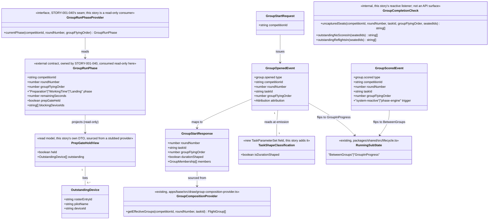

# Start Every Group with One Deliberate Action

## Requirements
Give the Announcer/Timekeeper the single, deliberate action that starts every
group — sequence-driven or manual-run alike — so no group ever crosses its
start boundary on its own (D10): for a duration-shaped task the action hands
off to the phased sequence (STORY-001-040); for a manual-run task it marks
the group current and gives Scorer devices their group context with no
automation. Either way this story is the sole emitter of `group.opened` (the
fact that flips lifecycle `RunningSubState` to `GroupInProgress`) and of
`group.scored` (the fact that flips it back) — the latter emitted
**reactively**, never by a second operator click: a duration-shaped group's
`group.scored` is triggered by STORY-001-040's phase engine reaching landing
completion, and a manual-run group's `group.scored` is triggered by this
story's own listener re-checking capture completeness (reusing
STORY-001-043's completeness definition, resolved-inclusive) each time a
capture/no-score/lone-pilot fact arrives for that group's seated pilots. This
story also surfaces — but never releases — a held prep-confirmation gate so
the operator always knows why a group hasn't moved.

## Entities


Conservative note: no new persistent aggregate is introduced beyond the
`group.opened`/`group.scored` event pair — both payload shapes
(`GroupOpenedPayload`/`GroupScoredPayload`) are **already declared** in
`packages/shared/src/events.ts:513-524` as `{competitionId, roundNumber,
groupFlyingOrder}`. This story extends both, additively (NFR-2), with one
new required field — `taskId: string` — rather than leaving the shape as-is:
without it, `groupFlyingOrder` alone cannot disambiguate F3B's three
concurrently-scheduled, independently-numbered per-task group sequences
(confirmed by inspecting `GroupCompositionProvider.getEffectiveGroups`, which
already keys on `(competitionId, roundNumber, taskId)` — the existing event
payload is simply missing the field needed to key the same way). This is a
necessary, deliberate correction, not a redesign of the payload's intent;
every man-on-man class (one task) is unaffected since its single `taskId` is
constant per round. `GroupRunPhase`/`GroupRunPhaseProvider` are drawn **exactly** as
STORY-001-040's already-shipped canvas defines them
(`spdd/prompt/STORY-001-040-...md`) — this story is a pure read-only
consumer, never a definer, of that contract. `PrepGateHoldView` is this
story's own new, minimal read DTO (not an entity STORY-001-034 defines) —
built against a stub today, per Decision #7 in the source analysis.
`TaskShapeClassification` is not a new class but one boolean field this story
adds to the existing `TaskParameterSet` (`packages/shared/src/class-model.ts`).

**A note on the file header comment currently in `packages/shared/src/
events.ts:459-467`**: it attributes `group.opened`/`group.scored` ownership
to "STORY-001-011 / Area 6" generically. That comment is **stale** relative
to the now-fixed cross-story decision (this story, 044, is confirmed sole
emitter of both facts, per STORY-001-040's own Approach §8) — Operations
below updates it rather than leaving it to mislead a future reader.

## Approach
1. **Follow the established event-sourced/projection pattern, one new
   sibling module**: a new `apps/base/src/group-run/` module — the same
   physical location STORY-001-040 also builds into (Approach documents both
   stories sharing this directory: this story owns the write side for
   `group.opened`/`group.scored` and the `GroupStart` action; STORY-001-040
   owns the phase-transition scheduler/projection). A service appends
   `group.opened` on the deliberate start action; a projection folds
   "current group + classification" for this story's own reads (distinct
   from, but consistent with, `LifecycleProjection`'s existing `openGroups`
   fold, which already derives `RunningSubState` from the same two event
   types with zero changes needed there).
2. **This story is the producer half of three consumer relationships,
   confirmed, not re-decided**: `group.opened` (carrying no classification
   payload field itself — see Operations "Emit `group.opened`" for why) is
   the trigger STORY-001-040's `GroupRunScheduler.onGroupStarted(...)` reacts
   to for duration-shaped tasks and is a no-op for manual-run ones (STORY-001-040
   Approach §7/§8, already committed); the same event is what STORY-001-034
   waits for to push Scorer-device round/group context (STORY-001-034
   unbuilt, consumed as a documented downstream fact, not built here).
3. **`group.scored` is reactive on both paths — settled, no operator click
   either way.** This resolves the prior tension between this story's own
   analysis (Decision #6: manual-run closure "is not this story's to
   define") and STORY-001-040's canvas (044 "appends group.scored") by
   making 044 own the **append mechanism** for both paths while the
   **trigger** for each is a system fact, never a human action:
   - **Duration-shaped**: STORY-001-040's scheduler calls this story's
     `onGroupRunCompleted(competitionId, roundNumber, taskId,
     groupFlyingOrder)` once the landing window elapses (`groupRun.completed`),
     mirroring how this story calls STORY-001-040's own `onGroupStarted(...)`
     the other direction. This story appends `group.scored` in response.
   - **Manual-run**: this story runs a `GroupCompletionReactor` that listens
     for every capture-shaped fact (`scoring.resultCaptured`,
     `scoring.lonePilotResolved`, a no-score creation fact, an "advance
     anyway" resolution) scoped to the competition. Each time one arrives
     while a manual-run group is open
     (`RunningSubState === "GroupInProgress"` and that group's task has
     `isDurationShaped === false`), the reactor re-runs a completeness check
     over that group's seated pilots only, reusing STORY-001-043's own
     definitions verbatim (`ScoreCompletenessProvider.uncapturedSeats`, plus
     `NoScoreOutstandingProvider`/`ReflightOutstandingProvider` filtered to
     this group's seats) — **resolved-inclusive**: a seat with a captured
     result, a resolved no-score, or a resolved lone-pilot fact all count as
     accounted-for, never as still-blocking. When the check returns nothing
     outstanding, the reactor appends `group.scored` immediately, with no
     human in the loop.
   - **There is no operator-facing "close group" action anywhere in this
     story.** Both triggers are system facts; both append via the same
     internal method, tagged with a system attribution sentinel (mirroring
     STORY-001-040's own `"system"/"group-run-engine"` convention for its
     own no-`Attribution` events) rather than an operator's `Attribution` —
     a deliberate, symmetric departure from `group.opened` (which *is*
     operator-attributed, since starting a group is the one deliberate human
     action this story delivers). This is now the final, settled design —
     not a placeholder pending re-confirmation.
4. **Class-agnostic by construction (CLAUDE.md)**: the branch between
   "hand off to the phased sequence" and "mark current, push context, do
   nothing further" reads exactly one boolean —
   `TaskParameterSet.isDurationShaped` — read through the existing
   `ClassModelProjection`/class-model service, never a discipline-name
   literal. No route, service method, or event payload in this story
   inspects a class/discipline identifier.
5. **Business logic / validation strategy**:
   - `GroupStart` is a new `LifecycleGuard` admissibility entry, distinct
     from the existing `"Start"` (STORY-001-025's Setup→Running), admissible
     only from `Running/BetweenGroups` — mirroring `Suspend`/`Lock`/
     `RoundAdvance`'s existing table shape exactly. This single guard
     rejects both a double-start (already `GroupInProgress`) and a
     pre-proceedings start (still `Setup`) for free (Decision #8).
   - "The next group" is always system-derived — the server computes the
     next `(roundNumber, groupFlyingOrder)` in flying order from the
     accepted draw plus prior `group.opened`/`group.scored` facts; the
     start route accepts no body beyond the competition id path param
     (Decision #3), matching AC4's "minimal, unambiguous interaction"
     literally.
   - AC5's held-gate visibility is a pure read exposed alongside the start
     action's response/a companion read route — this story never calls any
     gate-release method; `PrepGateHoldView` is fed by a stub
     (`UnavailablePrepGateHoldProvider`, always `{held: false, outstanding:
     []}`) until STORY-001-034 lands, exactly mirroring the
     `AlwaysUnlockedProvider` idiom already used elsewhere in this codebase.
   - All new domain errors extend the existing `DomainError` base
     (`apps/base/src/pilots/errors.ts`) and get one `setErrorHandler` branch
     each in `apps/base/src/app.ts`, inserted after the round-advance block
     (STORY-001-043's) and before the generic `TransitionNotAllowedError`/
     `DomainError` fallback.
6. **Next-group resolution algorithm — a concrete rule, not an assertion**
   (resolves the F3B multi-task-group gap flagged at analysis time). A bare
   `POST .../group-run/start` with no body/no `taskId` resolves the *one*
   `(taskId, groupFlyingOrder)` to open next as follows:
   - `round = progress.completedRounds(competitionId) + 1` (the same
     derivation STORY-001-026/043 already use).
   - `model = classModelProjection.getById(competition.classModelId)`;
     iterate `model.tasks` **in the class model's own declared array
     order** (F3B's fixed Distance → Speed task order, or the single task
     for every man-on-man class).
   - For each `task` in that order: call
     `groupComposition.getEffectiveGroups(competitionId, round, task.id)`
     (existing, ordered ascending by `flyingOrder`); for each `group` in
     that order, test whether a `group.opened` fact already exists for
     `(competitionId, round, task.id, group.flyingOrder)` (tracked by this
     story's own internal fold over `group.opened`, keyed on the full
     4-tuple — see Structure/Operations for why `taskId` must be added to
     the payload to make this tuple resolvable at all).
   - Return the **first** `(task.id, group.flyingOrder)` pair, in that
     nested iteration order, with no matching `group.opened` fact yet.
   - If every task's every group for the current round already has a
     `group.opened` fact, throw `NoGroupReadyToStartError` — advancing to
     the next round is exclusively STORY-001-043's `round-advance` action,
     never inferred here.
   - This generalises for free to F3B's three-task shape (the loop is over
     `model.tasks`, never a discipline branch) and degenerates to "the next
     unopened group in flying order" for every single-task class, matching
     AC3's "the next group never starts itself" literally: nothing is
     opened until this exact algorithm is invoked by the start action.

## Structure

### Inheritance Relationships
1. `GroupRunControlError` (reused name is deliberately avoided — that name
   belongs to STORY-001-032's authority-slice errors; this story's own base
   is `GroupStartError extends DomainError`, from `apps/base/src/pilots/
   errors.ts`), matching every existing module's error hierarchy.
2. Concrete subclasses: `NoGroupReadyToStartError` only. There is no
   `GroupNotOpenError`/close-rejection class — with `group.scored` fully
   reactive (Approach §3), the internal append path is idempotent (a
   completeness check firing after the group has already been closed is a
   silent no-op, not an error), so there is no operator-facing rejection to
   model. (If a `GroupNotFoundError`-shaped need arises for the prep-gate
   read, reuse STORY-001-040's own `GroupRunNotFoundError` shape rather than
   declaring a duplicate class.)
3. `GroupRunPhaseProvider` (interface) is **not** defined by this story — it
   is STORY-001-040's contract, consumed here read-only for AC5's display;
   this story imports the interface, never redeclares it.
4. `TaskShapeProvider`-equivalent: this story does **not** introduce a new
   interface for the classification read — it reads
   `TaskParameterSet.isDurationShaped` directly via the existing
   `ClassModelProjection`, since this story is the one adding the field
   (settled: 044 owns it — see Operations), not consuming it through a seam
   (STORY-001-040 is the one that reads it through its own `TaskShapeProvider`
   seam, per that story's Approach §7).
5. `GroupOpenedPayload`/`GroupScoredPayload` (existing plain interfaces,
   `packages/shared/src/events.ts:513-524`) gain one additive field each,
   `taskId: string` — necessary to disambiguate F3B's concurrent per-task
   group sequences (see Entities conservative note and Approach §6's next-
   group algorithm); every other field is unchanged.

### Dependencies
1. `apps/base/src/routes/group-run.ts` (new route file, shared physically
   with STORY-001-040's read route in the same directory but a distinct set
   of routes — this story's one write route, 040's read route) calls a new
   `GroupStartService` (new, `apps/base/src/group-run/start-service.ts`).
2. `GroupStartService` depends on: the `EventStore` (append),
   `GroupCompositionProvider` (existing, resolve "who is seated in the next
   group"), `ClassModelProjection` (existing, read `model.tasks` in order
   plus `TaskParameterSet.isDurationShaped`), `LifecycleProjection`
   (existing, read current `RunningSubState`), `FinalisationProgressProvider`
   (existing, derive the current round number), and `LifecycleGuard`
   (existing, `GroupStart` admissibility check).
3. A new `GroupCompletionReactor` (`apps/base/src/group-run/
   completion-reactor.ts`) depends on: the `EventStore` (append
   `group.scored`, and subscribe/replay to observe capture-shaped facts),
   `GroupCompositionProvider` (the currently-open group's seated
   `rosterEntryId`s), STORY-001-043's `ScoreCompletenessProvider` and the
   round-level `NoScoreOutstandingProvider`/`ReflightOutstandingProvider`
   (all three reused unmodified, filtered to the open group's seats — no
   re-implementation of 043's completeness definition), and
   `ClassModelProjection` (to confirm the open group's task is manual-run
   before running the reactive check at all). STORY-001-040's scheduler
   depends on this story's `onGroupRunCompleted(...)` method for the
   duration-shaped path — the one dependency edge pointing 040 → 044,
   mirroring 044 → 040's own `onGroupStarted(...)` edge.
4. `apps/base/src/app.ts` injects `GroupStartService` and
   `GroupCompletionReactor` the same way it injects
   `DrawService`/`CompetitionService`, and registers
   `registerGroupStartRoutes(app, groupStartService, prepGateHoldProvider)`
   alongside the existing route registrations; `GroupCompletionReactor` is
   started (subscribed to the event stream) at boot, not exposed via any
   route.
5. Neither `GroupStartService` nor `GroupCompletionReactor` imports or
   depends on any `ClassModel`-adjacent module beyond `ClassModelProjection`'s
   existing generic reads — a structural check (grep for class-name
   literals under `apps/base/src/group-run/` must return zero hits),
   matching STORY-001-032 and STORY-001-040's own equivalent constraints.
6. `PrepGateHoldView`'s stub provider has zero dependencies today; its real
   implementation (STORY-001-034's to supply) will depend on that story's
   own device-confirmation state — out of this story's build.

### Layered Architecture
1. **Route layer** (`apps/base/src/routes/group-run.ts`): reuses
   `attributionFromHeaders()` (the existing default, non-CD helper from
   `apps/base/src/routes/draw.ts` — extracted to a shared module if not
   already, per the Norms below) for the one write route (start); a plain
   GET for the prep-gate hold view; no business logic in the route handlers
   themselves. There is no close/complete route — nothing for an operator
   to call to mark a group scored.
2. **Service layer** (`apps/base/src/group-run/start-service.ts`, new):
   `startGroup(competitionId, attribution)` only — resolves the next group
   via the Approach §6 algorithm, applies the `GroupStart` guard, reads the
   classification, constructs and appends `group.opened`, and (for a
   duration-shaped task) invokes STORY-001-040's `GroupRunScheduler
   .onGroupStarted(...)` hook synchronously in the same request
   (fire-and-forget per STORY-001-040's own interface contract).
3. **Reactive completion layer** (`apps/base/src/group-run/
   completion-reactor.ts`, new): `onGroupRunCompleted(competitionId,
   roundNumber, taskId, groupFlyingOrder)` — called by STORY-001-040's
   scheduler for a duration-shaped group's landing-window completion — and
   an internal capture-fact subscriber for manual-run groups (Approach §3).
   Both paths funnel into one private `closeGroup(...)` method that appends
   `group.scored` with a system attribution sentinel, idempotently (a
   second call for an already-closed group is a silent no-op). No route
   exposes either entry point directly; both are internal/inter-module
   calls.
4. **Read layer** (`apps/base/src/group-run/prep-gate-view.ts`, new): maps
   `GroupRunPhaseProvider.currentPhase(...)`'s `prepGateHeld`/
   `blockingDeviceIds` (when a run is active) into `PrepGateHoldView`;
   returns `{held: false, outstanding: []}` when no run is active
   (`RunningSubState !== "GroupInProgress"`) rather than calling the
   partial-function `currentPhase()` in that case, per STORY-001-040's own
   documented calling convention.
5. **Event store / projection layer**: `group.opened`/`group.scored` append
   under `scope = competitionId` (existing convention, unchanged); no new
   projection is required beyond `LifecycleProjection`'s existing fold —
   this story's own "which group is next" derivation is a stateless
   computation over `DrawProjection`'s accepted-draw read plus this story's
   own internal fold over prior `group.opened` facts (keyed on the full
   `(roundNumber, taskId, groupFlyingOrder)` tuple), not a new persisted
   read model.
6. **Exception handling layer**: one new `instanceof` branch (
   `NoGroupReadyToStartError`) appended to the existing `apps/base/src/
   app.ts` `setErrorHandler`, ordered after STORY-001-043's round-advance
   block.

## Operations

### Update Shared Type — `packages/shared/src/class-model.ts`
1. Responsibility: add the duration-shaped/manual-run classification field
   this story owns (Decision #2), to the existing `TaskParameterSet`
   interface.
2. Change:
   ```ts
   export interface TaskParameterSet {
     // ...existing fields unchanged...
     // Whether this task runs the automatic phased sequence (STORY-001-040)
     // or is manual-run with no automated countdown/callouts/prep-gate
     // (STORY-001-044). Rule-fixed, derived from the task's own shape, never
     // an operator/competition-config choice (Area 3.8, D10).
     isDurationShaped: boolean;
   }
   ```
3. Constraints: additive-only (NFR-2) — every existing seed `TaskParameterSet`
   (F3B/F3J/F3K/F5J/F5K/F5L stock class models) must set this field
   explicitly at seed time (F3B Distance/Speed and F3K all-up = `false`; all
   duration/working-time tasks = `true`) — no default inferred silently.
   **Settled, not an open race**: STORY-001-044 (this story) owns adding
   this field, since 044 is both the later-built canvas and the story that
   structurally branches on it (phased-sequence hand-off vs. reactive
   manual-run completion, per Approach §3); STORY-001-040 consumes it
   read-only through its own `TaskShapeProvider` seam and must simply point
   that seam at this exact field/location — this is confirmation, not a
   redesign, and STORY-001-040's canvas should be updated to drop any
   remaining "whichever lands first" framing now that ownership is fixed
   here.

### Update Shared Type — `packages/shared/src/events.ts`
1. Responsibility: (a) add one additive field to each of
   `GroupOpenedPayload`/`GroupScoredPayload`; (b) correct the stale
   ownership comment at lines ~459-467 that attributes `group.opened`/
   `group.scored` to "STORY-001-011 / Area 6" generically.
2. Change (payload):
   ```ts
   export interface GroupOpenedPayload {
     competitionId: string;
     roundNumber: number;
     taskId: string; // NEW — disambiguates F3B's concurrent per-task groups
     groupFlyingOrder: number;
   }

   export interface GroupScoredPayload {
     competitionId: string;
     roundNumber: number;
     taskId: string; // NEW — same rationale as above
     groupFlyingOrder: number;
   }
   ```
3. Change (comment): update the ownership comment to read "`group.opened`/
   `group.scored` (STORY-001-044 — the single deliberate group-start action;
   `group.opened` is operator-attributed, `group.scored` is system-emitted,
   reactively, on both the duration-shaped and manual-run paths — see
   STORY-001-044's own canvas Approach §3)" in place of the prior generic
   attribution, matching the file's existing per-event-type
   ownership-comment convention.
4. Constraints: additive-only (NFR-2) — `taskId` is a genuinely new field,
   not a rename; every emitter of these two events (there is exactly one,
   this story) must populate it going forward. No consumer that reads only
   the pre-existing three fields breaks.

### Create Domain Errors — `apps/base/src/group-run/errors.ts` (new file)
1. Responsibility: the one error subclass this story's start action can
   throw, matching `draw/errors.ts`'s file-header discipline verbatim.
2. Classes:
   - `NoGroupReadyToStartError extends DomainError` — `code =
     "NO_GROUP_READY_TO_START"` — thrown when Approach §6's algorithm finds
     no `(taskId, groupFlyingOrder)` left unopened for the current round
     (every task-group already opened, or the draw is incomplete for the
     next round).
3. Constraints: carries exactly one `readonly code` string and a
   single-argument `message` constructor, matching every existing error
   class in this codebase byte-for-byte in shape. The existing
   `LifecycleGuard`'s own `TransitionNotAllowedError` (already wired) is
   reused unchanged for the `GroupStart`-admissibility rejection path (a
   double-start or pre-proceedings start). There is no close-rejection
   error class — `group.scored`'s reactive append path is idempotent, not
   throwing (Structure, Inheritance Relationships §2).

### Implement Service — `apps/base/src/group-run/start-service.ts` (new)
1. Interface Definition: `GroupStartService` with exactly one public method.
2. Core Method:
   - `startGroup(competitionId: string, attribution: Attribution):
     Promise<GroupStartResponse>`: Input Validation — none beyond route-level
     path param. Business Logic — read `LifecycleState` via
     `LifecycleProjection`; `lifecycleGuard.assertAdmissible(state,
     "GroupStart")` (throws the existing `TransitionNotAllowedError` if the
     competition is not `Running/BetweenGroups`); run Approach §6's
     next-group algorithm — `round = progress.completedRounds(competitionId)
     + 1`; iterate `model.tasks` in declared order, and within each task
     iterate `groupComposition.getEffectiveGroups(competitionId, round,
     task.id)` in ascending `flyingOrder`, returning the first
     `(task.id, group.flyingOrder)` with no prior `group.opened` fact for
     that exact `(round, task.id, flyingOrder)` tuple (tracked via this
     story's own internal fold over its own emitted `group.opened` events,
     replayed at construction like every other projection); throw
     `NoGroupReadyToStartError` if the whole nested iteration is exhausted;
     read `task.isDurationShaped` for the resolved task; append
     `group.opened` with `{competitionId, roundNumber: round, taskId:
     task.id, groupFlyingOrder}` and the given operator `Attribution`; if
     `isDurationShaped`, invoke STORY-001-040's `GroupRunScheduler
     .onGroupStarted(competitionId, round, task.id, groupFlyingOrder)`
     (fire-and-forget, this story never awaits or blocks on the phase
     engine's own transitions); if **not** `isDurationShaped`, notify the
     injected `GroupCompletionReactor` that this group is now the
     manual-run group to watch (so its capture-fact subscription knows
     which seated pilots to check completeness against); read
     `GroupCompositionProvider.getEffectiveGroups(...)` for the response's
     `members`. Return value: `GroupStartResponse` (round/task/group
     identity, `durationShaped` flag, seated members).
3. Dependency Injection: `EventStore`, `DrawProjection`/
   `GroupCompositionProvider`, `ClassModelProjection`,
   `LifecycleProjection`, `FinalisationProgressProvider`, `LifecycleGuard`,
   an injected `GroupRunSchedulerHook` interface (`onGroupStarted(...): void`,
   satisfied by STORY-001-040's real scheduler, stubbed as a no-op here
   until that story lands), and `GroupCompletionReactor` (this story's own,
   see below) — constructor-injected, matching `DrawService`'s existing
   style.
4. Transaction Management: appends exactly one event per call — no
   multi-event transactions, matching the existing one-append-per-action
   discipline.

### Implement Reactive Completion — `apps/base/src/group-run/
### completion-reactor.ts` (new)
1. Interface Definition: `GroupCompletionReactor` with one method callable
   by STORY-001-040 (`onGroupRunCompleted`) and an internal subscription
   entry point for capture-shaped facts; no public HTTP-facing method at
   all.
2. Core Methods:
   - `onGroupRunCompleted(competitionId: string, roundNumber: number,
     taskId: string, groupFlyingOrder: number): Promise<void>` — called by
     STORY-001-040's scheduler once a duration-shaped group's landing
     window elapses (`groupRun.completed`). Business Logic — delegate
     straight to the shared private `closeGroup(...)` below; no
     completeness check is run for this path (a duration-shaped group's
     completion is determined entirely by the phase engine reaching
     landing's end, not by capture presence).
   - `onCaptureShapedFact(competitionId: string, roundNumber: number,
     taskId: string): Promise<void>` — the internal handler invoked after
     every `scoring.resultCaptured` / `scoring.lonePilotResolved` / no-score
     creation / `roundAdvance.overridden` fact is appended for this
     competition (wired as a post-append hook off the `EventStore`, or a
     lightweight poll after each scoring-module append — an implementation
     detail, not an AC). Business Logic — if
     `RunningSubState !== "GroupInProgress"`, no-op (nothing open to
     close); read the currently-open `(roundNumber, taskId,
     groupFlyingOrder)` via this story's own internal state (set by
     `startGroup`'s notify call); if that task's `isDurationShaped ===
     true`, no-op (that path is 040's `onGroupRunCompleted`, not this one);
     otherwise read the group's seated `rosterEntryId`s via
     `GroupCompositionProvider`, then check, **all resolved-inclusive**:
     `scoreCompleteness.uncapturedSeats(competitionId, roundNumber, taskId,
     groupFlyingOrder, seatedIds)` is empty, **and** no entry in
     `noScoreOutstanding.outstandingNoScores(competitionId, roundNumber)`
     names a seat in this group, **and** no entry in
     `reflightOutstanding.outstandingReflights(competitionId, roundNumber)`
     names a pilot/task in this group. When all three hold, call
     `closeGroup(...)`; otherwise no-op (still incomplete, waiting for more
     captures).
   - `closeGroup(competitionId, roundNumber, taskId, groupFlyingOrder)`
     (private): Business Logic — idempotency guard first (if
     `RunningSubState !== "GroupInProgress"` for this exact group, already
     closed — no-op, no error); append `group.scored` with
     `{competitionId, roundNumber, taskId, groupFlyingOrder}`, using a
     system attribution sentinel (`actorName: "system", originClient:
     "group-run-engine", authority: "system"`, matching STORY-001-040's own
     documented convention for its own system-emitted events) rather than
     any human `Attribution` — there is no operator to attribute this fact
     to on either trigger path.
3. Dependency Injection: `EventStore`, `LifecycleProjection`,
   `GroupCompositionProvider`, `ClassModelProjection`,
   STORY-001-043's `ScoreCompletenessProvider`, `NoScoreOutstandingProvider`,
   `ReflightOutstandingProvider` (all three reused, injected, never
   reimplemented) — constructor-injected.
4. Transaction Management: `closeGroup` appends exactly one event; the
   capture-fact handler itself never appends unless the completeness check
   passes — no partial/multi-event writes.

### Implement Read Model — `apps/base/src/group-run/prep-gate-view.ts` (new)
1. Interface Definition: `PrepGateHoldProvider` — one method,
   `currentHold(competitionId: string): PrepGateHoldView`.
2. Core Method:
   - `currentHold(...)`: Business Logic — read `RunningSubState` via
     `LifecycleProjection`; if not `GroupInProgress`, return
     `{held: false, outstanding: []}`; otherwise delegate to the injected
     `GroupRunPhaseProvider.currentPhase(...)` (STORY-001-040's interface,
     consumed read-only) and map `prepGateHeld`/`blockingDeviceIds` into
     `PrepGateHoldView`, resolving each device id's `pilotName` via the
     roster projection (existing). Never calls, or offers a route to call,
     any gate-release method — read-only by construction (AC5, Scope Out).
3. Dependency Injection: `LifecycleProjection`, `GroupRunPhaseProvider`
   (stub `UnavailablePrepGateHoldProvider`-style default until
   STORY-001-034/040 land — actually the stub here is of
   `GroupRunPhaseProvider` itself, not a separate class, matching
   STORY-001-032's own stubbing idiom for the same interface), `RosterProjection`.
4. Transaction Management: n/a — pure read.

### Create Routes — `apps/base/src/routes/group-run.ts` (new, shared file
### with STORY-001-040's read route — this story's one write route plus one
### read route)
1. Responsibility: expose the start action and the prep-gate hold read.
   There is deliberately no route to close/complete a group — that fact is
   always system-emitted (Approach §3), never operator-triggered.
2. Routes:
   - `POST /api/competitions/:competitionId/group-run/start` — no body
     (Decision #3) → `GroupStartResponse`.
   - `GET /api/competitions/:competitionId/group-run/prep-gate` →
     `PrepGateHoldView`.
3. Annotations/registration: `registerGroupStartRoutes(app,
   groupStartService, prepGateHoldProvider)` called from
   `apps/base/src/app.ts` alongside `registerDrawRoutes`,
   `registerCompetitionRoutes`, and (once it exists)
   `registerGroupRunReadRoutes` (STORY-001-040's); `GroupCompletionReactor`
   is constructed and its capture-fact subscription started in the same
   file, but it registers no route of its own.
4. Constraints: the one write route uses `attributionFromHeaders()` (the
   existing default, non-CD helper) — Decision #4, no new
   Announcer/Timekeeper-specific attribution helper; the prep-gate read
   route requires no attribution at all (read-only).

### Update Exception Handler — `apps/base/src/app.ts`
1. Responsibility: extend the existing `setErrorHandler` with one new
   branch, inserted after STORY-001-043's round-advance block and before
   the generic `TransitionNotAllowedError`/`DomainError` fallback.
2. Exception Types (new):
   - `NoGroupReadyToStartError` → 409
3. Methods: no new handler methods — reuse the existing single
   `app.setErrorHandler(...)` callback, append one `if (error instanceof
   NoGroupReadyToStartError)` block in the established
   `reply.status(...).send({code, message})` shape.
4. Constraints: a missing branch for this error class is a release blocker
   per the file's own documented Safeguard-8 discipline (`draw/errors.ts`'s
   header comment).

## Norms
1. **Annotation Standards**: none beyond existing Fastify route-handler
   conventions (`app.post<{ Params: CompetitionParams }>`) already used
   throughout `routes/draw.ts`/`routes/competitions.ts` — no decorator
   framework.
2. **Dependency Injection**: constructor injection only, matching
   `DrawService`/`CompetitionService`'s existing pattern; no DI container —
   services instantiated once in `apps/base/src/app.ts`.
3. **Exception Handling**:
   - Every new domain error extends `DomainError`, carries a `readonly code:
     string` and a single-argument `message` constructor.
   - One `setErrorHandler` branch per class, inserted in module order.
   - Response shape: `reply.status(<code>).send({ code: error.code, message:
     error.message })` — no new `ErrorResponse` DTO.
4. **Data Validation**: no request body on either of this story's two
   routes — path params only, reusing the existing param-coercion idiom.
5. **Logging**: none beyond the existing event-log itself (D4) — the
   append-only `EventStore` is the audit trail; no parallel logging
   framework.
6. **Documentation Standards**: every new file/section carries a top-of-file
   comment stating which story it belongs to and which ACs/decisions it
   satisfies, matching `events.ts`/`draw.ts`/`lifecycle.ts`'s dense inline
   commentary style.
7. **Attribution reuse**: this story's routes reuse `attributionFromHeaders()`
   verbatim from `apps/base/src/routes/draw.ts` (or its extracted shared
   location, if extraction happens first) — never `cdAttributionFromHeaders()`,
   since this action is Announcer/Timekeeper's, not the Contest Director's
   (Decision #4; D1 records authority without enforcing it).

## Safeguards
1. **Functional Constraints**: `startGroup()` MUST append exactly one
   `group.opened` event on success and zero events on any rejection (AC1/
   AC2/AC4) — verified by a test asserting event-store record count
   before/after both a successful and a rejected call.
2. **Never-auto-starts constraint (AC3)**: `group.opened` is appended from
   exactly one call site (`startGroup()`, itself only reachable from the
   one `POST .../group-run/start` route) — no background scheduler, no
   auto-advance. `group.scored` is appended from exactly one private method
   (`closeGroup(...)`), reached only via `onGroupRunCompleted(...)`
   (STORY-001-040's scheduler, duration-shaped path) or the internal
   capture-fact subscriber (manual-run path) — verified by there being
   exactly these three call sites for the two event types across the whole
   codebase, and by a test asserting no group transitions state without one
   of them firing.
3. **Double-start / pre-Start rejection (Decision #8)**: a `startGroup()`
   call while `RunningSubState === "GroupInProgress"`, and a call while the
   competition is still `Setup`, both throw `TransitionNotAllowedError` via
   the single `GroupStart` admissibility entry (`Running/BetweenGroups`
   only) — verified by one test per case, matching the existing
   `Suspend`/`Lock`/`RoundAdvance` admissibility test pattern.
4. **Class-agnosticism constraint**: the duration-shaped/manual-run branch
   reads exactly one boolean (`TaskParameterSet.isDurationShaped`) and no
   route, service method, or event payload in this story reads or branches
   on a class/discipline identifier — structurally verifiable (grep for
   class-name literals or `ClassModel` imports under
   `apps/base/src/group-run/` must return zero hits beyond the generic
   `ClassModelProjection` read), per CLAUDE.md's core law. The next-group
   algorithm (Approach §6) generalises to F3B's three-task shape and every
   single-task class through the identical `model.tasks` loop — verified by
   a test parametrised over a single-task class model and an F3B-shaped
   (three-task) class model.
5. **Manual-run "no automation" constraint (AC2)**: when `isDurationShaped
   === false`, `startGroup()` MUST NOT invoke
   `GroupRunSchedulerHook.onGroupStarted(...)` at all — verified by a test
   asserting the scheduler hook is never called on the manual-run path.
6. **Prep-gate display-only constraint (AC5)**: `PrepGateHoldProvider` and
   its route expose no method or endpoint capable of releasing, pausing, or
   otherwise mutating the gate — verified by there being zero write methods
   on `PrepGateHoldProvider`'s interface and zero POST/PUT/DELETE routes
   under `.../group-run/prep-gate`.
7. **`group.scored` is reactive on both paths — settled, no hedging**:
   there is no operator-facing route, button, or "close group" action
   anywhere in this codebase; `group.scored` is appended only by
   `GroupCompletionReactor.closeGroup(...)`, triggered either by
   STORY-001-040's `onGroupRunCompleted(...)` call (duration-shaped: the
   phase engine reaching landing completion) or by this story's own
   capture-fact subscriber finding a manual-run group's completeness check
   satisfied (resolved-inclusive, reusing STORY-001-043's
   `ScoreCompletenessProvider`/`NoScoreOutstandingProvider`/
   `ReflightOutstandingProvider` verbatim, filtered to the group's seats) —
   verified by (a) a test that a manual-run group's `group.scored` appends
   automatically the instant its last outstanding item resolves, with zero
   additional calls from any route/test harness acting as "the operator,"
   and (b) a test that a resolved no-score or lone-pilot fact, not only a
   raw capture, can be the one that completes a group. This is the final
   resolution — not pending re-confirmation.
8. **Idempotency constraint**: `closeGroup(...)` MUST be a safe no-op when
   called for a group that is no longer `GroupInProgress` (already closed,
   or never opened) — no error thrown, no duplicate `group.scored` appended
   — verified by a test calling it twice in succession and asserting
   exactly one `group.scored` record exists.
9. **Integration Constraints**: this story MUST NOT implement
   `GroupRunPhaseProvider` (STORY-001-040's) or the prep-confirmation
   gate's real mechanics (STORY-001-034's) — only read through their
   seams/stubs. This story DOES consume STORY-001-043's
   `ScoreCompletenessProvider`/`NoScoreOutstandingProvider`/
   `ReflightOutstandingProvider` directly (not stubbed — those are already
   built by STORY-001-043) but MUST NOT redefine or duplicate their
   completeness predicate. A PR for this story that includes a real phase
   engine, gate mechanism, or a second/competing completeness definition is
   over-scoped and must be split out.
10. **Security Constraints**: none beyond this codebase's existing trust
    model (D1) — `x-actor-name`/`x-client-id` headers trusted as-is via
    `attributionFromHeaders()` for the one write route; `group.scored`'s
    system attribution sentinel is fixed in code, never derived from a
    request header, since no request triggers it.
11. **Business Rule Constraints**:
    - "The next group" is always system-derived via Approach §6's concrete
      algorithm — the start route accepts no client-supplied round/task/
      group target (Decision #3), verified by the route accepting no
      request body.
    - The very first group of the first round, and a group following a
      suspend/resume cycle, both re-enter identically to "the next
      unopened `(taskId, groupFlyingOrder)` for the current round" — no
      special-casing in the derivation logic, verified by a test covering
      both scenarios against the same code path.
    - A manual-run group's completeness check is **resolved-inclusive**: a
      seat with a captured result, a resolved no-score, or a resolved
      lone-pilot fact all count as accounted-for — verified by a test
      where a group with one raw capture and one resolved no-score (no
      other outstanding items) closes automatically.
12. **Exception Handling Constraints**:
    - The one business exception this story introduces
      (`NoGroupReadyToStartError`) carries `code` and `message` and is
      classified under a `GROUP_START_*` domain prefix, matching the
      existing per-module `code`-prefixing convention.
    - No exception message may leak internal implementation detail.
    - The new error class gets its `setErrorHandler` branch in the same
      change that introduces it (Safeguard-8 discipline).
13. **Technical Constraints**: no service method, route, or reactive
    handler in this story may read or branch on a competition-class
    identifier (F3B/F3J/F3K/F5J/F5K/F5L) — structurally verifiable per
    Safeguard 4.
14. **Data Constraints**: `group.opened`/`group.scored` gain one additive
    field each (`taskId: string`, NFR-2) — necessary to disambiguate F3B's
    concurrent per-task group sequences (see Entities); no other field is
    added, renamed, or removed. `isDurationShaped` is never carried on
    either event payload — it is re-read from `TaskParameterSet` at
    consumption time by whichever consumer needs it (this story at
    `startGroup()`'s emission time; STORY-001-040 at its own
    `onGroupStarted` entry, via its own `TaskShapeProvider` seam).
15. **API Constraints**: `POST .../group-run/start` returns 200 with
    `GroupStartResponse` on success, 409 `NO_GROUP_READY_TO_START` or 409
    `TRANSITION_NOT_ALLOWED` on rejection, 404 for a never-existed
    competition id; `GET .../group-run/prep-gate` always returns 200 with
    `PrepGateHoldView` (never a 404 — `{held: false, outstanding: []}` is
    itself a valid, meaningful response when no group is open or no gate is
    held). There is no third route.
16. **Cross-Story Coordination Constraint**: the exact `GroupRunPhase`/
    `GroupRunPhaseProvider` shape (adopted verbatim from STORY-001-040), the
    `TaskParameterSet.isDurationShaped` field name/location (**settled: 044
    owns it** — STORY-001-040's own canvas should be updated to drop its
    "whichever lands first" framing and simply consume this field), and the
    `group.opened`/`group.scored` payload's new `taskId` field MUST all be
    re-confirmed against STORY-001-040's and STORY-001-034's own
    implementations before this story ships — building against an assumed
    contract a sibling story later reshapes is an accepted, explicitly-
    flagged risk, not a defect to silently absorb. The `group.scored`
    mechanism/trigger design (Safeguard 7) is no longer an open
    cross-story question — it is this canvas's final, settled answer.
