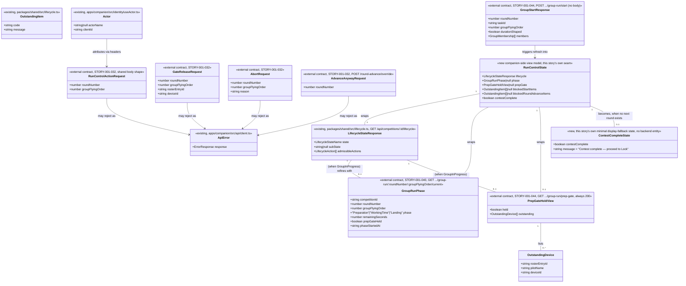

# Companion-App Run-Control Console

## Requirements
Give an operator one companion-app screen that always shows the competition's
current lifecycle/phase state and offers exactly the single deliberate action
that state calls for — Start Proceedings, Start Group, Advance Round, or the
Contest Director's run-control authority controls over a live group — so that
none of STORY-001-025/-032/-040/-043/-044's backend behaviour is stranded
behind a headless Base Station (D8). The console contributes no backend logic
of its own; it is a stateless, always-refetching client view (D8) over five
already-defined (four still unimplemented) backend contracts, usable at phone
size (companion-app §3.2), and it never triggers a boundary crossing itself
(D10) — every action is a deliberate tap.

## Entities

Conservative note: every entity above except `RunControlState` is an existing
or already-committed sibling-story DTO — this console defines and stores none
of them, it only fetches, displays and posts against them. `RunControlState`
is the one new concept: a plain client-side view-model shape (not a class
hierarchy, not a persisted store) assembled in the console's own hook from the
existing `LifecycleStateResponse` plus the two new read calls, mirroring how
`CompetitionLibrary.tsx` already assembles multiple `apiRequest` results into
local `useState`. No entity here is a competition-class model or carries a
discipline field (CLAUDE.md law) — every field is either a lifecycle/phase
primitive or an operator-facing string the backends already generate.
`ContestCompleteState` is likewise new but deliberately minimal — a single
boolean-plus-fixed-message display fallback, not a new backend contract or
lifecycle state; it is derived client-side from existing signals (see
Approach), never fetched from a dedicated endpoint, and it carries no
control of its own — Lock itself stays out of scope (STORY-001-026).

## Approach
1. **One new companion screen, following the established
   library/form/api-seam pattern exactly, not a new client architecture**:
   - Add `apps/companion/src/run-control/RunControlView.tsx` (the screen,
     mirroring `CompetitionLibrary.tsx`'s `useState`+`useEffect`+`apiRequest`
     shape) and `apps/companion/src/run-control/api.ts` (the seam module,
     mirroring `draw/api.ts`'s `DrawRequest`-typed-function-per-endpoint
     idiom — one exported function per backend call, no class, no fetch
     logic duplicated outside `apiRequest`).
   - Nest the screen under the already-selected competition, consistent with
     how `RosterView`/`DrawSpecView`/`DrawView` are opened as sub-views from
     `CompetitionLibrary`'s own `open: {id, view}` state (add `"run-control"`
     as a fourth `OpenView` member) — the console is meaningless without a
     competition context, matching the source analysis's Key Design
     Decision.
   - No new top-level `App.tsx` screen/nav entry is required; this composes
     into the existing `competitions` screen's per-competition sub-nav
     rather than adding a fifth item to `Screen`.
2. **Live-refresh via polling, layered on the existing `apiRequest` wrapper,
   not a new transport**:
   - A single `useEffect` interval (recommend 2s while the view is mounted,
     cleared on unmount) re-runs one `refresh()` function that always
     re-fetches `LifecycleStateResponse` first, then — only if
     `runningSubState === "GroupInProgress"` — fetches `GroupRunPhase` and
     `PrepGateHoldView` in parallel (`Promise.all`, mirroring
     `CompetitionLibrary.refresh()`'s existing dual-fetch pattern). This
     satisfies D8/AC9 ("fetched/streamed... client holds no state of its
     own") without inventing WebSocket/SSE infrastructure this codebase has
     no precedent for — resolves the analysis's open "poll vs stream"
     question in favour of polling, per the analysis's own recommendation.
   - Every mutating action's response handler calls the same `refresh()`
     rather than locally mutating state — this is the defensive,
     server-authoritative posture the analysis's multi-client edge case
     requires (companion-app §2, last-action-wins, no session lock): a
     rejected action (e.g. `TRANSITION_NOT_ALLOWED` because another client
     already advanced) still triggers a fresh read, so the console converges
     on the base's truth rather than trusting its own optimistic UI.
3. **Conditional rendering keyed on `LifecycleStateResponse` +
   `GroupRunPhase.phase`, never on a class/discipline field**:
   - `state !== "Running"` → show Start Proceedings only (AC1/AC2).
   - `runningSubState === "BetweenGroups"` → show Start Group and Advance
     Round together, unconditionally, whenever `BetweenGroups` holds
     (**settled, not open**: the console performs no client-side "is this
     really a round boundary" detection at all — it always offers Advance
     Round in this sub-state and lets the backend's 409
     `COMPETITION_NOT_READY` response on a premature tap surface the
     outstanding-items list, AC6, exactly as `TRANSITION_NOT_ALLOWED`
     already does for any other illegal-state tap; this resolves the prior
     open question in favour of "always offer, let the server gate").
   - `runningSubState === "GroupInProgress"` → show the CD run-control
     authority controls, phase-gated per `GroupRunPhase.phase`:
     `"Preparation"` → pause/resume/fast-forward/add-time + abort disabled;
     `"WorkingTime"`/`"Landing"` → abort only (AC5, STORY-001-032's fixed
     guard, mirrored not re-decided here). `prepGateHeld === true` also
     renders the held-gate banner + the two release controls (AC4).
   - This is the "one state, one next action" business rule from the
     analysis — implemented as a single `deriveNextAction(lifecycle, phase)`
     pure function the view calls, not scattered `if` statements across the
     JSX, so the rule stays testable in isolation.
4. **No "close group"/"mark scored" control anywhere in this console — an
   explicit scope exclusion, now confirmed consistent, not a conflict**:
   STORY-001-044's own prompt file
   (`spdd/prompt/STORY-001-044-202607161600-[Prompt]-...md`) has been
   verified to define **no operator-facing "close group" route or action**
   for either task shape — `group.scored` is emitted **reactively and
   automatically** on capture-completeness for manual-run tasks
   (STORY-001-043's completeness definition, resolved-inclusive) via a
   private `closeGroup(...)` method, and by the phase-engine's landing
   completion for duration-shaped tasks, with **no human click** on either
   path (044's own text states this explicitly in multiple places, e.g.
   "there is no operator-facing route, button, or 'close group' action").
   This console therefore builds no UI control against any close/mark-scored
   endpoint — an earlier draft of this canvas flagged an apparent conflict
   here; that conflict is now resolved on 044's side and this exclusion is
   confirmed correct, not a risk to track further.
5. **A minimal "Contest complete" display fallback so the console never
   dead-ends (new, this revision)**: when `runningSubState ===
   "BetweenGroups"` and an Advance Round attempt (or the lifecycle read
   itself) indicates there is no next round to advance into, the console
   shows a plain "Contest complete — proceed to Lock" state **instead of**
   Start Group/Advance Round/any authority control — never a blank or
   broken screen. Detection is deliberately cheap and derived from signals
   already on hand, not a new backend endpoint: an `advanceRound()` call
   that succeeds with a `LifecycleStateResponse` whose `admissibleActions`
   no longer contains `"RoundAdvance"` (all rounds exhausted) is treated as
   the completion signal; alternatively, if a future lifecycle read already
   surfaces an explicit "no further round" indicator, the console prefers
   that over inferring it. The console does **not** attempt to independently
   compute "is this the last round" from round counts/class-model data
   itself (that would be exactly the kind of client-side business-rule
   duplication Norms §4 already forbids) — it only reacts to what the
   backend's own response tells it. Lock itself (STORY-001-026) is
   explicitly out of scope here; this state is a **read-only, action-free**
   placeholder, not a Lock trigger.
6. **Class-agnostic by construction (CLAUDE.md)**: every string this screen
   renders (`phase`, `state`, `subState`, `OutstandingItem.message`,
   `pilotName`) is opaque, backend-supplied text — the console never
   inspects a `classModelId`/discipline literal to decide layout, wording, or
   which controls to show. Any code path that would need to special-case
   F3B/F3J/F3K/F5J/F5K/F5L is a violation of this story's own design; none
   was found necessary — the round-boundary/phase state machine is already
   fully generic in every sibling backend contract this screen consumes.
7. **Phone-size layout — one responsive layout, not a separate route**:
   a single CSS-breakpoint layout for `RunControlView` (stacked
   state-banner → primary action → authority-control grid on narrow
   viewports; the same markup, wider grid, on desktop) — consistent with
   AC8's "run-control **portion**" wording and the analysis's recommendation
   against a duplicate phone-only route.
8. **Two-speed build, matching the sequencing risk the analysis already
   flagged**: this canvas's Operations below build the full screen against
   all five contracts as now-fixed shapes (all four backend canvases have
   since landed, unlike when the source analysis was written) — but
   integration/e2e testing for AC3–AC7 cannot complete until STORY-001-032/
   -040/-043/-044 are actually implemented in `apps/base/src` (currently
   canvased only, per grounding above). The console's own component/unit
   tests (rendering logic, `deriveNextAction`, error-display) are buildable
   and testable today against mocked responses shaped exactly per this
   canvas's Entities section.

## Structure

### Inheritance Relationships
1. No new class hierarchy — this story is 100% function components + plain
   TypeScript interfaces, matching every existing companion-app screen
   (`CompetitionLibrary`, `DrawView`, `RosterView` are all function
   components with no class-based state).
2. `ApiError` (existing, `apps/companion/src/api/client.ts`) is reused
   unchanged for every rejected action — no new error class.
3. `RunControlState` (new) is a plain interface, not a class — matching
   `EditState`/`OpenView`'s existing shape in `CompetitionLibrary.tsx`.

### Dependencies
1. `apps/companion/src/run-control/RunControlView.tsx` (new) depends on:
   `apps/companion/src/run-control/api.ts` (new seam module), `apiRequest`/
   `ApiError` (`api/client.ts`, existing), `Actor` (`identity/useActor.ts`,
   existing).
2. `apps/companion/src/run-control/api.ts` (new) depends only on the
   `DrawRequest`-shaped function signature already established by
   `draw/api.ts` — no new HTTP abstraction; each exported function is a thin
   wrapper over one backend path.
3. `apps/companion/src/competitions/CompetitionLibrary.tsx` gains one new
   `OpenView` member (`"run-control"`) and one new conditional render branch
   calling `<RunControlView competitionId={open.id} actor={actor} />`,
   mirroring the existing `"roster"`/`"draw-spec"`/`"draw"` branches exactly.
4. `RunControlView` never imports `packages/shared/src/class-model.ts` or any
   `ContestClassModel`/discipline-specific type — a structural check
   (grep for class-name literals or `ClassModel` imports under
   `apps/companion/src/run-control/` must return zero hits), matching the
   equivalent constraint already imposed on every backend sibling story.

### Layered Architecture
1. **API-seam layer** (`apps/companion/src/run-control/api.ts`, new): one
   function per backend endpoint (see Operations for the full list), each
   typed against the DTOs in Entities, no business logic, exactly mirroring
   `draw/api.ts`'s `DrawRequest`-parameter idiom (the caller's own
   `apiRequest`-bound `request` function is passed in, so actor headers are
   stamped by the caller, not this module).
2. **View-model/hook layer** (`apps/companion/src/run-control/
   useRunControlState.ts`, new): owns the poll loop, the `refresh()`
   function, and the `deriveNextAction()` pure function; returns
   `RunControlState` plus action-dispatch callbacks to the view.
3. **View layer** (`apps/companion/src/run-control/RunControlView.tsx`,
   new): pure rendering — state banner, single next-boundary-action button,
   phase-gated authority-control grid, outstanding-items lists, prep-gate
   banner — driven entirely by the hook's returned `RunControlState`; no
   direct `apiRequest` calls in this file (all routed through the hook).
4. **Host layer** (`apps/companion/src/competitions/CompetitionLibrary.tsx`):
   one new `OpenView` branch, matching the existing sub-nav wiring.

## Operations

### Create API Seam — `apps/companion/src/run-control/api.ts` (new)
1. Responsibility: one typed function per backend call this console makes,
   mirroring `draw/api.ts`'s file-header/`DrawRequest` idiom verbatim.
2. Exported type: `export type RunControlRequest = <T>(path: string, method?: string, body?: unknown) => Promise<T>;`
   (identical shape to `DrawRequest`, kept as its own named type since the
   scope is a distinct module, matching the existing per-module naming
   convention rather than sharing one generic type across seams).
3. Functions (each `(request: RunControlRequest, competitionId: string, ...)`):
   - `getLifecycle(request, competitionId): Promise<LifecycleStateResponse>` →
     `GET /api/competitions/${competitionId}/lifecycle` (existing route,
     STORY-001-024/-025).
   - `getGroupRunPhase(request, competitionId, roundNumber, groupFlyingOrder): Promise<GroupRunPhase>` →
     `GET /api/competitions/${competitionId}/group-run/${roundNumber}/${groupFlyingOrder}/current`
     (STORY-001-040) — caller MUST only invoke this when
     `runningSubState === "GroupInProgress"`; a 404 here is treated as "no
     active run" and mapped to `phase: null` in `RunControlState`, never
     surfaced as an application error.
   - `getPrepGateHold(request, competitionId): Promise<PrepGateHoldView>` →
     `GET /api/competitions/${competitionId}/group-run/prep-gate`
     (STORY-001-044) — always 200, no error handling needed.
   - `startProceedings(request, competitionId): Promise<LifecycleStateResponse>` →
     `POST /api/competitions/${competitionId}/start` (STORY-001-025,
     existing).
   - `startGroup(request, competitionId): Promise<GroupStartResponse>` →
     `POST /api/competitions/${competitionId}/group-run/start`, no body
     (STORY-001-044).
   - `advanceRound(request, competitionId): Promise<LifecycleStateResponse>` →
     `POST /api/competitions/${competitionId}/round-advance`, no body
     (STORY-001-043).
   - `pausePrep`/`resumePrep`/`fastForwardPrep`/`addPrepTime(request,
     competitionId, roundNumber, groupFlyingOrder): Promise<RunControlActionResponse>` →
     `POST .../group-run/prep/pause` | `/resume` | `/fast-forward` |
     `/add-time`, body `{roundNumber, groupFlyingOrder}` (STORY-001-032).
   - `abortGroup(request, competitionId, roundNumber, groupFlyingOrder, reason): Promise<RunControlActionResponse>` →
     `POST .../group-run/abort`, body `{roundNumber, groupFlyingOrder, reason}`
     (STORY-001-032).
   - `releaseGateDeviceOffline`/`releaseGatePilotUnconfirmed(request,
     competitionId, roundNumber, groupFlyingOrder, rosterEntryId, deviceId): Promise<RunControlActionResponse>` →
     `POST .../group-run/gate/release-device-offline` |
     `/release-pilot-unconfirmed`, body `{roundNumber, groupFlyingOrder,
     rosterEntryId, deviceId}` (STORY-001-032).
   - `advanceRoundAnyway(request, competitionId, roundNumber): Promise<RunControlActionResponse>` →
     `POST /api/competitions/${competitionId}/round-advance/override`, body
     `{roundNumber}` (STORY-001-032).
4. Constraints: no function in this file performs its own `fetch` — every
   one delegates to the passed-in `request`, exactly as `draw/api.ts`
   already establishes; no function catches `ApiError` — rejections
   propagate to the caller (the hook), matching the existing seam's
   error-transparency convention.

### Implement Hook — `apps/companion/src/run-control/useRunControlState.ts` (new)
1. Interface Definition: `useRunControlState(competitionId: string, actor: Actor): { state: RunControlState | null; loading: boolean; error: ApiError | null; actions: RunControlActions }`.
2. Core Methods/Behaviour:
   - `refresh()`: Input Validation — none. Business Logic — build a bound
     `request` closure from `apiRequest`+`actor` (mirroring
     `CompetitionLibrary.refresh()`); fetch `getLifecycle()`; if
     `runningSubState === "GroupInProgress"`, fetch `getGroupRunPhase()`
     (catching a 404 as `phase: null`, per api.ts's contract above) and
     `getPrepGateHold()` in parallel via `Promise.all`; else set `phase:
     null, prepGate: null`; assemble into `RunControlState`; clear any
     previously blocked-items display **only** if the corresponding action
     is re-attempted (blocked-items lists persist across a poll tick until
     superseded by a fresh attempt, so a transient poll does not blank the
     operator's view of what's outstanding mid-read).
   - `useEffect` mounts a `setInterval(refresh, 2000)`, calls `refresh()`
     immediately on mount, and clears the interval on unmount — the one
     genuinely new piece of infrastructure this console introduces
     (no existing companion screen polls).
   - `deriveNextAction(state: RunControlState): "start-proceedings" |
     "start-group" | "advance-round" | "contest-complete" | null` — pure
     function: if `state.contestComplete` → `"contest-complete"` (checked
     first, since it can only ever be true once already derived — see
     below — and always overrides the boundary-action set); else `state !==
     "Running"` → `"start-proceedings"`; `runningSubState ===
     "BetweenGroups"` → both `"start-group"` and `"advance-round"` are
     valid to show simultaneously (the backend, not this function, decides
     which one actually succeeds — Advance Round 409s harmlessly if not yet
     at a true round boundary); `runningSubState === "GroupInProgress"` →
     `null` (no boundary action; only authority controls apply).
   - **Contest-complete detection** (new): `RunControlState.contestComplete`
     is set to `true` when a successful `advanceRound()` response's
     `admissibleActions` no longer includes `"RoundAdvance"` while
     `runningSubState === "BetweenGroups"` (i.e. the round advanced but no
     further round remains to advance into) — computed inside `refresh()`/
     the `onAdvanceRound` success handler, never independently recomputed
     from round counts or class-model data (Approach §5). Once set, it
     persists across subsequent `refresh()` polls (the lifecycle response
     itself continues to omit `"RoundAdvance"`), so the console does not
     flicker back to the boundary-action view.
   - Each action callback (`onStartProceedings`, `onStartGroup`,
     `onAdvanceRound`, `onPausePrep`, `onResumePrep`,
     `onFastForwardPrep`, `onAddPrepTime`, `onAbort`,
     `onReleaseGateDeviceOffline`, `onReleaseGatePilotUnconfirmed`,
     `onAdvanceRoundAnyway`) calls the matching `api.ts` function inside a
     `try/catch`; on success calls `refresh()` (and, for `onAdvanceRound`
     specifically, also re-evaluates `contestComplete` per the rule above
     before calling `refresh()`); on `ApiError` with
     `code === "COMPETITION_NOT_READY"`, stores
     `error.response.details.outstandingItems` into
     `blockedStartItems`/`blockedRoundAdvanceItems` (keyed by which action
     was attempted) then calls `refresh()` anyway (server-authoritative
     posture, Approach §2); any other `ApiError` is surfaced via the
     hook's `error` return for a generic inline message.
3. Dependency Injection: none beyond `apiRequest`/`actor`, matching every
   existing companion hook-less screen's direct-call pattern — this is the
   first hook-extracted screen in this codebase, justified by the poll loop
   needing a lifecycle (`useEffect` cleanup) that a plain component
   function handles less cleanly once actions are added on top.
4. Transaction Management: n/a — client-side only; the base owns all
   transactional integrity.

### Create View — `apps/companion/src/run-control/RunControlView.tsx` (new)
1. Responsibility: render `RunControlState` and dispatch the hook's action
   callbacks; no direct API calls.
2. Structure (top to bottom, single responsive column that becomes a wider
   grid above a phone-width breakpoint):
   - **Contest-complete fallback (new)**: when `deriveNextAction(state) ===
     "contest-complete"`, render only a plain "Contest complete — proceed to
     Lock" banner and return early — no Start Group/Advance Round button, no
     authority-control grid, no blocked-items list, since none apply once
     the contest has no further round. This is a terminal display state for
     this console; it renders no button of its own (Lock is STORY-001-026's
     own action, out of scope here).
   - State banner: `state`/`subState`/`phase` (when present) as plain text —
     e.g. "Running — Group 3, Preparation (0:42 remaining)".
   - Blocked-items banner (AC2/AC6): renders `blockedStartItems` or
     `blockedRoundAdvanceItems` as a plain `<ul>` of `message` strings when
     present.
   - Prep-gate-held banner (AC4): when `prepGate.held`, lists each
     `outstanding` device's `pilotName`/`deviceId`, with the two release
     buttons per device (`onReleaseGateDeviceOffline`/
     `onReleaseGatePilotUnconfirmed`, each passing that device's
     `rosterEntryId`/`deviceId`).
   - Primary boundary action(s) (AC1/AC3/AC7): "Start Proceedings" /
     "Start Group" / "Advance Round" buttons per `deriveNextAction()`,
     each disabled while a request for that action is in flight.
   - Authority-control grid (AC5), shown only when `phase !== null`:
     pause/resume/fast-forward/add-time buttons enabled only when
     `phase.phase === "Preparation"`; abort button enabled only when
     `phase.phase === "WorkingTime"` (STORY-001-032's guard — this view
     never overrides it client-side by hiding it during Landing versus
     disabling it; it simply omits pause/fast-forward/add-time entirely
     outside Preparation and omits abort entirely outside WorkingTime, per
     AC5's literal wording "are not offered").
   - "Advance anyway" button (AC6), shown only alongside a
     `blockedRoundAdvanceItems` display.
   - No close/mark-scored control anywhere (Approach §4).
3. Constraints: every button visible to every operator with no role-gating
   (Key Business Rule, companion-app §1) — this component contains no
   `actor.actorName`-based conditional rendering of any control.

### Update Host — `apps/companion/src/competitions/CompetitionLibrary.tsx`
1. Responsibility: add the run-control sub-view alongside the existing
   roster/draw-spec/draw sub-views.
2. Change: `type OpenView = "roster" | "draw-spec" | "draw" |
   "run-control";` plus one new button in the per-competition sub-nav and
   one new conditional render branch:
   `{open.view === "run-control" && <RunControlView competitionId={open.id} actor={actor} />}`.
3. Constraints: no change to `CompetitionLibrary`'s existing `refresh()`,
   `handleSubmit()`, or delete-flow logic — purely additive.

## Norms
1. **Annotation Standards**: none — this is a plain React/TypeScript
   function-component codebase with no decorator framework, matching every
   existing companion screen.
2. **Dependency Injection**: none beyond React hook composition
   (`useRunControlState` called from `RunControlView`) — no DI container,
   matching the rest of the companion app.
3. **Exception Handling**: reuse `ApiError` unchanged; every action callback
   catches it locally in the hook (per Operations) rather than letting it
   propagate to an error boundary — matching `CompetitionLibrary`'s existing
   per-action `try/catch` + `setFieldErrors`-style local handling.
4. **Data Validation**: none client-side beyond disabling a button while its
   own request is in flight — every real validation (phase legality, gate
   state, round completeness) is server-side per the sibling stories; this
   console must not duplicate or pre-empt those checks with client-side
   guards that could drift from the backend's actual rules.
5. **Logging**: none — no client-side logging framework exists in this
   codebase; the base's event log is the sole audit trail (D4).
6. **Documentation Standards**: every new file carries a top-of-file comment
   naming STORY-001-045 and which ACs it satisfies, matching
   `draw/api.ts`'s existing dense-comment convention.
7. **Polling cadence as an implementation detail, not a contract**: the 2s
   interval is this story's own choice (Approach §2) — no sibling backend
   story mandates a specific cadence (STORY-001-040 Safeguard 9 explicitly
   leaves cadence to each consumer); changing it later is a companion-only
   change with no backend coordination required.

## Safeguards
1. **Functional Constraints**: the console renders exactly one
   next-boundary-action set at a time per `deriveNextAction()` (AC1/AC3/AC7)
   — verified by a component test asserting `"Start Proceedings"` is absent
   whenever `state === "Running"`, and `"Start Group"`/`"Advance Round"` are
   absent whenever `runningSubState === "GroupInProgress"`.
2. **No close/mark-scored control (explicit exclusion)**: `RunControlView`
   MUST NOT render any control that posts to `.../group-run/close` or any
   equivalent "mark scored" action — verified by there being zero references
   to a `/close` path anywhere under `apps/companion/src/run-control/`.
   **Confirmed consistent, not open**: STORY-001-044's on-disk prompt file
   (`spdd/prompt/STORY-001-044-202607161600-[Prompt]-...md`) has been
   verified to define no operator-facing close route for either task shape —
   `group.scored` is fully reactive on both the duration-shaped and
   manual-run paths, matching this console's exclusion exactly. An earlier
   revision of this canvas flagged an apparent conflict with 044's text;
   that conflict is resolved on 044's side and this constraint is now simply
   a settled design fact, not a risk requiring further reconciliation.
3. **Phase-gated authority controls (AC5)**: pause/resume/fast-forward/
   add-time render only when `phase.phase === "Preparation"`; abort renders
   only when `phase.phase === "WorkingTime"` — verified by a test per phase
   value asserting the exact control set shown, matching STORY-001-032's own
   fixed guard rather than inventing a looser client-side rule.
4. **No role-gating (companion-app §1)**: no control's visibility depends on
   `actor.actorName` — verified by there being no `actor.actorName`
   comparison anywhere in `RunControlView.tsx`'s render logic.
5. **Server-authoritative refresh (multi-client safety)**: every action
   callback calls `refresh()` after both success and rejection — verified by
   a test asserting `getLifecycle()` (or the fuller poll) is invoked again
   after a mocked `ApiError` rejection from any action.
6. **Stateless client (AC9/D8)**: `RunControlState` holds no data that
   survives a fresh mount other than what the next `refresh()` call
   re-populates — verified by a test that mounts a fresh `RunControlView`
   instance and asserts it reflects a server-provided `GroupInProgress`
   state with no prior local state assumed.
7. **Class-agnostic constraint (CLAUDE.md)**: no file under
   `apps/companion/src/run-control/` imports `ContestClassModel` or any
   `ClassModel`-adjacent type, or contains a class-name string literal
   (F3B/F3J/F3K/F5J/F5K/F5L) — structurally verifiable by grep, matching
   every backend sibling story's identical constraint.
8. **Phone-size constraint (AC8)**: the authority-control grid and every
   primary action button remain tappable (no horizontal scroll, no
   overlapping controls) at a 375px viewport width — verified by a visual/
   responsive test or manual check at that width, per companion-app §3.2.
9. **Contest-complete state MUST render (new, this revision)**: whenever
   `RunControlState.contestComplete === true`, `RunControlView` MUST render
   the "Contest complete — proceed to Lock" banner and MUST NOT render
   Start Group, Advance Round, or any authority control alongside it —
   verified by a test that sets `contestComplete: true` on a mocked state
   and asserts none of those controls appear, only the completion banner.
   This closes the previously-open "what happens on the last round" gap:
   the console now has a defined, non-blank state for it, even though the
   actual Lock action stays out of scope (STORY-001-026).
10. **API Constraints**: every mutating call this console makes stamps
    `X-Actor-Name`/`X-Client-Id` via the existing `apiRequest` wrapper
    unchanged — no new header, no new attribution mechanism introduced by
    this story; the console never sends a client-supplied round/group number
    for `startProceedings`/`startGroup`/`advanceRound` (all three are
    bare/no-body calls per their owning stories) — verified by asserting
    those three `api.ts` functions accept no body parameter.
11. **Cross-Story Coordination Constraint**: this canvas's `api.ts` request/
    response shapes for STORY-001-032/-040/-043/-044 are transcribed
    verbatim from those stories' own already-shipped prompt files (paths
    cited in Operations) — any mismatch discovered once those stories are
    actually implemented in `apps/base/src` (none exist there yet, per
    grounding) is a cross-story coordination event to flag, not a silent
    local fix on the companion side. The `/close`-route question (Safeguard
    2) and the Advance Round boundary-detection design (Approach §3) are
    both now confirmed settled rather than open, per this revision.
